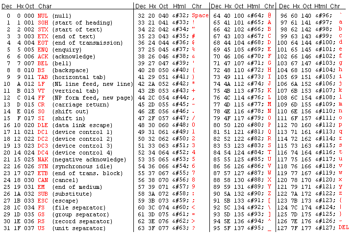
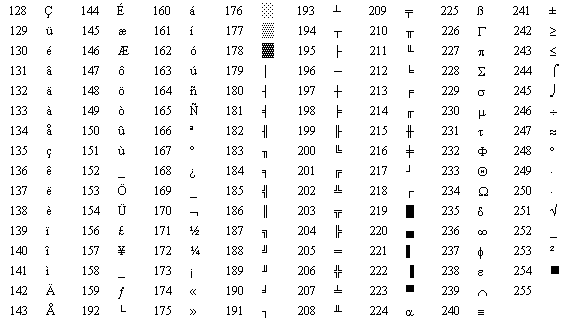
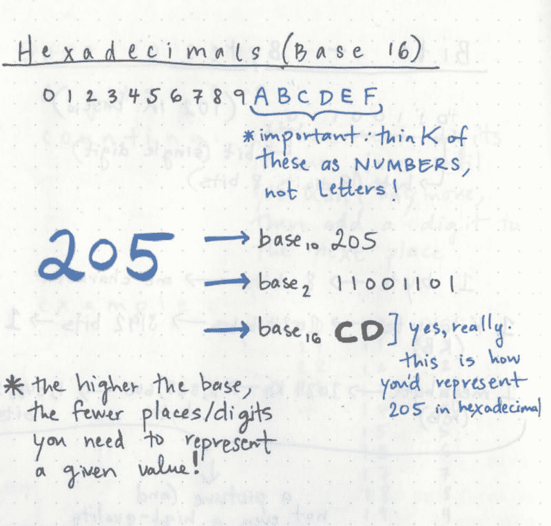
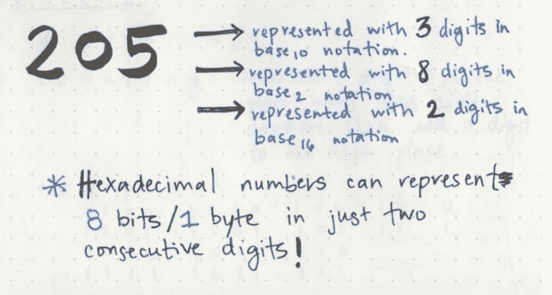
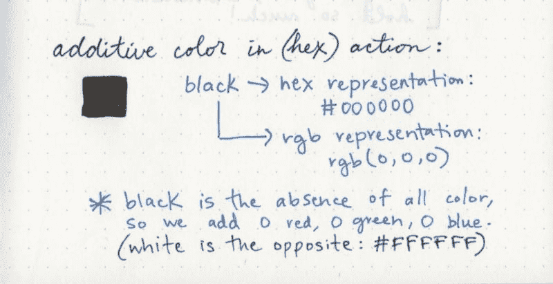
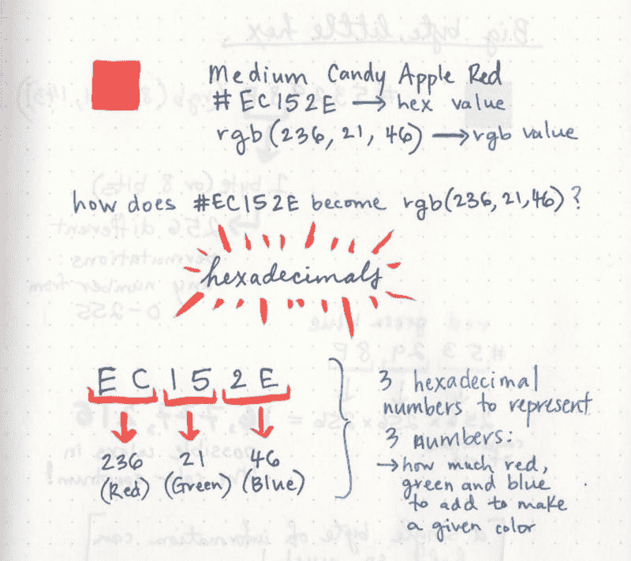
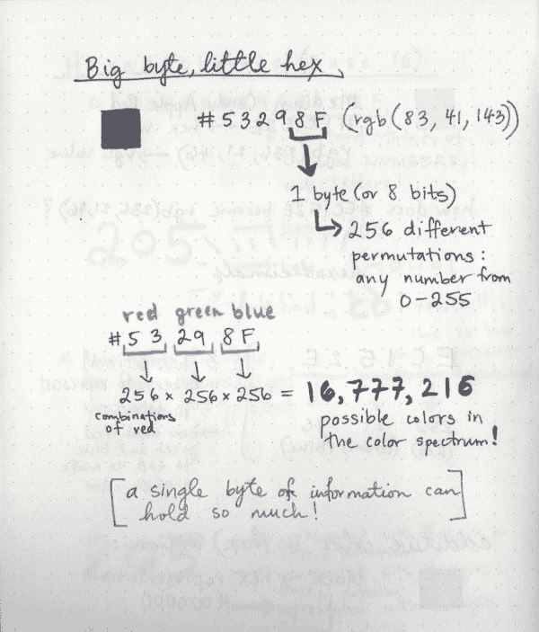

# Hexes 和其他神奇的数字

> 原文：<https://dev.to/vaidehijoshi/hexes-and-other-magical-numbers>

*本帖内容构建于我的上一篇作品，* [位，字节，构建与二进制](https://dev.to/vaidehijoshi/bits-bytes-building-with-binary) *。如果你是这个话题的新手，我建议你先读读这篇文章！*

有一些数字进入你的生活，把一切都颠覆了。有一些数字让你从完全不同的角度看问题。有些数字让你有点着迷，于是你决定写一篇博文。

你知道我指的是哪些数字，对吧？

没有吗？啊，让我给你介绍一下！

上周，我们学习了二进制，这是一个基于简单原理的数字系统:每个数字只能有两个可能的值，1 或 0。因为计算机是由晶体管或电路组成的，从根本上来说，它们只是开/关开关，所以二进制是计算机的一个伟大的数字系统和语言。我们显然不把*写成*二进制；有一些抽象层次为我们进行编译和转换。

但是关于二进制，对所有这些“抽象层次”至关重要的一点是二进制给我们的度量单位。二进制中的八位数字转化为一个字节，字节可以串在一起形成千字节、兆字节、千兆字节、兆兆字节等等(我在这里跳过了中间的一些单元，但我想你已经明白了)。

然而，二进制有一个稍微有点烦人的问题:你需要一堆数字来代表仅仅一个单字节的 T2。更具体地说，你需要 8 位数，或 8 位。

好吧，但是等一下:每个字符 8 位数也许并没有*那么*糟糕。但是如果你想表达一个词呢？你需要多少位？如果你想代表你的名字呢？如果我们想用我的名字来代表*呢？*

好吧，让我们试试:

_ " vaidehi " _ 直接编译下来的二进制是

**01110110 01100001 01101001 01100100 01100101 0110100 01101000 01101001**

是的，是的，但是我想要大写我的名字。我该如何表达呢？

*“Vaidehi”*直接编译下来二进制的是

**01010110 01100001 01101001 01100100 01100101 0110101 01101000 011011000 011101101**

不太好。没那么可读。肯定不短。我的名字等于 56 位(数字)，或者 7 个字节，或者一个真正可怕的头痛，取决于你盯着所有那些 1 和 0 看多久(不推荐！).

我的观点是:一个字节是一个强大的单位，但是请记住:一个字节只能代表一个字符。因此，我们可以想象，为了表示一幅图像、一个 gif 或一段视频，我们需要多少比特！事实上，这个数字太大了，我简直无法想象。

所有这些都让我们想知道，在字符和单词被计算机编译成二进制之前，是否有更好的方法来表示它们，对吗？必须有一种方法来表示这些东西，这样它们既更容易被人类阅读，又能被我们的机器转换？

没错。完全有更好的方法。事实上，有几种方法，而且很多方法在计算机科学中反复出现。还记得那些抽象层次吗？嗯，有一些神奇的数字是我们如何将比特和字节的信息抽象成更容易阅读的信息的基石。

### 我有 128 个问题，但编码不是其中之一

等一下。

我究竟是怎么知道如何用二进制表示我的名字的呢？！我们只学习了如何从十进制转换成二进制；如何将字母转换成二进制？这是什么魔法？！

嗯，这不是魔法——这是一种抽象！在这种情况下，我们处理的抽象被称为**编码** *。*编码是两种事物之间的标准化翻译方式，有点像不同数字系统而非语言的罗塞塔石碑。

我非常喜欢 David Zentgraf 在他的博客中解释和定义编码的方式:

> 为了用比特来表示除了比特以外的任何东西，我们需要规则。我们需要使用一种*编码方案*，或者简称为*编码*，将一个比特序列转换成类似字母、数字和图片的东西。

那么，我遵循什么样的规则将字母转换成二进制呢？我使用了一种编码方案，你可能已经听说过: **ASCII 编码**。

> ASCII 编码是一组规则，允许我们将某些字符翻译成十进制数。

ASCII 允许您在 95 英寸人类可读字符之间进行转换:数字 0-9、英语字母表(小写和大写字母 a-z)、一些不同的标点符号、数学符号和其他特殊字符。有趣的是，你还可以翻译空格、制表符、退格、删除和换行符，这非常重要(即使看起来不是很明显),因为计算机需要准确地知道这些动作在文本中发生的时间和位置。

ASCII 编码方案允许 128 种可能的“翻译”，这意味着 ASCII 中的所有内容在转换成小数时，必须在数字 0 和 255 之间。但是我们一会儿会回到这个话题。

[T2】](https://res.cloudinary.com/practicaldev/image/fetch/s--zPyeCR31--/c_limit%2Cf_auto%2Cfl_progressive%2Cq_auto%2Cw_880/https://cdn-images-1.medium.com/max/800/1%2AEu3I0zl4wTM_wVrQbONSBw.png)

使用上面的 ASCII 表，希望能更清楚地翻译我的名字(大写的 V)。我们可以一次分两步，先转换成十进制，然后转换成二进制。

*Vaidehi* 从 ASCII 码解码成小数:

86

97

105

100

101

104

105

*Vaidehi* 从十进制转换成二进制:

01010110

01100001

01101001

01100100

01100101

01101000

011101001

你注意到我名字的二进制表示有什么有趣的地方吗？即使我们不知道*如何从二进制转换为二进制，我们也可以通过观察这些数字推断出两件事:*

1.  每个字符用 8 位二进制表示；也就是说，每个字符需要 8 位或 1 字节的信息来表示。
2.  这些二进制字符中的每一个都以数字 0 开始。

这意味着每个字符实际上只需要 7 位，对吗？在我名字的每一个字母中，第一个数字似乎总是不用。对我来说这完全是浪费。

事实证明，我不是唯一一个有这种想法的人。

#### 输入 256

如果我们再看一下那个 ASCII 表，有一件事就变得很清楚了:确实没有太多的字符需要处理。“在哪里?”?还是那个？那么“呢？我将如何表示 smrbrad，以便我的计算机可以将其转换为二进制？

我们已经知道，ASCII(最初创建时)只允许 128 种可能的排列。在这种情况下，我的名字中每个 ASCII 转换的二进制字节开头的额外 0 更有意义:您只需要 7 位来表示 128 种不同的可能性。(还记得那些 2 的幂吗？2 的 7 次方是 128，在任何给定时间一起使用的 7 个比特将总是导致 128 种可能性)。因此，第一个 0 实际上可以不被使用。

但是，如果我们不把第一位，第一个数字，完全不使用呢？会发生什么？

好吧，让我们来计算一下:

7 位等于 2 的 7 次方。或者， **128** 种可能性。

8 位等同于 2 的 8 次方。或者， **256** 种可能性。

正是这种数学方法导致了 ASCII 编码方案扩展！它看起来是这样的:

[T2】](https://res.cloudinary.com/practicaldev/image/fetch/s--grl-pwPO--/c_limit%2Cf_auto%2Cfl_progressive%2Cq_auto%2Cw_880/https://cdn-images-1.medium.com/max/800/1%2AUDvQxh4n4XqaQqv1XTczlg.png)

扩展的 ASCII 表在原来的 ASCII 编码模式上又增加了 128 种可能性，甚至为将来更多的字符可能性留了余地！如果你仔细想想，这是非常酷的，因为我们可以用一个额外的位来打包双倍的编码。朋友们，比特是强大的。

在我们开始记忆 ASCII 表之前，值得一提的是，事物可以用许多不同的方式编码！当然，ASCII 是一种非常流行的编码方案，您可能会经常看到它，因为它的前导 0 很容易识别。但是，请注意:还有其他编码字符的方法！并非所有东西都使用 ASCII 编码，但有一点是肯定的:*所有的*编码方案都允许我们通过简单地添加规则作为中间的抽象层来简化字符和二进制之间的转换。

### 我怎么爱 16？我来细数一下。

所以 128 和 256 都是很棒的数字，知道它们可能出现在哪里是件好事。但它们实际上只是为另一个数字搭建了舞台，这个数字可能是软件中最重要的数字之一，它隐藏在网络的所有小角落和缝隙中，甚至在你自己的机器中。

我说的数字是数字 **16** 。并且，希望当你读到这篇文章的时候，你会和我一样喜欢它。

#### 我对你施了魔法

我们知道编码是特定字符和它们的二进制翻译之间的一种抽象形式。但是还有另一个在计算机科学中常用的抽象概念，它来自另一个数字系统——以 16 为基数的数字系统**,或**十六进制数字系统**。**

与 10 进制和 2 进制类似，16 进制数字系统的每一位都有——你猜对了——16 个可能的数字。一个地方可以有 16 个可能的数字，这些数字是这样的:

0，1，2，3，4，5，6，7，8，9，A，B，C，D，E，F

我是认真的。真的！如果你想用 16 进制表示 12 个项目，你会说我这里有 C 个项目(我猜，希望和你说话的人也知道十六进制)。一开始可能看起来有点奇怪，但是一旦你习惯了，十六进制的力量就变得清晰了。

[T2】](https://res.cloudinary.com/practicaldev/image/fetch/s--hVhpqYZ7--/c_limit%2Cf_auto%2Cfl_progressive%2Cq_auto%2Cw_880/https://cdn-images-1.medium.com/max/800/1%2ARx_5bSQFDGTl5VATp4Cb3w.jpeg)

为了用二进制(基数为 2)表示十进制数 **205** ，我们需要 8 位数。但是，要用十六进制(基数为 16)来表示它，我们只需要两位数。这里的经验法则是*基数越高，表示一个数*所需的位值就越少。

如果你想一想，这是有意义的:如果我们每个位置只有 2 个可能的选项(例如，在二进制中，当我们可以在 0 和 1 之间选择时)，我们需要更多的数字来表示一个更大的数，因为每个位置值的排列非常小。另一方面，如果我们每个位置有许多可能的选项(比如在十六进制中，当我们有 0-F 时)，我们每个位置值有更多可能的排列，所以我们可以表示更大的数字，而不必添加另一个数字。

好吧，我们需要更少的数字。我想这很酷。但是为什么那个*是重要的*？

> 一切都回到这一点:8 位数字等于一个字节。如果我们可以用更少的数字表示一个字节，我们就可以用相对较少的空间包含更多潜在的信息。

[T2】](https://res.cloudinary.com/practicaldev/image/fetch/s--ajuRWueW--/c_limit%2Cf_auto%2Cfl_progressive%2Cq_auto%2Cw_880/https://cdn-images-1.medium.com/max/800/1%2AEYuJKEbZAcvx0b0fY7kKFA.jpeg)

这正是十六进制如此强大的原因。这就是为什么，如果我们在正确的地方寻找，我们可以看到他们无处不在，在外面，在互联网上。

#### 十六进制围镇

如果你曾经建立过一个网站，与设计师合作过，或者浏览过一个网页，你可能会看到一两个十六进制代码。

十六进制用于指定网站上的颜色，可以内嵌在网页的 HTML 中，或者更常见的是，在网页的 CSS(样式表)中使用。

有趣的是，十六进制并不是指定颜色的唯一方式；它只是一个颜色模型。我们还可以通过使用 **rgb 颜色模型**来指定网页或应用程序上某些东西的颜色。它们是等价的，并且总是给我们相同的颜色，只是书写颜色的语法略有不同。

电脑总是使用大量的红色、绿色和蓝色来指定颜色。无论我们指定多少红色、绿色和蓝色，它们加在一起，这三种颜色的组合将在屏幕上呈现我们想要的任何颜色。

[T2】](https://res.cloudinary.com/practicaldev/image/fetch/s--u4dfC2qg--/c_limit%2Cf_auto%2Cfl_progressive%2Cq_auto%2Cw_880/https://cdn-images-1.medium.com/max/800/1%2AwHdDcKKkbN0UuwMw2qOpgg.jpeg)

好吧，好吧，这和十六进制有什么关系？答案是:嗯，显然，*一切*！

下面就通过拆开我最喜欢的一种颜色:中糖果红来看看**十六进制码**和**十六进制码**的关系吧！

#### 用妖术描绘城镇！

这种红色的十六进制代码是#EC152E。我们也可以在 rgb 模型中将其表示为 rgb(236，21，46)。如果它们在功能上是等价的，并且在一天结束时总是给我们相同的颜色，那么这两种书写相同颜色的方式是如何联系在一起的呢？

[T2】](https://res.cloudinary.com/practicaldev/image/fetch/s--hzQJNdk0--/c_limit%2Cf_auto%2Cfl_progressive%2Cq_auto%2Cw_880/https://cdn-images-1.medium.com/max/800/1%2ATbeqpugI1VMxAGpqZ3xagg.jpeg)

我不会深入讨论*如何将十六进制转换成十进制——这与转换二进制完全相同，但每一位有更多的数字——但这本质上是两者之间的关系:****十六进制*** *代码中的每一对连续数字都被转换成十进制，以便在* ***中表示*****

 *还记得我们之前学过如何用 2 个十六进制数字表示一个字节(8 个二进制数字)吗？这在这里也很重要。因为这意味着单个十六进制代码包含一个完整的颜色值，但只占用 3 个字节(或 24 位)的信息。

[T2】](https://res.cloudinary.com/practicaldev/image/fetch/s--UeWmWsg1--/c_limit%2Cf_auto%2Cfl_progressive%2Cq_auto%2Cw_880/https://cdn-images-1.medium.com/max/600/1%2ANykWe4iBzDhLvYZSi9LnaQ.jpeg)

如果你曾经想知道为什么 rgb 颜色模型只允许 0 到 255 之间的值，现在你知道原因了！这是因为 rgb 中的每个数字都是一个字节，即 8 位。我们已经知道，8 位导致 256 种可能的组合，所以现在每个颜色值的数值限制(在 0-255 之间)背后的逻辑应该更清楚一些。

但是我认为用来表示颜色的十六进制最酷的事情是，仅仅在 6 个十六进制数字中，我们就可以在光谱中包含超过 1600 万种可能的颜色。我很惊讶，因为我直到现在才知道！

#### 更加神奇的六法

你可能遇到十六进制代码的另一个地方是在**魔法调试值**或**六进制代码**，它们实际上只不过是程序运行时写入(或*分配*到内存中的十六进制代码。神奇调试值最常见的用例是当程序崩溃时；这些十六进制数被开发人员如此普遍地使用，以至于它们已经成为“某种程度上的保留”——也就是说，它们只用于向运行或调试代码的程序员指示:*“出错了！”*

这些调试代码有很多[示例](https://en.wikipedia.org/wiki/Magic_number_%28programming%29#Magic_debug_values)，但其中一些更著名的是“DEADBEEF”、“DEADC0DE”和“D15EA5E”。是的，这也是李斯匹克的一部分来源！

您还可以在最新协议版本的 IP 地址格式中找到十六进制！互联网协议版本 6 (IPv6)于 90 年代末发布，当时很明显，我们将很快耗尽地球上每台设备的唯一 IP 地址。新 IPv6 表示 IP 地址的方式是通过八组四个十六进制数字(每组 2 个字节或 16 位)，可能如下所示:

2b2b:1821:a9ih:0000:0000:ff91:9ab 0:1ee 3

想象一下把它转换成二进制！这正是为了让你的机器处理每一位而发生的，而且这一切发生的速度快得令人难以置信。我不知道你是怎么想的，但是一想到这个我就头晕，我非常感激拥有 16 这个简单的抽象数字。

### 资源

如果你喜欢阅读有关 hexes 和神奇的数字，看看下面的这些资源，继续学习更多！

1.  每个程序员绝对需要了解的关于编码和字符集的知识
2.  [十六进制颜色是如何工作的？](http://stackoverflow.com/questions/22239803/how-does-hexadecimal-color-work)，StackOverflow
3.  [十六进制数字](https://sites.google.com/site/dtcsinformation/data-representation/number-systems/hexadecimal-numbers)，彼得·内兰
4.  [十六进制和字符集](http://BBC%20Bitesize%C3%A2%E2%82%AC%C5%A0%E2%80%93%C3%A2%E2%82%AC%C5%A0GCSE%20Computer%20Science%C3%A2%E2%82%AC%C5%A0%E2%80%93%C3%A2%E2%82%AC%C5%A0Hexadecimal%20and%20character%20sets%C3%A2%E2%82%AC%C5%A0%E2%80%93%C3%A2%E2%82%AC%C5%A0Revision%201)，BBC Bitesize
5.  [十进制到十六进制](https://www.khanacademy.org/math/algebra-home/alg-intro-to-algebra/algebra-alternate-number-bases/v/decimal-to-hexadecimal)，可汗学院

*本文原载于我的[媒体刊物](https://medium.com/basecs/hexs-and-other-magical-numbers-9785bc26b7ee#.v5tlkm9s7)**