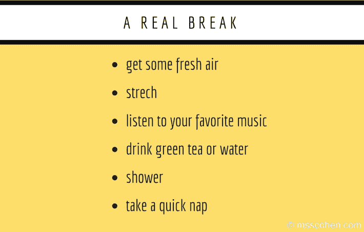

# 软件工程师在工作中保持高能量水平的 3 种有效方法

> 原文:[https://dev . to/msscohen/3-有效保持软件工程师工作高能级的方法](https://dev.to/msscohen/3-effective-ways-to-maintain-high-energy-levels-at-work-for-software-engineers)

*最初发布于 msscohen.com<u>[-软件工程师职业生涯攻略](http://www.msscohen.com)</u>*

尽管软件工程经常被认为是一个理想的职业，但在现实生活中，它是一项永无止境的工作，经常需要在荧光灯下、冰冷的空调下和没有阳光的情况下在办公室里工作很长时间。另一方面，编写简单有效的代码是一门手艺，所以它需要灵感、专注和高度精力。在这篇文章中，我将尝试演示如何在这两者之间取得平衡，并设法在一个高要求的工作场所保持高水平的精力。

## 1.寻找能源浪费的解决方案

生完第一个孩子 5 个月后，我重返工作岗位。我的宝宝仍然在晚上醒来 2-3 次，我已经筋疲力尽了。我的疲劳程度如此之高，以至于我决定停止驾驶以避免事故。考虑重返工作岗位并设法正常运转似乎是一个不可能完成的任务。我决定分析一下我的日常生活，看看我是否能避免能量浪费。

了解我自己，我一天中最有效率的时间是早上。因此，为了提高效率，我应该确保我的能量水平在早上是高的，并且被正确地使用。

对我早晨时间的分析表明，我的大部分精力甚至在我到达办公室之前就已经消耗掉了。在那些日子里，我早上 5:00 起床给孩子喂奶，给他穿好衣服，做好准备，带他去日托，然后坐两趟公交车去上班。当我早上 8 点上班时，我已经筋疲力尽了。

我考虑过用出租车代替 2 路公交车。出租车的价格很贵，单程大约 10 美元。也就是说，一个月 400 美元。一旦我意识到支付出租车费实际上是在为一个更有效率的工作日买单，这似乎就更合理了。看的是出租车的总价值，而不是单次乘坐的价格，我开始到处打车——聚会、课程和会议，否则我不会去。

总结:检查你一天中最有效率的时间是什么时候，分析这段时间你的能量被浪费在哪里，并通过专注于大局而不是个人行动来找到能量浪费的解决方案。

[T2】](https://res.cloudinary.com/practicaldev/image/fetch/s--lc_ZmGyU--/c_limit%2Cf_auto%2Cfl_progressive%2Cq_auto%2Cw_880/http://www.msscohen.com/assets/break3.jpg)

## 2.好好休息一下

我认识的一个工人不休息。没有。他早到，19:00 离开办公室。有时他也继续在家工作。有几天他也不去午休:他只是在办公桌前随便吃点东西，然后继续工作，或者冲到最近的餐馆，买些东西带走，然后消失在办公室里。有些经理也有类似的行为。

无意中，这种行为造成了压力和倦怠，是创造力的致命解毒剂。以这种方式行事的经理会让他们的员工产生相同水平的期望，即使他们没有明确要求。

这一职业的主要弊端之一是，在大多数公司，员工仍然是以考勤钟而不是绩效来衡量的。最近的研究表明 休息对大脑有好处:它们增加创造力，提高注意力，保持健康，因为我们不是为了整天坐着而设计的。

因此，为了保持高水平的精力，下次当你感到疲倦、注意力不集中或被一个 bug 困了几个小时时，继续工作只会让你感觉更累。试着休息一会儿，在你注意到之前，错误就会被解决。

休息的意义不是简单地停止工作。真正的休息是让你的大脑得到休息。在休息时间，做一些有助于平静大脑的事情，比如呼吸新鲜空气，听你喜欢的音乐，喝绿茶和水，伸展运动，如果可能的话，洗个澡或者小睡一会儿。

[T2】](https://res.cloudinary.com/practicaldev/image/fetch/s--ziNVKA95--/c_limit%2Cf_auto%2Cfl_progressive%2Cq_auto%2Cw_880/http://www.msscohen.com/assets/change_tasks3.jpg)

## 3.不同任务之间的转换

软件工程职业充满了需要不同技能的任务:阅读电子邮件、编写代码、性能测试、与利益相关者交谈、学习一个新的主题、审查代码、调试问题、编写文档、设计功能等。

如果你正在做一项需要一种技能的任务，并且感觉自己的能量正在耗尽，那么转而做一项需要不同技能的任务就像是对大脑的某个特定部分进行休息。所以你可以切换到另一个任务，让正在工作的那部分大脑休息一下，然后再回到那个任务。

例如，如果你写了两个小时的代码，感觉缺乏能量，试着和利益相关者交谈或者读邮件，这需要不同的技巧。如果你学习了一个新的主题，需要休息一下，试着检查代码或者调试一个问题。一段时间后，回到最初的任务，你会发现能量水平提高了。

简而言之，为了在像软件工程这样要求高的职业中保持高水平的精力:通过关注大局而不是个人行动来找到解决能源浪费的方法，休息一下，做一些能让你平静下来的事情，在不同的任务之间转换，让大脑的特定部分得到休息。