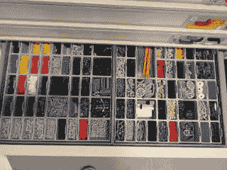
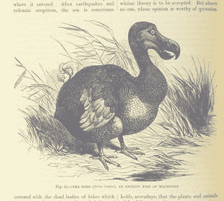
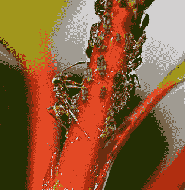

# 蚂蚁人的 Maven

> 原文:[https://dev.to/monknomo/maven-for-ant-people-4kg3](https://dev.to/monknomo/maven-for-ant-people-4kg3)

蚁人经常发现 Maven 完全令人费解。我知道我做到了。我在一家商店工作，直到最近，这家商店还是完全以蚂蚁为基础的。我们构建了复杂的构建脚本，并且我们按照上帝的意图使用 XML。

有了 Ant，您可以从头开始。你可以按照你想要的任何方式来设置你的项目——目录结构还没有确定，你想要通过构建来创建的工件也还没有确定，你甚至可以引入条件来根据你想要的改变构建。简而言之，蚂蚁就是狂野西部。

相比之下，Maven 是一个穿紧身衣的人。Maven 要求您的项目以特定的方式布局。你必须使用被认可的 Maven 目录，并且你必须在 Maven 生命周期内做事。你不能像对待 Ant 那样，写一堆目标，然后用老方法把它们粘在一起。从 Ant 世界进入 Maven 项目是非常令人困惑的，因为目录布局略有不同，依赖关系保存在哪里并不明显，当您试图像运行 build.xml 一样运行 pom 时，什么也没有发生。Maven 将这种行为的大部分称为“约定胜于配置”，这使得事情变得一清二楚。

# 项目布局

[T2】](https://res.cloudinary.com/practicaldev/image/fetch/s--eabvyAK8--/c_limit%2Cf_auto%2Cfl_progressive%2Cq_auto%2Cw_880/https://i.imgur.com/okSkhupm.jpg)

我认为，当人们来到 Maven 时，他们首先注意到的是目录结构是奇怪和不同的。我参与过的大多数 Ant 项目都有这样的布局:

```
src/ 
|- com/ 
  |- example/ 
    |- package/ 
      |- packageclass.java 
      |- test/ 
        |- test.java 
    |- otherpackage/ 
      |- otherclass.java 
      |- test/ 
        |- testother.java 
deps/ 
|- guava.jar 
|- jodatime.jar 
app.properties 
test.properties 
```

<svg width="20px" height="20px" viewBox="0 0 24 24" class="highlight-action crayons-icon highlight-action--fullscreen-on"><title>Enter fullscreen mode</title></svg> <svg width="20px" height="20px" viewBox="0 0 24 24" class="highlight-action crayons-icon highlight-action--fullscreen-off"><title>Exit fullscreen mode</title></svg>

Maven 项目有严格的布局，就像这样:

```
src/ 
|- main/ 
  |- java/ 
    |- com/ 
      |- example/ 
        |- package/ 
          |- packageclass.java 
        |- otherpackage/ 
          |- otherclass.java 
  |- resources/ 
    |- app.properties 
|- test/ 
  |- java/ 
    |- com/ 
      |- example/ 
        |- package/ 
          |- test.java 
        |- otherpackage/ 
          |- testother.java 
  |- resources/ 
    |- test.properties 
```

<svg width="20px" height="20px" viewBox="0 0 24 24" class="highlight-action crayons-icon highlight-action--fullscreen-on"><title>Enter fullscreen mode</title></svg> <svg width="20px" height="20px" viewBox="0 0 24 24" class="highlight-action crayons-icon highlight-action--fullscreen-off"><title>Exit fullscreen mode</title></svg>

Maven 希望代码和资源在`src`目录中。它进一步期望`src`目录包含一个`main`和一个`test`目录。`main`目录中的东西正走向终极神器。目录中的东西是测试数据，或者 junit 测试，或者其他我们不想包含在最终工件中的测试代码。

`main`和`test`目录都有`java`和可选的`resources`目录。Java 代码放在`java`目录中——当然，这是假设你是用 Java 开发的:)

像属性文件、测试数据或 FindBugs exclude 文件这样的资源放在`resources`目录中。如果您的项目没有任何资源，您可以完全省去这些目录。

Maven 和 Ant 的区别在于 Maven 绝对需要这种目录结构。没有它，它显然不会工作。起初，在我看来，这似乎是不必要的约束，但我越是使用它，我就越喜欢它。任何 Maven 项目都有完全相同的目录结构，所以只要你打开一个 Maven 项目，你就知道所有东西都在哪里，不管是谁开发的。在我的 Ant shop 中，知道谁是第一个开发人员会有所帮助，因为每个开发人员都会稍微不同地设计一个项目。虽然这给了代码一种迷人的旧世界村庄的感觉，但它使得增加新的开发人员是一个缓慢的过程。

# 生命周期

[T2】](https://res.cloudinary.com/practicaldev/image/fetch/s--1g9tWeqV--/c_limit%2Cf_auto%2Cfl_progressive%2Cq_auto%2Cw_880/https://i.imgur.com/Kygglt6m.jpg)

Ant 由构建目标组成。目标是定义 Ant 行为单元的 xml 元素。目标可以依赖于其他目标，所以你的构建可以有某种顺序。您可以定义任意数量的目标，并随意命名它们，还可以设置对您有意义的目标层次结构。

综上所述，我认为这可能是一个 Ant 项目的“正常”结构:

```
<project>
  <path></path>
  <target name="init"></target>
  <target name="compile" depends="init"></target>
  <target name="test" depend="compile"></target>
  <target name="jar" depend="test"></target>
  <target name="javadocs"></target>
<project\> 
```

<svg width="20px" height="20px" viewBox="0 0 24 24" class="highlight-action crayons-icon highlight-action--fullscreen-on"><title>Enter fullscreen mode</title></svg> <svg width="20px" height="20px" viewBox="0 0 24 24" class="highlight-action crayons-icon highlight-action--fullscreen-off"><title>Exit fullscreen mode</title></svg>

仔细阅读 Maven pom，没有发现任何关于构建期间发生了什么的线索。下面是一个示意图示例，与上面的 Ant 示例形成对比:

```
<project>
  <meta stuff defining the project></meta stuff> 
  <build></build>
  <dependencies></dependencies>
</project> 
```

<svg width="20px" height="20px" viewBox="0 0 24 24" class="highlight-action crayons-icon highlight-action--fullscreen-on"><title>Enter fullscreen mode</title></svg> <svg width="20px" height="20px" viewBox="0 0 24 24" class="highlight-action crayons-icon highlight-action--fullscreen-off"><title>Exit fullscreen mode</title></svg>

就是这样！当我第一次阅读 pom 时，在阅读 Ant 构建脚本多年后，我不知道应该发生什么。看起来什么都没有发生——没有编译，没有不和谐，当然也没有测试。

同样，与目录结构一样，Maven 是隐式的。它有专家们所说的“生命周期”

### 词汇课

蚂蚁人将从一堂简短的词汇课中受益，以快速掌握专家术语，并获得一些可谷歌搜索的术语

#### **生命周期**

*   构建和分发工件的过程
*   有三个生命周期
    *   `default`
    *   默认构建和部署您的项目。Deploy 可能会让那些习惯于把东西放在服务器上的人出错。在这种情况下，这并不意味着“将您的 webapp 部署到 Tomcat”相反，它意味着“将构建工件部署到 Maven 存储库中”
    *   `clean`
    *   清理通过删除构建产品和构建产生的中间混乱来清理您的项目。实际上，这主要意味着它删除了 Maven 构建创建的`target`文件夹
    *   `site`
    *   站点为您的项目网站创建文档。Javadocs、junit 测试报告、findbugs 报告以及诸如此类的事情都会在生命周期中发生

#### **相**

*   生命周期由几个阶段组成。Maven 在生命周期参考中保留了一个所有不同阶段的[列表](https://maven.apache.org/guides/introduction/introduction-to-the-lifecycle.html#Lifecycle_Reference)
    *   开发人员最常交互的阶段是组成默认生命周期的阶段
        *   `validate`
        *   `compile`
        *   `test`
        *   `package`
        *   `verify`
        *   `install`
        *   `deploy`

#### **目标**

*   阶段是由插件目标组成的。如果你通读一个 pom，你会注意到`build`元素，例如，经常包含一些插件。这些插件定义了一个阶段中发生的事情。
*   目标也可以独立于生命周期使用，以允许对构建进行更细粒度的控制

### 使用构建生命周期

要使用构建生命周期，请使用 Maven 命令行并传入任何生命周期、阶段或目标名称。

#### 例子

**生命周期**

`mvn default`

**阶段**

`mvn package`

**目标**

`mvn dependency:copy-dependecies`

您可以向 maven 传递多个生命周期参数，它将依次执行每个参数

# 依赖关系

[T2】](https://res.cloudinary.com/practicaldev/image/fetch/s--0Y1o6Ay8--/c_limit%2Cf_auto%2Cfl_progressive%2Cq_auto%2Cw_880/https://i.imgur.com/RFb58Hnm.jpg)

依赖关系是我认为没有标准的 Ant 方法来处理它们的地方之一。Ant 人都知道将他们的项目所依赖的 jar 保存在 synce 中的劳动，以及将这些 jar 分发给一个开发团队有多困难。

我在蚂蚁世界里见过一些方法。有时共享网络驱动器上有一个文件夹，在项目的 wiki 中，它告诉开发人员获取该文件夹，并将其放在与项目相关的某个特殊位置。其他时候，jar 只是作为大的二进制 blobs 包含在存储库中的源代码中。有时 jar 会得到它们自己的版本控制 repo，开发人员应该将依赖关系 repo 放在与它们的项目 repo 相同的目录中，所以所有的依赖关系都可以作为`../dependency.jar`到达。我甚至见过一个巨大的 zip 文件，其中有一个包含 eclipse 的预配置目录，所有项目都已设置好，还有一个包含在已知位置的存储库目录，以及一个用于将已知位置与中央服务器同步的脚本。

我的观点是，Ant 真的没有处理依赖问题的方法。不管您在做什么，您还必须手动编译类路径并将其包含在您的 Ant 文件中，这是另一个有趣的练习。

Maven 的闪光点，以及最初吸引人们使用 Maven 的地方，是它的依赖性管理。Maven 将为您获取所有的依赖项，构建一个类路径，甚至可以创建一个大的 jar 来轻松发布。要获得项目的所有依赖项，您唯一需要的就是 Maven 和 pom。

Maven 还有依赖关系的“作用域”概念。指出一个依赖项(像 junit 一样)仅仅是“测试”范围所需要的，将会在构建最终的工件时省去这个依赖项。

# 基本 Maven 用法

[T2】](https://res.cloudinary.com/practicaldev/image/fetch/s--S9mjOkQi--/c_limit%2Cf_auto%2Cfl_progressive%2Cq_auto%2Cw_880/https://i.imgur.com/YSysF5zm.png)

知道 Maven 应该如何工作当然很好，但是您实际上如何使用它呢？

在大多数情况下，一个开发者可能想做一个罐子，一个 war 或者一个 ear，他们可以使用或者送给别人。

下面是如何从命令行实现这一点:

`mvn package`

从 Eclipse 中，右键单击项目并选择‘Run As’>‘Maven Build’。第一次这样做时，将会打开运行配置对话框。在目标字段中键入“package”并运行构建。

您可能会注意到，这些命令不会运行整个默认生命周期。他们跳过了验证、安装和部署阶段。这些比我在这里试图说明的 Maven 和 Ant 之间的基本区别要复杂一些。可能需要一篇单独的文章来讨论安装和部署在 Maven 世界中意味着什么，它们如何与 ide 交互，以及何时应该使用它们。

**如果你喜欢这篇文章，并且希望每月都能收到关于编程、Java 和领导力的精彩文章，[注册我的时事通讯吧！](https://www.gunnargissel.com/pages/email-signup-1.html)T3】**

## 学分

感谢巴里·马尔尚提供的蚂蚁和蚜虫的[图片](https://flic.kr/p/dkxEs3)

感谢桑丘·麦肯提供的蚂蚁的[图片](https://flic.kr/p/7QyyFk)

感谢[组织的](https://flic.kr/p/Vg7naS)乐高 [Ambo100](https://www.flickr.com/photos/ambo100/)