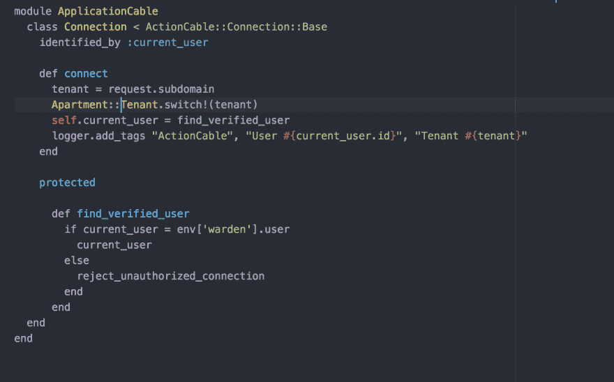
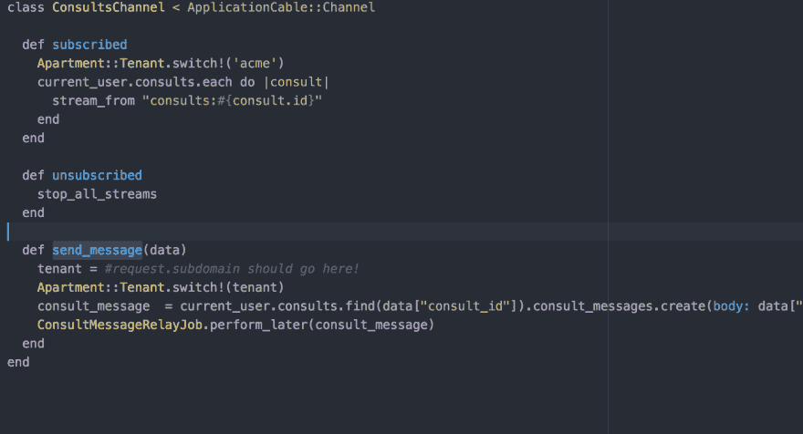

# 我与 Rails ActionCable 的斗争

> 原文：<https://dev.to/shakycode/my-struggle-with-rails-actioncable>

让我给你介绍一下这篇文章的背景。我正在建立一个连接医生和病人的多租户 SaaS 平台。其中包括在双方之间进行实时聊天的能力。这都是基于 Ruby on Rails 构建的，这是我选择的框架，使用的是我的主要语言 Ruby。在 Rails 5 中引入了 ActionCable，它简化了非常简单的 websocket 功能，取代了对 FAYE 或 pusher.io 等第三方服务的依赖。至少我是这么认为的。

您会看到多租户是一个很难解决的问题，ActionCable 喜欢在特定的请求源上传输其 websockets。例如，请求源可以是:[https://acme.engagemd.co](https://acme.engagemd.co)，因此所有套接字请求都从该请求源开始连接和传输。如果您不确定 Rails 中的请求来源是什么，可以将请求想象成 HTTP 请求的来源。在我的情况下，这是一个多租户应用程序，所以请求将来自过多的子域名。Actioncable 根据您在 production.rb 环境文件中指定的白名单来查找特定的请求来源。现在你可以变聪明，使用一些正则表达式匹配来允许来自父域名的子域，如 acme.engagemd.co，doctor.engagemd.co 等。但这还不够。

### 问题 1

在我的新平台中，我使用 Apartment gem 为每个租户提供他们自己的数据库模式，并编写了平台，以便整个应用程序可以根据请求源切换租户。当我第一次开始在应用程序中编写简单的聊天功能时，我遇到了如何让 ActionCable 基于请求源进行连接的问题。在朋友的帮助和我自己的研究之后，我能够获得 connection.rb 文件，该文件驱动 ActionCable 读取请求源并实时切换租户。这消除了被拒绝的连接，流开始正常流动。这是我的 connection.rb 文件:

[T2】](https://res.cloudinary.com/practicaldev/image/fetch/s--hPWt5jGW--/c_limit%2Cf_auto%2Cfl_progressive%2Cq_auto%2Cw_880/https://cdn-images-1.medium.com/max/1600/1%2AJb_K--vsL8-28WaZnqfkqg.png)

正如您所看到的，当我们进行连接时，我们将租户设置为请求子域，然后在 connect 方法的第二行调用 switch 来切换租户，然后验证用户是租户的一部分并允许接收 websocket 流量。这部分相对容易解决。

### 问题二又名秀塞

在负责向客户机发送数据的通道文件中，确实没有办法访问请求源和切换租户。

[T2】](https://res.cloudinary.com/practicaldev/image/fetch/s--FgJEu4Jh--/c_limit%2Cf_auto%2Cfl_progressive%2Cq_auto%2Cw_880/https://cdn-images-1.medium.com/max/1600/1%2AJrAz4jVuNba2xv2wiS95Kg.png)

正如您在通道文件的 subscribed 和`send_message`方法中看到的，我们需要切换租户。在 subscribed 方法中，我硬编码了一个租户，只是为了看看它是否会切换，而它确实切换了。在`send_message`方法(和 connect 方法)中，我真的需要能够访问请求的子域，这样我就可以切换租户和直播聊天。

这是最精彩的部分。在阅读了 ActionCable 文档并在谷歌上搜索了大概 4 个小时之后，我们真的没有办法将请求放入频道文件中。也就是说，这是一个彻底的失败，我不能使用 ActionCable 进行多租户实时聊天，因为该请求在 channel 文件中不可用。

所以我开始了一场巫术狩猎，试图找出这个该死的东西。我首先想到的是在应用程序控制器中设置一个全局的 like $request，并允许通道文件访问它。这在理论上是可行的，但存在多重问题。

*   全局变量是一种安全风险，容易出现互斥情况

*   当您有多个租户和用户时，全局变量`$request`会被覆盖，并且在租户切换后 ActionCable 不会传输。或者更糟的是，全局变量完全丢失，租户将尝试切换，但没有可切换的子域，这将失败，并且不会创建消息。

我在 Rails core 上公开了一个问题，看看是否有人可以提供帮助，因为缺少文档，我非常确定我不是唯一一个有这个特定用例的人。所以我希望尽快得到一些反馈。与此同时，我正在分解 rails 中的 ActionCable，看看是否有办法将请求传递给通道文件。如果我能搞清楚这一点，我会对 master 做一次公关，并希望被包含在 Rails 的下一个版本中，但我不会屏住呼吸，因为 Rails 社区是一群固执己见的人，多租户并不是每个人都在做的事情。

### 对案件进行轮询

考虑到我在处理 ActionCable 问题时首先要面对的事实，我决定一个很好的替代方法是在聊天室中进行 ajax 轮询，每隔 2-3 秒进行一次 Ajax 调用，轮询新内容并刷新 div/partial。令人惊讶的是，这就是 Basecamp 在他们的篝火聊天中如何做的，而不是使用 ActionCable。我和 DHH 就 Rails 的性能进行了一次很好的交谈，他谈到了他们是如何使用 Ajax 轮询而不是通过 websockets 进行直播的。他们的想法不是实时聊天，而是“足够实时”。99%的最终用户不会注意到聊天中有 2-3 秒的延迟，这对于系统轮询和刷新显示新消息的部分来说是足够的时间。

这不是我想要构建的，也不是我想要构建的方式，但是在这一点上，我没有其他选择，只能继续使用 Ajax 轮询，最终 ActionCable 将引入从 connection.rb 传递到通道文件的请求源。或者我会写一篇介绍这种行为的公关，并希望它被接受。

### 总结

写软件很难。就在你认为你已经想通了的时候，一只 800 磅的大猩猩跳到你的背上，带你去骑小马。我知道我在我的平台上取得了良好的进展，并将继续这样做，但所有这些障碍都令人沮丧。我尽最大努力将这些挑战视为成长和跳出框框思考的机会，但这仍然令人沮丧。

您正在使用 ActionCable 和多租户吗？如果是这样的话，让我们聊聊天，也许我们可以想出一个对所有人都有效的解决方案！

干杯！Shakycode

推特: [shakycode](https://twitter.com/shakycode)
邮箱:[shakycode@gmail.com](mailto:shakycode@gmail.com)