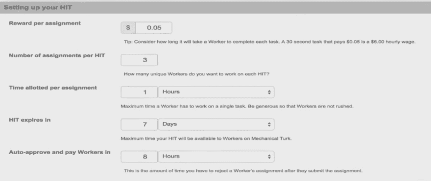
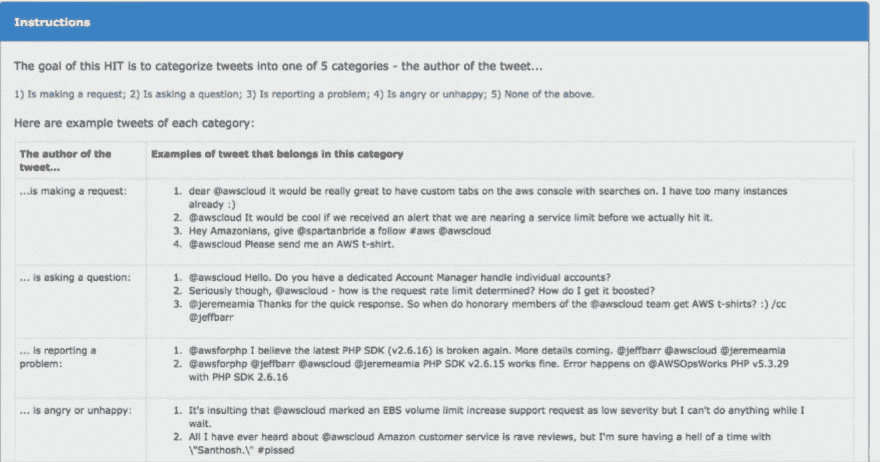
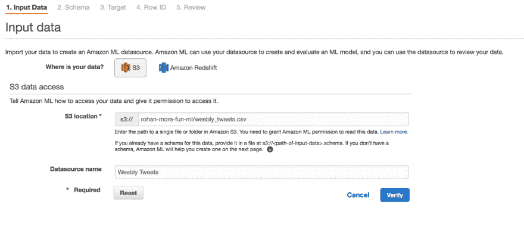
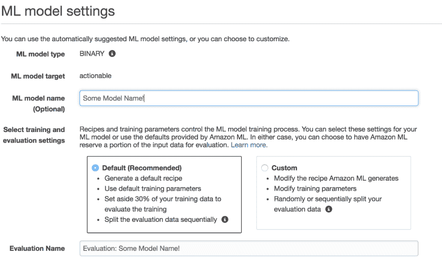
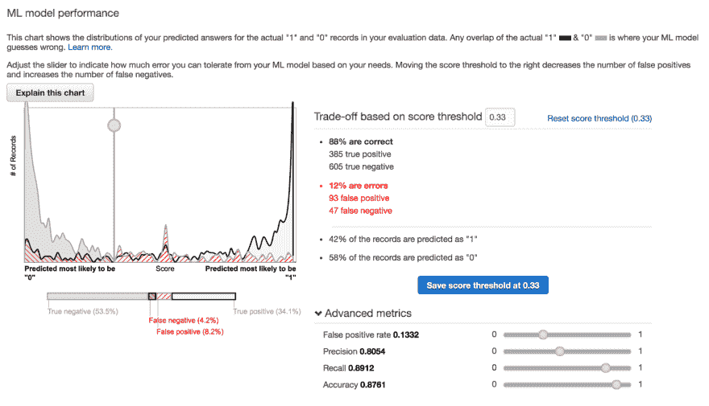
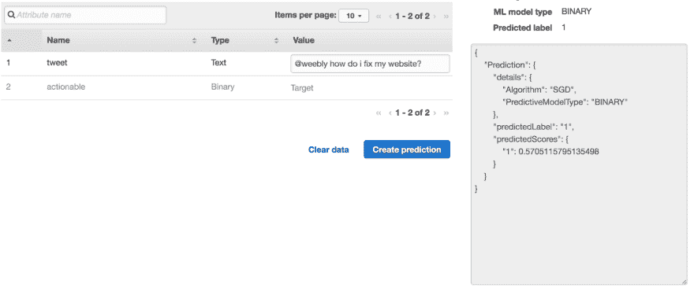
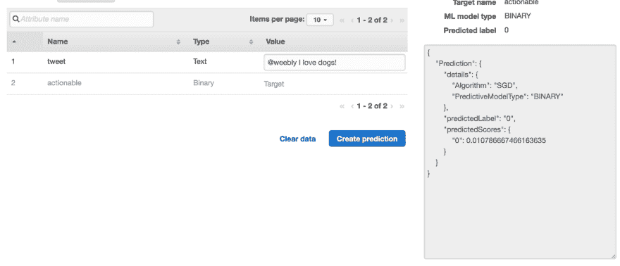

# 用 Amazon ML 对推文进行分类

> 原文:[https://dev.to/rohanjamin/classifying-tweets-with-amazon-ml](https://dev.to/rohanjamin/classifying-tweets-with-amazon-ml)

## 前言

我最近看了 AWS 的一个新服务“Amazon ML”的一个很棒的[视频概述/演示](https://www.youtube.com/watch?v=GRRX9amYsyM)。如果你手头有大约 50 分钟的时间来看上面的视频，我强烈建议你跟着看，如果没有的话，请阅读我博客的其余部分以获得更简短的总结。

那么什么是亚马逊 ML 呢？

> 亚马逊机器学习(Amazon Machine Learning)是一项服务，可以让所有技能水平的开发者轻松使用机器学习技术。亚马逊机器学习提供可视化工具和向导，指导您创建机器学习(ML)模型的过程，而不必学习复杂的 ML 算法和技术。一旦您的模型准备就绪，Amazon Machine Learning 就可以使用简单的 API 轻松获得您的应用程序的预测，而不必实现自定义预测生成代码，或管理任何基础架构。

换句话说，它是作为服务的**机器学习**。对于那些熟悉机器学习的人来说，亚马逊的服务还没有提供任何类型的深度学习模型，只有回归和分类模型。尽管如此，你可以用这些*浅层学习*模型做一些相当强大的东西。

## 概述

在上面链接的视频中，演讲者讲述了一个例子，他建立了一个模型来**自动将针对 AWS 客户支持的推文分类为可操作或不可操作**。您可能会为这样的模型设想一些不同的用例，其中一个是节省客户支持代理时间的好方法，通过过滤垃圾社交媒体数据来找到实际的客户问题。下面我将通过我自己公司的( [Weebly](https://www.weebly.com) ) twitter 数据来看同样的例子。

创建 ML 模型的整个过程可以归结为 4 个简单的步骤:

*   收集我们的数据
*   对我们的数据进行分类
*   将我们的分类数据输入亚马逊的 ML 引擎
*   测试一下！

## 收集我们的数据

首先，我们需要一些实际数据。因为我们将使用 twitter 数据，所以我们可以利用 Twitter API 来获得满足我们要求的大量 tweet 子集(即 tweets directed @ weebly)。这意味着你必须在 twitter 上注册一个[开发者应用](https://apps.twitter.com/)来获得相关的 API 密钥和令牌。一旦你这样做了，你就可以开始从 twitter 获取你需要的数据。下面是一个小 ruby 脚本，用来获取我们关心的所有推文，并将其保存到一个 CSV 文件中。

```
# Twitter client gem - https://github.com/sferik/twitter
client = Twitter::REST::Client.new do |config|
  config.consumer_key        = "API_KEY"
  config.consumer_secret     = "SECRET"
  config.access_token        = "ACCESS_TOKEN"
  config.access_token_secret = "ACCESS_TOKEN_SECRET"
end

CSV.open("weebly_tweets", "wb") do |csv|
  csv << ["username", "tweet"] # first row
  client.search("@weebly", lang: "en").collect do |tweet|
    csv << [tweet.user.screen_name, tweet.text]
  end
end 
```

<svg width="20px" height="20px" viewBox="0 0 24 24" class="highlight-action crayons-icon highlight-action--fullscreen-on"><title>Enter fullscreen mode</title></svg> <svg width="20px" height="20px" viewBox="0 0 24 24" class="highlight-action crayons-icon highlight-action--fullscreen-off"><title>Exit fullscreen mode</title></svg>

太棒了，现在我们有了一个有成千上万条推文的 CSV。分类时间到了。

## 数据分类

现在我们已经把所有的推文都放在一个 CSV 中了，我们需要把它们分为可操作的和不可操作的。我们可以这样做的一个方法是在我们的 CSV 中创建第三个专栏，手动浏览所有的推文，并自己对它们进行分类——尽管这听起来很糟糕。幸运的是，亚马逊还有另一项非常方便的服务，叫做亚马逊土耳其机器人。使用这项服务，我们可以雇人帮我们分类这些推文，价格由我们决定(通常低至每条推文几美分)。你可以选择雇佣多少不同的人来对你的推文进行分类，费用是多少，以及其他各种配置。以下是机械土耳其人界面的一些截图:

[](https://res.cloudinary.com/practicaldev/image/fetch/s--m22S_JRi--/c_limit%2Cf_auto%2Cfl_progressive%2Cq_auto%2Cw_880/https://cdn-images-1.medium.com/max/1600/1%2AUYXyOinMjlnafVBlUTEvhQ.png) 
*配置 HIT(人类智能任务)*

[](https://res.cloudinary.com/practicaldev/image/fetch/s--cDXKAzBj--/c_limit%2Cf_auto%2Cfl_progressive%2Cq_auto%2Cw_880/https://cdn-images-1.medium.com/max/1600/1%2A1V_XntCYc8vVEUhue2ku8Q.png) 
*命中指令*

在创建机器学习模型时，很容易忘记的一件重要事情是确保您有一个良好的**干净的数据集**。在创建 ML 模型方面，我还是个新手，在我处理模型的几乎每一个实例中，由于事后我做了一些数据清理工作，我最终会不断地返回到原始数据集并重新运行模型。对您的数据进行一些早期过滤可能会大大提高您的模型性能，并为您节省大量时间。举个例子——我第一次获取所有这些推特数据时，我注意到很多推特都是中文的。除非我们的客服人员会说中文，否则这些数据只会污染我们的模型。另一个例子是，我注意到 Weebly 博客平台的“分享”功能自动生成了许多推文，这些推文可以通过简单地检查某些文本(通过@weebly 分享的博客帖子)轻松地从数据集中过滤出来。我们的模型可以很容易地学会对这些进行适当的分类，但我们可以通过事先过滤掉这些推文来节省计算我们模型的时间，更重要的是，如果我们支付第三方分类服务来对我们的数据进行分类，我们可以节省资金。

## 创建我们的模型

一旦我们对所有数据进行了分类，并在 csv 中增加了一列带标签的数据，我们就可以开始实际创建模型了。截至我写这篇文章时，亚马逊 ML 模型需要从 S3 或红移中提取数据。我很快创建了一个新的 s3 存储桶，放在`weebly_tweets.csv`旁边。

从 Amazon ML [控制台](https://console.aws.amazon.com/machinelearning)中，您可以选择“创建新模型和数据源”。从那里，我们可以按照相当简单的步骤来创建我们的模型。注意——我们可以通过 Amazon 的 API 完成以下所有操作，但为了清晰和易于可视化，我将使用控制台。

[T2】](https://res.cloudinary.com/practicaldev/image/fetch/s--CMpB2B7w--/c_limit%2Cf_auto%2Cfl_progressive%2Cq_auto%2Cw_880/https://cdn-images-1.medium.com/max/1600/1%2A17VJJYQv4RJTC8DXIwG3tw.png)

在第一步中，我们只需输入数据的位置，并将这个新的数据源命名为。接下来的步骤只是让您确认您的列和它们的数据类型，以及识别目标列(输出)。创建数据源后，我们将最终能够创建我们的模型。

[T2】](https://res.cloudinary.com/practicaldev/image/fetch/s--9DBe0xYK--/c_limit%2Cf_auto%2Cfl_progressive%2Cq_auto%2Cw_880/https://cdn-images-1.medium.com/max/1600/1%2AZj4iytVUbcUw_e4Y_4ASaw.png)

上面的屏幕截图是创建模型时您将看到的初始屏幕。选择默认的训练和评估设置基本上意味着你让 Amazon 配置你的模型的一切。如果选择“自定义”,您可以更改诸如正则化参数、训练数据与评估数据分割、是随机还是按顺序选择训练数据等内容。第一次，我建议选择默认，让 Amazon 为你配置——如果你对结果不满意，那么你可以开始尝试一些定制。

一旦你完成创建你的模型- **嘣！**亚马逊将开始使用其服务器来训练你的模型。根据您输入的数据量，这一步可能需要一段时间。对几千条推文进行二元分类大约需要 7 分钟左右。完成后，我们可以检查我们的模型执行情况。

[T2】](https://res.cloudinary.com/practicaldev/image/fetch/s--Tsj-swhA--/c_limit%2Cf_auto%2Cfl_progressive%2Cq_auto%2Cw_880/https://cdn-images-1.medium.com/max/1600/1%2Ab_jR6buuQYMw5EpRqq2Z5w.png)

亚马逊会给你一个漂亮的小图表，解释你的模型在评估数据集上的表现。正如你从上面的截图中看到的，我们的模型分类推文以 88%的正确率可操作，这非常酷。从这个模型性能屏幕，您还可以修改您的模型的阈值，给你或多或少的误报/漏报。对于可操作的推文，我认为最好有更多的误报(一条推文被标记为可操作，而它不是)，而不是误报(一条推文被标记为不可操作，但它是可操作的)，所以我修改了我的模型，以避免误报。

## 测试我们的模型/我们将何去何从？

太酷了，我们已经有了一个运行良好的模型，现在怎么办？首先，我们可以在亚马逊控制台上尝试实时预测。

[T2】](https://res.cloudinary.com/practicaldev/image/fetch/s--ba7fBfna--/c_limit%2Cf_auto%2Cfl_progressive%2Cq_auto%2Cw_880/https://cdn-images-1.medium.com/max/1600/1%2AfjYXhyiwKGioYLHCPs_dng.png)

在这个例子中(如上),我测试了“我该如何修复我的网站?”？并正确得到可操作的预测(1 为可操作，0 为不可操作)。在“预测得分”blob 中，您可以更仔细地了解模型实际上是如何对您的数据进行评分的。我们的分数越接近 1，模型就越有信心是可行的，零分也是一样。

[T2】](https://res.cloudinary.com/practicaldev/image/fetch/s--SFqKr-eE--/c_limit%2Cf_auto%2Cfl_progressive%2Cq_auto%2Cw_880/https://cdn-images-1.medium.com/max/1600/1%2A8BXTx00UUgtmj6MnPA1uMA.png)

正如你在这个例子中看到的，模型非常自信地预测这不是一条可操作的推文。

我们还可以通过 Amazons API 与该模型进行交互(可能会在单独的帖子中保存这一点),因此它在生产环境中非常有用。

## 结论

亚马逊 ML 极其好用。它仍处于起步阶段，因此与使用像 [tensorflow](https://www.tensorflow.org/) 或 [scikit-learn](http://scikit-learn.org/stable/) 这样的服务相比，您对模型的定制和洞察力仍然很少。总的来说，这是一种轻松计算基本 ML 模型并快速将模型集成到应用层代码中的好方法。