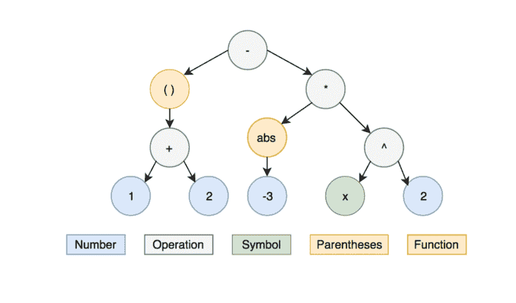
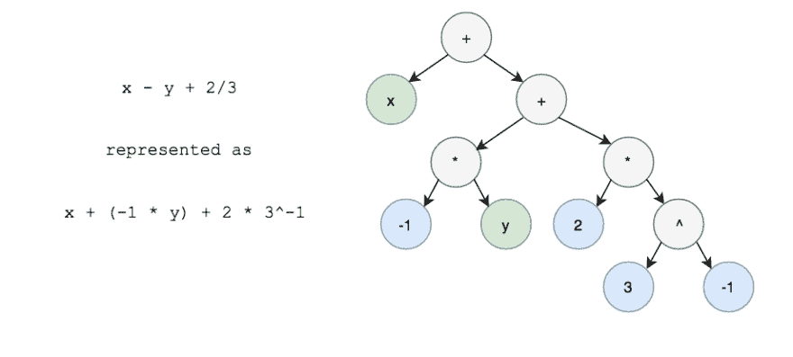
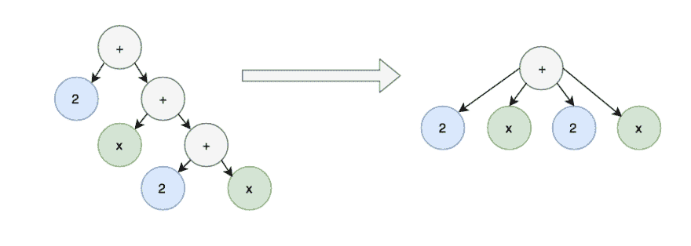
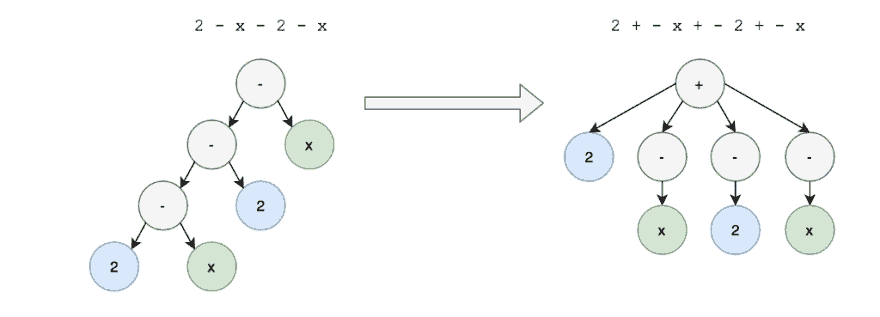
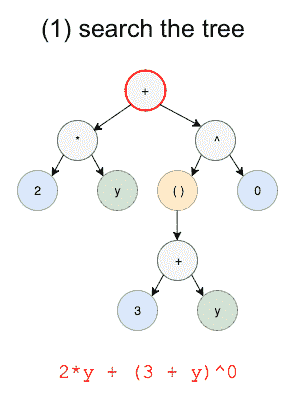
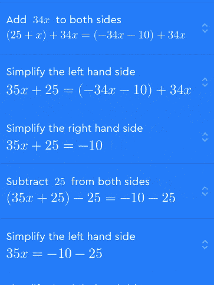
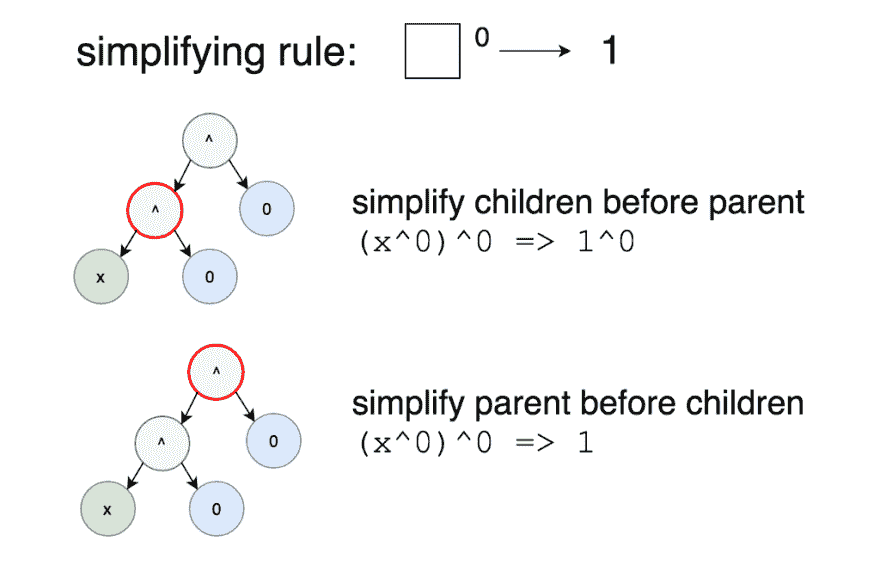

# 步入数学:开源我们的分步求解器

> 原文:[https://dev . to/evykassirer/stepping-into-math-open-sourcing-our-step-by-step-solver](https://dev.to/evykassirer/stepping-into-math-open-sourcing-our-step-by-step-solver)

*【叉上我们* [*GitHub*](https://github.com/socraticorg/mathsteps) *！]*

我们在苏格拉底的使命是“让学习变得简单”。我们的应用程序让你拍下家庭作业问题的照片，我们教你如何回答——神奇！

数百万学生使用我们的[应用](https://itunes.apple.com/us/app/id1014164514)和网站来学习，数学(尤其是代数)一直是最热门的科目，这是有充分理由的:每个人都必须学数学，他们学了好几年，概念是相互建立的，许多人觉得很难理解。

为了提供出色的数学学习体验，我们希望引导学生逐步解决他们的数学问题。一个好的代数问题的分步解决方案(比如“简化 x+β+x+β……”)应该是**详细的**，并且对过程中发生的事情有好的**解释**。这些步骤也应该感觉**直观**——不只是任何一步一步的解决方案，而是一个导师会向学生展示的解决方案。

我们四处寻找可以集成到我们的应用程序中的现有解决方案，但我们发现的解决方案都是闭源的，在付费墙后面，或者没有专注于步骤后面的教学，所以我们决定建立自己的解决方案。

我们很高兴发布[**math steps**](https://github.com/socraticorg/mathsteps)——**第一个循序渐进教授数学的开源项目**。我们希望你能加入我们，让数学变得简单有趣。

#### 苏格拉底式 app 中的 mathsteps

在我们最新的更新中，我们使用 mathsteps 来增强数学体验。学生可以对一道数学题拍照，我们教你怎么答。

[T2】](https://res.cloudinary.com/practicaldev/image/fetch/s--Wu132V2b--/c_limit%2Cf_auto%2Cfl_progressive%2Cq_66%2Cw_880/https://cdn-images-1.medium.com/max/300/1%2AX5b2cbgrSjVrDqzvhY9b3w.gif)

#### 自己项目中的 mathsteps

我们这个项目的主要目标是建立一个数学求解器库，它专注于**(如何最好地教学)。我们目前关注的数学问题是涉及简化表达式的前代数和代数问题，例如从(1 + 2) - abs(-3) * x 到 3 -- 3x。我们的解决方案是一个节点模块，给定一个数学字符串，生成解决方案的步骤列表。重要的是，这种循序渐进的解决方案类似于导师向学生展示的内容。**

 **要安装 mathsteps:

```
npm install mathsteps 
```

要在项目中使用 mathsteps:

```
const mathsteps = require('mathsteps');

const steps = mathsteps.simplifyExpression('2x + 2x + x + x');

steps.forEach(step => {
  console.log(step.oldNode.toString()); // "2 x + 2 x + x + x"
  console.log(step.changeType); // "ADD_POLYNOMIAL_TERMS"
  console.log(step.newNode.toString()); // "6 x"
  console.log(step.substeps.length); // 3
}); 
```

### math steps 如何工作

构建这个数学逐步求解器有三个主要部分:

1.  解析输入(数学字符串)以创建表达式树
2.  修改树以使其更易于使用
3.  以小的方式改变树，每一个改变都是一个“步骤”

### 1。解析数学输入

#### 数学表达式是树

作为人类，我们将数学作为一行文本来读写。如果您要键入一个数学表达式，它可能看起来像这样:

(1 + 2) -绝对(-3) * x

你也可以只看数学表达式，用你的直觉来决定从哪里开始简化。但是当它被存储在一棵树上时，计算机会更好地理解它。这些树可能非常复杂，甚至像(1 + 2) - abs(-3) * x 这样的简短表达式也会变成这种树:

[](https://res.cloudinary.com/practicaldev/image/fetch/s--qKvEHf9P--/c_limit%2Cf_auto%2Cfl_progressive%2Cq_auto%2Cw_880/https://cdn-images-1.medium.com/max/1024/0%2AKn0-h2uFKjubhraU.) 

<figcaption>表达式树为(1+2)-ABS(-3)*β</figcaption>

有许多现有的开源项目可以解析数学字符串并创建像这样的树。其中几个项目也是完整的计算机代数系统(CAS ),可以提供数学问题的答案，尽管没有一步一步的解释。

当我们研究这个项目时，我们考虑使用一个现有的 CAS 并向它添加步骤。 [SymPy](http://www.sympy.org/en/index.html) ，一个著名的开源 CAS，脱颖而出成为一个伟大的选择。然而，在深入研究代码后，我们意识到 [SymPy 表达式树](http://docs.sympy.org/dev/tutorial/manipulation.html)的结构是为寻找答案而优化的，而不是为教学而优化的。它的树不存储除法或减法，因为这些运算可以用乘法、加法和指数来表示。

[](https://res.cloudinary.com/practicaldev/image/fetch/s--moKc-6RD--/c_limit%2Cf_auto%2Cfl_progressive%2Cq_auto%2Cw_880/https://cdn-images-1.medium.com/max/919/0%2AR9AEmDIbvBVMCoC2.) 

<figcaption>x -y + 2/3 表示为数学上等价的 x+(-1 * y)+2 * 3<sup>-1</sup></figcaption>

Sympy 引入歧义；给定一个 sympy 树，有多个用户输入可以产生它，它们在数学上是等价的，但对学生来说不一定是相同的。构建 CAS 时，有利于[减少问题](http://www.math.wpi.edu/IQP/BVCalcHist/calc5.html#_Toc406792440)使目标更容易实现。**但是** **一个中科院的目标，唯一得到的答案，是一个不同于我们的目标，一个循序渐进的解决方案**。逐步解决方案需要不同的架构。

#### math . js 表达式树

进一步看，我们发现了 [math.js](http://mathjs.org) ，一个强大而广泛的开源数学库。它的[表达式树](http://mathjs.org/docs/expressions/expression_trees.html)提供了许多关于数学表达式结构的细节，这非常适合创建我们想要的步骤。与 math.js 合作是一件非常愉快的事情。它的社区非常棒，在我们构建 mathsteps 的过程中， [Jos](https://github.com/josdejong) 一直非常积极地响应和支持我们。

需要注意的是，当 math.js 创建表达式树时，它将所有操作表示为二进制(即一个节点最多可以有两个子节点)。这可以用教科书上对算术运算的定义来解释。例如，+正好是将两个事物相加。所以 2 + 3 + 4 其实不是(2 + 3) + 4 就是 2 + (3 + 4)。这意味着 math.js 必须选择将哪两个东西加在一起。它在构造树时隐式地添加了括号，以使操作二进制化。

但是因为+和*是[交换和关联的](https://www.mathsisfun.com/associative-commutative-distributive.html)二元运算，它们直觉上感觉不是二元的，但是可以有任意数量的参数。2 + 3 + 4 + 5 + 6 感觉是 5 个数的加法。x * y * x * x 感觉像 4 项的乘法，其中 3 项包含 x，可以组合在一起。这个合并步骤在教学中非常重要，这也是为什么我们需要将 math.js 树改为不再是二进制的原因。

### 2。修改分步解决方案的表达式树

在使用 math.js 从一串 math 创建一棵树后，我们通过**展平操作**来转换这棵树。这个展平步骤删除了 math.js 解析器做出的分组选择。通过将二叉树转换成以更人性化的直观方式表示数学的二叉树，执行逐步简化变得容易得多。

例如，考虑表达式 2 + x + 2 + x。以下是简化的步骤:

> 你的问题: *2 + x + 2 + x* >收集喜欢的术语: *(x + x) + (2 + 2)* >组合喜欢的术语: *2x + 4*

但问题是:math.js 为 2 + x + 2 + x 生成的二叉树需要在树上上下迭代以找到相似的术语。当我们第一次像这样转换树时，这些步骤更容易完成:

[](https://res.cloudinary.com/practicaldev/image/fetch/s--Ol5vbxY3--/c_limit%2Cf_auto%2Cfl_progressive%2Cq_auto%2Cw_880/https://cdn-images-1.medium.com/max/926/0%2Ax7fTL1nJcL9nVA5r.) 

<figcaption>展平加法的例子</figcaption>

转换后的树更接近我们直观地看待加法的方式。然后我们可以看看(+)，看到其中两个是 x，两个是数字，把那些类似的项收集起来得到(x + x) + (2 + 2)。展平乘法也是同样的工作方式。

请注意，即使我们更改了树，我们仍然保留了用户的输入，从而保留了我们教授学生问题的能力。只有一种情况，我们存储树的方式，和学生输入的有点不同:减法。当你看到表达式 2 - x - 2 - x 时，你可能仍然把- x 和- x 看作是相似的术语。我们以下面的方式重新构造树来表示这一点:

[](https://res.cloudinary.com/practicaldev/image/fetch/s--5XOTudq1--/c_limit%2Cf_auto%2Cfl_progressive%2Cq_auto%2Cw_880/https://cdn-images-1.medium.com/max/1024/0%2AZ3Ps3H9WdEne_A3E.) 

<figcaption>展平减法的例子</figcaption>

然而，打印的表达式 2 + -x + -2 + -x 实际上没有意义，我们假设学生永远不会输入这个。所以当我们打印右边的树时，我们用 just -代替+ -得到“2 - x - 2 - x”。

你可以在这里阅读展平操作[的代码。](https://github.com/socraticorg/mathsteps/blob/master/lib/util/flattenOperands.js)

### 3。简化表达式数学[循序渐进](https://www.youtube.com/watch?v=iCrargw1rrM)

一旦我们有了一个表达式树，它被修改以最好地支持逐步简化，我们迭代地将**简化规则**应用到树上。以下是我们在每个步骤中迭代的简化规则的主要类别的一些示例，它们按照导师向学生展示的顺序应用:

*   简化基础知识(例如–β= > 1，其中–可以是任何表达式)
*   评估算术(例如 2 + 2 => 4)
*   收集并组合(例如 2x+4xβ+x = > 4xβ+3x)
*   分布(例如，(2x+3)(x+4)= > 2xβ+11x+12

这些简化规则中的每一个都是遍历整个数学表达式树的树搜索，以查看我们是否可以在任何地方执行该简化。例如，搜索规则–1 应该是这样的:

[](https://res.cloudinary.com/practicaldev/image/fetch/s--B9tYXYHb--/c_limit%2Cf_auto%2Cfl_progressive%2Cq_auto%2Cw_880/https://cdn-images-1.medium.com/max/295/0%2AB5NLy6oDc86RhOug.) 

<figcaption>搜索树以应用β–β=>1 简化</figcaption>

在树搜索期间，该算法一次检查一个节点(在 gif 中以红色显示),以查看它们是否匹配规则。对于–1 = > 1 规则，检查如下:

1.  检查该节点是否是^操作节点。如果没有，继续前进。
2.  如果是这样，请检查指数参数。如果指数不为 0，则继续。
3.  如果是，则该节点符合规则。将节点替换为常量节点 1，记录为下一个“步骤”。

mathsteps 中的每个树搜索都会在树中找到一个应用简化的位置，然后从搜索中返回该简化。我们一直在寻找简化，每次都从树的最顶端开始，直到不能再应用更多的简化。在我们进行的过程中，我们保留了一个应用的每个简化的列表，然后组成最终的逐步解决方案。

#### 直观并不意味着简单

为了创造最佳的教学体验，我们有时会为细节添加额外的步骤。理想情况下，有尽可能多的细节，这样我们就不太可能让学生感到困惑。

[](https://res.cloudinary.com/practicaldev/image/fetch/s--FvuRMsev--/c_limit%2Cf_auto%2Cfl_progressive%2Cq_auto%2Cw_880/https://cdn-images-1.medium.com/max/1024/0%2AipgmhNLF8Nc0hWUi.) 

<figcaption>一个完整的解释并不简短或者简单</figcaption>

在这个例子中，最好的解决方案是更多的步骤，也需要更多的代码。**有教学观点使数学求解器更复杂，但这些额外的细节创造了更直观的学习体验**,因为我们正在更彻底地解释事情。

然而，复杂性可以让事情变得…嗯，更复杂。一旦我们开始整合*教授*数学的过程，步骤可能不再只是简化，但这可能会产生技术挑战。例如，教某人做分数加法的最好方法是先解释如何做一个公分母。

[](https://res.cloudinary.com/practicaldev/image/fetch/s--hlM_WKOF--/c_limit%2Cf_auto%2Cfl_progressive%2Cq_auto%2Cw_880/https://cdn-images-1.medium.com/max/1024/0%2AGWPIOLSkgy_lU2c9.) 

<figcaption>分数加法的理想步骤</figcaption>

注意第一步是如何使表达式*变得更加复杂的！但是，如果树搜索在没有任何上下文的情况下一次只做一个更改，可能会发生以下情况:*

[T2】](https://res.cloudinary.com/practicaldev/image/fetch/s--TikEZ_24--/c_limit%2Cf_auto%2Cfl_progressive%2Cq_auto%2Cw_880/https://cdn-images-1.medium.com/max/1024/0%2AvaQ92PiXdAbjGI5S.)

无限循环！好吧，该死。

为了解决这个问题，我们必须记住，在选择下一步时，我们正在添加分数。我们在 mathsteps 中的解决方案是将相关的简化(例如，将两个分数相加的所有步骤)分组到同一个树搜索迭代中。

#### 分组步骤让教学更好

当我们对步骤进行分组时，我们还可以引入子步骤——步骤背后的额外细节，这些细节不会显示在顶层。这是它在我们的应用程序中的样子:

[](https://res.cloudinary.com/practicaldev/image/fetch/s--9fpsr2q---/c_limit%2Cf_auto%2Cfl_progressive%2Cq_66%2Cw_880/https://cdn-images-1.medium.com/max/363/1%2A9nbsfY5MdpX0fjCbVAQJvw.gif) 

<figcaption>苏格拉底式 app 中的子步骤</figcaption>

折叠的子步骤允许我们给出详细的步骤，而不会让学生第一眼就不知所措。我们只能在开始时展示高层次的变化，让学生探索他们不理解的步骤的细节。分组步骤不仅仅是技术上的简化；它们代表了一个真实的、直觉的、教学的概念。

如果你好奇，你可以在这里看到分数相加的代码[。](https://github.com/socraticorg/mathsteps/blob/master/lib/simplifyExpression/fractionsSearch/addConstantFractions.js)

#### 详解

我们试图使步骤描述尽可能的详细和具体；例如，“把分子加在一起比仅仅把数字加在一起要好”。这使我们更接近人类导师可能在多步解释中自然使用的语言。我们还想让 mathsteps 的用户引用表达式中的具体变化，例如“2 加 3 等于 5”。我们跟踪树的哪一部分在节点中发生了变化。

#### 优化简化

在 mathsteps 中，有两种树搜索:一种是先简化节点的子节点，另一种是先简化父节点。

[](https://res.cloudinary.com/practicaldev/image/fetch/s--0JtNjn_Q--/c_limit%2Cf_auto%2Cfl_progressive%2Cq_auto%2Cw_880/https://cdn-images-1.medium.com/max/1024/0%2AKUp0vXuO2xjev_MM.) 

<figcaption>先简化孩子 vs 先简化父母</figcaption>

在这个例子中，在父元素之前简化子元素(这被称为后序搜索)将(x)简化为 1，然后将*简化为 1，这比在子元素之前简化父元素(前序搜索)并直接从(x)简化为 1 更难实现。因此，对于规则–1 =>,我们改变了匹配规则的树的最高*部分。**

然而，对于算术运算的顺序，后序搜索更有意义，因为我们被教导先简化表达式中最深层的东西。例如，(2 * (2 + 3))将首先简化 2 + 3，因此通过尝试在树的较低位置执行简化来开始树搜索会更有效。

一般来说，一些搜索作为前序搜索更好，而另一些作为后序搜索更好。有时这是因为技术原因和效率，但很多时候是因为教学原因。重要的是，代码库是围绕教学而组织的，而不仅仅是解决数学问题。

### 还有更多的事情要做

我们已经完成了很多，目前正在为[高中代数](https://github.com/socraticorg/mathsteps/blob/master/lib/ChangeTypes.js)的子集提供高质量的分步解决方案。然而，要扩大我们的覆盖面，教更多的学生，T2 还有很多事情要做。我们对这个项目的未来感到兴奋，我们也很高兴看到 mathsteps 还将构建什么。

以下是我们对基于 mathsteps 的优秀教学体验的一些想法:

*   在向学生展示一个步骤之前，让他们猜测下一步要做什么，并在进行过程中检查他们的工作
*   记录学生提出的问题类型以及他们查看子步骤的时间，并使用这些信息定制他们未来逐步解决方案的细节

…还有更多的可能性！如果你有想法，我们很乐意倾听。

### 帮助扩展 mathsteps

我们已经把 mathsteps 开源了！我们的目标是帮助尽可能多的学生，所以我们希望您能加入我们，帮助扩展 mathsteps 以支持各种数学！这个项目很多都是一个学生实习生(我！)所以你不需要一个花里胡哨的博士来理解它或者做出贡献。

以下是一些很好的起点:

*   在 GitHub 上查看我们的[小任务](https://github.com/socraticorg/mathsteps/issues?q=is%3Aissue+is%3Aopen+label%3Asmall)——它们是你第一次改变的绝佳选择！
*   如果你想探究现有代码做了什么或者它是如何工作的，通读我们对步骤的[测试或者代码注释中的例子](https://github.com/socraticorg/mathsteps/tree/master/test)
*   阅读我们的 [CONTRIBUTING.md](https://github.com/socraticorg/mathsteps/blob/master/CONTRIBUTING.md) 了解更多关于投稿的细节

我们对 mathsteps 感到兴奋，并希望它将改善工程师和学生的数学教育技术世界。如果您想与我们聊天，与我们一起创建您的第一份 PR，或者在您的项目中使用 mathsteps 获得一些帮助，请联系我们——“我们希望 [**收到您的来信**](mailto:mathsteps@socratic.org) ！

伊菲·卡西勒 *是滑铁卢大学的计算机科学学生，曾在谷歌、可汗学院和苏格拉底学院实习。她致力于激发好奇心，喜欢建造帮助人们的东西，热爱她的社区。*

* * *

*本帖最初发表于[medium.com](https://blog.socratic.org/stepping-into-math-open-sourcing-our-step-by-step-solver-9b5da066ae36)T3】***