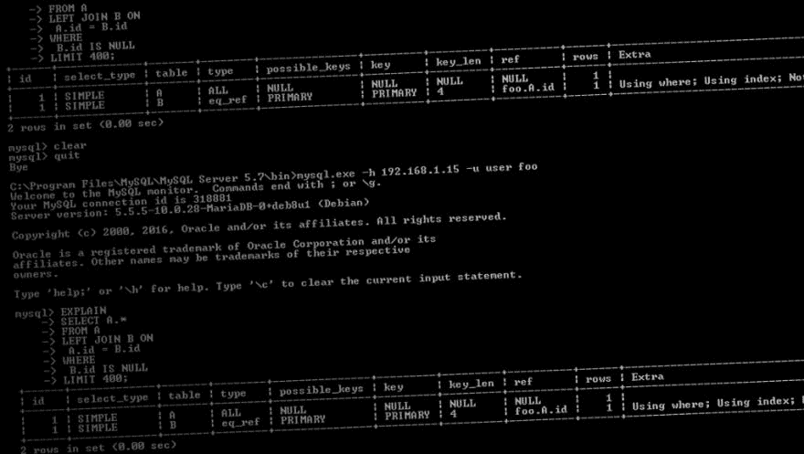

# 查询优化:从几周到 24 小时

> 原文:[https://dev . to/tddenbraber/query-optimization-from-a 几周到 24 小时-1a08](https://dev.to/tddenbraber/query-optimization-from-a-few-weeks-to-24-hours-1a08)

[T2】](https://res.cloudinary.com/practicaldev/image/fetch/s--kLIMTL1W--/c_limit%2Cf_auto%2Cfl_progressive%2Cq_auto%2Cw_880/https://cdn-images-1.medium.com/max/1024/0%2ADgpbgFCu6k-rj6h2.jpg)

每个编写 SQL 查询的人偶尔都会遇到这种情况:这些查询花费的时间太长。最近，我们的一个系统遇到了这样的问题。在这篇博文中，我将首先描述这个系统，然后展示这个问题是如何产生的，最后，我们如何解决它。剧透:这个过程现在需要 24 小时…而不是几周。

### 检测突变

我们的一个应用程序为我们的客户提供了不同的数据视图。每隔几周，我们就会从客户端收到一个数据集，并将其导入到我们的应用程序中。但是，我们在应用程序中使用的表示不同于接收到的数据转储的表示。为了能够处理接收到的转储和系统中的数据之间的差异，我们使用了一个突变检测器。突变检测器使用 SQL 查询来查找应用程序中的数据和接收到的转储之间的批量差异。在获取下一批更改之前，首先处理每一批。下面是一个突变检测查询的例子。它检测在表`A`中出现但不在表`B`中出现的所有条目，假设对于在`A`和`B`中出现的条目，它认为`A.id = B.id`。

```
SELECT A.* 
FROM A 
LEFT JOIN B ON 
    A.id = B.id 
WHERE 
    B.id IS NULL 
LIMIT 400 
```

<svg width="20px" height="20px" viewBox="0 0 24 24" class="highlight-action crayons-icon highlight-action--fullscreen-on"><title>Enter fullscreen mode</title></svg> <svg width="20px" height="20px" viewBox="0 0 24 24" class="highlight-action crayons-icon highlight-action--fullscreen-off"><title>Exit fullscreen mode</title></svg>

### 去哪里找他们

突变检测器一遍又一遍地执行相同的查询，直到找不到任何变化。然而，MySQL 并不保存关于它最后执行的查询的信息，即 MySQL 不知道它已经在哪里寻找变化。很有可能 MySQL 查看一条记录，发现它与我们系统中的数据没有什么不同，因为该条目已经包含在前面的查询中。结果是，随着时间的推移，查询变得越来越慢:最初的变化在几毫秒内被检测到，但随着更多的变化被处理，搜索新的突变需要越来越长的时间。

### 借 MySQL 一把

这个问题的解决方案很简单:我们需要给 MySQL 更多关于它已经在哪里寻找变化的信息，这样它就不会多次查看同一个条目。为了找出从哪里开始，我们运行`EXPLAIN`来找出`JOIN`语句是如何解析的，以及 SQL 将首先读取哪个表(从现在开始我们将这个表称为 base)。这是`EXPLAIN`语句输出中最顶端的条目。知道了 MySQL 从哪里开始搜索，我们就可以引入一个“便宜的`ORDER BY`”。让`pk`成为 base 的主键；我们可以增加`ORDER BY base.pk` [而不引入额外的成本](http://dev.mysql.com/doc/refman/5.7/en/order-by-optimization.html)。既然我们已经告诉 MySQL 它应该以什么顺序检测突变，我们还可以跟踪它在哪里检测到最后一个突变。我们将`base.pk`添加到选择的列中，而不是只查询*和*突变。在突变检测器中，我们保存遇到的 base.pk 的最大值，并将以下条件添加到查询中:`base.pk > [largest base.pk encountered]`。由于`ORDER BY`和`base.pk`上的条件，我们确信 MySQL 不会多次覆盖同一个条目。

我们现在可以将这些技术合并到上面给出的突变检测查询中。因为我们从`A`到`B`做了一个`LEFT JOIN`，我们知道`A`将被首先读取，因此对应于我们之前谈到的基表。`A.id`是`A`的主键，已经包含在`A.*`中，所以在这种情况下，不需要显式选择`A.id`。结果查询如下:

```
SELECT A.* 
FROM A 
LEFT JOIN B ON 
    A.id = B.id 
WHERE 
    B.id IS NULL AND 
    A.id > [largest encountered A.id in previous queries] 
ORDER BY A.id 
LIMIT 400 
```

<svg width="20px" height="20px" viewBox="0 0 24 24" class="highlight-action crayons-icon highlight-action--fullscreen-on"><title>Enter fullscreen mode</title></svg> <svg width="20px" height="20px" viewBox="0 0 24 24" class="highlight-action crayons-icon highlight-action--fullscreen-off"><title>Exit fullscreen mode</title></svg>

### 结束语

这种机制(包括一些其他小的优化)将导入某个数据集的时间从几周甚至几个月*减少到了 24 小时。上述机制适用于您想要检测和处理批处理的上下文，而不是一次检测和处理整个数据集。关键的教训是，向查询中添加额外的信息可以获得巨大的加速。每个读者都应该牢记的另一件事是:使用`EXPLAIN`来分析你的查询。它将加深您对数据库如何处理您的查询的理解，并且您将学习如何处理数据库的查询策略。

*不要担心，我们实际上并没有等待数周:我们在流程完成之前优化了查询。

*最初发表于*[*【www.moxio.com】*](https://www.moxio.com/blog/13/query-optimization-from-a-few-weeks-to-24-hours)*。*

* * *