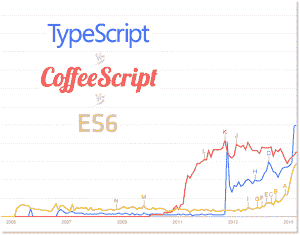
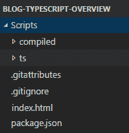

# Typescript 简介

> 原文：<https://dev.to/samueleresca/introducing-typescript>

原贴于[https://samueleresca.net](https://samueleresca.net)

> 阿特伍德定律:任何可以用 Javascript 编写的应用程序最终都会用 Javascript 编写——杰夫·阿特伍德

## 简介

[Typescript](http://www.typescriptlang.org/) 是微软创造的一种语言，以开源的方式发布(~~微软+开源？！？！？！？！~~)阿帕奇 2.0 许可。这种语言的基础是使 Javascript 程序的开发扩展到数千行代码。该语言通过提供**更好的设计时工具、编译时检查和运行时动态模块加载来攻击**大规模 Javascript 编程问题**。**typescript 语言是 Javascript 的**类型化超集**，它**被编译成普通 Javascript。这使得用 Typescript 编写的程序具有高度的可移植性，因为它们可以在几乎任何机器、网络浏览器、网络服务器和节点上运行。**

### Typescript 解决了哪些问题？

Typescript 解决了许多问题，尤其是在以下方面:

*   **原型继承:** Typescript 通过添加类、模块和 iterfaces 解决了这个问题。这允许程序员转移他们现有的 OOP 知识；
*   **等式和类型杂耍:** Typescript 引入了类型检查，它可以在设计和编译时提供警告，以发现潜在的意外杂耍；
*   **模块管理:** Typescript 使模块加载器正常工作，并允许编译您的模块以适应两种最流行的模块加载方式，而无需更改您的代码；
*   **Scope:** Typescript 警告您关于隐式全局变量；

### 打字稿替代品

Coffescript.org 是 Typescript 的替代品，它的语法类似于 Python，事实上它是一种与 JavaScript 非常不同的语言。另一种选择是谷歌的 **Dart** 语言。Dart 与 Typerscript 有更多的共同点，你可以在这里找到更多信息[。](https://www.dartlang.org/)我也推荐你阅读[这篇由尼尔·格林写的演讲](http://i%20recommend%20you%20to%20read%20this)，它比较了 Typescript、CoffeeScript 和 ES6。

### 为什么要用 TypeScript？

[caption id = " attachment _ 1169 " align = " align left " width = " 300 "][](http://samueleresca.net/wp-content/uploads/2015/10/typescript-coffeescript-es6.png)鸣谢:neilonsoftware . com[/caption]Typescript 是一种应用程序级编程语言，它提供了对提议的新 Javascript 功能和强大的附加功能的早期访问。Typescript 在**具有 **OOP 方法**的大规模应用**中很有用，类和接口可以在浏览器和服务器应用之间重用。Typescript 变得越来越普遍，它也被很多公司和框架使用，比如 [Angular JS](https://github.com/angular/angular) 。显然，typescript 与 Visual studio 100%集成，但它也可以与其他工具集成，如 Webstorm、Eclipse、Sublime Text、Visual Studio 代码和 Atom·可以使用 [Node.js.](https://nodejs.org/en/) 编译 Typescript

## 入门:打字稿和咕哝

[ ](http://samueleresca.net/wp-content/uploads/2015/11/grunt-typescript.png) [GruntJS](http://gruntjs.com/) 是一个 JavaScript 任务运行器，被很多框架和插件用来自动化一些任务。typescript 可以**结合**与 GruntJS:它监视对 Typescript 文件执行的更改，并将 Typescript 文件编译成 JS 文件。下面的演示演示了如何设置开发 Typescript 应用程序的环境。

#### 项目要求

GruntJS 和 Typescript 运行在 NodeJS 上，你可以从[这里](https://nodejs.org/en/download/)安装 node。

### 项目设置

首先，让我们创建一个新文件夹，它将包含项目并键入以下命令:

```
npm init

```

它将创建 **package.json** 文件，该文件将包含关于已安装的软件包和依赖项的所有信息。

#### 安装依赖项

下面是最后的 **package.json，**它声明了 typescript 所需的所有 dev dependencies:【https://gist.github.com/e47a5e2c7e14557a77df】T2 你可以复制你的 package.json 中的 **devDependencies** 部分，并启动以下命令来解决所有 Typescript 依赖:

```
npm install

```

#### 项目结构

[T2】](http://samueleresca.net/wp-content/uploads/2015/11/typescript-overview-folder-structure.png)

*   **脚本/ts** 将包含所有。项目使用的 ts 文件；
*   **Scripts/compiled** 将包含 main.js，这是*的结果。ts 文件编译；

**index.html**简单的包含了 main.js 文件，下面是源代码:【https://gist.github.com/4c7faac11af2b65eeb70】T2

#### 配置咕哝

下一步是使用 **GruntFile.js** 配置 grunt 的任务。下面的代码片段显示了 grunt 的配置:【https://gist.github.com/8dbe86fa226a4ba2ec07】T2“typescript”部分(第 20 行)告诉 grunt typescript 文件和目标文件(main.js)的路径，它还指定了要监视更改的**文件夹**(第 30 行)。要运行 gunt 任务，让我们键入

```
grunt

```

在项目文件夹中。

### 演示源代码

以下是 **main.ts** 文件所使用的源代码，它将被编译成 **main.js** 文件并被【index.html】页面[https://gist.github.com/1fce4d97db00faf6ddd2](https://gist.github.com/1fce4d97db00faf6ddd2)的**收录**

## 结论

帖子简单介绍了打字稿，官方网站上有完整的参考指南[，本演示使用的所有代码](http://www.typescriptlang.org/Handbook)[都在 Github](https://github.com/samueleresca/blog-typescript-overview) 上共享。干杯:)