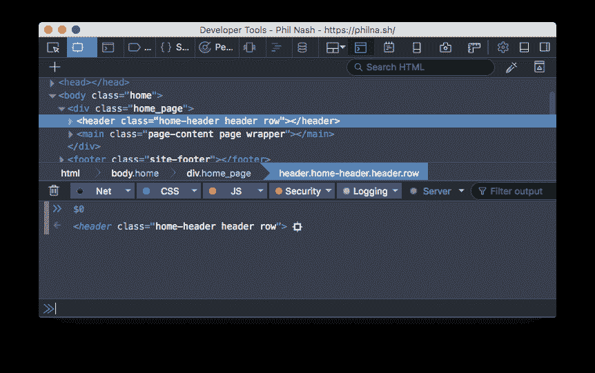
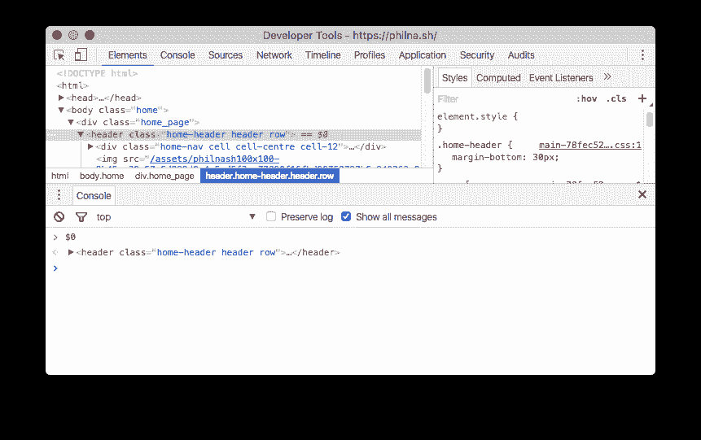
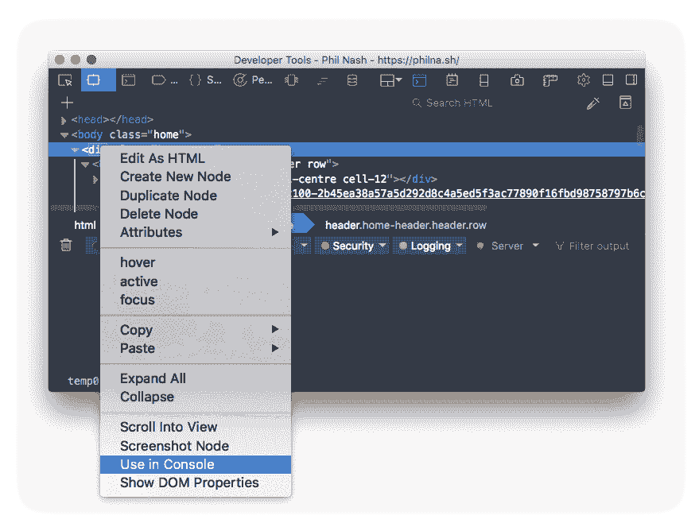
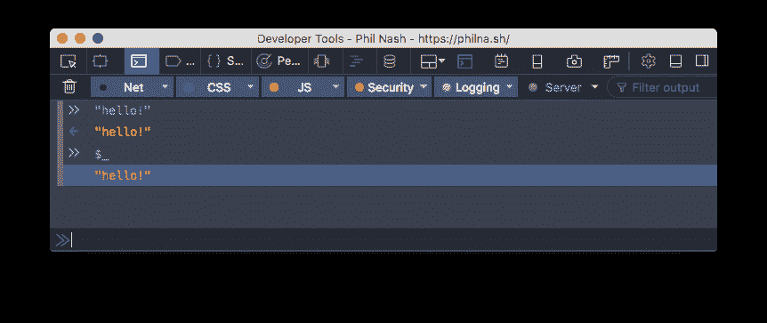
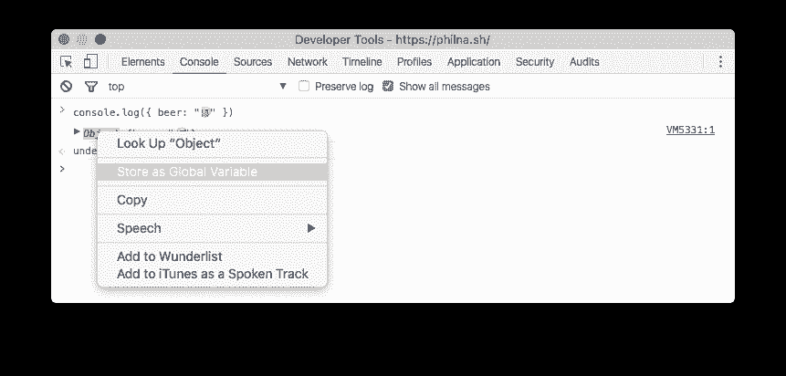

# 开发工具技巧:将对象和元素作为变量存储在控制台中

> 原文:[https://dev . to/philnash/dev-tools-tricks-store-objects-and-elements-as-variables-in-the-console](https://dev.to/philnash/dev-tools-tricks-store-objects-and-elements-as-variables-in-the-console)

浏览器开发工具的功能太多了，很难跟上。我敢打赌，每个开发人员都知道彼此不同的一组特性。我想分享一些我使用的小技巧，你可能不知道，如果我不写下来，我可能会忘记。

继续阅读，发现`$0`、`$_`和`temp0`的魔力。

## 访问所选元素作为变量

当你点击 Firefox 中的检查器或 Chrome 中的 Elements 标签页，并想在控制台中使用选中的元素时，你需要一个对该元素的引用。您可以键入一个`querySelector`来从文档中挑选元素，但是这太麻烦了。相反，让元素保持选中状态，并使用控制台中的`$0`来获取您需要的引用。

[T2】](https://res.cloudinary.com/practicaldev/image/fetch/s--4Ulc9O0K--/c_limit%2Cf_auto%2Cfl_progressive%2Cq_auto%2Cw_880/https://philna.sh/assets/posts/dev-tools-tricks/firefox_dollar_zero-510b6a988373a6f07bcdaa3f3721bdbfa3dbd7d8eddd5627c6c9a0511abd0407.png)

Chrome 甚至通过在 HTML 旁边显示`== $0`来暗示这一点。

[T2】](https://res.cloudinary.com/practicaldev/image/fetch/s--bBiRs_18--/c_limit%2Cf_auto%2Cfl_progressive%2Cq_auto%2Cw_880/https://philna.sh/assets/posts/dev-tools-tricks/chrome_dollar_zero-a369679f67b420864f9d2e8d257ee77483982c0d99b3def3019881de16d6f859.png)

但是要注意，如果你在检查器中选择了一个不同的元素，那么它将成为`$0`的主题，你将失去对旧元素的引用。

Firefox 对此有另一个窍门。右键单击一个元素并选择“在控制台中使用”。这会将一个名为`temp0`的变量放入控制台的命令行中，该变量是对所选元素的引用。

[T2】](https://res.cloudinary.com/practicaldev/image/fetch/s--gL61Nvxb--/c_limit%2Cf_auto%2Cfl_progressive%2Cq_auto%2Cw_880/https://philna.sh/assets/posts/dev-tools-tricks/firefox_use_in_console-671b0e3849c059eea10ce109891e16c14aedf67f955ffb6451af0dec2ef9c015.png)

## 把控制台中的任何对象变成一个全局变量

如果您在控制台中处理其他对象，可能是您从自己的代码中记录的对象，并且您希望引用它们，那么也有几种方法可以做到这一点。

例如，`$_`是对控制台中返回的最后一个对象的引用。

[T2】](https://res.cloudinary.com/practicaldev/image/fetch/s--utPDswcN--/c_limit%2Cf_auto%2Cfl_progressive%2Cq_auto%2Cw_880/https://philna.sh/assets/posts/dev-tools-tricks/firefox_dollar_underscore-cae5a1e421b153f749cf02db5b332ac06c043942072a5f72f30ea1df3b7549ff.png)

更一般地说，任何已经返回或记录到控制台的对象都可以通过右键单击它并选择“存储为全局变量”来转换为全局变量。您将获得一个引用该对象的名为`temp0`的变量。更好的是，对更多的对象这样做，你会得到新的变量叫做`temp1`，然后是`temp2`，以此类推。

[T2】](https://res.cloudinary.com/practicaldev/image/fetch/s--wgdETez0--/c_limit%2Cf_auto%2Cfl_progressive%2Cq_auto%2Cw_880/https://philna.sh/assets/posts/dev-tools-tricks/store_as_global-bb26e1820c7c4c855487ad00ce61eb3857e7c1ad16eabb882eb7dcedd0e75204.png)

## 开发工具深入

关于开发工具有太多的东西需要学习，这些只是在调试代码时可能有所帮助的一些小技巧。如果你正在寻找更多这样的技巧，我建议你注册参加 [Umar Hansa 的开发技巧](https://umaar.com/dev-tips/)或者观看他的 [ffconf 2016 演讲](https://www.youtube.com/watch?v=N33lYfsAsoU&list=PLXmT1r4krsTpDoGcdh1baZPIV6DtX9_rX)。

不要忘记分享你自己的技巧或你在开发工具中发现的东西。如果你有什么好的，请发推特给我，地址是 [@philnash](https://twitter.com/philnash) 。

* * *

*[Dev Tools 招数:将对象和元素作为变量存储在控制台](https://philna.sh/blog/2017/01/12/dev-tools-tricks-store-objects-and-elements-as-variables-in-the-console/)最初发表于 2017 年 1 月 12 日 [philna.sh](https://philna.sh) 。*