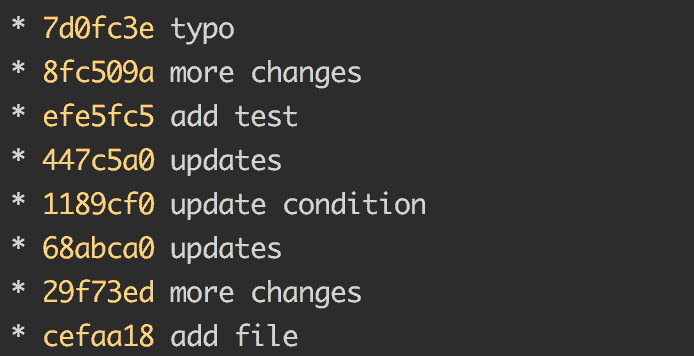

# 何时让 Git 提交

> 原文:[https://dev.to/gonedark/when-to-make-a-git-commit](https://dev.to/gonedark/when-to-make-a-git-commit)

你不需要在 GitHub 上查看太多的提交历史，就能发现人们对于提交是非常糟糕的。

[T2】](https://res.cloudinary.com/practicaldev/image/fetch/s--I5aN6UXo--/c_limit%2Cf_auto%2Cfl_progressive%2Cq_auto%2Cw_880/https://jason.pureconcepts.nimg/git-commit-history.png)

现在我不打算谈论编写提交消息。这里有*[在那上面贴](http://chris.beams.io/posts/git-commit/)。我想谈谈同样重要的话题*何时*提交。*

 *我在会议上经常被问到这个问题。足够让我制定两个*规则*并不断测试。

我在以下情况下提交:

1.  我完成一个*工作单元*。
2.  我有我可能想要*撤销*的更改。

每当我满足这些规则中的一个，我就提交那组更改。明确地说，我只提交**那组变更。例如，如果我有变更，我可能想要撤销完成一个工作单元的**和**变更，我会提交两次——一次包含我想要撤销的变更，另一次包含完成工作的变更。**

我认为第二条规则非常简单。所以让我们先解决它。随着时间的推移，你会做出一些你*知道*会撤销的改变。无论是促销功能、补丁还是其他临时改变，总有一天你会想要撤销这些工作。

如果是这种情况，我将在自己的提交中进行这些更改。这样很容易找到变化并使用`git revert`。这种实践已经一次又一次地证明了自己，我甚至会在他们自己的提交中提交我不确定的更改。

回到第一条规则。

我想一般来说，我们大多数人都遵循这条规则。然而，你不必在 GitHub 上浏览太多的库，就能发现我们在提交方面做得很差。

差异来自于我们如何定义一个*工作单元*。

让我们从如何**而不是**来定义一个*工作单元*开始。

一个工作单位绝对不是基于时间的。每隔几分钟、几小时或几天提交一次是荒谬的，并且永远不会产生一个*版本历史*，它在记录系统之外提供任何价值。

是的， *WIP* 提交是可以的。但是如果他们出现在你的*大师*的历史上，我就来找你了！

基于变更的类型，工作单元是*而不是*。将对*新文件*的提交与对*已修改文件*的提交分开很少有意义。任何其他*类型*抽象也是如此:代码(例如 JavaScript vs HTML)、层(例如客户端 vs API)或位置(例如文件系统)。

那么如果一个*工作单元*基于*时间*或者*类型*是**而不是**，那么呢？

我觉得是基于*特征*。一个特性提供了更多的上下文。这使得它成为一个*工作单元*的更好的度量。通常，在这个上下文中隐含着诸如*时间*和*类型*，以及变化的*性质*之类的东西。换句话说，通过基于特性的*工作单元*将引导你提交一个故事。

那么，为什么不制定第一条规则:*当我完成一个特性*时，我提交？

嗯，我认为这是一个旅程很重要的例子。一个*特性*可能意味着不同的事情，甚至在同一个存储库的上下文中。特征的大小也可以不同。使用*工作单元*，您可以灵活控制*单元*的*大小*。你只需要知道如何*测量*。我发现 by *特性*给你最好的提交。

喜欢这篇文章吗？查看我的综合视频系列[获得 Git](https://gettinggit.com) 。*