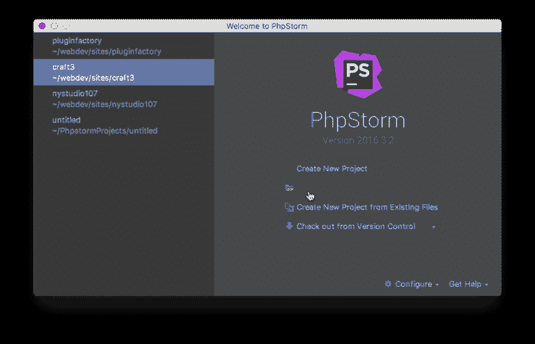
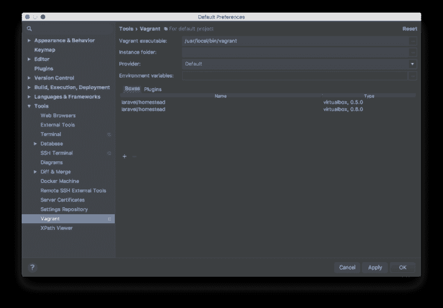
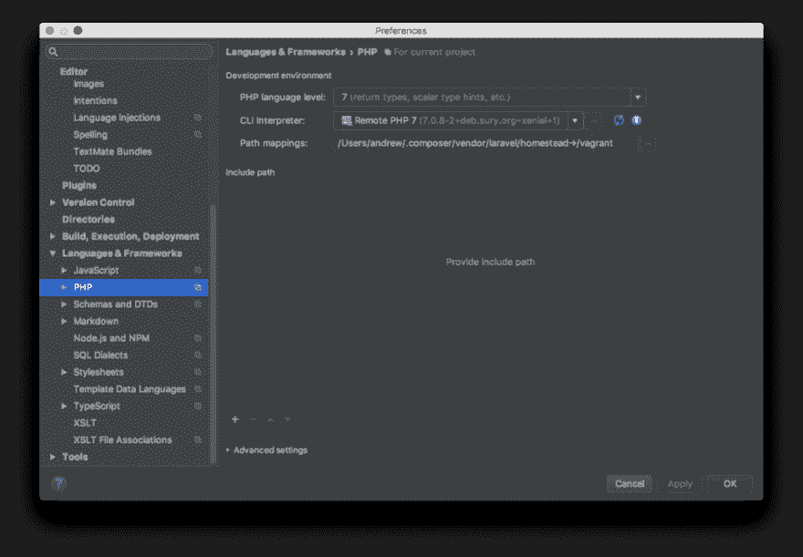
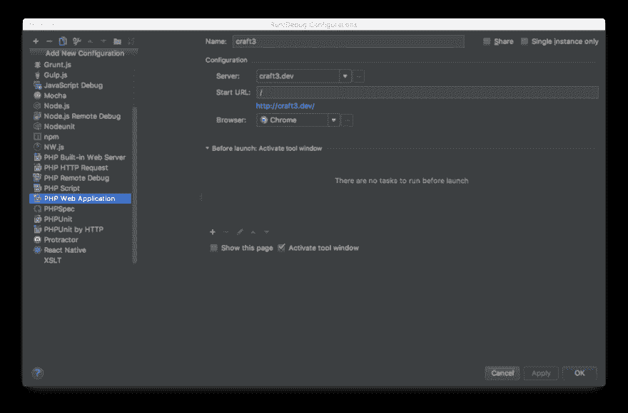
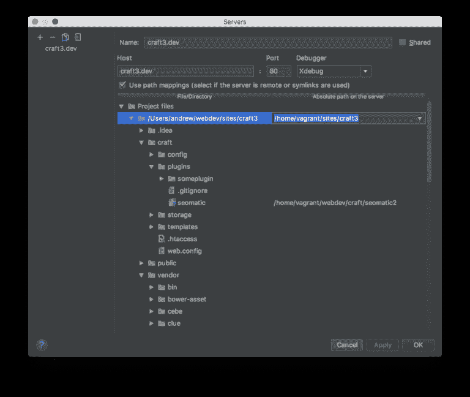

# 对流浪者/家园使用 PhpStorm

> 原文:[https://dev . to/gaijinity/using-PHP storm-with-lavong-homestead-32l 1](https://dev.to/gaijinity/using-phpstorm-with-vagrant-homestead-32l1)

# 使用 PhpStorm 与流浪者/家园

### 下面是如何为本地开发人员设置 Php Storm，并为 Craft CMS 或其他 Php 开发人员设置 Xde bug

安德鲁·韦尔奇

[T2】](https://res.cloudinary.com/practicaldev/image/fetch/s--IP-J2uCW--/c_limit%2Cf_auto%2Cfl_progressive%2Cq_auto%2Cw_880/https://nystudio107-ems2qegf7x6qiqq.netdna-ssl.com/img/blog/_1200x675_crop_center-center_82_line/storm-at-sea.jpg)

有很多关于使用 [Php Storm](https://www.jetbrains.com/phpstorm/) 和[流浪者/家园](https://laravel.com/docs/5.3/homestead)的指南，但其中很多都已经过时了，鉴于我遇到的令人困惑的问题，我想我应该贴一个关于这个主题的快速“如何做”。

这是一个非常特殊的到岸价格。如果你不是为了进行 PHP 开发(或者是 Php 和 fron 的混合开发)而使用 Php Storm with lavour/Homestead 的话，你可能对它一点都不感兴趣。

那么我们为什么要用 Php Storm 呢？用我认识的一个叫 Brad 的愤怒的家伙的话来说，“坦白地说，我不知道没有它的 PHP 是怎么开发的。”

如果您从事任何级别的 PHP 开发，花费时间设置断点、检查变量值、查看堆栈跟踪等等都是值得的。您期望从集成开发环境(IDE)中得到的正常东西。

Php Storm Lara Casts 中的一些是必看的(而且是免费的！)对于任何一个使用 PhpStorm 的人来说。

## 我的秘密耻辱

尽管事实上我在开发过程中做了大量的 PHP plu g，但我的秘密遗憾是我一直在和 T2 的 Sub lime Text 一起做。这不是对 Sub lime 文本的轻视，这是一个粉丝的评论。但它不是一个 IDE，试图在没有 IDE 的情况下进行任何规模的开发都是痛苦的。

我做了几次尝试来启动和运行 Php Storm，但是我总是遇到一些令人困惑的问题，或者根本没有时间来启动和运行它，并学习如何有效地使用它。

[T2】](https://res.cloudinary.com/practicaldev/image/fetch/s--TXy8f125--/c_limit%2Cf_auto%2Cfl_progressive%2Cq_auto%2Cw_880/https://nystudio107-ems2qegf7x6qiqq.netdna-ssl.com/img/blog/_1200x675_crop_center-center_82_line/hidden-shame-face.jpg)

因此，我对即将到来的项目的“一件新事情”是，不管遇到什么样的困难，都要开始 Php 风暴。如果你正在做任何级别的 PHP 开发工作，不要像我一样。尽快登上 Php 风暴快车。

## 启动并运行 ting Php Storm

所以让我们收拾东西跑吧，好吗？本教程假设您已经安装并运行了 lavour，并且正在使用它进行本地开发。如果你还没有安装并运行 ning，视频[在流浪者之家 stead](https://www.youtube.com/watch?v=DfUqciZ91oU) 上设置工艺 CMS 将会帮助你。

第一个专业建议是当你启动 Php Storm 时，不要使用它的任何设置向导。我肯定有办法让他们产生想要的最终结果，但我肯定没有找到。

相反，只需直接进入**打开**并选择你现有的 root Craft CMS 项目安装，就可以了。

[T2】](https://res.cloudinary.com/practicaldev/image/fetch/s--_fYd9r96--/c_limit%2Cf_auto%2Cfl_progressive%2Cq_auto%2Cw_880/https://nystudio107-ems2qegf7x6qiqq.netdna-ssl.com/img/blog/_768x494_crop_center-center_100_line/phpstorm-open.png)

接下来我们需要做的是告诉 Php Storm 我们正在使用流浪者。进入**PHP storm→首选项**，然后点击**工具→漫游**。如果您看到一条错误消息`Error: Can't run Vagrant executable`，即使 Vagrant 已经正确安装并运行，也可能是`vagrant`命令不在您的`$PATH`中。

[T2】](https://res.cloudinary.com/practicaldev/image/fetch/s--LwA8nEkp--/c_limit%2Cf_auto%2Cfl_progressive%2Cq_auto%2Cw_880/https://nystudio107-ems2qegf7x6qiqq.netdna-ssl.com/img/blog/_992x689_crop_center-center_100_line/phpstorm-vagrant.png)

例如，我必须输入我的`vagrant`可执行文件的完整路径:`/usr/local/bin/vagrant`点击**应用**。

[T2】](https://res.cloudinary.com/practicaldev/image/fetch/s--MOKK8lFJ--/c_limit%2Cf_auto%2Cfl_progressive%2Cq_auto%2Cw_880/https://nystudio107-ems2qegf7x6qiqq.netdna-ssl.com/img/blog/_992x689_crop_center-center_100_line/phpstorm-php-settings.png)

接下来，我们需要告诉 Php Storm 我们正在使用什么样的 **PHP 语言级别**(版本)(PHP 7 是我建议每个人现在使用的基础)，并且我们需要选择项目应该使用的流浪者盒子内的*的**客户端解释器**。*

点击客户端解释器旁边的小标题`…`，设置`Vagrantfile`(通常在`Homestead/`文件夹内)的路径，以便 Php Storm 知道在哪里可以找到你的流浪虚拟机，并适当地配置你的远程 Php 设置，然后点击**应用**。

如果它没有出现，点击圆形箭头图标，它将连接到你的流浪者盒子，并进行交互。点击**应用**。

接下来，我们需要为我们的项目设置一个运行配置。转到**运行→编辑配置…**

[T2】](https://res.cloudinary.com/practicaldev/image/fetch/s--fJuUqff7--/c_limit%2Cf_auto%2Cfl_progressive%2Cq_auto%2Cw_880/https://nystudio107-ems2qegf7x6qiqq.netdna-ssl.com/img/blog/_992x654_crop_center-center_100_line/phpstorm-run-config.png)

然后点击 **+** 图标，选择 **PHP Web Appli ca tion** ，给你的运行配置起一个名字(我只是以项目名命名)。选择尤尔想要使用的默认浏览器(我更喜欢 Chrome 浏览器，但无论什么对你都适用)。

接下来，我们需要为它设置一个服务器，用于这个运行配置。点击**服务器**下拉菜单旁边的小 **…** 按钮，给你的服务器阿尔名称，输入本地 URL，确保**调试程序**设置为 **Xde bug** 。

[T2】](https://res.cloudinary.com/practicaldev/image/fetch/s--XNy2M9fj--/c_limit%2Cf_auto%2Cfl_progressive%2Cq_auto%2Cw_880/https://nystudio107-ems2qegf7x6qiqq.netdna-ssl.com/img/blog/_768x648_crop_center-center_100_line/phpstorm-server.png)

选中**使用路径映射 pings(选择服务器是远程的还是使用 sym 链接)**复选框。现在我们需要告诉 Php Storm 我们的本地文件在服务器上的什么位置。例如，我在本地机器上的项目根目录是`/Users/andrew/webdev/sites/craft3`，但是它需要被映射到远程服务器上的绝对路径`/home/vagrant/sites/craft3`(我们的流浪者盒子)。

我们需要为根项目添加一个 map ping，以及任何其他符号链接的东西。例如，对于 plu g in devel op ment 来说，`seomatic` plu g in 是一个到它在我的开发机器中的实际位置的符号链接，所以我们也需要为它添加一个映射 ping。

虽然这看起来有点奇怪，但是请记住 Php Storm 从您的本地机器上读取文件，但是让您在我们的 travel box 上的“远程”服务器上运行和调试它们。所以我们需要一些方法来告诉它如何映射这些东西。

点击**确定**，然后从**运行/调试配置**设置中的**服务器:**下拉菜单中选择这个新的服务器配置，然后点击**确定**。

## 我们到了吗？

*注意:*下面的问题已经在家庭版的更新版本中解决了，所以下面的问题可能对你不适用……但是检查一下你的 Xde 错误设置也无妨。

不，我们还没有到那一步——但是我们已经非常接近了！不管是什么原因，尽管 Home stead 包含 Xde bug，默认情况下它是启用的，但它还没有准备好进行远程调试。在流浪汉之箱的文本中我完全不明白。但是无论如何…

所以我们需要设置它。通过`vagrant ssh`到你的流浪者盒子，然后假设你运行的是 php7.0，编辑`/etc/php/7.0/mods-available/xdebug.ini`(你需要`sudo`)文件如下:

```
 zend_extension=xdebug.so
xdebug.remote_autostart = 1
xdebug.remote_enable = 1
xdebug.remote_connect_back = 1
xdebug.remote_port = 9000
xdebug.max_nesting_level = 512 
```

这告诉它我们希望能够使用 [Xde bug](https://xdebug.org/) 进行远程调试。保存它，然后通过`sudo service php7.0-fpm restart`重启`php7.0-fpm`服务，你就可以走了。

如果你运行的是 PHP 7.1 的更新版本，只需在上面的路径/注释中用`7.1`替换`7.0`。

你现在可以开始享受 Php Storm IDE 的所有好处，使用**运行→运行项目名**或**运行→调试项目名**菜单项。

设置断点。深入堆栈跟踪。做一些了不起的事情。

## 进一步阅读

如果你想获得新文章的通知，请在 Twitter 上关注[纽约时报 107](https://twitter.com/nystudio107) 。

版权所有 2020 nystudio107。由 nystudio107 设计