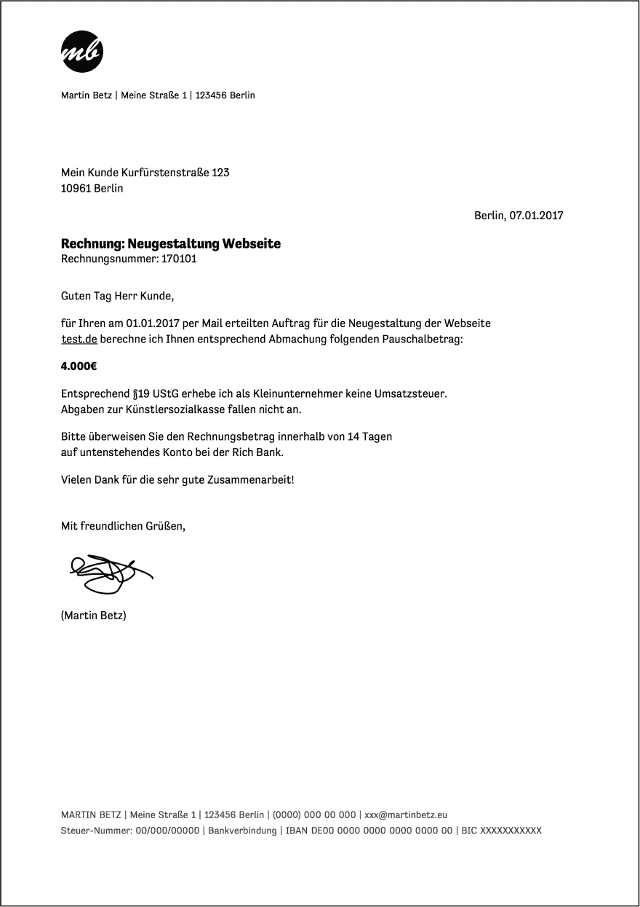

# 使用 Pandoc 从 Markdown 生成 PDF 发票

> 原文：<https://dev.to/martin_betz/generate-pdf-invoices-from-markdown-using-pandoc>

## TL；速度三角形定位法(dead reckoning)

您可以使用 [Pandoc](http://pandoc.org/) 和 [WKHTMLTOPDF](http://wkhtmltopdf.org/) 从 Markdown 文件生成好看的 PDF 发票。

## 上下文

我喜欢简单，结构，喜欢好的设计。作为一名自由职业者，当你需要生成发票或其他正式文件时(如状态报告或情况说明书)，这些东西并不容易集中在一起:

## 商业或复杂的方式

当然，你可以启动 InDesign 或 T2 的苹果页面，并对你的文档进行微调，但这是有代价的:你必须单独创建每个新文档，因为模板和邮件合并在这两个程序中都是非常基本的。此外，您还会受到专有文件格式的困扰，将来可能无法打开这些文件(您的税务局可能会对此不高兴)。另一方面，你有 *LaTeX* ，它可以从带标记的文本中输出奇妙的文档，但有一个陡峭的学习曲线，也有相当大的重量(额外约 1GB)。此外，如果你想使用系统或 OTF 字体，你很快就会遇到问题。这两个程序都在努力生成网络格式，最著名的是 HTML5。

## (相当)轻松的方式

*[Pandoc](//pandoc.org)* 前来救援。Pandoc 是一个方便的命令行工具，可以在不同格式之间转换文本文件。我用它将带有 YAML 元数据块的 markdown 文件转换成 PDF 和 HTML5 文件。我可以通过 CSS3 设计这些文档的样式，这样我就可以简单地使用所有字体。要使用我安装在我机器上的 Avenir Next，我只需要在我的 CSS 中添加“font-family: 'Avenir 新'”。

那么，我如何创建一个好看的发票呢？

这是我做的一个固定预算项目的降价模板:

```
\--- # escaped intentionally
papersize: a4
margin-left: 20mm
margin-right: 25mm
margin-top: 10mm
margin-bottom: 20mm
\... # escaped

{ width=13.587mm height=13.559mm}

Martin Betz | Meine Straße 1 | 123456 Berlin

Mein Kunde
Kurfürstenstraße 123
10961 Berlin

Berlin, 07.01.2017

# Rechnung: Neugestaltung Webseite
## Rechnungsnummer: 170101

Guten Tag Herr Kunde,

für Ihren am 01.01.2017 per Mail erteilten Auftrag für die Neugestaltung der Webseite
[test.de](test.de) berechne ich Ihnen entsprechend Abmachung folgenden Pauschalbetrag:

**4.000€**

Entsprechend §19 UStG erhebe ich als Kleinunternehmer keine Umsatzsteuer.
Abgaben zur Künstlersozialkasse fallen nicht an.

Bitte überweisen Sie den Rechnungsbetrag innerhalb von 14 Tagen
auf untenstehendes Konto bei der Rich Bank.

Vielen Dank für die sehr gute Zusammenarbeit!

Mit freundlichen Grüßen,

{ width=33.8mm }
(Martin Betz)

MARTIN BETZ | Meine Straße 1 | 123456 Berlin | (0000) 000 00 000 | xxx@martinbetz.eu
Steuer-Nummer: 00/000/00000 | Bankverbindung | IBAN DE00 0000 0000 0000 0000 00 | BIC XXXXXXXXXXX 
```

Enter fullscreen mode Exit fullscreen mode

请注意，我手动输入了我所有的个人、项目和客户数据，但也可以从数据库中查询。在这个工作流程中，自动化很容易。

这是我的输出 PDF(格式:A4，黑色边框仅用于对比)的外观:

[T2】](https://res.cloudinary.com/practicaldev/image/fetch/s--5pddmHZX--/c_limit%2Cf_auto%2Cfl_progressive%2Cq_auto%2Cw_880/http://i.imgur.com/sKKILXv.png)

那么怎样才能把发票开得这么漂亮，甚至比这还漂亮呢？

### 指令

1.  安装`pandoc`。如果你在 Mac 上，获得 [brew](//brew.sh) 并通过`brew install pandoc`安装。否则，前往 [Pandoc 的网站](http://pandoc.org/installing.html)为您的机器获取一个软件包。
2.  通过`brew install Caskroom/cask/wkhtmltopdf`或者从[他们的网站](http://wkhtmltopdf.org/downloads.html)通过正确的软件包安装`wkhtmltopdf`-这是一个不可见的(又名无头)浏览器，保存为 PDF 格式。
3.  `pandoc invoice.m -t html5 d -o invoice.pdf`输出您的第一个发票 PDF 版本。`-t`代表“收件人”并指示格式，`-o … *.pdf`将自动理解您要将其保存为 PDF
4.  为了让发票更漂亮，你可以在 *pandoc* 命令中添加`--css style.css`

这是我最后的 CSS。我会在代码之后告诉你一些问题、解决方案和架构决策。

```
@charset "utf-8";

body {
font-size: 10.5pt;
font-family: "Avenir Next", -apple-system, BlinkMacSystemFont, "Segoe UI", "Roboto", "Oxygen", "Ubuntu", "Cantarell", "Fira Sans", "Droid Sans", "Helvetica Neue", sans-serif;
hyphens: auto;
height: 270mm; /* 297 - 10 (top) - 20 (bottom) */
line-height: 140%;
margin: 0;
padding: 0;
}

code {
font-family: "Source Sans Code", Courier New, Courier, monospace;
margin-left: 1pt;
}

a {
color: black;
margin-left: 1pt;
}

table {
width: 100%;
}

table:nth-of-type(3) {
border: 1px solid black;
padding: 5pt;
}

table:nth-of-type(3) td:nth-of-type(2) {
text-align: center;
}

h1 {
font-size: 13pt;
margin-top: 6pt;
margin-bottom: 0;
}

h2 {
font-size: 10.5pt;
font-weight: normal;
margin-top: 0;
margin-bottom: 20pt;
}

p {
width: 100%;
}

p:first-of-type {
font-size: 9pt;
word-spacing: 1pt;
}

/*p:first-of-type::after {
content: "\2014";
position: absolute;
top: 89mm; / 99mm - 10mm top /
right: 0mm;

}*/

p:nth-of-type(2) {
margin-top: 20mm;
}

p:nth-of-type(3) {
text-align: right;
}

p:nth-last-of-type(3) {
margin-top: 10mm;
}

p:last-of-type {
text-align: justify;
font-size: 9pt;
position: absolute;
bottom: 2mm;
margin-bottom: 0;
padding-bottom: 0;
/* word-spacing: 1pt; */
color: #444;
}

hr {
border: 1px solid #eee;
}

hr:last-of-type {
position: absolute;
bottom: 14mm;
width: 100%;
}

figure {
margin: 0;
} 
```

Enter fullscreen mode Exit fullscreen mode

现在是制作:

1.  定位元素比预期的要难:您通过 YAML 元数据设置了纸张大小，所以我想我可以从那里得到绝对值
2.  我相信`body`的身高应该是:`297 (A4 height) - 10 (margin-top) - 10 (margin-bottom) = 277mm`。
3.  我试图通过`.foldline { position: absolute; top:99mm; }`将折叠线定位在 99 毫米(`297/3`)，但当我打印它时，它显示为 105 毫米。
4.  CSS 将`mm`和`pt`理解为值，所以我用`mm`来定位，用`pt`来表示字体大小(和传统的 DTP 程序完全一样)
5.  页脚:我首先想到了一个固定页脚的`Flexbox`布局，但很快就选定了一个`position: absolute;`解决方案，因为它足以满足我的目的。然而，计算并没有像预期的那样工作，所以我不得不手动调整`bottom: xx mm`的设置
6.  我试图调整我的页脚，但是……CSS[不能轻易地调整单行段落](http://stackoverflow.com/questions/23038457/justify-one-line-of-html-text-to-fill-an-entire-line)。哎哟…
7.  由于你不能在 HTML 的 markdown 中设置`id`或`class` es，你最终会得到很多`<p>`，我不得不过度使用`:nth-of-type()`、`:first-of-type()`、`:last-of-type()`和`:nth-last-of-type`。如果有一个 HTML 输出的模板就好了(这是可能的，稍后会详细介绍)
8.  我的 logo 是`*.svg`，但是当渲染成 PDF 格式时，它完全变形了。我不得不生成一个高分辨率的 PNG 来解决这个问题。
9.  为了得到我想要的设计，我对 CSS 做了几十次迭代。首先，我做了艰苦的方式:改变 CSS，运行 Pandoc 命令，打开 PDF。然后我发现 *PDF 专家*会在 PDF 改变时重新渲染。尽管如此，我还是不得不在每次手动更改 CSS 后启动 Pandoc。所以我在找“实时重装”，结果在 Mac 上用了`fswatch`(或者在 Linux 上用了`inotifywait`)。我将实际的 Pandoc 命令放在 Bash 脚本中，并使用`fswatch -o . | xargs -n1 ./compile.sh`启动了观察器。成功了。我遇到的唯一缺点是 PDF 会每 2 秒钟在 *PDF Expert* 中重新加载一次，不管 CSS 是否有变化。闪烁，闪烁，闪烁。

### 让它安全(r)

现在你已经从一个非常简单的降价文件中获得了一个整洁的发票 PDF。但是:客户可以很容易地编辑这个 PDF，改变成本或复制我的签名。你不能完全防止这种情况发生，但让我们使它更安全一点。

1.  获取命令行工具*pdftk*T0】
2.  `pdftk invoice.pdf output invoice-protected.pdf allow printing owner_pw "mysecretpassword"`

客户仍然可以打印安全发票，但不能更改它。有趣的是， [PDF Expert](https://pdfexpert.com/de) 忽略了这些设置，仍然可以编辑文件。我不知道为什么。

### 下一步

发票 PDF 很好，但当然，我们可以做得更好。以下是一些想法:

1.  在`pt`中设置基本字体大小，并相对于`em`设置其他大小
2.  将整个造型切换到`Sass`，主要是嵌套`p { %:nth-of-type {} }`
3.  *表格*在大多数非固定价格发票中是很重要的。和一个巨大的 CSS 设计挑战
4.  摆弄类似于`p:nth-of-type(10)`的选择器并不太有趣，所以使用带有一些更智能的默认设置的 HTML 模板可能会很好。我从不同的`--data-dir`而不是 *brew 的*加载一个新模板并不太成功，所以我把我的模板复制到了`/usr/local/Cellar/pandoc/1.16.0.2/share/x86_64-osx-ghc-7.10.3/pandoc-1.16.0.2/data/templates/`
5.  此外，我还发现了另一个不错的模板,我可以从中学习一两个技巧
6.  最后，对于跨媒体使用，我可能会为 web 或媒体查询添加另一个样式表(但我不知道这是否可行……)

### 问&答

*   为什么不使用样式化的 *OpenDocument* 模板？我不喜欢你[不能删除标准样式格式](https://ask.libreoffice.org/en/question/19709/how-to-delete-unwanted-styles-and-formatting-options-in-libreoffice/?answer=19720#post-id-19720)的事实。我喜欢精益模板。否则，极好的选择！
*   为什么不通过*乳胶*？字体、安装开销{~900 MB)、不同的标记(见上文)

您是否以不同的方式使用 Pandoc 生成发票？或者你有其他的意见或建议吗？我非常期待你的反馈！