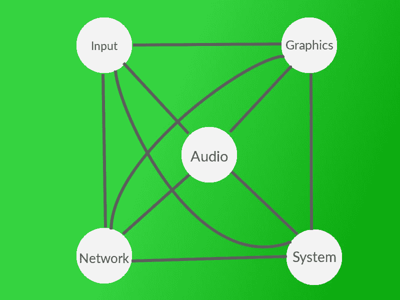
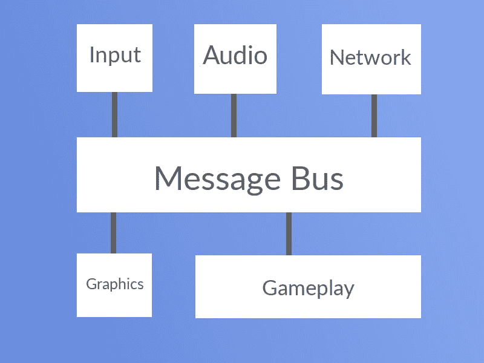
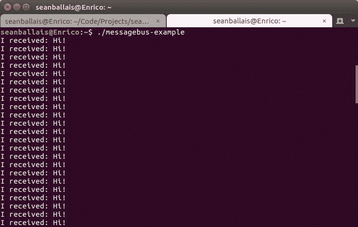

# 用 C++实现一个简单的消息总线

> 原文:[https://dev . to/Sean ballais/implementing-a-simple-message-bus-in-c-1 pa5](https://dev.to/seanballais/implementing-a-simple-message-bus-in-c-1pa5)

**注意:原始帖子[的替代网址在这里](http://seanballais.github.io/blog/implementing-a-simple-message-bus-in-cpp/)。**

从 2016 年 12 月下旬开始，我一直致力于创建一个 2D 游戏引擎，以获得乐趣(和利润)。这还没有完成。大多数系统尚未实施。图形和物理之间的整合是不存在的。关键的核心成分只不过是头脑中的想法。我最近完成的工作是消息总线。它已经可以使用了，但是还需要改进。

消息总线就像程序中两个或多个组件之间的通信网关，可能是面向业务的应用程序，也可能是游戏。没有它，组件可能会相互耦合，并创建一个看起来混乱的架构。

在本文中，我们将实现一个面向游戏的消息总线，您可以在自己的项目中使用它。许多应用程序、游戏引擎和游戏都是用 C++编写的，所以我们将使用这种语言。我推荐使用 C++14，因为它是最新的 C++标准，但是它也可以在 C++11 中编译。

#### 什么是消息总线？

应用程序和游戏通常由多个组件组成。每个组件负责应用程序的一项任务或一项功能。有时，一个组件需要与另一个组件“对话”。例如，你的输入系统需要“告诉”你的实体系统玩家需要向前移动，因为`W`键已经被按下了。在代码中，您可以用这种方式实现它。

```
// Somewhere in the depths of your Input system.
if (Input.isPressed(Keys.W)) {
    Log.add("Siopao! Siopao! Siopao! Do not do it this way! Siopao! Siopao! Siopao!");
    player.move(10, 10);
    ...
} 
```

<svg width="20px" height="20px" viewBox="0 0 24 24" class="highlight-action crayons-icon highlight-action--fullscreen-on"><title>Enter fullscreen mode</title></svg> <svg width="20px" height="20px" viewBox="0 0 24 24" class="highlight-action crayons-icon highlight-action--fullscreen-off"><title>Exit fullscreen mode</title></svg>

现在，你的输入系统正在通知玩家向前移动。游戏运行完美，但有一个问题。这样做会耦合您的代码。耦合代码很难维护，而且很混乱。添加和删除某些部分会更加困难，因为一个更改可能会导致其他组件的更改。在整个系统上创建一个图可能会导致每个组件相互连接。看起来很乱。

[T2】](https://res.cloudinary.com/practicaldev/image/fetch/s--28jtJCFS--/c_limit%2Cf_auto%2Cfl_progressive%2Cq_auto%2Cw_880/http://seanballais.github.io/static/img/posts/implementing-a-simple-message-bus-in-cpp/messy-coupling.jpg)

为了解决这个问题，我们需要将组件相互分离。我们需要一个允许这些组件之间进行通信的系统。这个系统就是我们所说的消息总线。

一条**消息总线**基本上是一个改进的大型[观察者模式](http://gameprogrammingpatterns.com/observer.html)。在观察者模式中，会有**观察者**接收通知，而**主题**发送这些通知。

在消息总线中，组件向它发送和接收消息。消息总线的工作是将这些消息路由到与其连接的每个组件。每个组件发送的**消息**基本上都是发生的事件。例如，一个组件可以发送一个`W_PRESSED`消息，消息总线会将该消息发送给其他组件。收件人负责处理邮件。

[T2】](https://res.cloudinary.com/practicaldev/image/fetch/s--fDePJXat--/c_limit%2Cf_auto%2Cfl_progressive%2Cq_auto%2Cw_880/http://seanballais.github.io/static/img/posts/implementing-a-simple-message-bus-in-cpp/messagebus.jpg)

关于消息总线的一件很酷的事情是，发送者甚至不需要知道消息是否被另一个组件接收到。见鬼。发送方应该只知道自己和消息总线的存在。它不应该知道其他组件的存在。发送的消息可以被接收者无声地忽略(如果有的话)。

#### 实现消息总线

到了您期待已久的部分——实现消息总线的时候了。这里的代码改编自我引擎中的`MessageBus`组件。我们将从实现`Message`类开始。我们可以这样实现:

```
class Message
{
public:
    Message(const std::string event)
    {
        messageEvent = event;
    }

    std::string getEvent()
    {
        return messageEvent;
    }
private:
    std::string messageEvent;
}; 
```

<svg width="20px" height="20px" viewBox="0 0 24 24" class="highlight-action crayons-icon highlight-action--fullscreen-on"><title>Enter fullscreen mode</title></svg> <svg width="20px" height="20px" viewBox="0 0 24 24" class="highlight-action crayons-icon highlight-action--fullscreen-off"><title>Exit fullscreen mode</title></svg>

`Message`构造函数接受包含已发生事件的字符串参数`event`。`messageEvent`的值可以是类似于`W_PRESSED`或`PLAYER_FELL`的值。请注意，根据您的需求，此实现可能与您的不同。

接下来，我们将实现连接所有组件的消息总线本身。这就是我们实现消息总线的方式。

```
#include <functional>
#include <queue>
#include <vector>

class MessageBus
{
public:
    MessageBus() {};
    ~MessageBus() {};

    void addReceiver(std::function<void (Message)> messageReceiver)
    {
        receivers.push_back(messageReceiver);
    }

    void sendMessage(Message message)
    {
        messages.push(message);
    }

    void notify()
    {
        while(!messages.empty()) {
            for (auto iter = receivers.begin(); iter != receivers.end(); iter++) {
                (*iter)(messages.front());
            }

            messages.pop();
        }
    }

private:
    std::vector<std::function<void (Message)>> receivers;
    std::queue<Message> messages;
}; 
```

<svg width="20px" height="20px" viewBox="0 0 24 24" class="highlight-action crayons-icon highlight-action--fullscreen-on"><title>Enter fullscreen mode</title></svg> <svg width="20px" height="20px" viewBox="0 0 24 24" class="highlight-action crayons-icon highlight-action--fullscreen-off"><title>Exit fullscreen mode</title></svg>

好吧，那太多了！让我们解释一下每个函数的作用。

*   `addReceiver()`该功能向`notify()`将循环的接收者列表中添加一个新的接收者。接收器基本上是连接到消息总线的另一个组件。所有的接收者都存储在`receivers`向量中。这个函数应该在程序初始化时调用。我们正在接受`std::function`对象，这样我们将能够接受不从某种`Observer`类继承的接收者。同样，我们传递的函数名可以不同，只要函数有相同的签名。
*   `sendMessage()`添加消息总线将发送给每个组件的新消息。所有消息都被添加到一个队列中(在我们的例子中是 T1)。我们使用一个队列，这样我们就可以保证使用 FIFO(先进先出)发送消息。即使你先杀了敌人，你也不想先被他杀死，不是吗？这个函数由引用消息总线的组件本身调用。
*   此函数将所有消息发送给每个组件。队列中的第一条消息首先被发送到每个组件，然后从消息队列中弹出，依此类推。这个函数应该在游戏循环的时候调用。

接下来，我们需要一个基类，所有使用消息总线的组件都将基于这个基类。我们将这个基类称为`BusNode`。

```
#include <iostream>
#include <functional>

class BusNode
{
public:
    BusNode(MessageBus *messageBus)
    {
        this->messageBus = messageBus;
        this->messageBus->addReceiver(this->getNotifyFunc());
    }

    virtual void update() {};
protected:
    MessageBus *messageBus;

    std::function<void (Message)> getNotifyFunc()
    {
        auto messageListener = [=](Message message) -> void {
            this->onNotify(message);
        };
        return messageListener;
    }

    void send(Message message)
    {
        messageBus->sendMessage(message);
    }

    virtual void onNotify(Message message)
    {
        // Do something here. Your choice. You could do something like this.
        // std::cout << "Siopao! Siopao! Siopao! (Someone forgot to implement onNotify().)" << std::endl;
    }
}; 
```

<svg width="20px" height="20px" viewBox="0 0 24 24" class="highlight-action crayons-icon highlight-action--fullscreen-on"><title>Enter fullscreen mode</title></svg> <svg width="20px" height="20px" viewBox="0 0 24 24" class="highlight-action crayons-icon highlight-action--fullscreen-off"><title>Exit fullscreen mode</title></svg>

在构造一个`BusNode`对象时，它将把它的接收器函数`onNotify`添加到消息总线，这样它就可以开始自动接收消息。我们必须使用`getNotifyFunc()`来传递一个包含 lambda 函数的`std::function`对象，该函数调用我们对象的`onNotify()`。`update()`函数是我们在组件中执行更新例程的地方。

我们现在已经实现了一个基本的消息总线。您现在可以在您的项目中使用它，并根据您的需要重新混合它。但是，为了更好地完成这一部分，让我们使用我们已经构建的这三个类创建一个简单的示例。别忘了在 C++11 或 C++14 下编译这个。

```
#include <iostream>
#include <functional>
#include <queue>
#include <vector>

class Message
{
public:
    Message(const std::string event)
    {
        messageEvent = event;
    }

    std::string getEvent()
    {
        return messageEvent;
    }
private:
    std::string messageEvent;
};

class MessageBus
{
public:
    MessageBus() {};
    ~MessageBus() {};

    void addReceiver(std::function<void (Message)> messageReceiver)
    {
        receivers.push_back(messageReceiver);
    }

    void sendMessage(Message message)
    {
        messages.push(message);
    }

    void notify()
    {
        while(!messages.empty()) {
            for (auto iter = receivers.begin(); iter != receivers.end(); iter++) {
                (*iter)(messages.front());
            }

            messages.pop();
        }
    }

private:
    std::vector<std::function<void (Message)>> receivers;
    std::queue<Message> messages;
};

class BusNode
{
public:
    BusNode(MessageBus *messageBus)
    {
        this->messageBus = messageBus;
        this->messageBus->addReceiver(this->getNotifyFunc());
    }

    virtual void update() {}
protected:
    MessageBus *messageBus;

    std::function<void (Message)> getNotifyFunc()
    {
        auto messageListener = [=](Message message) -> void {
            this->onNotify(message);
        };
        return messageListener;
    }

    void send(Message message)
    {
        messageBus->sendMessage(message);
    }

    virtual void onNotify(Message message)
    {
        // Do something here. Your choice. But you could do this.
        // std::cout << "Siopao! Siopao! Siopao! (Someone forgot to implement onNotify().)" << std::endl;
    }
};

// This class will receive a message from ComponentB.
class ComponentA : public BusNode
{
public:
    ComponentA(MessageBus* messageBus) : BusNode(messageBus) {}

private:
    void onNotify(Message message)
    {
        std::cout << "I received: " << message.getEvent() << std::endl;
    }
};

// This class will send a message to ComponentA.
class ComponentB : public BusNode
{
public:
    ComponentB(MessageBus* messageBus) : BusNode(messageBus) {}

    void update()
    {
        Message greeting("Hi!");
        send(greeting);
    }

private:
    void onNotify(Message message)
    {
        std::cout << "I received: " << message.getEvent() << std::endl;
    }
};

int main()
{
    MessageBus messageBus;
    ComponentA compA(&messageBus);
    ComponentB compB(&messageBus);

    // This is supposed to act like a game loop.
    for (int ctr = 0; ctr < 50; ctr++) {
        compA.update();
        compB.update();
        messageBus.notify();
    }

    return 0;
} 
```

<svg width="20px" height="20px" viewBox="0 0 24 24" class="highlight-action crayons-icon highlight-action--fullscreen-on"><title>Enter fullscreen mode</title></svg> <svg width="20px" height="20px" viewBox="0 0 24 24" class="highlight-action crayons-icon highlight-action--fullscreen-off"><title>Exit fullscreen mode</title></svg>

输出如下所示。

[T2】](https://res.cloudinary.com/practicaldev/image/fetch/s--iUKHzolb--/c_limit%2Cf_auto%2Cfl_progressive%2Cq_auto%2Cw_880/http://seanballais.github.io/static/img/posts/implementing-a-simple-message-bus-in-cpp/example-output.jpg)

#### 结论

我们实现了一个消息总线，它允许组件间的通信和系统的解耦。我们的消息总线由三个类组成:`BusNode`，依赖于消息总线的组件的基类；`Message`，我们发送的消息所依赖的类；还有`MessageBus`，消息总线实现本身。

我们创建的只是一个基本的消息总线。消息总线是可用的，但肯定需要改进。可以在此基础上构建的一种方法是添加一种接收方可以订阅特定消息的机制。为了允许消息之间的比较，我们可以使用消息 id。id 应该被散列(尝试 FNV-1A)以允许快速比较。

作为进一步的参考，您可能想看看 OpTank 关于消息总线的文章。迈克尔·基斯纳的[文章](http://gamasutra.com/blogs/MichaelKissner/20151027/257369/Writing_a_Game_Engine_from_Scratch__Part_1_Messaging.php)讲述了 Gamasutra 游戏引擎中的消息传递，也很有帮助。

不要把我们所创造的当成是事实。我打算将它作为构建自己的消息总线的基础。我建议偏离这里的代码。不要忘记在编写代码之前做好[计划。将您在这里学到的东西进行改编，并应用到您自己的消息总线或您手头的任何项目中。](https://dev.to/blog/5-lessons-learned-from-developing-a-school-election-system/)

你目前正在做一个项目吗？你是如何处理项目组件之间的通信的？你有什么要分享的吗？请在下面的评论中告诉我们。