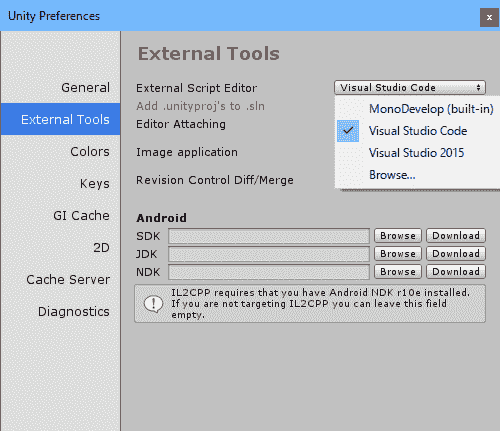

# Unity5.5とVSCode 連携

> 原文::1230〔https://dev . to/shiena/unity 5-5-vscode-51 OA〕〔t1〕

我因为兴趣在玩 Unity，但是如果 Visual Studio 2015 只是制作沉重的小代码的话会很烦躁。
于是我们试着切换到了最近支持变得充实、动作也很轻的 Visual Studio Code。

# 设定并安装的东西

[T2】](https://res.cloudinary.com/practicaldev/image/fetch/s--JY5Yo2B2--/c_limit%2Cf_auto%2Cfl_progressive%2Cq_auto%2Cw_880/https://dev-to-uploads.s3.amazonaws.com/i/dx76xoaid5tm0i2dn8eu.png)

1.  从菜单中的 Edit -> Preferences ...打开 Unity Preferences 对话框
2.  从外部工具选项卡上的外部脚本编辑器下拉列表 Browse ...中指定 visual studio 代码的路径
    *   第一次是下拉菜单中没有 visual studio 代码，但是设置一次就会出现

※如果是 Unity5.5 以前的话，如果不在项目中追加[unity visual studio code integration](https://github.com/dotBunny/VSCode/)的话就不能很好地合作，但是因为从 Unity5.5 开始有同等的功能，所以不需要追加。

## codeの视觉工作室拡張

如果放入这一带的话，可以补充和调试，很方便。

*   [C#](https://marketplace.visualstudio.com/items?itemName=ms-vscode.csharp)
*   【Unity 调试器
*   [Unity 片段](https://marketplace.visualstudio.com/items?itemName=YclepticStudios.unity-snippets)
*   [上等命名](//marketplace.visualstudio.com/items?itemName=reflectiondm.ClassyNaming)

## [T1】settings . JSON](#settingsjson)

虽然格式化程序的喜好各不相同，但在换行和保存时可以自动应用。

```
{
    // 行単位(エンターを押したとき)にフォーマットします。
    "editor.formatOnType": true,

    // ファイルを保存するときにフォーマットします。
    "editor.formatOnSave": true
} 
```

## 除此之外

加入以上扩展后，Visual Studio Code 中将显示 Get Tools 按钮，从中可以下载并安装. NET Core Tools。

*   [。NET Core 1.0.1 工具预览版 2](https://www.microsoft.com/net/core#windowsvs2015)

以上，在 Visual Studio Code 中也完成了便利的环境。

# 参考链接

*   [使用 VS Code 的 Unity 开发](http://qiita.com/53able@github/items/e7c6a5ea59106348df4e)