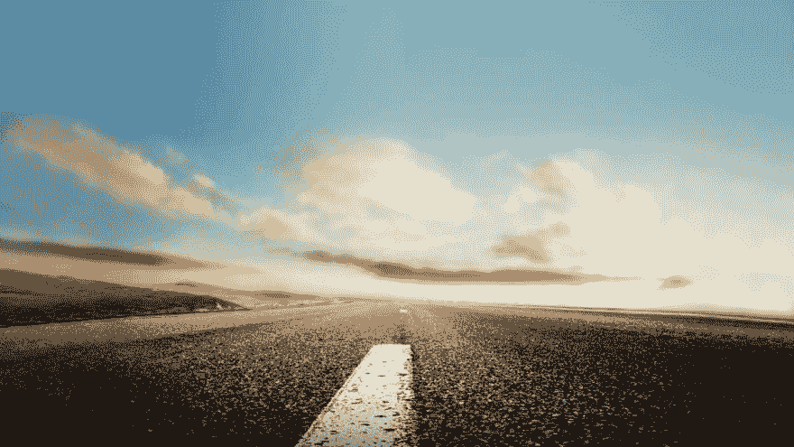
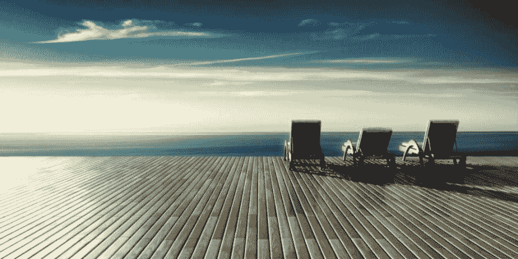

# 在 Ubuntu 16.04 和 18.04 上安装 mozjpeg(Forge)

> 原文:[https://dev . to/gaijinity/installing-mozjpeg-on-Ubuntu-16-04-18-04-forge-1h6c](https://dev.to/gaijinity/installing-mozjpeg-on-ubuntu-16-04-18-04-forge-1h6c)

# 在 Ubuntu 16.04 上安装 mozjpeg&18.04(Forge)

### 如果你想更进一步优化你的图像，以下是如何在 Ubun tu 16.04 或 18.04 (Forge)上安装 mozjpeg 的方法

安德鲁·韦尔奇

[T2】](https://res.cloudinary.com/practicaldev/image/fetch/s--3eJVJ4Rl--/c_limit%2Cf_auto%2Cfl_progressive%2Cq_auto%2Cw_880/https://nystudio107-ems2qegf7x6qiqq.netdna-ssl.com/img/blog/_1200x675_crop_center-center_82_line/extra-mile.jpg)

为新的基于 CMake 的构建系统更新了。

对于那些阅读了 Craft CMS 文章中的[crea in ing optimized Images 并对更进一步感兴趣的人来说……还有一个叫做`mozjpeg`的损失更少的 JPEG 图像优化工具，你可能想利用它。](https://dev.to/gaijinity/creating-optimized-images-in-craft-cms-2hc5-temp-slug-2354251)

我没有将它包含在原始文章中的原因是，没有一个包可以让您直接`apt-get install`。这需要更多的工作，但这是值得的。在我的测试中，我在用`mozjpeg`创建的图像上的`3-5%`和`jpegoptim`之间进行选择，这取决于图像。如果你喜欢看统计数据，这里有一个不错的[Com par I son JPEG 无损压缩工具](https://blarg.co.uk/blog/comparison-of-jpeg-lossless-compression-tools)。

例如，这里有一张我在博客中使用的图片，它没有经过优化(但调整了大小):

[T2】](https://res.cloudinary.com/practicaldev/image/fetch/s--b-vYSnht--/c_limit%2Cf_auto%2Cfl_progressive%2Cq_auto%2Cw_880/https://nystudio107-ems2qegf7x6qiqq.netdna-ssl.com/img/blog/_992x496_crop_center-center_100_line/nice-view_unoptimized.jpg)

接下来，使用`jpegoptim`优化图像:

[T2】](https://res.cloudinary.com/practicaldev/image/fetch/s--HMYBsYT1--/c_limit%2Cf_auto%2Cfl_progressive%2Cq_auto%2Cw_880/https://nystudio107-ems2qegf7x6qiqq.netdna-ssl.com/img/blog/_992x496_crop_center-center_100_line/nice-view_jpegoptim.jpg)

这是用`mozjpeg`优化的同一幅图像:

[T2】](https://res.cloudinary.com/practicaldev/image/fetch/s--29DgNtfb--/c_limit%2Cf_auto%2Cfl_progressive%2Cq_auto%2Cw_880/https://nystudio107-ems2qegf7x6qiqq.netdna-ssl.com/img/blog/_992x496_crop_center-center_100_line/nice-view_mozjpeg.jpg)

你能说出这些图像之间的区别吗？你不应该，因为最佳值是*损失减去*。图像本身没有变化。就`jpegoptim`与`mozjpeg` ( `81,950`字节与`79,822`字节)而言，节省并没有很大的差别，但`2k`是`2k` …并且差别可能比这更大`~3%`节省取决于图像。

`jpegoptim`从原始图像中的`82,011`字节变成了`81,950`字节，节省了仅仅`0.07%`

`mozjpeg`从原始图像中的`82,011`字节变为`79,822`字节，节省了`2.66%`

显而易见，优化图像的巨大收益在于确保它们的尺寸[合适& com 按](https://dev.to/gaijinity/creating-optimized-images-in-craft-cms-2hc5-temp-slug-2354251)开始，这是成像仪的特性。但是以一种损失更少的方式切断不必要的神经系统才是最重要的。

而且安装起来也没那么难。因此，如果你在船上，并觉得可以使用终端…我们走吧！

这里的指令都是通过 [Forge](https://forge.laravel.com) 在运行于 Ubun tu 16.04 或 18.04 的 VPS 上完成的。他们在我的本地开发[家园](https://laravel.com/docs/5.3/homestead)环境中也工作得很好，这也是 Ubun tu 16.04。

首先，确保您已经通过
安装了我们需要构建的所有包

```
 sudo apt-get update
sudo apt-get install cmake autoconf automake libtool nasm make pkg-config git 
```

接下来`cd`到你的构建目录中(只有`cd ~`可能是好的)并克隆 git repo:

```
 git clone https://github.com/mozilla/mozjpeg.git 
```

然后执行以下操作来配置和组合`mozjpeg 3.x` :

```
 cd mozjpeg
mkdir build && cd build
sudo cmake -G"Unix Makefiles" ../ 
```

去喝一杯咖啡吧，这个命令需要一点时间。现在我们需要安装它；默认情况下，它将被安装在`/opt/mozjpeg`目录:

```
 sudo make install 
```

现在，我们将创建一个符号链接，将`jpegtran`的特殊版本`mozjpeg`链接到我们的`$PATH`(以及[成像仪](https://github.com/aelvan/Imager-Craft)预期的位置):

```
 sudo ln -s /opt/mozjpeg/bin/jpegtran /usr/bin/mozjpeg 
```

然后进入`imager`文件夹，复制`config.php`文件，重命名为`imager.php`，并将`imager.php`文件复制到你的`craft/config`目录下。这个文件让我们定制成像仪如何工作。在你的文本编辑器中打开`imager.php`文件，像这样启用`mozjpeg`:

```
 'mozjpegEnabled' => true,
  'mozjpegPath' => '/usr/bin/mozjpeg', 
```

如果您已经在使用`jpegoptim`，请确保您设置了`'jpegoptimEnabled' => false,`。我也这样做:

```
 'optimizeType' => 'runtime', 
```

…因此，成像仪可以立即优化图像，而不是通过任务进行优化，因为我有一个场景，在成像仪任务优化图像之前，我的 CDN 会抓取并缓存图像。

就是这样！享受您的超级优化的图像，并祝贺走得更远！

我还强烈建议在 Craft with Imager 中使用 WebP 图像来阅读文章[，以通过 Imager 添加`webp`支持。](https://www.vaersaagod.no/en/using-webp-images-in-craft-with-imager)

## 进一步阅读

如果你想获得新文章的通知，请在 Twitter 上关注[纽约时报 107](https://twitter.com/nystudio107) 。

版权所有 2020 nystudio107。由 nystudio107 设计