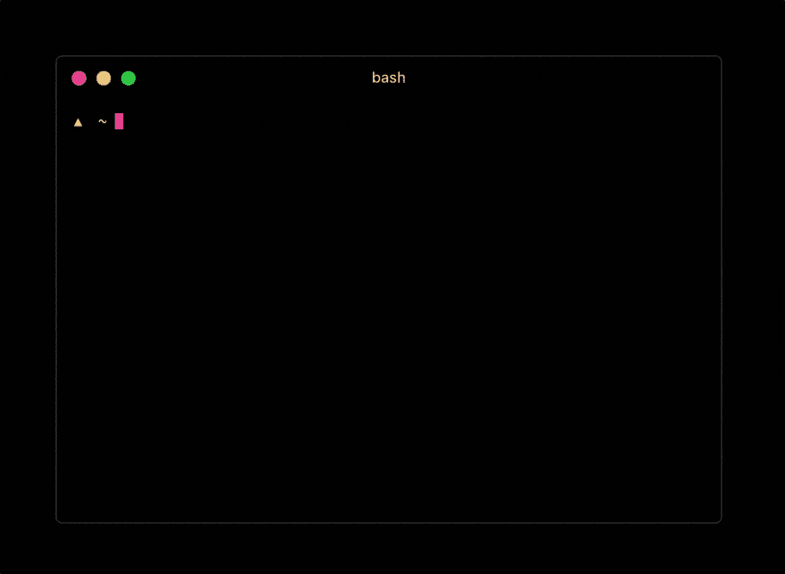
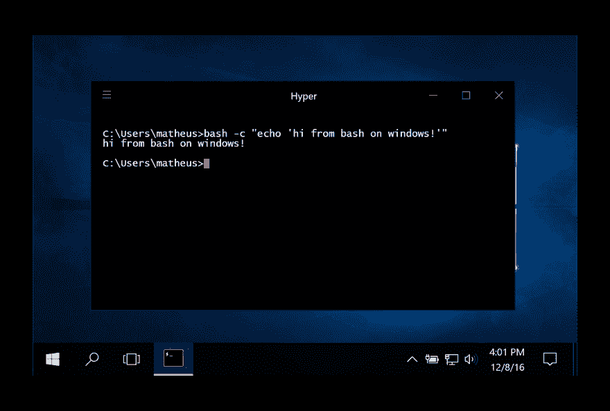
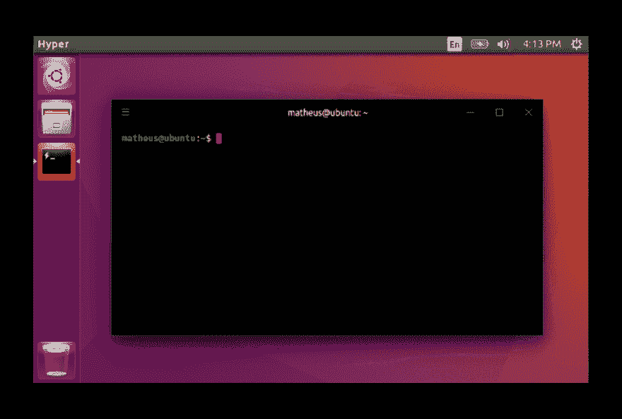

# Zeit 宣布推出 Hyper 1.0.0

> 原文:[https://dev.to/ben/zeit-announces-hyper-100](https://dev.to/ben/zeit-announces-hyper-100)

Zeit 宣布了 Hyper 的稳定的 [1.0.0 版本](https://github.com/zeit/hyper/releases/tag/1.0.0)，这是一个基于 web 技术的可扩展终端模拟器。Hyper 于 7 月首次公之于众，现已被下载超过 25 万次。

Hyper 是由包裹在 [Electron](http://electron.atom.io/) 中的 web 技术构建的，这是一个使用 JavaScript、HTML 和 CSS 等 web 技术创建本地应用程序的框架。基于这些工具运行终端的想法可能会让一些开发人员踌躇不前，但 Electron 已经走过了漫长的道路，Hyper 迄今为止也受到了好评。Hyper 的哲学建立在 GitHub 的 [Atom 编辑器](https://atom.io/)背后的理念之上，同样的目标是可定制性。

[T2】](https://res.cloudinary.com/practicaldev/image/fetch/s--UFZtlthI--/c_limit%2Cf_auto%2Cfl_progressive%2Cq_66%2Cw_880/https://cdn.zeit.co/hyper/hyperapp.gif)

到目前为止，已经为 Hyper 开发了 300 多个扩展和主题。npm 上提供了扩展。随着新版本的发布，预计这一数字将继续增长。

最初由 Guillermo Rauch 创建，他是 Zeit 的联合创始人，也是像 T2 socket . io T3 这样的开源项目的作者。“终端是许多关键流程的起点。我们希望确保体验是美好的、可扩展的和现代的。Guillermo 说:“浏览器能做的一切，终端现在也能做，但不会牺牲生产力，因为它是开源的，该项目现在由世界各地的几十个贡献者维护。”1.0.0 版本由来自巴西的撰稿人 Matheus Fernandes 领导。

## Windows 和 Linux 支持

这个新版本扩展了 Hyper 以支持 Windows 和 Linux 的大多数版本和发行版。“因为它是基于 web 技术和电子的，所以直接获得多平台支持，而不是从头开始编写三个不同的应用程序”，Matheus 评论道。

[T2】](https://res.cloudinary.com/practicaldev/image/fetch/s--auBQDv31--/c_limit%2Cf_auto%2Cfl_progressive%2Cq_auto%2Cw_880/https://cloud.githubusercontent.com/assets/4721750/21022378/93807b6c-bd63-11e6-9557-c37a51ca913c.png)

[T2】](https://res.cloudinary.com/practicaldev/image/fetch/s--TkIUR44c--/c_limit%2Cf_auto%2Cfl_progressive%2Cq_auto%2Cw_880/https://cloud.githubusercontent.com/assets/4721750/21022382/96a584f4-bd63-11e6-804a-a7c2d3647a05.png)

包装在浏览器中的终端的概念有很大的潜力，看到该项目达到 v1 是令人兴奋的。定制和可扩展性的障碍已经尽可能地减少了，这个社区正在健康地成长。这种事情以前已经尝试过，有像 [Termkit](https://acko.net/blog/on-termkit/) 这样的项目，但是 Hyper 的时机和执行给了它持久的力量。电子使这个项目可行，Zeit 清楚地知道如何领导开源项目。

在他的书[编织网络](https://www.amazon.com/Weaving-Web-Original-Ultimate-Destiny/dp/006251587X)中，蒂姆·伯纳斯·李描述了不情愿地将他最初的 Objective-C 代码库移植到 C，这样它就可以在更广泛的平台上运行，并在开发人员中获得更高的采用率。我看到了很多现代趋势的相似之处，比如为 Hyper 这样的应用程序选择 web 技术。通过使扩展平台和为核心做贡献变得更容易，这些技术被允许蓬勃发展，尽管需要做出任何权衡。

随着 Atom、Slack、Visual Studio Code 等流行应用程序的出现，以及许多其他基于 Electron 构建的应用程序的出现，使用浏览器技术构建核心桌面应用程序的想法变得越来越普遍。终端是操作系统最基本的应用程序之一，它只是可以利用这种方法的又一个工具。性能是这种方法的一个典型问题，但是随着问题的解决，我们已经看到这些应用程序的性能越来越高的趋势。

版本 1.0.0 [发布说明](https://github.com/zeit/hyper/releases/tag/1.0.0)包括一些 bug 修复、对国际化的改进支持以及开发者体验的改善。这是 Hyper 的[下载/安装](https://hyper.is/#installation)指南。