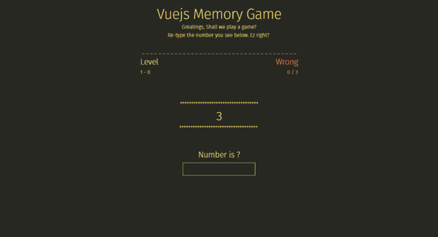

# 用 Vuejs 做一个简单的游戏

> 原文:[https://dev.to/sadick/make-a-simple-game-with-vuejs-1370](https://dev.to/sadick/make-a-simple-game-with-vuejs-1370)

#### 重新输入您在下面看到的数字。Ez 对吗？

<figure> 

<figcaption>Vuejs 记忆游戏</figcaption>

</figure>

这个想法很简单。显示一个数字，然后让用户键入他们在屏幕上看到的数字。不过有一个转折。我们从显示一位数开始，然后随着用户进入更高的级别，我们继续增加显示的位数。我们还在数字上引入了超时显示，这样数字将只显示特定的持续时间，然后对用户隐藏。Ez 对吗？

我将跳过 html 和 css 部分，直接进入 vuejs 部分，制作游戏。

#### 生成一个随机数。

用 javascript 生成一个随机数非常简单。只要加入 Math.random()就可以了。但问题是 Math.random()只生成一个介于 0 和 1 之间的随机数。我们希望能够生成 n 位数的整数。下面的代码使我们能够做到这一点。