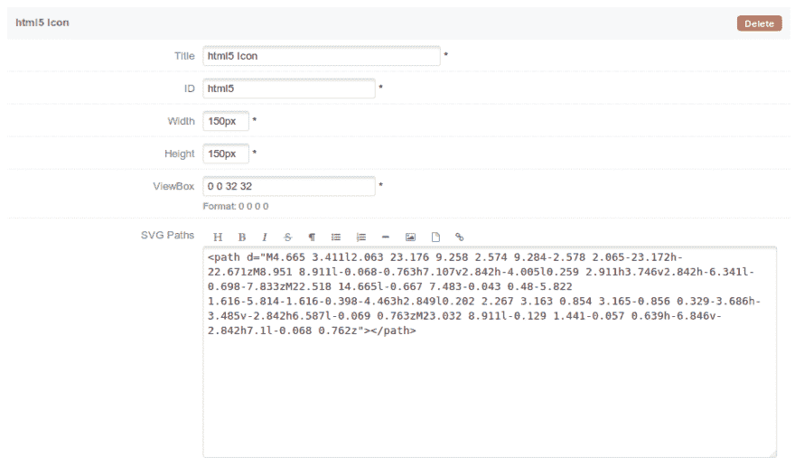
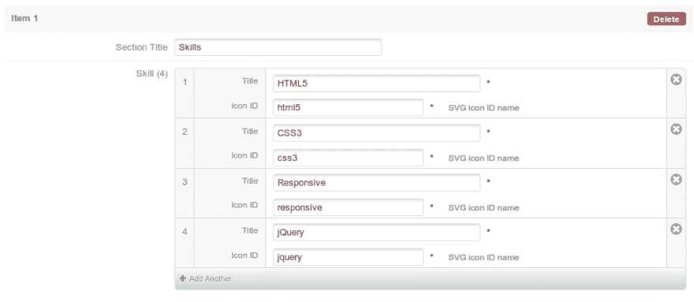

# 用 Perch CMS 给精灵添加 SVG 图标

> 原文:[https://dev . to/Juan Fernandes/adding-SVG-icons-to-a-sprite-with-perch-CMS-2 aoo](https://dev.to/juanfernandes/adding-svg-icons-to-a-sprite-with-perch-cms-2aao)

我希望能够允许 CMS 用户添加一个 SVG 图标到网站的 SVG 精灵。

SVG 精灵是制作图像精灵的新方式，就像制作 CSS 图像精灵的旧方式一样——你可以将所有的图标放在一个图像文件中，然后使用 CSS 来定位该图像以显示你需要的图标，这本质上是一样的，但它是一个可以在整个站点中使用的 SVG 图标列表。

参见这篇关于 CSS 创造“带有 SVG 精灵的图标系统”的技巧的文章-[https://css-tricks.com/svg-sprites-use-better-icon-fonts/](https://css-tricks.com/svg-sprites-use-better-icon-fonts/)

通常，SVG 精灵是由开发人员/设计人员在构建网站时创建的，除非网站重新设计，否则不会重新访问。创建一个精灵很可能是一个使用 Grunt 或 Gulp JS 这样的任务运行器的自动化过程。

但是一旦网站上线并由内容管理系统(CMS)管理，这个过程就不再适用了。

一个类似的技术启发我创造了这个。参见克利夫·沃克的帖子-[http://www . cvwdesign . com/blog/using-perch-layouts-and-managing-SVG-assets-with-perch](http://www.cvwdesign.com/blog/using-perch-layouts-and-managing-svg-assets-with-perch)

## 让我们进入代码

首先，您需要创建一个列出所有 SVG 图标的 PHP 文件。这个 PHP 文件必须包含在所有页面上，但它们将被隐藏。此文件不在网站的根目录中，并且没有被搜索引擎编入索引。

一旦设置完成，就可以在模板中添加 SVG 图标，用户只需插入 SVG 的 ID。

在/perch /includes/中创建一个 PHP 文件——你不必创建 includes 文件夹，但我喜欢将这些类型的文件分开。

我把这个页面叫做 svgs.php，但是你可以给它取任何名字——icons.php 可能更有意义。

```
<?php include($_SERVER['DOCUMENT_ROOT'].'/cms/runtime.php'); ?>

<svg  xmlns:xlink="http://www.w3.org/1999/xlink" aria-hidden="true" style="display: none" class="hidden">
    <?php perch_content('svgs'); ?>
</svg> 
```

<svg width="20px" height="20px" viewBox="0 0 24 24" class="highlight-action crayons-icon highlight-action--fullscreen-on"><title>Enter fullscreen mode</title></svg> <svg width="20px" height="20px" viewBox="0 0 24 24" class="highlight-action crayons-icon highlight-action--fullscreen-off"><title>Exit fullscreen mode</title></svg>

在这个 PHP 文件中，我有一个名为 svgs 的 perch_content 标记——同样，它可以被称为任何东西。确保你像往常一样包括 runtime.php，然后转到你网站上的那个文件:websiteaddress.uk/cms/svgs.php——你现在可以通过 Perch CMS 编辑那个页面。

您需要创建一个新模板来为 svgs.php 文件添加图标。在/templates/content/中创建模板，您可以随意命名它；我调用了我的 SVG_icons.html 并使用了下面的代码:

```
<perch:before>
    <svg  xmlns:xlink="http://www.w3.org/1999/xlink" aria-hidden="true" style="display: none" class="hidden">
</perch:before>
      <symbol id="svg-<perch:content id="id" type="text" label="ID" requi
      red="true" size="m" />" width="<perch:content id="width" type="text" label="Width" required="true" size="s" />" height="<perch:content id="height" type="text" label="Height" required="true" size="s" />" viewBox="<perch:content id="viewbox" type="text" label="ViewBox" required="true" size="m" help="Format: 0 0 0 0" />">
        <title><perch:content id="title" type="text" label="Title" required="true" title="true" order="1" /></title>
        <perch:content id="text" type="textarea" label="SVG Paths" html="true" editor="markitup" />
      </symbol>
<perch:after>
    </svg>
</perch:after> 
```

<svg width="20px" height="20px" viewBox="0 0 24 24" class="highlight-action crayons-icon highlight-action--fullscreen-on"><title>Enter fullscreen mode</title></svg> <svg width="20px" height="20px" viewBox="0 0 24 24" class="highlight-action crayons-icon highlight-action--fullscreen-off"><title>Exit fullscreen mode</title></svg>

现在登录到您的 Perch CMS，进入页面> svgs，点击图标区域，选择新模板- SVG 图标-确保您选中“允许多个项目”,以便您可以添加多个图标。

你需要在所有你想使用 SVG 图标的页面上包含这段代码——我会把它添加到你的页眉布局中——确保它放在

标签。

```
<?php
    perch_content_custom('svgs', array(
        'page'=>'/cms/includes/svgs.php',
        'template'=>'SVG_icons.html'
    ));
?> 
```

<svg width="20px" height="20px" viewBox="0 0 24 24" class="highlight-action crayons-icon highlight-action--fullscreen-on"><title>Enter fullscreen mode</title></svg> <svg width="20px" height="20px" viewBox="0 0 24 24" class="highlight-action crayons-icon highlight-action--fullscreen-off"><title>Exit fullscreen mode</title></svg>

让我们回到 svgs 页面-页面> SVGs，让我们添加一个图标。

[T2】](https://res.cloudinary.com/practicaldev/image/fetch/s--ZRxWZS2y--/c_limit%2Cf_auto%2Cfl_progressive%2Cq_auto%2Cw_880/https://www.juanfernandes.uk/assets/imgs/svgs-1.png)

SVG_icons.html 模板提供了以下字段:

*   标题-如果你没有为视觉障碍用户隐藏这个图标，你应该给它一个标题
*   ID -这必须是一个唯一的名称，因为它将用于引用图标
*   宽度和高度
*   视图框和 SVG 路径。

填写所有这些内容——您可以通过使用类似 IDE 的 Sublime 文本打开 SVG 来获得这些信息。

保存这个。

保存后，该图标现在应该出现在 svgs.php 页面中——但是它看不到，因为我们隐藏了 SVG 容器。

这是 svgs.php 文件中标记内部的输出结果:

```
<symbol id="svg-html5" width="150px" height="150px" viewBox="0 0 32 32">
    <title>html5 Icon</title>
    <path d="M4.665 3.411l2.063 23.176 9.258 2.574 9.284-2.578 2.065-23.172h-22.671zM8.951 8.911l-0.068-0.763h7.107v2.842h-4.005l0.259 2.911h3.746v2.842h-6.341l-0.698-7.833zM22.518 14.665l-0.667 7.483-0.043 0.48-5.822 1.616-5.814-1.616-0.398-4.463h2.849l0.202 2.267 3.163 0.854 3.165-0.856 0.329-3.686h-3.485v-2.842h6.587l-0.069 0.763zM23.032 8.911l-0.129 1.441-0.057 0.639h-6.846v-2.842h7.1l-0.068 0.762z"></path>
</symbol> 
```

<svg width="20px" height="20px" viewBox="0 0 24 24" class="highlight-action crayons-icon highlight-action--fullscreen-on"><title>Enter fullscreen mode</title></svg> <svg width="20px" height="20px" viewBox="0 0 24 24" class="highlight-action crayons-icon highlight-action--fullscreen-off"><title>Exit fullscreen mode</title></svg>

在您希望用户能够从 sprite 添加 SVG 图标的任何模板上包含以下代码。

```
<svg aria-hidden="true">`
    <use xlink:href="#svg-<perch:content type="text" id="skill-icon-id" label="Icon ID" required="true" size="m" help="SVG icon ID name" />" />
</svg> 
```

<svg width="20px" height="20px" viewBox="0 0 24 24" class="highlight-action crayons-icon highlight-action--fullscreen-on"><title>Enter fullscreen mode</title></svg> <svg width="20px" height="20px" viewBox="0 0 24 24" class="highlight-action crayons-icon highlight-action--fullscreen-off"><title>Exit fullscreen mode</title></svg>

通过在 Perch 的模板中添加上述代码，您可以使用 svgs.php 文件中的 SVG 图标。

[T2】](https://res.cloudinary.com/practicaldev/image/fetch/s--bx_19j8E--/c_limit%2Cf_auto%2Cfl_progressive%2Cq_auto%2Cw_880/https://www.juanfernandes.uk/assets/imgs/svgs-2.png)

你现在应该可以通过 Perch CMS 将你自己的 SVG 图标添加到 SVG 精灵中了。

这个解决方案是我在自己的网站上使用的，并将在我创建的所有使用鲈鱼 CMS 的未来网站上使用。

你认为这个解决方案怎么样？你能找到改进的方法吗？我很乐意得到一些反馈——这是我第一次分享我在 Perch 中使用的代码。