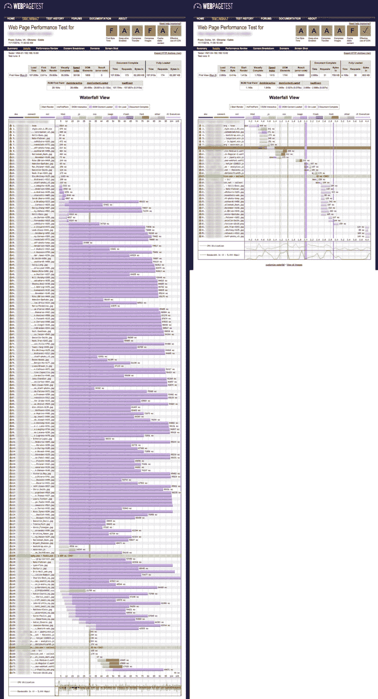

# 事后分析:应用图像优化

> 原文:[https://dev . to/gaijinity/post-mortal-applied-image-optimization-2f 52](https://dev.to/gaijinity/post-mortem-applied-image-optimization-2f52)

发布: <time>2016.12.07</time> /更新: <time>2020.01.19</time>

# 事后分析:应用图像优化

### 这个项目的事后分析展示了应用图像优化策略来加速网站加载的结果

安德鲁·韦尔奇

[T2】](https://res.cloudinary.com/practicaldev/image/fetch/s--NkpBFVQa--/c_limit%2Cf_auto%2Cfl_progressive%2Cq_auto%2Cw_880/https://nystudio107-ems2qegf7x6qiqq.netdna-ssl.com/img/blog/_1200x675_crop_center-center_82_line/postmortem.jpg)

虽然我认为这个理论是有用的，但通常你能做的最复杂的事情是看一个真实世界的例子，看看应用的最佳实践是如何得到回报的。这是一个项目的例子，我被叫去帮助优化页面加载速度。

我们特别强调了优化网站上的图像这一唾手可得的成果，因为这是迄今为止我们所取得的最大收获。可以说物有所值。所应用的技术大部分是在 Craft CMS 文章中的[创建优化图像中描述的技术。](https://dev.to/gaijinity/creating-optimized-images-in-craft-cms-2hc5-temp-slug-2354251)

我们将使用[Web page test . org](https://www.webpagetest.org/)per for mance bench mark ing 网站。如果你不熟悉它，**去熟悉一下**！这是一个很好的工具，可以看到一个网站是如何加载浏览器的。您甚至可以为每次分析选择位置、连接速度和眉毛。

因此，在没有进一步的麻烦，这是网站瀑布从之前，然后在图像优化工作(准备滚动，因为它是一个大的)。优化前在左侧，优化后在右侧:

[T2】](https://res.cloudinary.com/practicaldev/image/fetch/s--qB-RqSW_--/c_limit%2Cf_auto%2Cfl_progressive%2Cq_auto%2Cw_880/https://nystudio107-ems2qegf7x6qiqq.netdna-ssl.com/img/blog/_1200x2217_crop_center-center_100_line/imageoptim_waterfall_comparison_fixed.png)

即使不看细节，你也能清楚地看到差别是巨大的。我们从一个`107.8s`加载时间到一个`2.8s`加载时间。这是哪种 sor cery？

好吧，这不是磁集成电路。这一页上有许多图片，这是不可避免的。但是我们不是一次加载所有的图像，而是使用[惰性尺寸](https://github.com/aFarkas/lazysizes)来惰性地加载文件夹下的*图像。这使得最初的页面加载很好，响应也很快！*

因为网站是在`http2`(T2】服务器批次的过程中运行的，这造成了更大的差异:所有这些图像并不倾向于用流带宽一次下载，它们利用来自`http2`的每个人的 TCP 连接在人们向下滚动时缓慢地加载图像。

我们还在 Craft CMS 文章中跟踪了来自[create 优化图像的最大即时消息，并且不再显示任何客户端上传的图像。相反，我们通过](https://dev.to/gaijinity/creating-optimized-images-in-craft-cms-2hc5-temp-slug-2354251)[成像仪](https://github.com/aelvan/Imager-Craft)将图像转换成相同的响应尺寸，优化图像服务器端，并将它们转换成为网络优化的清晰 JPEGs。

这意味着当图像加载时，它们是为浏览网页的设备而优化的，并且它们在文件大小方面尽可能小，所以它们加载很快。

我们从开始的时间`29.8s`减少到仅仅`1.4s`，我们从视觉上完全的时间`35.5s`减少到仅仅`1.7s`。*哇。*

[T2】](https://res.cloudinary.com/practicaldev/image/fetch/s--kStwC1Sk--/c_limit%2Cf_auto%2Cfl_progressive%2Cq_auto%2Cw_880/https://nystudio107-ems2qegf7x6qiqq.netdna-ssl.com/img/blog/_1200x675_crop_center-center_82_line/celebrate_fireworks.jpg)

*谭根特:*精明的读者会注意到瀑布后“高速公路静态内容”的`F`；这只是因为它在一个服务器上。

<aside>Again, it’s not mag­ic. It’s just opti­miz­ing the images you dis­play, as well as how and when you load them.</aside>

显然，这是一个极端的例子，但它是一个真实的项目。这些事情真的会产生相当大的差别，所以[前进并优化](https://dev.to/gaijinity/creating-optimized-images-in-craft-cms-2hc5-temp-slug-2354251)！

## 进一步阅读

如果你想获得新文章的通知，请在 Twitter 上关注[纽约时报 107](https://twitter.com/nystudio107) 。

版权所有 2020 nystudio107。由 nystudio107 设计