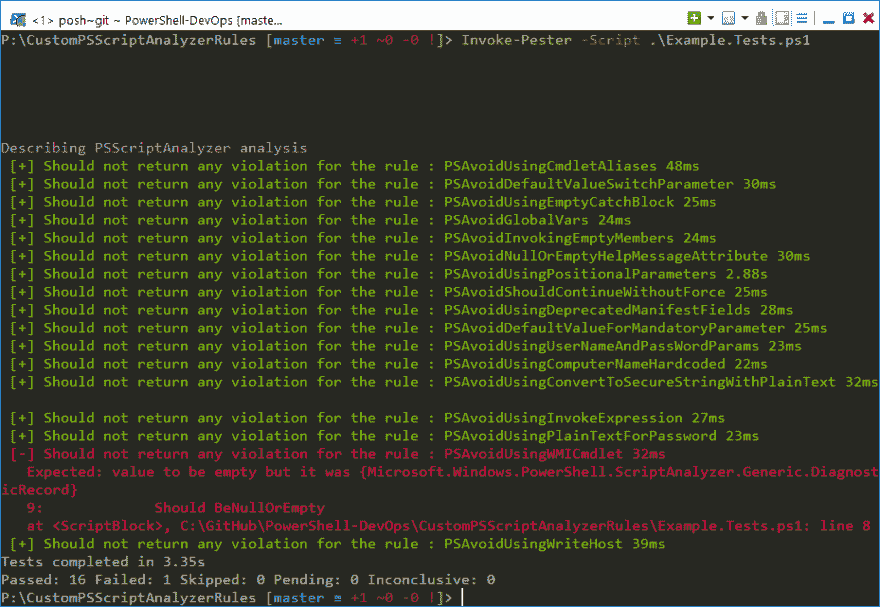
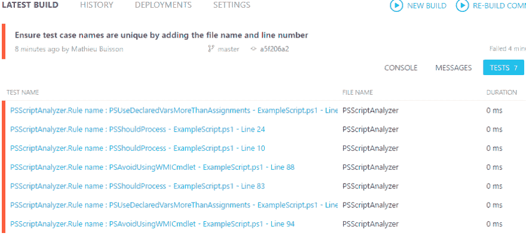
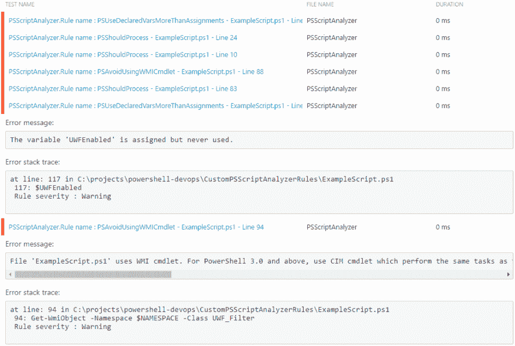

# 使 PSScriptAnalyzer 成为 PowerShell CI 管道中的一等公民

> 原文:[https://dev . to/mathieubuisson/making-psscriptanalyzer-a-first-class-citizen-in-a-powershell-ci-pipeline](https://dev.to/mathieubuisson/making-psscriptanalyzer-a-first-class-citizen-in-a-powershell-ci-pipeline)

正如你已经知道的，如果你读过[这个](https://mathieubuisson.github.io/psscriptanalyzer-appveyor/)或者[这个](https://mathieubuisson.github.io/create-custom-rule-psscriptanalyzer/)，我是`PSScriptAnalyzer`的忠实粉丝，以保持一定的编码标准。这在发布管道中尤其强大，因为这允许我们执行编码标准。

在我们的 <abbr title="Continuous Integration">CI</abbr> 管道中，如果我们的代码违反了`PSScriptAnalyzer`规则，我们很容易使构建失败。

太棒了，但是[持续集成](http://martinfowler.com/articles/continuousIntegration.html)的要点是向开发人员快速反馈他们的代码变更。这是关于尽早发现问题，尽早解决问题。所以问题是:

> 我们如何让我们的 CI 工具发布`PSScriptAnalyzer`结果，其中包含我们补救任何违规行为所需的信息？

所有的 <abbr title="Continuous Integration">CI</abbr> 工具都有办法发布测试结果，使它们高度可见，深入到测试失败并做一些报告。

既然我们在谈论一个 **PowerShell** 管道，我们很可能已经在使用 Pester 来测试我们的 PowerShell 代码了。

Pester 可以吐出和 NUnit 一样的`XML`格式的结果，这些 NUnit `XML`文件可以被大多数 <abbr title="Continuous Integration">CI</abbr> 工具消费和发布。

将这种纠缠集成作为一种通用的 <abbr title="Continuous Integration">CI</abbr> 粘合剂来利用，并将我们的`PSScriptAnalyzer`检查作为纠缠测试来运行，这是非常有意义的。

让我们来看看可能的方法。

## 一个纠缠测试检查 PSScriptAnalyzer 输出

这可能是从 perspect:
调用`PSScriptAnalyzer`的最简单的方法

```
Describe 'PSScriptAnalyzer analysis' {    
    $ScriptAnalyzerResults = Invoke-ScriptAnalyzer -Path '.\Example.ps1' -Severity Warning

    It 'Should not return any violation' {
        $ScriptAnalyzerResults | Should BeNullOrEmpty
    }
} 
```

<svg width="20px" height="20px" viewBox="0 0 24 24" class="highlight-action crayons-icon highlight-action--fullscreen-on"><title>Enter fullscreen mode</title></svg> <svg width="20px" height="20px" viewBox="0 0 24 24" class="highlight-action crayons-icon highlight-action--fullscreen-off"><title>Exit fullscreen mode</title></svg>

这里，我们在一次测试中检查所有具有警告严重性的规则。

然后，我们依赖于这样一个事实，如果`PSScriptAnalyzer`返回一些东西，这意味着它们至少是一个违例，如果`PSScriptAnalyzer`没有返回任何东西，这一切都是好的。

这里有两个问题:

*   我们在一个测试中评估了一大堆规则，所以测试名不能告诉我们违反了哪条规则
*   如果有一个以上的违规，纠缠信息给我们无用的信息

多没用？嗯，我们来看看:

```
Invoke-Pester -Script '.\Example.Tests.ps1'
Executing all tests in .\Example.Tests.ps1

Executing script .\Example.Tests.ps1

  Describing PSScriptAnalyzer analysis
    [-] Should not return any violation 1.52s
      Expected: value to be empty but it was {Microsoft.Windows.PowerShell.ScriptAnalyzer.Generic.DiagnosticRecord Microsoft.Windows.PowerShell.ScriptAnalyzer.Generic.DiagnosticRecord Microsoft.Windows.PowerShell.ScriptAnalyzer.Generic.DiagnosticRecord Microsoft.Windows.PowerShell.ScriptAnalyzer.Generic.DiagnosticRecord}
      at <ScriptBlock>, E:\Example.Tests.ps1: line 5
      5: $ScriptAnalyzerResults | Should BeNullOrEmpty
Tests completed in 1.52s
Tests Passed: 0, Failed: 1, Skipped: 0, Pending: 0, Inconclusive: 0 
```

<svg width="20px" height="20px" viewBox="0 0 24 24" class="highlight-action crayons-icon highlight-action--fullscreen-on"><title>Enter fullscreen mode</title></svg> <svg width="20px" height="20px" viewBox="0 0 24 24" class="highlight-action crayons-icon highlight-action--fullscreen-off"><title>Exit fullscreen mode</title></svg>

纠缠失败消息给了我们`PSScriptAnalyzer`结果的对象类型，而不是它们的内容。

## 每个 PSScriptAnalyzer 规则一个纠缠测试

这是一种非常典型的(也是更好的)通过 Pester 运行`PSScriptAnalyzer`检查的方式。

```
Describe 'PSScriptAnalyzer analysis' {    
    $ScriptAnalyzerRules = Get-ScriptAnalyzerRule -Name "PSAvoid*"

    Foreach ( $Rule in $ScriptAnalyzerRules ) {
        It "Should not return any violation for the rule : $($Rule.RuleName)" {
            Invoke-ScriptAnalyzer -Path ".\Example.ps1" -IncludeRule $Rule.RuleName |
            Should BeNullOrEmpty
        }
    }
} 
```

<svg width="20px" height="20px" viewBox="0 0 24 24" class="highlight-action crayons-icon highlight-action--fullscreen-on"><title>Enter fullscreen mode</title></svg> <svg width="20px" height="20px" viewBox="0 0 24 24" class="highlight-action crayons-icon highlight-action--fullscreen-off"><title>Exit fullscreen mode</title></svg>

在这种情况下，第一步是获得我们想要评估的规则列表。在这里，我将规则列表改为:名称以`PSAvoid`开头的所有规则。这只是为了说明我们可以通过名称以及严重性来过滤规则。

然后，我们循环遍历这个规则列表，并对每个规则逐一进行 percept 测试。下面我们可以看到，输出有用多了:

[](https://res.cloudinary.com/practicaldev/image/fetch/s--QbgxCnvG--/c_limit%2Cf_auto%2Cfl_progressive%2Cq_auto%2Cw_880/https://mathieubuisson.github.img/2016-11-30-psscriptanalyzer-first-class-citizen-by-rule.png)

这肯定是更好的，但我们仍然会遇到和以前一样的问题，因为有不止一个违反了`PSAvoidUsingWMICmdlet`规则。所以我们还是不知道文件名和行号。

我们可以使用嵌套循环:对于每个规则，我们将遍历每个文件。那会更细致，降低这个特殊问题的风险。但是如果一个文件不止一次地违反了相同的规则，我们仍然会遇到相同的问题。

因此，我决定采用不同的方法来解决这个问题:从`PSScriptAnalyzer`获取输出，并将其转换为测试结果文件，使用与 Pester 和 NUnit 相同的`XML`模式。

## 将 PSScriptAnalyzer 输出转换为测试结果文件

为此，我写了一个名为`Export-NUnitXml`的函数，这个函数在模块中的[中可用。](https://github.com/MathieuBuisson/PowerShell-DevOps/tree/master/Export-NUnitXml)

以下是`Export-NUnitXml`的高级步骤:

*   将`PSScriptAnalyzer`的输出作为其输入
*   为每个输入对象创建一个包含“测试用例”节点的`XML`文档
*   将此`XML`文件写入通过`Path`参数指定的文件

下面是一个我们如何在构建脚本中使用它的例子(在本例中是在[Appveyor](https://ci.appveyor.com):

```
$ScriptAnalyzerRules = Get-ScriptAnalyzerRule -Severity Warning
$ScriptAnalyzerResult = Invoke-ScriptAnalyzer -Path '.\CustomPSScriptAnalyzerRules\Example.ps1' -IncludeRule $ScriptAnalyzerRules
If ( $ScriptAnalyzerResult ) {  
    $ScriptAnalyzerResultString = $ScriptAnalyzerResult | Out-String
    Write-Warning $ScriptAnalyzerResultString
}
Import-Module '.\Export-NUnitXml\Export-NUnitXml.psm1' -Force
Export-NUnitXml -ScriptAnalyzerResult $ScriptAnalyzerResult -Path '.\ScriptAnalyzerResult.xml'

(New-Object 'System.Net.WebClient').UploadFile("https://ci.appveyor.com/api/testresults/nunit/$($env:APPVEYOR_JOB_ID)", '.\ScriptAnalyzerResult.xml')
If ( $ScriptAnalyzerResult ) {        
    # Failing the build
    Throw 'There was PSScriptAnalyzer violation(s). See test results for more information.'
} 
```

<svg width="20px" height="20px" viewBox="0 0 24 24" class="highlight-action crayons-icon highlight-action--fullscreen-on"><title>Enter fullscreen mode</title></svg> <svg width="20px" height="20px" viewBox="0 0 24 24" class="highlight-action crayons-icon highlight-action--fullscreen-off"><title>Exit fullscreen mode</title></svg>

这是 Appveyor 的结果:

[T2】](https://res.cloudinary.com/practicaldev/image/fetch/s--76Cp1QcF--/c_limit%2Cf_auto%2Cfl_progressive%2Cq_auto%2Cw_880/https://mathieubuisson.github.img/2016-11-30-psscriptanalyzer-first-class-citizen-overview.png)

仅仅通过读取测试用例的名称，我们就可以获得必要的信息:规则名、文件名甚至行号。

此外，我们可以扩展任何失败的测试来获得额外的信息。

例如，最后 2 项测试展开如下:

[T2】](https://res.cloudinary.com/practicaldev/image/fetch/s--_D7AMnc_--/c_limit%2Cf_auto%2Cfl_progressive%2Cq_auto%2Cw_880/https://mathieubuisson.github.img/2016-11-30-psscriptanalyzer-first-class-citizen-details.png)

“ **Stacktrace** ”部分提供了额外的细节，比如规则严重性和实际的违规代码。另一个不错的地方是“**错误消息**”部分为我们提供了规则消息，它通常会提供可操作的建议来修复问题。

> 但是，如果`PSScriptAnalyzer`什么都不返回呢？

`Export-NUnitXml`很好地处理了这个场景，因为它的`ScriptAnalyzerResult`参数接受了`$Null`。在这种情况下，测试结果文件将只包含一个测试用例，这个测试将通过。

所以现在，我们不仅在遵守编码标准方面有快速的反馈，而且在如何改进方面也有可操作的指导。

记住，这种 NUnit `XML`格式在 CI/CD 工具界得到了广泛的支持，因此在 TeamCity、微软 VSTS 和其他公司中也同样适用…

*本帖原载于[mathieubuisson . github . io](https://mathieubuisson.github.io/psscriptanalyzer-first-class-citizen/)T3】*