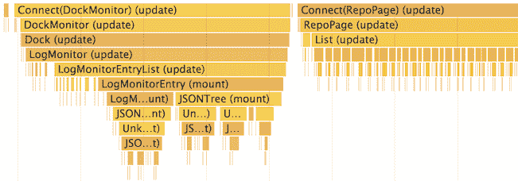

# 本周代码，11 月 21 日

> 原文:[https://dev.to/ben/this-week-in-code-november-21st](https://dev.to/ben/this-week-in-code-november-21st)

如果你错过了其中的任何一个，这里有一些我们行业过去一周最值得关注的链接。

SpaceX 计划在全球范围内建立低延迟、千兆速度的卫星互联网当然，这个项目可能会对世界产生巨大影响。它还将影响我们设计和构建应用程序的方式，这些应用程序可能有一天会被世界上几乎每个人使用。

[快，画](https://quickdraw.withgoogle.com/)神经网络可以学习识别涂鸦吗？这是谷歌的一个有趣项目，展示了神经网络的力量。

Google Cloud 比 AWS 便宜 50%这是一项透明但固执己见的探索，旨在研究 Google Cloud 和 AWS 在经济上的优势。

[学习编程，做你真正关心的项目](https://datarebellion.com/blog/to-learn-programming-do-projects-you-actually-care-about/)我能理解并同意这里表达的观点。动机和兴趣是学习的有力工具。

[IP Over 二维码！](http://seiferteric.com/?p=356)使用网络摄像头和显示器通过二维码可靠地发送数据。这是一个迷人的小项目。这让我想起了电报的早期历史，它起源于一个村庄最高的塔上的视觉提示。

玛格丽特·哈米尔顿和格蕾丝·赫柏(死后)获得总统自由勋章两位伟大的技术专家被授予国家最高平民荣誉。

[Rust 和系统编程的未来](https://medium.com/mozilla-tech/rust-and-the-future-of-systems-programming-b75fba746910#.h71dz9uw0)一个视频系列的介绍，很好地概述了 Rust 是什么。

[React v15.4.0 发布](https://facebook.github.io/react/blog/2016/11/16/react-v15.4.0.html)几个重要特性和 API 调整。一个非常好的附加功能是用 Chrome timeline 分析组件。这让您可以看到哪些组件被确切地装载、更新和卸载，它们相对于彼此花费了多少时间。

[T2】](https://res.cloudinary.com/practicaldev/image/fetch/s--ZACJY-m_--/c_limit%2Cf_auto%2Cfl_progressive%2Cq_auto%2Cw_880/https://facebook.github.io/react/img/blog/react-perf-chrome-timeline.png)

## 播客

与 Haseeb Qureshi 的调试故事三个经典调试故事的精彩阅读。我真的很喜欢这个。绝对精彩听着。

[伺服与杰克·莫菲特的铁锈](https://dev.to/changelog/228-servo-and-rust-with-jack-moffitt)与“第一位专业铁锈开发者”商榷 Servo 是一个实验性的网页浏览器布局引擎。是什么让 Rust 非常适合这项工作？

## #发展讨论

上周的[# dev discuse](https://twitter.com/hashtag/DevDiscuss)Twitter 聊天是关于冒名顶替综合症的，[以下是重点](https://twitter.com/i/moments/798882106705399808)。

我们每周一次的 Twitter 聊天将于明天(美国东部时间周二晚上 9 点(UTC - 0500)回归。这个话题将于今晚通过推特投票进行表决。