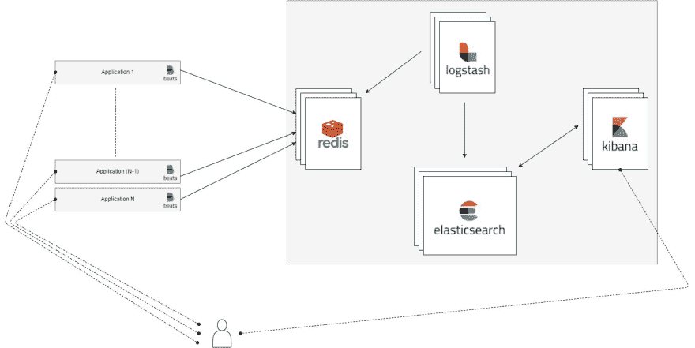

# 一个麋鹿栈从零开始，与 Docker

> 原文:[https://dev . to/d3rwan/an-elk-stack-from-scratch-with-docker-ofh](https://dev.to/d3rwan/an-elk-stack-from-scratch-with-docker-ofh)

或者如何在几分钟内部署完整的监控架构。

## 监视器

几年后，监控已经成为 IT 界不可或缺的活动。无论是技术性的还是功能性的，无论是提供指标、图表还是其他 KPI，监控其系统都已成为一项必备的工作。

在本文的其余部分，由于 Docker 的帮助，我们将在几分钟内学习如何从头开始部署一个监控架构。

## 堆栈

首先，我们将使用 ELK stack，它在几年内已经成为其他监控解决方案(Splunk、SAAS……)的可靠替代方案。

它基于以下软件:

*   **E** as *Elasticsearch* ，提供全文搜索的搜索引擎& analytics、
*   **L** as *Logstash* ，一个 ETL，用于从异构数据源检索数据，转换后发送给 *Elasticsearch* ，
*   **K** as *Kibana* ，它提供了一个用户界面来浏览数据，并创建交互式仪表板

而且:

*   **R** as *Redis，*上游代理，其将在系统延迟的情况下充当缓冲器，同时在高峰情况下避免过度拥塞，
*   **C** 作为*馆长*，管理我们索引的工具
*   **B * *as *Beats* ，客户端代理将日志/指标发送到我们的堆栈

 *完整架构*

## 部署

我们将为每个堆栈组件使用 Docker 容器。

*   [弹性搜索](https://hub.docker.com/_/elasticsearch/) (5.1.2)，
*   [Logstash](https://hub.docker.com/_/logstash/) (5.1.2)，
*   [Kibana](https://hub.docker.com/_/kibana/) (5.1.2),
*   [再说](https://hub.docker.com/_/redis/) (3.2.6)，
*   [策展人](https://hub.docker.com/r/bobrik/curator/) (4.0.4)

docker-compose.yml 文件中描述了服务和交互: