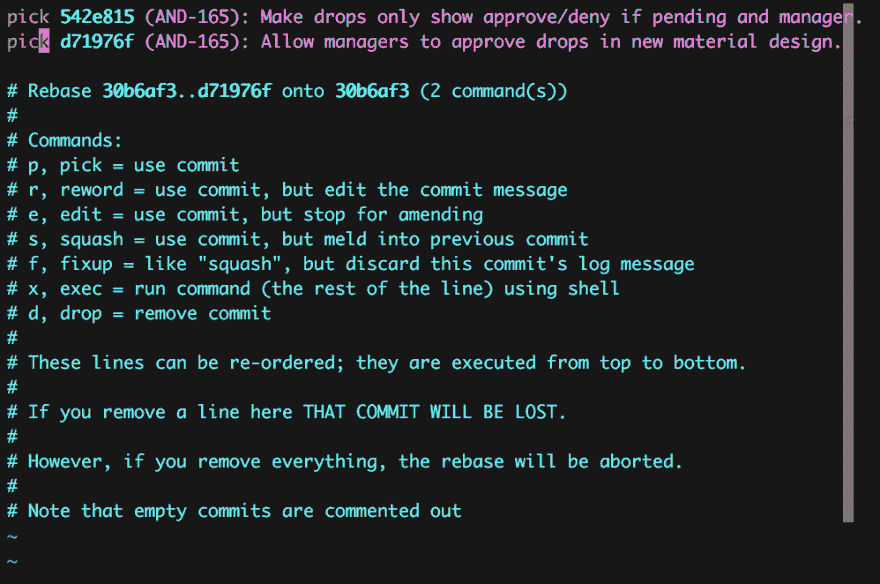

# 向独立转变

> 原文:[https://dev.to/jwir3/rebasing-toward-independence-gfk](https://dev.to/jwir3/rebasing-toward-independence-gfk)

# 简介

在审查代码时，我通常会做的事情之一是验证拉请求中的每个提交至少*编译了*。由于我从开发和审查补丁中学到了很多技巧，而不是拉请求，这通常是代码审查结构中固有的。然而，现在完全有可能的是，当一个给定的*分支*在被合并到另一个分支后编译，并不是每个*提交*都独立编译。

你可能会问为什么我在这个问题上如此坚持。答案是双重的。

首先，我认为提交应该是相互独立的*。这在很多方面都有帮助，但主要是关于我思考的方式。我想把我的改变分成彼此独立的几个部分，因为这样我可以更好地在脑海中总结它们。这有助于我仔细思考，在开始一项特定的任务之前需要采取什么步骤。反过来，我发现这导致更少的错误和更多的思考*，在开始代码开发之前。**

 *第二，当我试图诊断一个已经发现的 bug 时，我经常使用`git bisect`*。当您平分的提交很小、不相关并且可以独立编译时，平分修订以发现哪里发生了更改会更有用。这最后一部分是至关重要的，因为如果一个特定的提交不能在不添加其他提交的情况下构建，这意味着如果它是二分法搜索中的一个支点，您将不得不在那个提交上使用`git bisect --skip`。这增加了您以多次提交结束的可能性，而多次提交可能会引入 bug。*

 *# 方法论

既然我已经解释了为什么*您希望您的提交能够被独立编译的基本原理，那么如何检查实际情况是否如此呢？答案是`git rebase`。*

 *您可能在想“是的，我不碰 rebase，因为它改变了 git 的历史。”对于共享分支(例如`master`或`develop`)来说，这是一个很好的经验法则，但是对于临时分支<sup>[【1】](#fn1)</sup>，在将提交合并到主干之前，为了使提交具有更好的结构，修改历史是完全可以接受的。

## 交互重置基础

Git rebase 有一个交互式开关`-i`，它允许您指定想要操作哪些提交，以及想要对它们做什么。你只需要指定一个起点(通常是你现在的`HEAD`)和一个终点:

```
git checkout feature/my-cool-feature
git rebase -i HEAD~2 
```

这将打开一个编辑器，您可以在其中交互地告诉 git 您想要进行哪些提交`edit`:

[T2】](https://res.cloudinary.com/practicaldev/image/fetch/s--wDipLb81--/c_limit%2Cf_auto%2Cfl_progressive%2Cq_auto%2Cw_880/http://www.jwir3.com/conteimg/2016/09/Screen-Shot-2016-09-08-at-3-51-59-PM.png)

为了编辑具体的提交，只需将每行开头的单词`pick`改为`edit`。然后，保存文件并退出编辑器。Git 现在将开始一个接一个地遍历提交，直到到达您让它编辑的提交集的末尾。在每一步，您只需确定代码是否可以编译。如果是，那么您可以运行`git rebase --continue`继续下一个提交。

## 遍历提交

下面是一个示例，说明如何通过具有大量提交的分支来手动确定每个提交是否编译。

> **注意**:对于下面所有的例子，我在 Mac OSX 上使用了带有 zsh 的 [git-prompt](https://github.com/git/git/blob/master/contrib/completion/git-prompt.sh) ，这就是为什么当我运行`git rebase`时，你会看到剩余的步骤。如果您使用不同的 shell 或操作系统，您的里程数可能会有所不同。

1.  看看这个分支

```
git checkout feature/super-cool-feature 
```

1.  确定该分支从主干<sup>[【2】](#fn2)</sup>中分出多少提交

```
git cherry --abbrev=6 -v <trunk-branch> | wc -l 
```

1.  Start git rebase

```
# Use the commits from the above step in place of XX
git rebase -i HEAD~XX

# You will need to use your editor to make
# all the commit messages start with 'edit'
# instead of 'pick' 
```

1.  检查每个提交

```
# Run your compile command. If it's successful, run:
git rebase --continue 
```

1.  重复直到完成

## 自动化 It

上面的例子很好，并且，对于大多数小分支，我将手工完成它。然而，一旦提交次数超过 10 次，就会变得令人厌倦。特别是如果您刚刚从 master 返回，没有冲突，现在您只想检查以确保所有内容仍然可以编译，即使您非常确定它会编译。

这里有一个小的 shell 脚本，可以让您自动完成这项工作:

## 修复错误的提交

如果遇到无法编译的提交，可以在再次运行`git rebase --continue`之前修复代码使其编译。如果您正在使用上面的脚本，如果编译失败，它会自动停止，以便您可以修复它。修复后，您可以重新运行脚本以继续。

## 结论

既然您已经知道了如何快速检查以确定分支上的提交是否独立编译，以及 b)如何修复没有编译的提交，我希望您将使用这些知识来改进您的提交。您还可以在检查代码时检查分支，以验证每个提交是否编译。

努力拥有一个卫生的仓库！从长远来看，这会节省你大量的时间。

* * *

1.  几乎我所有的项目都使用了一种变体 [git-flow](http://nvie.com/posts/a-successful-git-branching-model/) 。如果你从未听说过，我强烈建议你去看看。 [↩︎](#fnref1)

2.  这个命令使用了 git cherry，我发现这个命令在过去非常有用。您可以使用它来确定哪些提交在一个分支中，而不是在另一个分支中。例如，如果你想找到哪些提交在分支*我的酷功能*中，但是还没有被合并到*开发*，你可以使用:`git checkout my-cool-feature && git cherry --abbrev=6 -v develop` [↩︎](#fnref2)***