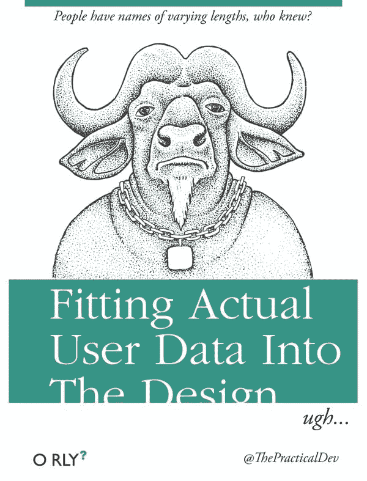

# 确定字符串的宽度

> 原文：<https://dev.to/ben/determining-the-width-of-a-string>

我不是文字排列美学方面的专家，但是我认为当一段文字，尤其是居中的一段文字，最后一行只有一个字的时候是很难看的。这件事发生在这个网站上。像一个优秀的开发人员一样，我决定修改我正在开发的语言中的一个核心类，以解决一堆假设的未来问题，而不是解决这一个问题。😋

## 举例审丑

[T2】](https://res.cloudinary.com/practicaldev/image/fetch/s--3YdkT4aQ--/c_limit%2Cf_auto%2Cfl_progressive%2Cq_auto%2Cw_880/https://i.imgur.com/AlDYG3U.png)

有几种方法可以解决这个问题。这里有一个[关于它的栈溢出问题](http://stackoverflow.com/questions/687998/auto-size-dynamic-text-to-fill-fixed-size-container)。然而，我对这个应用程序有一个限制，因为[渲染性能的原因](https://dev.to/ben/faster-rendering-on-the-web)，我不想在客户端进行格式化计算。所以我开始着手解决这个问题，而不需要进行即时计算。这里的基本问题是服务器端应用程序不知道一段文本的宽度。我们通常只关注字符串中字符的数量，而不是它的实际宽度。

### 以下字符串都有十个字符

## MMMMMMMMMM

## mmmmmmmmmm

## fffffff

## fffffff

## AAAAAAAAAA

## aaaaaaaaaa

### 又来了，使用等宽字体

```
"MMMMMMMMMM"

"mmmmmmmmmm"

"FFFFFFFFFF"

"ffffffffff"

"AAAAAAAAAA"

"aaaaaaaaaa" 
```

Enter fullscreen mode Exit fullscreen mode

显然，在精度非常重要的任何情况下，我们都不能用字符串的字符数和长度来代表它的宽度。一旦我们知道宽度是一个可以在服务器上计算的精确值，我们就可以以各种有趣的方式使用它，比如对输入长度进行验证。用户名通常都有字符限制，这样做的一个重要原因是为了确保我们可以在页面上清晰地呈现他们的名字，但是如果我们确信可以准确地确定宽度，我们可以在执行验证时考虑它。

[T2】](https://res.cloudinary.com/practicaldev/image/fetch/s--EIJsemum--/c_limit%2Cf_auto%2Cfl_progressive%2Cq_auto%2Cw_880/https://pbs.twimg.com/media/ChinzjeWgAAeS2x.jpg)

## API

因为我在后端使用的是 Ruby，所以我想对 String 类进行猴子式的修补，以达到最大的表现力。这似乎符合语言的精神，创造了一种很好的表达方式来引用字符串的宽度。看来`"hello".width`和`"hello".length`属于同一个范畴，或者是它的别名`"hello".size`等等。

在 Ruby 中，这非常简单。

```
class String

  def width(font="Helvetica")
    StringWidth.new.calc(self,font)
  end

end 
```

Enter fullscreen mode Exit fullscreen mode

我创建了第二个名为`StringWidth`的类，因为只给 string 一个新方法是有意义的。我不确定最“红宝石”的方式是什么。

`String#width`接受可选字体并返回字符串的归一化长度。每个字符被赋予一个值，其中 1.0 是近似的平均值。如上图所示，Helvetica 中的“f”字得分为 0.559，表示它很窄。五个字符的“典型”字符串将以大约 5.0 的值响应。特别窄的字符串可能返回 2.5，而宽的字符串可能返回 8.0。这对我来说是有意义的，但是我愿意听听关于这应该如何表现的其他想法。

为了在 Ruby 中计算字符串的宽度，有几个选项。下面是[题上的一个栈溢出问题](http://stackoverflow.com/questions/378887/how-do-i-calculate-a-strings-width-in-ruby)。

```
the_text = "TheTextYouWantTheWidthOf"
label = Draw.new
label.font = "Vera"
label.text_antialias(true)
label.font_style=Magick::NormalStyle
label.font_weight=Magick::BoldWeight
label.gravity=Magick::CenterGravity
label.text(0,0,the_text)
metrics = label.get_type_metrics(the_text)
width = metrics.width
height = metrics.height 
```

Enter fullscreen mode Exit fullscreen mode

这个要看 RMagick。我个人不喜欢使用 Ruby 的通用图像处理库和它们的依赖项，所以我从一开始就决定不这么做。整个事情的一个核心前提是，计算不应该在运行时进行，它们可以很容易地预先计算，然后存储为一个字典。这非常适合我的目的。

我还认为，在客户机上进行初始计算，依靠字体的实际浏览器渲染，将是填充字典的最准确方式。这也考虑到了额外的复杂情况，如字母间距。我还没有做 API 的这一部分，但是如果需要的话，它可以很容易地扩展到考虑字母间距等。因此，我设置了一个脚本，将我想要包含在库中的每个字符打印 100 次，然后获取宽度并将其标准化。我把结果打印出来，作为 JSON，然后复制到我的 Ruby 代码中。我可以在任何需要更新功能的时候重新运行这个脚本，我对这种方法很满意。

所以你有它。运行这个 web 应用程序的 Ruby 代码库现在有了一个支持宽度感知的字符串实现。

## 这样不是更好看吗？

[T2】](https://res.cloudinary.com/practicaldev/image/fetch/s--KEF_HdSZ--/c_limit%2Cf_auto%2Cfl_progressive%2Cq_auto%2Cw_880/https://i.imgur.com/ZgDfy31.png)

在模板中，我使用了一些逻辑来确保我的基本情况看起来更好，但是到目前为止，我只考虑了一个基本情况，其中我根据字符串是否在一个特定的“尴尬区域”来修改标题的类。我还没有考虑到标题宽度和窗口宽度的可能变化。但是现在我可以很容易地将字符串的真实宽度作为一个可靠的值，为不同的场景调整呈现将是轻而易举的。