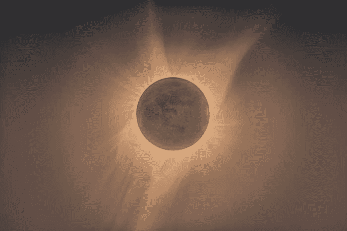

# 设置 Eclipse

> 原文:[https://dev.to/committedsw/setting-up-eclipse-2hn3](https://dev.to/committedsw/setting-up-eclipse-2hn3)

[T2】](///static/bryan-goff-356687-5a4de7ebc99a741957e28189cc6a1ca4-7a1db.jpg)

建立一个 IDE 总是一件私人的事情，但是这里是我们认为 Eclipse 中 Java 开发的一个开始标准。

所有的配置选项都在窗口->首选项下。

## 格式化(Java - >下代码样式- >格式化程序)

首先，也是最重要的，我们使用 [Google 编码风格](https://github.com/google/styleguide)。虽然我们可能不会 100%同意每一条规则；这是一个广为人知的、普遍良好且全面的起点，它为 Eclipse 提供了[格式化程序。](https://raw.githubusercontent.com/google/styleguide/gh-pages/eclipse-java-google-style.xml)

要安装格式化程序:

*   从[https://raw . githubusercontent . com/Google/style guide/GH-pages/eclipse-Java-Google-style . XML](https://raw.githubusercontent.com/google/styleguide/gh-pages/eclipse-java-google-style.xml)下载格式化程序。
*   通过访问窗口->首选项-> Java ->代码样式->格式化程序并单击导入来导入。
*   确保活动配置文件显示“GoogleStyle ”,然后单击应用。
*   在常规->编辑器->文本编辑器下，选中“为制表符插入空格”。

虽然空格与制表符是一个永恒的争论，但我们对空格进行了标准化，谢天谢地，它保持了 CheckStyle 的安静。

## Maven(在 Maven 之下)

在 Eclipse 中调试时，让源代码和外部库的 javadoc 唾手可得是件好事。因为我们使用 Maven 作为我们的构建系统:

*   窗口->首选项-> Maven 并检查下载工件源和下载工件 JavaDoc。

我们的网络上有一个 Maven 代理，它减少了多人和多个工作区的重复下载，但是如果您的带宽有限，那么这个选项可能不适合您。

## 清理(Java - >下代码风格- >清理)

清理是用来大规模整理你的代码。Eclipse 内置了一个，但是我们有更严格的东西。基本上，这允许您镜像您的保存操作(见下文)，但是您可以在 Eclipse 中导入和导出它。

除了“排序成员”和“添加未实现的方法”之外，我们的清理配置基本上是打开的。(总有一天我们会放一个导出文件的链接！)

## 保存动作(在 Java - >下编辑>保存动作)

为什么这是不同的清理我们不知道，但这是月蚀。遗憾的是，你不能在这里导入，实际上这比清理更重要(因为它会在保存时自动运行)。

您应该启用所有功能！那就是:

*   格式化源代码(格式化所有行)
*   组织导入
*   附加操作

在附加动作下，我们镜像我们的清理动作，除非它妨碍了开发。例如，我们不会删除未使用的局部变量或未使用的私有成员，因为这通常意味着它们会在开发过程中被删除(例如，如果您在完成方法编码之前按了 save)。最终变量也是如此。

因此，我们在开发期间使用保存操作来获得合理的清理输出，然后在提交之前执行清理。

## 类型过滤器(Java - >外观- >类型过滤器)

当 Eclipse 将`java.awt.List`作为主要的自动完成选项时，这真的很烦人，但是您可以解决这个问题。

添加以下软件包以提高您的理智:

*   `java.awt.*`(隐藏过时了！)
*   `java.util.logging.*`和`org.apache.log4j.*`(隐藏我们不使用的日志框架，我们使用 Slf4j)
*   (你可能不应该玩这个)
*   `groovy.*`和`scala.*`(因为我们不怎么使用 Groovy 或 Scala，所以我们不想看到它们的类型)

图片来源:布莱恩·戈夫在 [Unsplash](https://unsplash.com/?utm_source=unsplash&utm_medium=referral&utm_content=creditCopyText) 上拍摄的照片