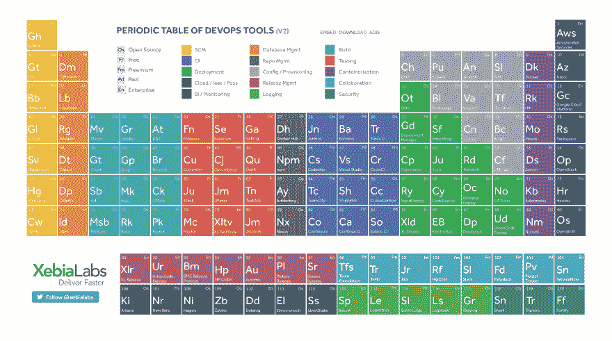

# DevOps 周期表

> 原文:[https://dev.to/funkysi1701/periodic-table-of-devops-15c7](https://dev.to/funkysi1701/periodic-table-of-devops-15c7)

元素周期表列出了所有的化学元素，并根据一些关键属性将它们分组。今天发现一篇关于 DevOps 元素周期表[的文章。](https://xebialabs.com/periodic-table-of-devops-tools/)

[T2】](https://res.cloudinary.com/practicaldev/image/fetch/s--u5ugJMmO--/c_limit%2Cf_auto%2Cfl_progressive%2Cq_auto%2Cw_880/https://storageaccountblog9f5d.blob.core.windows.net/blazor/wp-content/uploads/2016/06/https-xebialabs.com-assets-files-infographics-periodic-table-of-devops-v2.png%3Fresize%3D1024%252C572%26ssl%3D1)

我不会讨论每一个元素，但我想我可能会通过一些我听说过或使用。

*   github——大量开源软件的仓库。我的 Github 可以在 https://github.com/funkysi1701 找到
*   亚马逊网络服务——第二大最受欢迎的云计算提供商(不确定为什么不是第三？)
*   git——如今每个人都在使用的分布式源代码控制系统。
*   azure——排名第一的云提供商，我已经用了很多次了，主要是在网站上，但也有一些其他功能，如流量管理器。
*   bit bucket——类似 Github，但允许私有存储库。我已经在我不想公开的基于工作的项目中广泛使用了它。
*   谷歌云平台——我不太了解这个平台，但毫不奇怪，谷歌想要在云计算这块蛋糕上分一杯羹。
*   selenium——这是一款我想尝试的产品，它允许用浏览器进行前端测试。
*   Rackspace——在我们转向 Azure 之前，我们使用了一些 Rackspace 服务器。
*   subversion——我使用的第一个源代码控制系统，但是使用 git 很久了，现在我不确定我能记得它是如何工作的。
*   visual Studio——我用来写代码的微软 IDE。我是一个超级粉丝，因为它做了我想要的一切。
*   TeamCity——我一直用来自动化部署的持续集成软件。
*   MSBuild–Visual Studio 使用它来构建您的软件，您的部署脚本也可以使用它。
*   trello——一个允许你创建一个想法或事情板的网站。
*   slack——将您所有的通信集中在一个地方。它是现代团队的实时消息传递、归档和搜索。
*   new Relic–开发人员、运营人员和软件公司使用的软件分析工具套件，用于了解您的应用程序的执行情况。有用，但我发现自己现在更喜欢应用洞察(Azure 的一部分)。
*   纳吉奥斯-耶，纳吉奥斯在名单上！我最喜欢的服务器监控系统。
*   splunk–该应用程序可用于搜索、监控和分析您的所有日志文件，以了解正在发生的事情。目前不使用它，但我在过去尝试过。