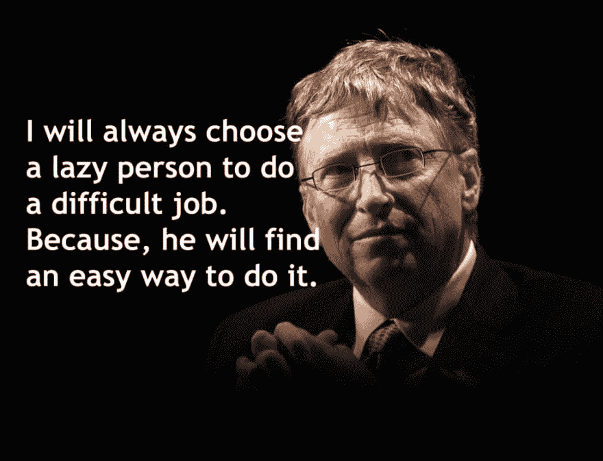

# 懒惰的程序员会怎么样？

> 原文:[https://dev.to/ben/what-happens-to-lazy-programmers](https://dev.to/ben/what-happens-to-lazy-programmers)

程序员很懒。或者不是。程序员有时被称赞为“懒惰”，指的是导致他们自动完成任务而不是做重复性工作的个性特征。这个故事是真实的，但只是一种开玩笑的想法。虽然很难确定，但真正导致成功的性格特征肯定不是懒惰。我认为的品质包括创造力、细心、与他人相处的能力，以及许多其他他们在小学给你打星星的习惯。

我有时很懒，但大多数时候不是(我想)。我没有在许多不同场景中观察许多开发人员所需的各种行业经验，所以我自己很难做出类比。我确实在非编程环境中遇到过很多懒惰的人，我也和一些看起来懒惰的开发人员一起工作过，但是很难确定他们是真的懒惰还是仅仅因为他们的角色不够积极，这是一个很大的区别。也许他们只是在经历个人生活中的一些事情，阻止他们将精力投入到工作中。我们对每一个人的情况确实了解得不够。我很好奇一个人怎么能在这个行业偷懒，因为这似乎很难。我不想对懒惰本身下任何判断，因为每个人都需要做适合自己的事情，但我对长期的程序员懒惰仍然很好奇。

除了简单的缺乏动力之外，一个相当有天赋和热情，但本质上懒惰的人的职业轨迹是什么？他们大多能写出好的代码，但有时却不能。他们倾向于通过漂亮的解决方案，但有时会落后于复杂的项目。他们把快速浏览 Reddit 或 Twitter 变成了两个小时的无所事事。这些特质是他们可能会变得更好的，但他们很容易在整个职业生涯中保持这些特质。

[T2】](https://res.cloudinary.com/practicaldev/image/fetch/s--ScCvyWGh--/c_limit%2Cf_auto%2Cfl_progressive%2Cq_auto%2Cw_880/http://res.cloudinary.com/practicaldev/image/fetch/fl_progressive%2Cq_90%2Cw_880/f_jpg/http://quotography.com/i/lazy-bill-gates-7298367009.jpg)

在当前的编程工作经济中，一个有经验和相当有才华的程序员应该很容易找到工作，但也很容易想象一个懒惰的开发人员会很难在任何一份工作上坚持很久。这些程序员从一个地方跳到另一个地方，从来没有真正贡献出任何有意义的代码，还是他们只是在一个地方继续做着懒惰的工作？他们是被解雇了还是辞职了？人们需要多长时间才能发现自己有多懒，在每种情况下需要多长时间才能赶上他们？

也许懒惰的程序员并不常见，因为他们把自己从一个对心理要求很高且不宽容的行业中剔除出去。作为一个模仿奥莱利的那些愚蠢的封面的家伙，我知道程序员*喜欢拿自己的懒惰开玩笑，但我很好奇一个真正懒惰的程序员*是如何度过的。懒惰的程序员对自己的懒惰有多少自知之明，他们有多少，在懒惰伤害他们的职业生涯和他们所在的团队之前，如何识别懒惰？懒惰是一种迷人的人类状态，它与代码的交集也是如此，所以我提出了这些问题。我本可以以此为起点来研究这个话题，但是我实在太懒了。**