# 如何在云中设置持续集成流程

> 原文:[https://dev . to/kuniss/how-to-setup-a-continuous-integration-process-in-the-cloud-3p1e](https://dev.to/kuniss/how-to-set-up-a-continuous-integration-process-in-the-cloud-3p1e)

> 如果不在 Maven Central 上，就不存在！

拥有一个不在 [Maven Central](http://search.maven.org) 或至少不在 [Bintray](https://bintray.com) 上的库并不是最先进的。我的意思是，我们现在是 2016 年，大多数开发人员都喜欢使用 Maven、Gradle 或其他现代构建系统来自动解决库对工件库的依赖性。

然而，挑战不仅仅是将一个库放入这些存储库中，而是通过一个持续的集成过程将它们自动放入。

我利用这个机会为一个标准化组织建立了这样一个过程，该组织的成员正在维护一个在整个行业中广泛使用的标准的参考实现。

设置不是很复杂，但我没有发现它立刻写下来。因此，我将在这里为所有需要类似解决方案的人做这件事，希望这对他们有价值。我这样做也是为了给委员会成员提供文件。

# 工具和服务

我将使用以下云服务和工具:

1.  [Github.com](https://github.com)用于源代码托管和发布控制
2.  [Travis-CI.org](https://travis-ci.org)用于运行编译、测试和库发布
3.  [Bintray.com](https://bintray.com/)用于存储库托管和发布到 Maven Central
4.  作为构建系统工具的 Gradle
5.  [Stefan Oehme 的 sobula Gradle 插件](https://plugins.gradle.org/plugin/com.github.oehme.sobula.bintray-release)用于发布到 Bintray

事实上， [Stefan 的文章](http://mnmlst-dvlpr.blogspot.de/2014/12/my-lightweight-release-process.html#gpluscomments)是我这项工作的起点，他的 Gradle 插件是最有用的工具，因为通过 HTTP 服务 API 发布到 Bintray 是整个过程中的主要挑战。由于他的工作导致了他的插件，我可以实现这个过程，而不需要真正的编程工作。

本文展示了我为一个组织建立 CI 流程的经验。为单个开发人员设置它非常相似，也不太复杂。我以前也为我自己的图书馆做过。

# GitHub

第一步是在登录 GitHub 后建立一个组织(当然，这需要一个 GitHub 帐户)。转到您的个人资料页面，在个人设置下显示的菜单中单击*组织*菜单项。将出现一个已经创建的组织的列表(可能是空的)。在右上角会有一个创建新组织的按钮。

<figure>[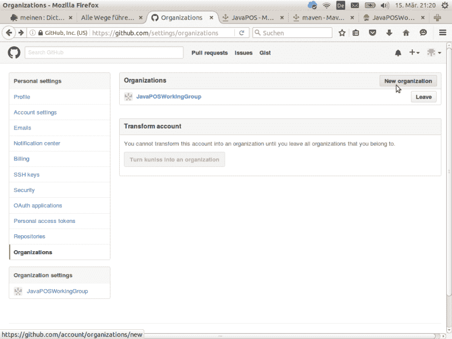](http://blog.grammarcraft.de/wp-content/uploads/2016/04/gitub1-create-new-org.png) 

<figcaption>开始创建组织的 GitHub 对话框</figcaption>

</figure>

按下这个按钮会要求您输入组织名称和计费方案。

<figure>[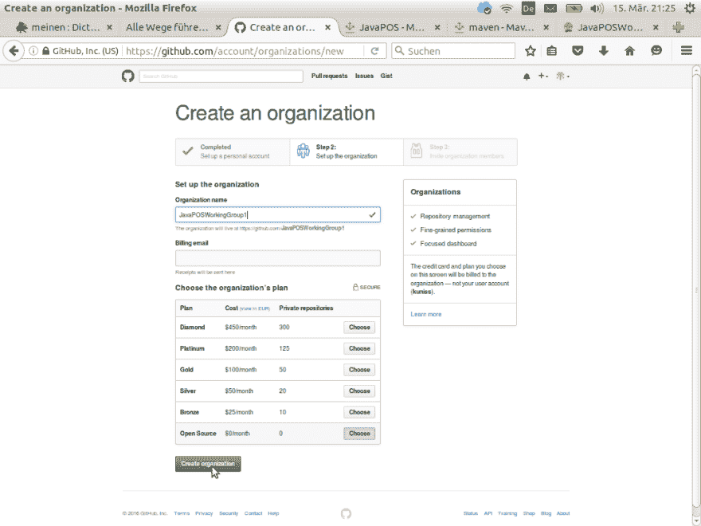](http://blog.grammarcraft.de/wp-content/uploads/2016/04/gitub2-create-new-org.png) 

<figcaption>创建组织的 GitHub 对话框</figcaption>

</figure>

由于我们计划使用 Travis-CI.org 和 Bintray，我们必须让他们访问我们的 GitHub 组织的帐户。这可以在个人设置的 *OAuth 应用*对话框中完成。

<figure>[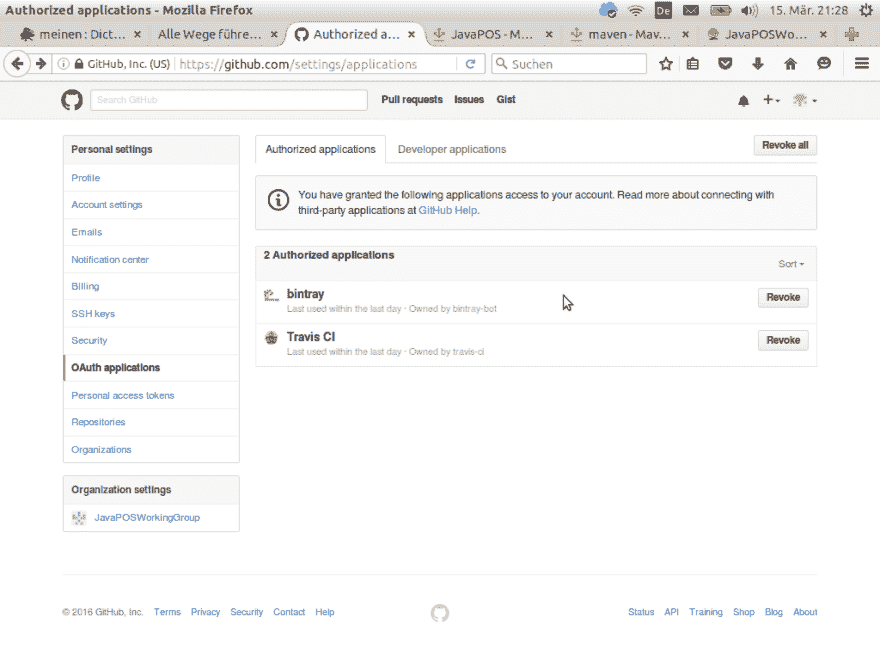](http://blog.grammarcraft.de/wp-content/uploads/2016/04/github3-authorize-applications.png) 

<figcaption>GitHub OAuth 应用对话框</figcaption>

</figure>

要显示第三方应用程序，可能需要在 Travis-CI.org 和 Bintray 上创建帐户。你可以通过你的 GitHub 账户登陆；在侧面的登录页面上寻找合适的 GitHub 图标。

之后，点击该页面上的*任务栏*和 *Travis CI* 链接。在随后的对话框中检查是否允许特定应用程序访问您的组织。如果没有，请在此页面上按下您所在组织的相应按钮。

<figure>[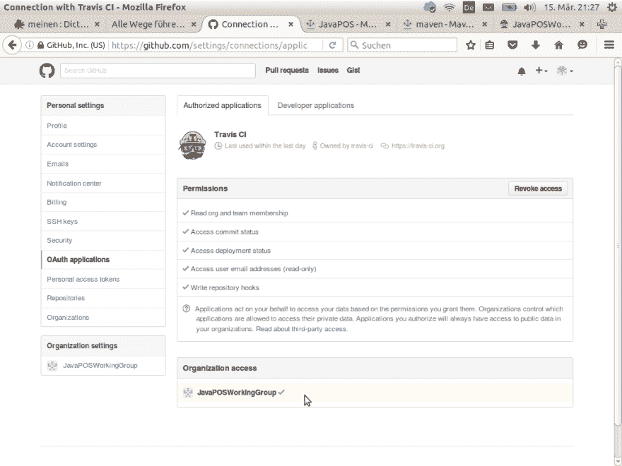](http://blog.grammarcraft.de/wp-content/uploads/2016/04/gitub4-give-travis-ci-access-to-org.png) 

<figcaption>授权访问 Travis CI 第三方应用程序的 GitHub 对话框</figcaption>

</figure>

对第二个应用程序做同样的操作，这里是 Bintray。

<figure>[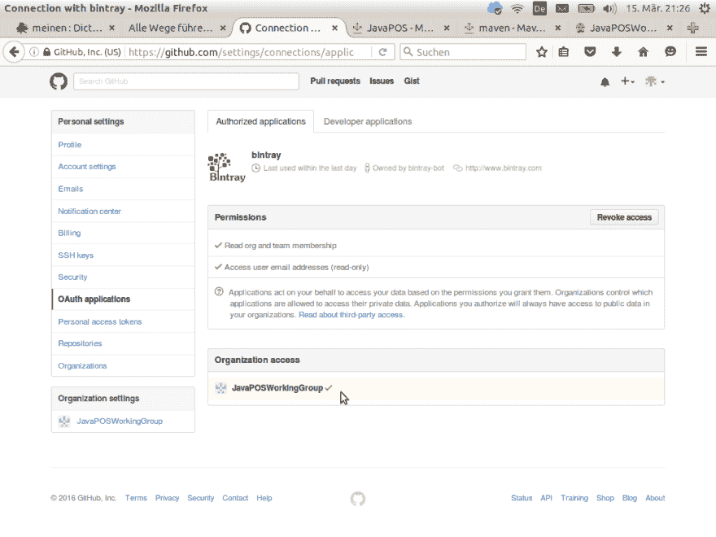](http://blog.grammarcraft.de/wp-content/uploads/2016/04/gitub5-give-bintray-access-to-org.png) 

<figcaption>GitHub 对话框授权访问 Bintray</figcaption>

</figure>

现在，为您的组织建立源代码存储库的准备工作已经就绪。我已经为[委员会参考实现](https://github.com/JavaPOSWorkingGroup)建立了 5 个存储库。

# 纸盒

Bintray 上的 GitHub 集成做得相当不错。您的用户简档页面上将显示一个组织。不幸的是，无论是 Stefan Oehme 的 Gradle Bintray 发布插件还是 Bintray 的服务 API 本身都不能为组织处理自动发布。然而，对于普通用户来说，它工作得很好。因此，我已经为该组织注册了一个自己的通用用户。它的帐户将托管我们想要发布的库。

<figure>[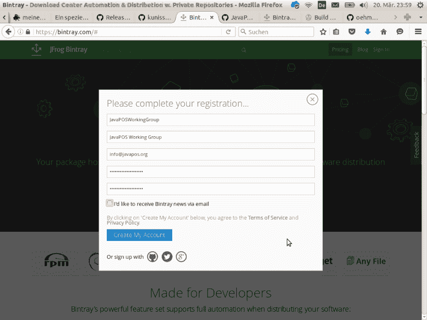](http://blog.grammarcraft.de/wp-content/uploads/2016/04/bintray-sign-up.png) 

<figcaption>垃圾箱注册对话框</figcaption>

</figure>

对于自动发布，Bintray 必须满足其他几个前提条件。首先，我们需要一个 Bintray API 键。该密钥像密码一样用于授权 Travic CI 服务的 Bintray API 调用。当点击 *API 键*菜单时，该 API 键可以在 Bintray 用户配置文件中生成。

<figure>[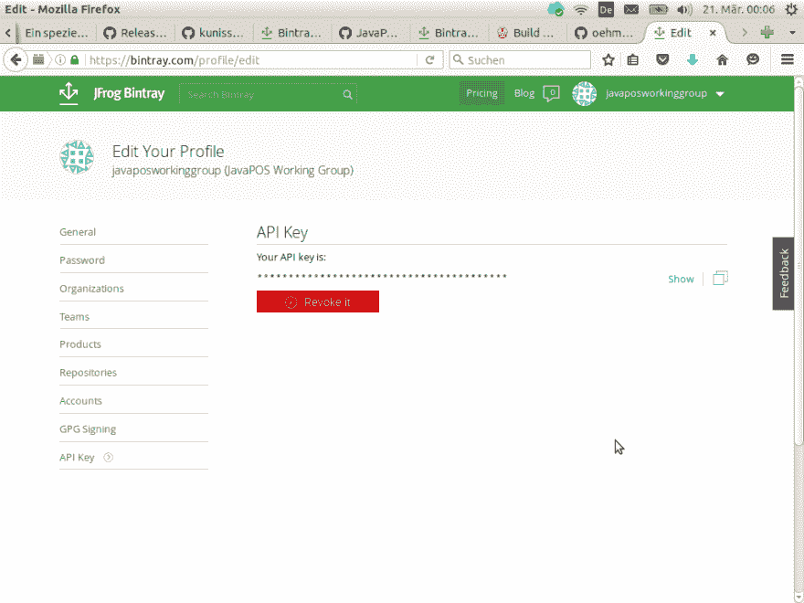](http://blog.grammarcraft.de/wp-content/uploads/2016/04/bintray-gen-api-key.png) 

<figcaption>Bintray API 键对话框</figcaption>

</figure>

该键稍后将被复制到项目的 Travis CI 配置对话框中。然而，这还不是全部。为了从 Bintray 发布到 Maven Central，所有的 Java 库都必须经过数字签名。Bintray 通过它们的服务 API 支持已发布库的签名。但是，该密钥对必须存储在 Bintray 中。

## GPG 密钥

为此，我们需要生成一对公钥和私钥。最简单的方法是使用 Linux 命令行工具 *gpg* 。好在我是在 Linux 下开发的。生成新对的命令行是

```
gpg --gen-key 
```

这将指导您交互式地完成密钥生成。在这个过程中，你必须准备输入一些名字，这些名字应该选择明智的。

1.  您的组织的真实名称。
2.  我们组织的一个电子邮件地址，它与建立图书馆的上下文相关。这可能是一个通用的，例如[builder@your-organization.org](mailto:builder@your-organization.org)；但是发送给它的电子邮件应该会被某个人发现。
3.  防止您的密钥对被误用的密码短语。这就像是你的钥匙的密码，以避免其他人未经授权滥用它们。事实上，这个通行短语后来被存储在 Travis CI 中，以允许使用存储在 Bintray 中的私钥通过 Bintray 服务进行数字签名。

从这个*开始，gpg* 将创建生成的密钥的用户 ID。将要求在一个特殊的对话框中输入密码短语，此处未显示。

<figure>[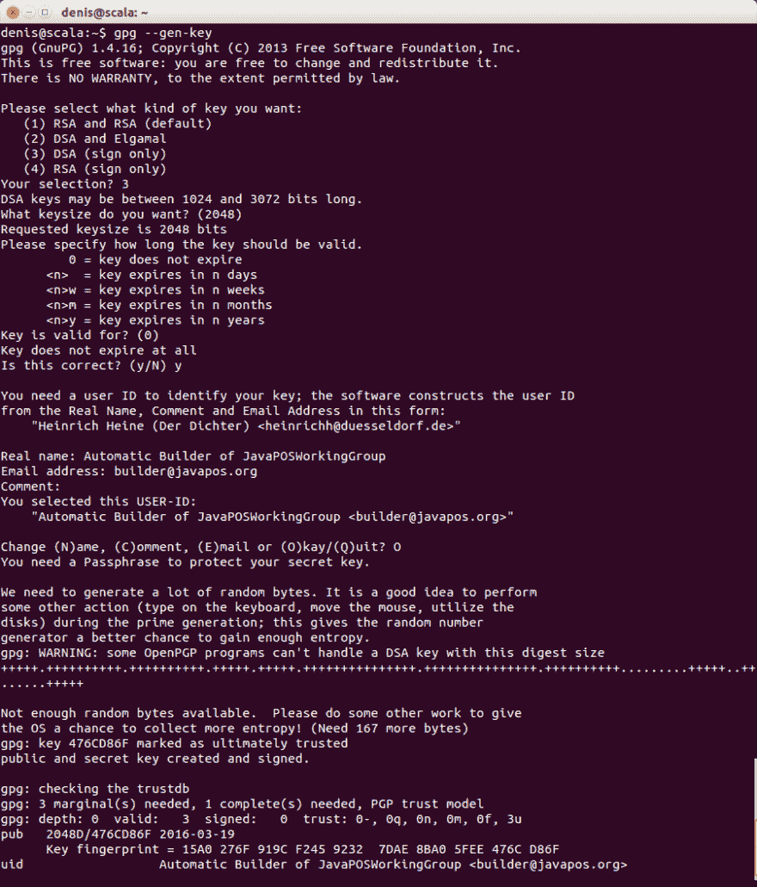](http://blog.grammarcraft.de/wp-content/uploads/2016/04/gpp-gen-key.1.png) 

<figcaption>使用 gpg 生成数字密钥对</figcaption>

</figure>

为了为将来做好准备，您现在还应该创建一个密钥撤销证书。命令是

```
gpg --output revoke.asc --gen-revoke \<your key ID\> 
```

<figure>[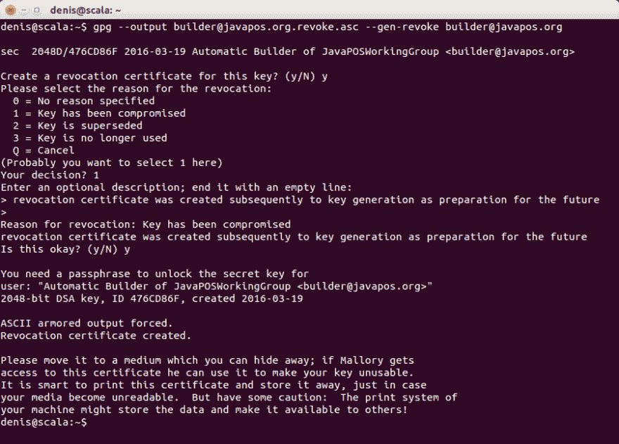](http://blog.grammarcraft.de/wp-content/uploads/2016/04/gpg-revoke-cert.png) 

<figcaption>使用 gpg 创建密钥撤销证书</figcaption>

</figure>

为了在 Bintray 上存储公钥和私钥，您必须将它们导出到一个文本文件中。Bintray 需要一个更好的格式

```
gpg --armor --output public.gpg --export \<your key ID\> 
```

<figure>[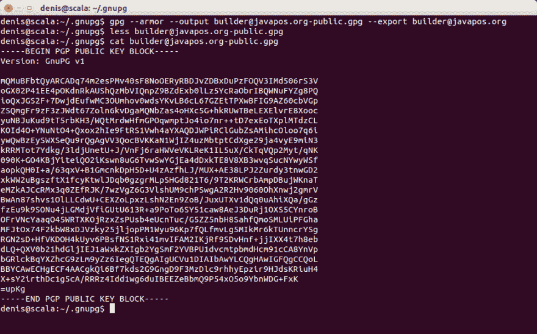](http://blog.grammarcraft.de/wp-content/uploads/2016/04/gpg-export-public-key.png) 

<figcaption>使用 gpg</figcaption>

</figure>

导出公钥

私钥的命令类似:

```
gpg --armor --output private.gpg --export-secret-key \<your key ID\> 
```

请求导出时，请准备好输入密码。

最后一步是将公钥发布到公钥服务器。稍后，当库被发布到 Maven Central repository 时，Maven Central 服务将查询这个密钥服务器，以检查数字签名。

用于此的 *gpg* 命令是

```
gpg --keyserver \<public keyserver address\> --send-keys \<your key ID\> 
```

在我这边，用于导出的密钥 ID 不起作用。我不知道为什么。因此，我使用了 list-key 命令显示的十六进制 ID。

<figure>[](http://blog.grammarcraft.de/wp-content/uploads/2016/04/gpg-sending-key-to-keyserver.png) 

<figcaption>向公钥服务器发送公钥</figcaption>

</figure>

**注意:**永远不要使用您在通信中使用的普通加密密钥对进行库签名。即使通行短语和私有密钥存储在不同的服务中，Bintray 和 Travis-CI(可能对两者都有控制权的人)也可能泄露您的密钥！创建一个新的即可。你可能有不止一把钥匙在使用 *gpg* 。

生成的公钥和私钥现在都必须添加到 Bintray 中。

<figure>[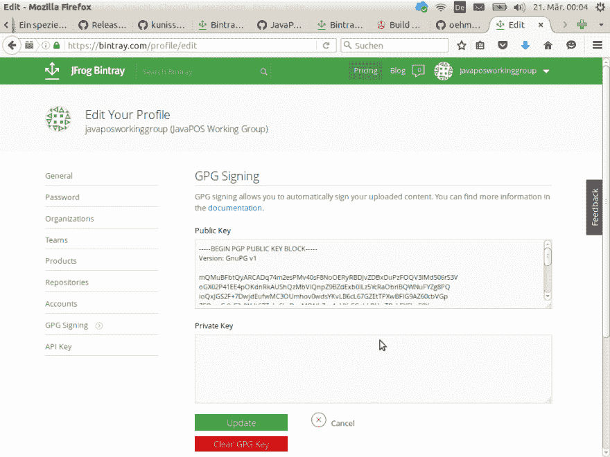](http://blog.grammarcraft.de/wp-content/uploads/2016/04/bintray-adding-keys.png) 

<figcaption>向二进制纸盒添加数字键</figcaption>

</figure>

# 美文中央

要将库[发布到 Maven Central](http://central.sonatype.org/pages/ossrh-guide.html) ，首先需要一个 Sonatype 的吉拉帐户。然后，您可以创建新的项目票证。在这张票上你需要声明

1.  组 ID，库将在下发布。这是最关键的部分，因为这将由 Sonatype 员工手动检查。ID 必须是唯一的，并且属于申请人。因此，如果是一个像“org.your-organization”这样的域名，你应该是该域名的所有者。
2.  GitHub 项目页面。
3.  GitHub 源代码库 URL(结束于“.”。git”)

这是一项按时完成的任务。你只需要为你的第一个库按组 ID 做这件事。随后的库可以基于第一次请求的结果来发布。

当您的请求得到确认后，您将收到一封电子邮件回复。

Travis CI 稍后需要吉拉密码作为 Sonatype 密码，用于授权向 Maven Central 发布库。

# 特拉维斯词

Travis CI 服务与 GitHub 紧密集成。使用 GitHub 授权登录 Travis CI 后，只需在您的帐户页面上同步您的帐户(在您的个人资料名称下的右上角有一个按钮)。按下此按钮将显示 Travis CI 上 GitHub 中您组织的所有源代码库。

<figure>[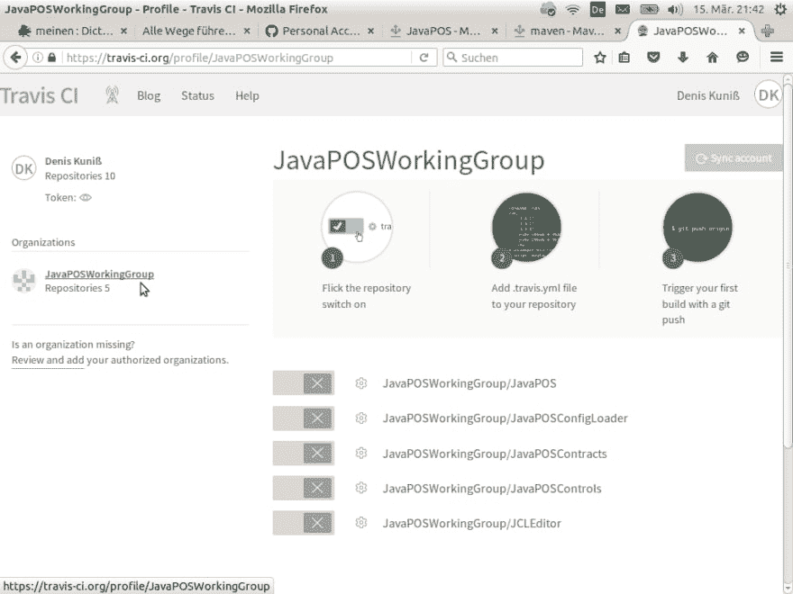](http://blog.grammarcraft.de/wp-content/uploads/2016/04/travis-ci-sync-account-to-get-org-shown.png) 

<figcaption>特拉维斯 CI 页面显示 GitHub 知识库</figcaption>

</figure>

目前，所有存储库都被禁用。我们将逐个项目地启用它们，因为每个项目都需要自己的关于 Bintray API 密钥和 GPG 密码短语等的配置。

通过将项目滑块推到左侧来启用第一个项目，它会变成绿色。单击滑块右侧的齿轮，进入该项目的配置页面。

<figure>[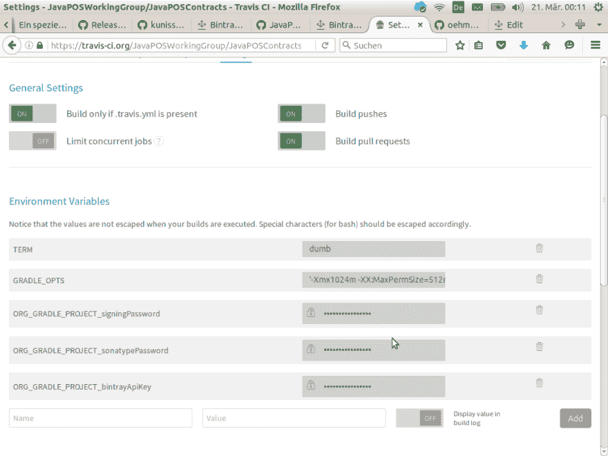](http://blog.grammarcraft.de/wp-content/uploads/2016/04/travis-ci-add-env-vars.png) 

<figcaption>特拉维斯 CI 项目配置设置</figcaption>

</figure>

首先，将滑块“*Build only if . Travis . yml present*”推到左边，启用它。这将避免在每次 GitHub 提交时都构建项目，只要项目不是为 Travis CI 准备的。

此外，为了更好的构建体验，我们必须设置两个环境变量。滑块“在构建日志中显示值”可以在这里启用。

1.  将*项*设置为*哑*。这将缩短 Travis 构建的日志输出，使其更具可读性。
2.  将 *GRADLE_OPTS* 设置为'-xmx 1024m-XX:MaxPermSize = 512m-dorg . GRADLE . daemon = true '(包括单引号)以加速 grad le 构建。

最后，我们必须设置库签名的通行短语，设置 Bintray API 密钥作为发布到 Bintray 的授权，设置 Sonatype 密码作为发布到 Maven Central 的授权。确保滑块“*显示构建日志中的值*”未启用(默认值是什么)；否则，秘密值将在构建日志中可见。

1.  将 ORG _ grad le _ PROJECT _ bintrayApiKey 设置为从 Bintray 配置文件上的 API 关键字页复制的值。
2.  将 ORG _ grad le _ PROJECT _ signing password 设置为创建数字密钥对时使用的通行短语。
3.  将 ORG _ grad le _ PROJECT _ sonatypassword 设置为 Sonatype 帐户注册时使用的密码(吉拉密码)。

如果您的口令或密码包含空格，不要忘记将您的配置值放在单引号中(如在 GRADLE_OPTS 上)。此外，bash 特殊字符如' \ '或' & '必须避免变成' \ '或' & '。否则 Travis 系统将无法正确转发它们，构建将会失败。

# 梯度构建

在自动构建和发布可以开始之前，现在已经没有多少了。构建逻辑必须到位。首先，将对 Stefan Oehme 的 [sobula](https://github.com/oehme/sobula) Gradle 插件的引用添加到构建脚本中。

```
plugins { id 'java'     id 'com.github.oehme.sobula.bintray-release' version '0.6.7' } 
```

现在将发布配置添加到构建脚本中。

```
group = "your.sonatype.registered.group.id" description = "Your cool project description" contacts {     "builder@your-organization.org" {         moniker "Your Organization's Name"         roles "owner"         github "yourOrganizationsGithubUsername"     } } bintray.user = "yourOrganizationsBintrayUsername" bintray.pkg.version.mavenCentralSync.user = "yourSonatypeUsername" 
```

必须将*组*定义设置为 Maven Central 请求的组 ID。在*联系人*下，您可以输入用于创建密钥 ID 的电子邮件地址。*这个名字*是你的组织的可读名称。*角色*定义应该设置为*所有者*。我想其他的定义是不言自明的。例如，参见这个 *[build.gradle](https://github.com/JavaPOSWorkingGroup/javapos-contracts/blob/master/build.gradle)* 文件。

自动构建项目之前的最后几个步骤如下。

*   将文件 *[releaseOnTag.sh](https://github.com/JavaPOSWorkingGroup/javapos-contracts/blob/master/.travis/releaseOnTag.sh)* 添加到子目录*。特拉维斯*在你的项目中。该文件的内容对于所有项目都是相同的。
*   将文件 [travis.yml](https://github.com/JavaPOSWorkingGroup/javapos-contracts/blob/master/.travis.yml) 添加到我们项目的根目录。如果遵循标准的项目目录结构，该文件的内容对于所有项目通常都是相同的。它包含 Travis CI 运行时系统的一些配置。并且调用之前添加的 *releaseOnTag.sh* 文件。

确保已经设置了文件 *releaseOnTag.sh 的文件可执行权限；否则 Travis-CI 服务器将无法执行该脚本。在 Linux 上，这很容易在命令行上实现* 

```
chmod +x releaseOnTag.sh 
```

以及 Eclipse 的这个文件的资源对话框。然而，在 Windows 上这是一个相当大的挑战，因为无论是在命令行上还是在 Eclipse 中都无法做到。为此，您必须使用任何 git 客户端:

```
git update-index --chmod=+x releaseOnTag.sh 
```

在这些更改之后，您对 GitHub 的下一次提交将强制在 Travis CI 上首次构建您的项目。从现在开始，每次提交 GitHub 都会强制在 Travis CI 上自动构建。

甚至其他开发人员对您的项目的拉请求也会触发 Travis CI 上这个拉请求的自动构建。因此，您将立即看到是否构建了拉请求，以及是否通过了所有测试。这真的很有成效！

# 执照

让它工作的一个重要的事情一定不要忘记:你必须把一个名为 *LICENSE* 的开源许可文件放在你的项目的根目录下。该文件由 *sobula* Gradle 插件处理，以获得许可证，该项目在。对于 Bintray 和 Maven Central，任何托管在那里的项目都必须有开源许可证。

*sobula* Gradle 插件目前支持以下开源许可证:

1.  [Eclipse 公共许可证，版本 1.0](https://www.eclipse.org/legal/epl-v10.html)
2.  [麻省理工学院许可证](http://opensource.org/licenses/MIT)
3.  [Apache 许可证，版本 2.0](http://www.apache.org/licenses/LICENSE-2.0)
4.  [GNU 通用公共许可证第二版，1991 年 6 月](http://www.gnu.org/licenses/gpl-2.0)
5.  [GNU 宽松通用公共许可证版本 2.1，1999 年 2 月](http://www.gnu.org/licenses/lgpl-2.1)
6.  GNU 通用公共许可证版本 3，2007 年 6 月 29 日
7.  GNU 宽松通用公共许可证版本 3，2007 年 6 月 29 日
8.  GNU Affero 通用公共许可证版本 3，2007 年 11 月 19 日
9.  [通用公共许可证(CPL)，1.0 版](http://www.ibm.com/developerworks/library/os-cpl.html)

选择其中一个并从给定的链接下载许可文件。 *sobula* Gradle 插件需要一个文本文件；不要使用 HTML 文件。如果您需要的许可不被支持，只需分叉项目，将您的许可添加到 License.java 的下，并开始一个拉请求，不要忘记单元测试！).

# 出版

然而，还没有向 Bintray 和 Maven Central 发布任何版本。为此，您已经在 GitHub 上起草了一份新闻稿。如果 *assemble* 任务本身运行良好，这将强制在 Travis CI 上构建，随后将您的库发布到 Bintray。然而，发布到 Maven Central 将首次失败，因为您的库必须添加到 [Bintray 的 jCenter](https://bintray.com/bintray/jcenter) 中，然后才能自动发布到 Maven Central。

要将您的库添加到 jCenter，请转到您组织的 Bintray 配置文件上的库仪表板。右侧有一个菜单项 *Maven Central* 。将鼠标悬停在上面可以看到悬停标签，其中有一个链接，您可以请求将您的库链接到 jCenter，作为同步到 Maven Central 的前提条件。这是一项一次性任务，似乎需要在纸盒侧进行一些手动操作。当它被确认时，你将得到一个邮件回答。后续版本不需要重复。

从现在开始，您的持续集成将在云中运行。你唯一要做的就是提交你的代码修改到 GitHub 上并起草发布，让你的库发布到 Bintray 和 Maven Central 上。

所以，没有借口了，为什么一个开源项目在云中没有一个持续的集成管道…