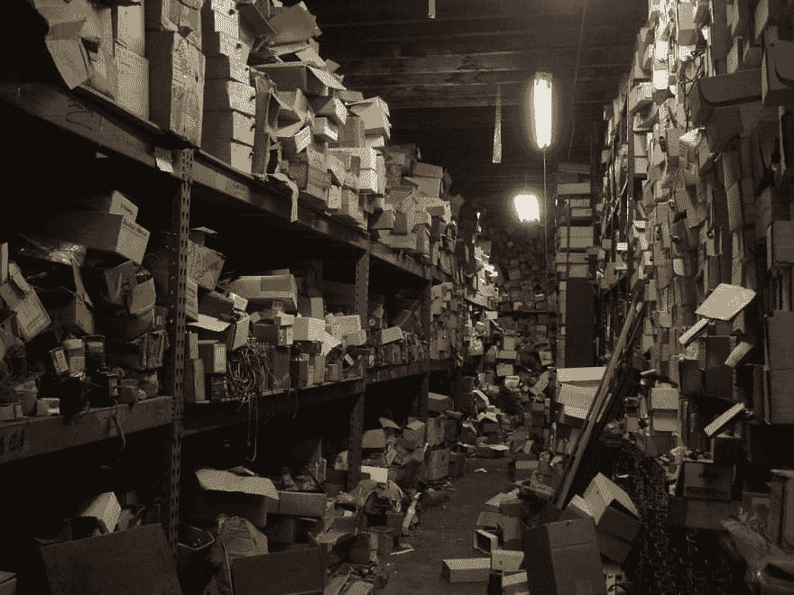

# 组织你的 Unity 项目目录结构！

> 原文:[https://dev . to/koprowski _ it/organize-your-unity-project-directory-structure-13pp](https://dev.to/koprowski_it/organize-your-unity-project-directories-structure-13pp)

整理你的工作场所！Unity devs 没有为这个问题提供任何通用的解决方案。是时候改变了。

与许多开发人员一起参与多个项目让我明白，由于现在最常见的模式是一团乱麻，所以必须开发一些通用的解决方案。仅仅因为文件放错了地方，我就浪费了生命中的几个小时。人们可以认为这只是表面上的改善，或者可以以后再做。但是这个小细节可以改善你的团队工作，节省不必要的混乱。

[T2】](https://res.cloudinary.com/practicaldev/image/fetch/s--cPb8NIeV--/c_limit%2Cf_auto%2Cfl_progressive%2Cq_auto%2Cw_880/https://upload.wikimedia.org/wikipedia/commons/3/39/Messy_storage_room_with_boxes.jpg)

## 将你的文件放在适当的目录中

这是我可以结束的地方，但是……在 Unity 中，我们有一个空的`Assets`文件夹，所以我们可以做任何我们想做的事情。这就是我所说的自由:)但是要负责任！

*   坏主意:把所有东西都放在这个文件夹里，没有任何顺序。
*   好主意:创建一些目录结构
*   最好的想法:创造一个万物皆有其位的宇宙结构

### 但是我该如何准备这样的结构呢？

看看你最近的项目。哪些文件可以打包在一起？你最常用的是哪一种？

也想想你的团队。解决方案应该对每个人都很直观。

我主要从事小项目——场景少，团队成员少。对于更大的游戏，我宁愿调整每个场景/级别或功能的文件。尽管如此，在我的例子中，最好的目录结构如下:

```
|- Assets
    |- Editor //special folder
    |- Resources //special folder
    |- Plugins //special folder
    |- Extensions
    |- Scenes
    |- Scripts
    |- StaticAssets
        |- Animations
        |- Animators
        |- Effects 
        |- Fonts
        |- Materials
        |- Models
        |- Prefabs
        |- Shaders
        |- Sounds
        |- Sprites
        |- Textures
        |- Videos 
```

<svg width="20px" height="20px" viewBox="0 0 24 24" class="highlight-action crayons-icon highlight-action--fullscreen-on"><title>Enter fullscreen mode</title></svg> <svg width="20px" height="20px" viewBox="0 0 24 24" class="highlight-action crayons-icon highlight-action--fullscreen-off"><title>Exit fullscreen mode</title></svg>

这里有所谓的[特殊文件夹](http://docs.unity3d.com/Manual/SpecialFolders.html)的完整列表。从大约一年前开始，我们就在我的团队中使用这种订单，效果很好。我不记得我们需要添加一些新文件夹*(当然我们用一些子文件夹)*

### 自动解

别担心。您不必手动创建所有这些文件夹。我正在创建一些工具来帮助启动新项目。其中一个就是 [Unity 项目树生成器](https://github.com/dkoprowski/UnityProjectTreeGenerator)。

这个小插件将在几分钟内生成提到的目录结构。它还会将`.keep`文件添加到每个文件夹中，因为`git`忽略了空目录。如果你已经有了一个已经创建了结构的项目——没关系——它只会在你没有文件夹的情况下创建新的文件夹。它不会编辑或删除任何内容。

当然，这是你的项目，所以你可以改变你想要的目录树。为此，只需查看`CreateProjectTree`类中的`GenerateDirectory`方法。