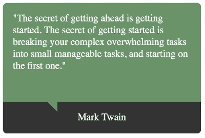

# 用 HTML 和 CSS 创建一个报价框

> 原文:[https://dev . to/mariordev/create-a-quote-box-with-html-and-CSS-281 p](https://dev.to/mariordev/create-a-quote-box-with-html-and-css-281p)

我偶然发现一个网站，在一个盒子里显示一段引文，你知道，在底部有一个小三角形的东西来表示对话或什么的。我从未参与过需要我以这种方式设计报价的项目，所以我很想知道如何创建一个报价。以下是我想出的一个预览:

[T2】](https://res.cloudinary.com/practicaldev/image/fetch/s--RrtUekK9--/c_limit%2Cf_auto%2Cfl_progressive%2Cq_auto%2Cw_880/http://www.mariorodriguez.co/assets/img/posts/quote-box.png)

## HTML

首先，我需要一些标记来设置整个事情。我把所有东西都包装在一个`container`类中，只是为了控制这个演示的大小:

```
<div class="container">

</div> 
```

<svg width="20px" height="20px" viewBox="0 0 24 24" class="highlight-action crayons-icon highlight-action--fullscreen-on"><title>Enter fullscreen mode</title></svg> <svg width="20px" height="20px" viewBox="0 0 24 24" class="highlight-action crayons-icon highlight-action--fullscreen-off"><title>Exit fullscreen mode</title></svg>

然后我为引用添加了一个包装类，我称之为`quote-box` :

```
<div class="container">
    <div class="quote-box">

    </div>
</div> 
```

<svg width="20px" height="20px" viewBox="0 0 24 24" class="highlight-action crayons-icon highlight-action--fullscreen-on"><title>Enter fullscreen mode</title></svg> <svg width="20px" height="20px" viewBox="0 0 24 24" class="highlight-action crayons-icon highlight-action--fullscreen-off"><title>Exit fullscreen mode</title></svg>

然后实际的报价分为两个区域，报价文本和名称，分别由类`quote`和`name`定义:

```
<div class="container">
    <div class="quote-box">
        <div class="quote">
            <blockquote>
                "The secret of getting ahead is getting started. The secret of getting started is breaking your complex overwhelming tasks into small manageable tasks, and starting on the first one."
            </blockquote>
        </div>
        <div class="name">
            Mark Twain
        </div>
    </div>
</div> 
```

<svg width="20px" height="20px" viewBox="0 0 24 24" class="highlight-action crayons-icon highlight-action--fullscreen-on"><title>Enter fullscreen mode</title></svg> <svg width="20px" height="20px" viewBox="0 0 24 24" class="highlight-action crayons-icon highlight-action--fullscreen-off"><title>Exit fullscreen mode</title></svg>

## CSS

我对报价文本和名称应用了一些样式:

```
/* Contain demo size */
.container {
    width: 400px;
}

.quote {
    background-color: #6b936a;
    border-top-left-radius: 8px;
    border-top-right-radius: 8px;
    color: #fff;
    margin: 0;
    padding: 20px;
    font-size: 20px;
}

.name {
    background-color: #333;
    border-bottom-left-radius: 8px;
    border-bottom-right-radius: 8px;
    color: #fff;
    font-size: 20px;
    padding: 20px;
    text-align: center;
}

/* Reset */
blockquote {
    padding: 0;
    margin: 0;
} 
```

<svg width="20px" height="20px" viewBox="0 0 24 24" class="highlight-action crayons-icon highlight-action--fullscreen-on"><title>Enter fullscreen mode</title></svg> <svg width="20px" height="20px" viewBox="0 0 24 24" class="highlight-action crayons-icon highlight-action--fullscreen-off"><title>Exit fullscreen mode</title></svg>

目前没什么特别的。下面是将这个框转换为“报价”框的内容。下面的 CSS 利用边框的行为方式创建了一个三角形的东西。为此，我在引号后创建了一个元素，该元素没有宽度或高度，但有一个粗边框。战略性地设计边框颜色可以创建一个三角形。然后我把这个三角形的一半放在引号下面，就完成了！位置是相对的，因此它可以随着盒子“移动”以响应:

```
blockquote::after {
    border-color: transparent #6b936a transparent transparent;
    border-image: none;
    border-style: solid;
    border-width: 20px;
    top: 40px;
    content: " ";
    display: block;
    right: 75%;
    position: relative;
} 
```

<svg width="20px" height="20px" viewBox="0 0 24 24" class="highlight-action crayons-icon highlight-action--fullscreen-on"><title>Enter fullscreen mode</title></svg> <svg width="20px" height="20px" viewBox="0 0 24 24" class="highlight-action crayons-icon highlight-action--fullscreen-off"><title>Exit fullscreen mode</title></svg>

这是所有的东西。随意改变它，让它成为你的。

在 [CodePen](http://codepen.io) 上看到马里奥·罗德里格斯( [@mariordev](http://codepen.io/mariordev) )的笔 [yObrMv](http://codepen.io/mariordev/pen/yObrMv/) 。

编码快乐！