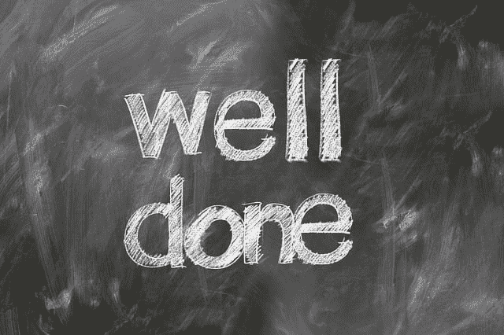
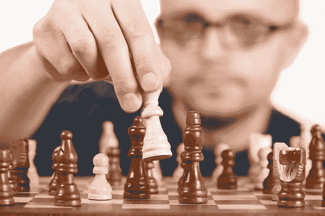
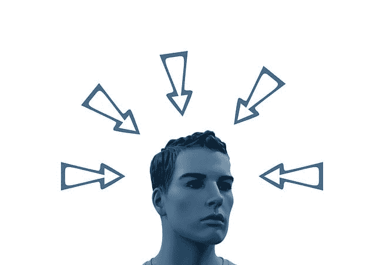

# 提高情商的 11 种最佳方法

> 原文：<https://dev.to/lpasqualis/11-best-ways-to-improve-your-emotional-intelligence>

这篇文章最初发表在 [CoderHood](https://coderhood.com) 上，名为[提高情商的 11 种最佳方法](https://coderhood.com/11-best-ways-to-improve-your-emotional-intelligence/)。CoderHood 是一个致力于软件工程人类层面的博客。

[T2】](https://res.cloudinary.com/practicaldev/image/fetch/s--CjpvLMLV--/c_limit%2Cf_auto%2Cfl_progressive%2Cq_auto%2Cw_880/https://thepracticaldev.s3.amazonaws.com/i/xtcd3lm8yohrps5pz1ej.png)

## 软件工程师和情商

软件工程师很少与情商联系在一起。他们通常被认为是内向的人，倾向于关注内在而不是外在。

这种刻板印象是由于开发人员通常是从孤立地学习编码开始的。这导致了将编码与长时间的独处和专注联系起来。随着时间的推移，事情会发生变化，当在团队中工作并在职业生涯中取得进展时，开发人员需要变得更加社会化和协作化。

该行业的趋势也在变化。软件工程师的平均年龄在增长，随之而来的是工程组织的情感成熟。此外，如今软件随处可见。对于非软件企业来说，创建软件工程团队来改善他们的在线形象是很常见的。在那些组织中，软件工程团队较少以技术为中心，而更多以客户为中心。在那种环境下，情商很重要，很早就成为一种需求。

## 混合模式

情商有很多定义。其中之一是“混合模式”。它是由丹尼尔·戈尔曼博士介绍的，他是《纽约时报》畅销书《情商和社交智能:人类关系的新科学》的作者。"

尽管混合模型的定义受到了批评，但我还是选择了它，因为它在本文的上下文中运行良好。在这篇文章中，作者将情商描述为推动领导力表现的 5 种技能的组合。这些技能是:

*   自我意识:了解自己的情绪、优势、劣势、动力、价值观和目标；认识到他们对他人的影响。
*   自我调节:控制你破坏性的情绪和冲动；适应变化的环境。
*   社交技能:管理你的人际关系，让人们朝着你想要的方向前进。
*   同理心:你意识到他人的感受(尤其是在做决定的时候)
*   动力:你实现目标的动力。

以下是我推荐的 11 条提高情商的建议。

## # 1——假设最好的意图。

[T2】](https://res.cloudinary.com/practicaldev/image/fetch/s--6iPBPJH2--/c_limit%2Cf_auto%2Cfl_progressive%2Cq_auto%2Cw_880/https://thepracticaldev.s3.amazonaws.com/i/q9oiyf69vre1t76oihsy.png)

当你认为其他人有最好的意图时，神奇的事情就发生了。你觉得更安全；你的自我意识会增强，因为你可以专注于自己的情绪状态。你可以更好地控制你的破坏性情绪，并专注于将人们推向理想的方向。如果你没有受到攻击，你会意识到别人的感受，因为你觉得和他们更有联系。

假设最好的意图会让世界变得更友好，让你专注于重要的事情。它消除了不得不提防自己的分心，让你能够关注他人的情绪。

## # 2——生气的时候千万不要发邮件。

[T2】](https://res.cloudinary.com/practicaldev/image/fetch/s--b63HXh38--/c_limit%2Cf_auto%2Cfl_progressive%2Cq_auto%2Cw_880/https://thepracticaldev.s3.amazonaws.com/i/03zyvx80jxsjbe3hbdsi.png)

你知道是怎么回事。你收到一封让你心烦意乱的电子邮件，你开始愤怒地回复邮件。不要这样做！如果你生气的时候发邮件，你会后悔的。根据我的经验，这条规则很少有例外。

这里有一个商业想法 *:创建一个电子邮件编辑器，如果你打字有点太快，并且使用了负面情绪，它会警告你。这样的软件可以挽救很多关系。)*

不要打一个愤怒的答案，做点别的。散散步，吃点零食，或者把邮件标记为你必须回复的事情，然后等几个小时。

无数次，在等待冷静下来后，我意识到我最初误解了信息的含义。如果我回复得快，我的回应就会出格。

在这种情况下，情商是通过自我调节和抵制冲动来锻炼的。此外，你表现出同理心，没有放弃“惩罚让你难过的人”的冲动。此外，不要因为愤怒的回应而树敌，你会提高你的社交技巧。有了一个泰然自若的回答，你就更有可能让你与之交谈的人朝着你选择的方向前进。

## # 3——私下批评，公开表扬。

[T2】](https://res.cloudinary.com/practicaldev/image/fetch/s--CfMs_Dap--/c_limit%2Cf_auto%2Cfl_progressive%2Cq_auto%2Cw_880/https://thepracticaldev.s3.amazonaws.com/i/busmfxtu2jwdiom2eb69.jpg)

如果你需要批评某人，最好私下进行。在公共场合这样做不能让你批评的人挽回面子，并且显示出缺乏情商。

如果你需要表扬某人，就在公共场合。用公开表扬来奖励好的结果会强化积极的行为。它还在该表扬时给予表扬，并向团队表明好人好事不会被忽视。

私下批评，公开表扬会增加你的社交技巧。体现了你的同理心，是社交自我调节的很好展示。

## # 4——让人留面子。

[T2】](https://res.cloudinary.com/practicaldev/image/fetch/s--OfCYLRtY--/c_limit%2Cf_auto%2Cfl_progressive%2Cq_auto%2Cw_880/https://thepracticaldev.s3.amazonaws.com/i/j4uc7qbvinw1282bnij4.jpg)

每当你注意到有人犯了错误，给他们一个挽回面子的机会。接受他们的解释。如果他们道歉，接受道歉。如果他们想出了一个明显的借口，第一次就让它溜走。不要马上叫他们出来，除非不止一次。

放过一个一次性的借口是让他们挽回面子，也显示了良好的社交技巧。如果同一个人一直找借口，那就成了一种模式。模式需要解决，但要私下解决。如果这种趋势继续下去，你可能不得不在公共场合大声说出来，以传达这样的信息:借口是不可接受的。

## 疯狂地赞扬人们的贡献。

[T2】](https://res.cloudinary.com/practicaldev/image/fetch/s--QvMr3TWt--/c_limit%2Cf_auto%2Cfl_progressive%2Cq_auto%2Cw_880/https://thepracticaldev.s3.amazonaws.com/i/s82bmhk7lt1nxicmh6mr.jpg)

想办法对人们所做的积极的事情给予肯定。这样做显示了自我意识和同理心。它还能建立牢固的关系，让你提高社交技能。

如果你意识到你(错误地)因为你没有做的事情而获得了荣誉，一定要纠正这种情况。没有人会原谅你的。这是降低你的社交技能、显示缺乏同理心、自我意识和情商的最快方法。

## # 6——设身处地为别人着想。

[T2】](https://res.cloudinary.com/practicaldev/image/fetch/s--6CVjoeOF--/c_limit%2Cf_auto%2Cfl_progressive%2Cq_auto%2Cw_880/https://thepracticaldev.s3.amazonaws.com/i/9yc3czvf5riybfane4pu.jpg)

要展示情商，你应该设身处地为他人着想。在你说或做某件事之前，试着“感受别人的反应”。想象一下其他人工作的环境，不要破坏这个环境，以此来表达你的同情心。

你所拥有的信息很少是完整的，这样做并取得好的结果可能是困难的。从长远来看，尝试做这件事会对你有帮助。

## # 7——有应变计划。

[T2】](https://res.cloudinary.com/practicaldev/image/fetch/s--PNk4syVz--/c_limit%2Cf_auto%2Cfl_progressive%2Cq_auto%2Cw_880/https://thepracticaldev.s3.amazonaws.com/i/2rov0g14bb78waohi9i6.jpg)

与人交往就像一盘棋。你做的每一个决定和说的每一句话都可能产生不同的影响和后果。

如前所述，如果你要说一些有争议的话，你需要考虑人们可能会有什么反应。对于其中的每一个，都要计划好应对措施和行动，并随时准备使用。你不需要经常使用你的应急计划，但是当你这样做的时候，你会很高兴你花时间去计划它。

## # 8——注意你如何影响他人。

[T2】](https://res.cloudinary.com/practicaldev/image/fetch/s--KXSkwgTp--/c_limit%2Cf_auto%2Cfl_progressive%2Cq_auto%2Cw_880/https://thepracticaldev.s3.amazonaws.com/i/io8u3f64glrzr3bwun54.jpg)

你的一言一行都会对他人产生影响。大多数情况下，这种影响很小；其他时候，它可能是深刻的。试着意识到你的言行对他人的影响，并试着预测会发生什么。提高你意识的一些方法:

*   设身处地为他人着想(如前所述)。
*   通过检查非语言线索和肢体语言来解读房间。
*   注意微表情。
*   在你说了一些可能会对情绪产生影响的话一天或几天后，和别人聊聊。试着理解人们是如何理解这个信息的，以及为什么。
*   寻求反馈，了解他人对你的看法。
*   注意人们与你互动方式的任何变化，并找出引起变化的原因。

## # 9——为你能影响的一切承担责任。

[T2】](https://res.cloudinary.com/practicaldev/image/fetch/s--I0hsLMjR--/c_limit%2Cf_auto%2Cfl_progressive%2Cq_auto%2Cw_880/https://thepracticaldev.s3.amazonaws.com/i/2sgc49vcjibnyeijfbwq.jpg)

为了提高你的情商，你需要对你能影响的任何事情有一个所有权的心态。这可能看起来很极端，但是我发现任何不那么做的事情都会导致找借口。如果你找借口，你会想为自己辩护。那会导致你去责怪别人，而责怪别人降低了你的情商。

完全拥有的心态给你必要的动力和意识，让你在行动和互动中深思熟虑。它让你远离让事情偶然发生，推动你关注细节。

## #10 -听。

[T2】](https://res.cloudinary.com/practicaldev/image/fetch/s--FVy1OCDt--/c_limit%2Cf_auto%2Cfl_progressive%2Cq_auto%2Cw_880/https://thepracticaldev.s3.amazonaws.com/i/shvp53mdn69u2bp1ezdg.jpg)

你的情商和你的倾听技巧成正比。倾听是一个积极的过程，通过它你可以理解你所听到的。对于你所有的人际关系来说，这是一项至关重要的技能。它展示了真诚，没有什么是假设或想当然的。

听不是听话语。它包括五个不同的阶段:

*   感知语言和肢体语言。
*   积极关注。
*   记住这些概念，将它们与其他概念联系起来。
*   思考和推理，在概念之间建立联系和推论。
*   用你自己的单词和句子结构来表达信息。

这五个动作是活动的；它们需要参与和精力。它们不涉及接管谈话或思考接下来要说什么。倾听是关于吸收和理解某人的信息；把它和其他概念联系起来。

## 真正对他人感兴趣。

[T2】](https://res.cloudinary.com/practicaldev/image/fetch/s--najI7Rh---/c_limit%2Cf_auto%2Cfl_progressive%2Cq_auto%2Cw_880/https://thepracticaldev.s3.amazonaws.com/i/plvcv862ftsiofxlc1qq.jpg)

对我来说，人是宇宙中最有趣的东西。在每个人的内心，都有一个完整的现实版本，包含无数的故事、细节、观点、知识、经历、观点、情感、事实、记忆、恐惧、希望、梦想以及任何使一个人成为一个人的东西。

用一生的时间去了解一个人是不够的。每个人，不管他们是谁，做什么，都有东西可以教你。

你对别人越感兴趣，你就越能了解人们。你的情商与你对他人的兴趣成正比。此外，当你对某人感兴趣时，这种兴趣会得到回报，从而巩固你们的关系。

* * *

### 如果你喜欢这篇文章，请保持联系！

*   在 CoderHood 上找到我所有的帖子。
*   在 LinkedIn 上加入我的职业网络。
*   在推特上关注我。
*   加入我的脸书主页。
*   最后，请在 dev.to 上关注我！