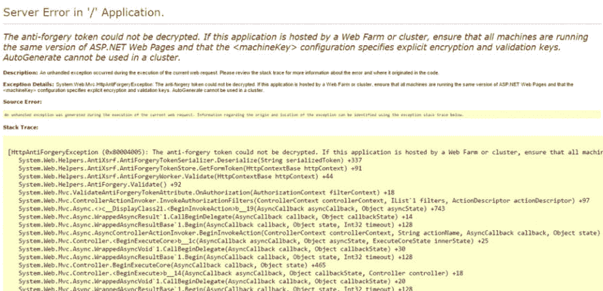
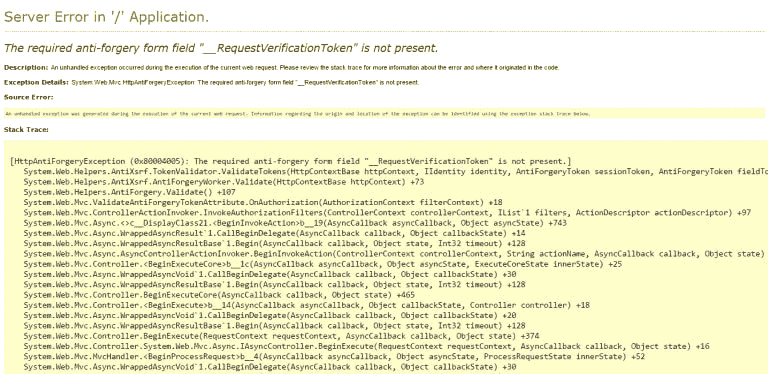

# 创建强制防伪令牌

> 原文:[https://dev . to/alexhyettdev/creating-a-mandatory-防伪令牌-2nfp](https://dev.to/alexhyettdev/creating-a-mandatory-anti-forgery-token-2nfp)

我喜欢 ASP.Net 的一点是，创建一个安全的网站所需的大量艰苦工作已经为你做好了。通常只需要几行代码就可以添加这些特性，这意味着没有理由遗漏重要的安全措施。

## 防伪令牌

其中一个特性是防伪令牌，只需 2 行代码就可以将它添加到你的 MVC 网站中。那么什么是防伪令牌呢？顾名思义，这是一个防止伪造的令牌！就像有人可能伪造签名来伪装成其他人一样，恶意的人也可能伪造对您网站的请求，而不是来自您网站的请求。

我听你说，这是怎么做到的？假设您的网站上有一个表单，用于更改用户的详细信息，如姓名和电子邮件地址，而黑客想将这些更改为其他内容。

黑客可以在另一个网站上创建一个与您的网站所期望的请求相匹配的表单，并发布到同一个 URL。整个表单可以在隐藏字段中，并通过 Ajax 请求在页面加载时发布，使用户看不到它。

如果用户在其他网站发布表单时已经登录到您的网站，您的网站会将其视为有效请求，并将用户详细信息更改为黑客想要的任何信息。

那么我们如何解决这个问题呢？

同样，双因素身份认证也适用于您知道的东西和您拥有的东西。防伪令牌的作用相当于你所拥有的东西(抱歉打了个糟糕的比方)。服务器在您的表单中放置一个带有填充的防伪标记的隐藏字段。当向您的网站发出请求时，服务器会检查防伪标记是否存在，如果不存在或与预期值不匹配，则会发生异常。

由于黑客恶意形式不知道什么是防伪令牌，请求失败。

## 添加防伪令牌

这一切听起来都很棒，那么你该如何添加呢？正如我提到的，您只需要两行代码来添加一个防伪标记，一行在视图中，一行在控制器中。

### 视图

在视图中，您需要在您的帖子表单中添加带有`@Html.AntiForgeryToken()`的防伪标记，如下:

```
@using (Html.BeginForm("Login", "Account", new { ReturnUrl = ViewBag.ReturnUrl }, FormMethod.Post, new { @class = "form-horizontal", role = "form" }))
{ @Html.AntiForgeryToken()
.....
... 
```

<svg width="20px" height="20px" viewBox="0 0 24 24" class="highlight-action crayons-icon highlight-action--fullscreen-on"><title>Enter fullscreen mode</title></svg> <svg width="20px" height="20px" viewBox="0 0 24 24" class="highlight-action crayons-icon highlight-action--fullscreen-off"><title>Exit fullscreen mode</title></svg>

### 控制器

然后，控制器需要将`[ValidateAntiForgeryToken]`添加到 post 动作中。

```
// POST: /Account/Login
[HttpPost]
[AllowAnonymous]
[ValidateAntiForgeryToken]
public async Task<ActionResult> Login(LoginViewModel model, string returnUrl)
{ if (!ModelState.IsValid) { return View(model); } 
```

<svg width="20px" height="20px" viewBox="0 0 24 24" class="highlight-action crayons-icon highlight-action--fullscreen-on"><title>Enter fullscreen mode</title></svg> <svg width="20px" height="20px" viewBox="0 0 24 24" class="highlight-action crayons-icon highlight-action--fullscreen-off"><title>Exit fullscreen mode</title></svg>

如果您查看页面的源代码，您现在应该会在表单中看到以下内容(当然值不同):

`<input name="__RequestVerificationToken" type="hidden" value="JN8mexoJ6sCyfy9TzagXr1DSmjk6au-5VfP9IN_EyLhkWwvd-w2HGJ5EzCW1e_W9nf3wpTQWG_bDgDFFhzLWU8EqAb_8uQtXTwvojSTe3541">`

好了，让我们通过改变这个隐藏字段中的值来测试它，看看会发生什么。`<input name="__RequestVerificationToken" type="hidden" value="bad token">`[T3】](///static/944d3989e7802c6e44906605e3f48798/2bef9/anti-forgery_exception.png)

如上所示，我们得到了预期的异常，即防伪标记无法被解密。在生产中，您将打开自定义错误，这样用户将看到一个漂亮的错误消息，而不是本身就很危险的堆栈跟踪。

## 强制使用防伪标识

正如你可能已经从这篇文章的标题中猜到的，我们还没有完成。如果你在一个团队中工作，有人可能会忘记将防伪标记添加到他们的新视图和操作中。那么，如果您忘记将令牌添加到视图中，会发生什么呢？

[T2】](///static/90fe723e879930ec52cd810a8469accb/e5715/anti-forgery-not-present-exception.png)

正如您所料，您会得到一个异常，指出令牌丢失。很好，但是如果您忘记将 ValidateAntiForgeryToken 添加到操作中会发生什么呢？

没什么。没有例外。它只是允许它通过。

假设您必须为每个 post 操作添加一个属性，那么可以想象可能会遗漏一个属性。我们可以通过做两件事来缓解这个问题:

1.)使用 BeginForm 的 HTML Helper 扩展来始终添加令牌。2.)编写一个单元测试来检查每个 Post 操作是否存在 ValidateAntiForgeryToken。

那么我们如何做到这一点:1。)使用 BeginForm 的 HTML Helper 扩展创建 HTML Helper 扩展我们将创建一个名为 HtmlExtensions 的新类，并将其放在我们项目的某个位置。然后你需要添加下面的方法:

```
public static MvcForm BeginFormWithToken( this HtmlHelper htmlHelper, string actionName, string controllerName, object routeValues, FormMethod method, object htmlAttributes)
{
    var form = htmlHelper.BeginForm(actionName, controllerName, routeValues, method, htmlAttributes);
htmlHelper.ViewContext.Writer.WriteLine(htmlHelper.AntiForgeryToken());
    return form;
} 
```

<svg width="20px" height="20px" viewBox="0 0 24 24" class="highlight-action crayons-icon highlight-action--fullscreen-on"><title>Enter fullscreen mode</title></svg> <svg width="20px" height="20px" viewBox="0 0 24 24" class="highlight-action crayons-icon highlight-action--fullscreen-off"><title>Exit fullscreen mode</title></svg>

现在我只为上面显示的 BeginForm 方法创建了一个，但是您可能想要为您使用的每个其他重载创建一个。然后，您需要仔细检查您的每个视图，并将 begin format 更改为 BeginFormWithToken。因此，现在我们有防伪标记被添加到每一个形式。

2.)编写一个单元测试来检查 ValidateAntiForgeryToken 是否存在。为此，我们必须使用反射来查找所有带有 HttpPost 的控制器操作，并检查它们是否存在 ValidateAntiForgeryToken。在下面的示例中，您需要将 MyWebApplication 更改为您的 Web 项目的名称。

```
[TestMethod]
public void TestValidateAntiForgeryTokenAttributeOnAllPostActions()
{
    // Act
    var actions = Assembly.Load("MyWebApplication").GetTypes()
                        .Where(t => typeof(Controller).IsAssignableFrom(t))SelectMany(type => type.GetMethods()).Where(method => method.IsPublic &&
                        method.GetCustomAttributes(typeof(HttpPostAttribute), true).Any() &&
                        !method.GetCustomAttributes(typeof(ValidateAntiForgeryTokenAttribute), true).Any()).ToList();
    // Assert
    Assert.IsFalse(actions.Any(), actions.Any() ? $"The action '{actions[0].Name}' in the '{actions[0].DeclaringType.Name} ' controller is missing the ValidateAntiForgeryToken attribute." : string.Empty);
} 
```

<svg width="20px" height="20px" viewBox="0 0 24 24" class="highlight-action crayons-icon highlight-action--fullscreen-on"><title>Enter fullscreen mode</title></svg> <svg width="20px" height="20px" viewBox="0 0 24 24" class="highlight-action crayons-icon highlight-action--fullscreen-off"><title>Exit fullscreen mode</title></svg>

如果任何操作缺少 validate 属性，该测试将失败，并将给出第一个违规者的名字。请随意修改。例如，您可能希望让它打印出所有缺少防伪标记属性的操作。

如果这篇文章有帮助，请在下面留下评论。