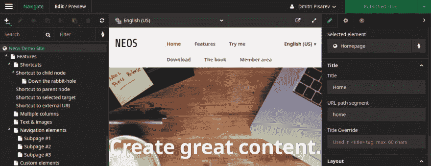
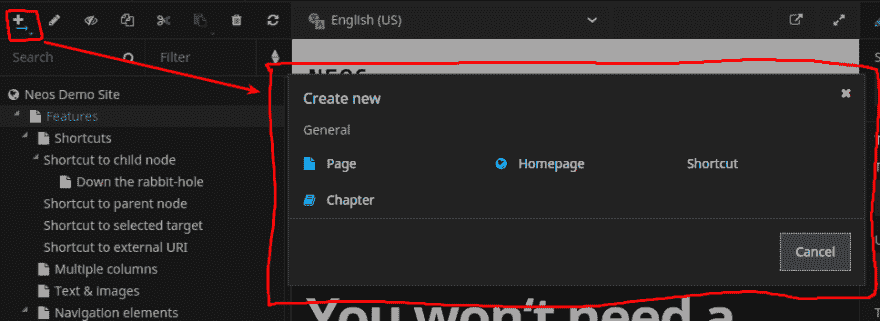

# Neos CMS 使用 React 和 Redux 进行了全面的用户界面重写

> 原文：<https://dev.to/dimaip/neos-cms-goes-for-a-full-ui-rewrite-with-react-and-redux-35d0>

Neos 是一个现代化的内容管理系统，以其灵活性和易用性而闻名。在项目背后，我们有 19 名活跃的团队成员，分布在 3 个敏捷团队中，总共有 85 名项目贡献者，如果您曾经参观过 Neos 活动或代码冲刺，您很快就会发现我们更像一个家庭，而不是一个公司。事实上，当大型开放源码项目没有任何商业公司支持时，Neos 是一个罕见的案例。

*Neos 当前 UI*

但是不要担心，我不会在文章的剩余部分崇拜我们的产品或者描述它的所有特性(尽管它完全值得拥有)。

我有一些其他的故事要告诉你，即**我们如何用 React、Redux 和 2016** 的其他现代和闪亮的 JS 堆栈来重写 Neos UI。

网络上充满了 Redux 教程和很棒的学习材料，但是**很难找到像我们这样规模的真正的开源项目用现代 JS 栈**编写(哦，我忽略了 [Calypso](https://github.com/Automattic/wp-calypso) 也使用 Redux，虽然它有 flux)。在这篇文章中，我将尝试同时做两件事:向您简要介绍我们的代码库，以及我们选择的堆栈部分背后的一些理论。请注意，**我们目前正处于重写的最开始，所以你将看到的代码是正在进行中的工作**。

## 决定

进行完整的 UI 重写并不是一个容易做出的决定。你看，现在我们有了内容管理世界中最直观的用户界面之一，大部分是稳定和完整的。它是用 EmberJS 1.x 编写的，在当时来说构建得相当整洁。但是随着时间的推移，事情开始失控，复杂性成倍增加，开发新的界面功能的成本越来越高。触摸它的一部分可能会在其他最不重要的地方适得其反，我们没有接口测试，所以重构也不容易，整个事情不再觉得可预测和有趣。最后一次下降是升级到 Ember 2.x 的困难，在这段时间里有太多的事情发生了变化，我们想重新考虑多种事情。

为了评估这一决定，两位令人惊叹的核心团队开发人员，威廉·贝恩克(Wilhelm Behncke)和 T2(Tyll Wei)花了几天时间秘密建造了一个概念验证原型，这能够说服团队的其他成员我们应该去做。

上周，我们在德累斯顿进行了一次代码冲刺，更多的开发人员加入了重写工作，现在我们有 6 个人( [@WilhelmBehncke](https://twitter.com/WilhelmBehncke) 、[、@inkdpixels](https://twitter.com/inkdpixels) 、[、@DerGerDner](https://twitter.com/DerGerDner) 、[、@skurfuerst](https://twitter.com/skurfuerst) 、 [@MarkusGoldbeck](https://twitter.com/MarkusGoldbeck) 和 [me](https://twitter.com/dimaip) )正在积极地工作，还有大约 5 个人感到兴趣并希望加入我们的工作。

## 假设这是一个教程…

 

*我们要实现的 AddNodeModal 对话框*

我会尽量让代码演练看起来更像一个教程。作为一种辅导作业，我将使用上周我正在研究的功能。**我们的任务是为创建节点**(即 Neos 中的页面或内容元素)创建一个对话框，它将为您提供允许在给定位置创建的所有可能的页面类型的选择，并最终将命令发送到服务器 API，创建所选类型的新节点。姑且称之为`AddNodeModal`。

<aside>

警告！本演练假定您知道一些 React 和 Redux 的基本知识，不会帮助您从零开始。

</aside>

### 反应成分

<aside>

我们所有的 React 组件分为两种类型:**表示组件**和**容器组件**。表示组件是界面上可重用的小部件，比如按钮、模态、图标甚至树。表示组件被封装到容器组件中，容器组件提供更专用的应用程序逻辑，这通常不意味着是可重用的。容器可以通过[react-redux](https://github.com/reactjs/react-redux)@ connect decorator 连接到应用状态。通常，它们不直接呈现数据，而是将数据传递给表示组件。

</aside>

因此，要呈现我们的 AddNodeModal，我们需要几个组件:对话框、按钮、图标、标题和网格(将按钮很好地布局到多行中)。幸运的是，其他人已经创建了所有需要的组件，所以我们可以从现有的组件中玩一点乐高来组成我们的 UI。

[AddNodeModal 容器组件](https://github.com/PackageFactory/PackageFactory.Guevara/blob/9e06fdd96c1627a262c42b8405c1f128de972fa4/Resources/Private/JavaScript/Host/Containers/AddNodeModal/index.js)

### 状态

<aside>

切换到这个新堆栈的主要原因是希望给 UI 更多的可预测性和完整性。你看，我们的情况有点复杂，因为我们有分布在多个地方的相同数据:导航树、内联编辑等。之前，我们没有统一的数据模型，所有这些模块都独立运行，通过一些状态同步代码小心翼翼地粘合在一起。是的，那是一场噩梦。这就是为什么从一开始我们就把所有的数据清晰地规范化并存储在状态中。但是这不仅包括内容数据，还包括 UI 本身的状态:所有的树、面板、用户偏好等等现在在应用程序状态中都有一个专门的位置。

</aside>

对于我们的 AddNodeModal，我们需要在状态中存储两个东西:引用节点(相对于它创建新节点)和插入模式(inside、before、after)。让我们将这两个值存储在状态内部的`UI.AddNodeModal.referenceNode`和`UI.AddNodeModal.mode`处。当我们将某个节点放入`referenceNode`时，我们的对话框就会出现，一旦我们清除了那个值，对话框就会消失。

### 减速器

<aside>

Redux 背后的想法是将应用程序状态加入到一个单一的状态树中，并通过一个无副作用的函数来操作它，该函数基于描述我们想要应用于它的操作的动作来获取以前的状态并返回新的状态。为了模块化，减速器可以分成多个减速器。状态本身保存在存储中而不是还原器中，还原器只是一个简单的函数，记得吗？操纵状态的动作可以比作 CQRS 中的 C(命令)(命令-查询责任分离)。您可以记录并稍后重放动作，以获得一种事件源。

为了有效地操作状态，我们使用了自己名为 plow-js 的库，它带有函数式编程的味道。看看吧，真的很酷！您可能已经注意到，我们没有在 reducers 中使用常见的 switch 语句块，而是通过 map 处理程序来描述它们。没什么特别的，只是我们的口味偏好。

</aside>

因此，为了操纵状态，我们需要创建一个 reducer 来处理两个动作:打开和关闭。打开会将`referenceNode`和`mode`设置为提供的值，关闭会清除`referenceNode`的值，关闭对话框。目前为止没什么困难，对吧？

[UI。添加模态减速器](https://github.com/PackageFactory/PackageFactory.Guevara/blob/9e06fdd96c1627a262c42b8405c1f128de972fa4/Resources/Private/JavaScript/Host/Redux/UI/AddNodeModal/index.js)

### 选择器

<aside>

一般建议将数据保持在正常状态，就像在关系数据库中一样。这样就更容易操作它，而不用担心数据的某些部分不同步。但是通常您需要从州内的多个地方收集数据，这时选择器就来帮忙了。选择器是获取状态并返回所需部分的函数。我们使用一个非常好的选择器库，叫做 reselect。它可以帮助你通过组合简单的选择器来创建更复杂的选择器，也可以通过自动记忆来提高选择器的性能。

</aside>

我们从州政府那里得到`referenceNode`和`mode`没有困难，但是现在我们面临更大的挑战。我们需要为引用节点和模式获取一个允许的节点类型列表。为此，我们需要组合来自状态中多个地方的数据:nodeType 数据、nodeType 约束、referenceNode、模式、给定 referenceNode 的父节点和祖父节点等等。但这还不是全部，现在我们需要对允许的节点类型进行分组，并按正确的顺序进行排序。你看，相当复杂的逻辑由多个简单的选择器组成，每个选择器都需要独立的测试和性能优化。

所以我们得到了允许的节点类型列表，很好地进行了分组和排序。现在是时候给它们添加一些行为来创建节点了。

[约束选择器](https://github.com/PackageFactory/PackageFactory.Guevara/blob/9e06fdd96c1627a262c42b8405c1f128de972fa4/Resources/Private/JavaScript/Host/Selectors/CR/Constraints/index.js)

### 副作用

<aside>

Redux 架构主要关注客户端状态，不考虑影响，比如对服务器的异步请求。这里没有关于最佳实践的共识，但是对于我们的例子，我们选择了 [redux-saga](https://github.com/yelouafi/redux-saga) 库。它使用发电机，乍看之下很花哨，但我们在使用它的过程中发现了最大的自由。基本上，它会等待你的某个动作发生，然后执行一些代码，这些代码可能是异步的，会触发其他动作。

</aside>

我们有一个漂亮的新服务器 API 来描述我们想要在服务器上执行的操作。我们想要采取的任何行动都被编码为一个变更对象，例如`Create`、`Move`、`Property`等等。对于我们创建节点的任务，我们需要基于`mode`状态在动作`Create`、`CreateAfter`和`CreateBefore`之间进行选择。在我们构造了正确的变更对象后，我们需要将它作为参数发送给`Changes.add`动作创建者，它将被 changes saga 透明地拾取并发送给服务器上正确的 API 端点。成功时 saga 触发一个`FINISH`动作，失败时`FAIL`。

[变化传奇](https://github.com/PackageFactory/PackageFactory.Guevara/blob/9e06fdd96c1627a262c42b8405c1f128de972fa4/Resources/Private/JavaScript/Host/Redux/Sagas/Changes/index.js)

### 测试

不言而喻，我们必须用测试至少覆盖代码库的关键部分。在给定的任务中，我们必须测试归约器、选择器、组件本身，可能还有 sagas。最关键的部分是减速器和选择器，它们最容易测试，毕竟它们只是一个纯函数:传递一些输入，期望一些输出！为了用行为风格写断言，我们使用柴。为了在真正的浏览器中运行它们，我们使用 Karma。对于验收测试，我们使用硒。我还没有写完这个特性的验收测试，所以一旦我有一些代码要展示，我会更新这篇文章。

因此，我希望这能让你对我们如何将核心 React & Redux 架构原则应用于我们的应用有所了解。请随意浏览代码库的其余部分，我相信您会在那里找到许多有趣的东西。

## 尼奥斯家族

如果你一直和我在一起，你可能会对项目本身感兴趣，而不仅仅是我们使用的技术。正如一些非常聪明的人[所说的话](https://blog.engineyard.com/2014/open-source-software-contribution) , **开源产品如果没有背后的人**就什么都不是。我们在这里真的很幸运:我们不仅仅是分散在全球各地的书呆子，我们也不是一些企业付钱让我们编写代码的雇员。我们是一个朋友的社区，几乎是一个家庭。[我们定期组织代码冲刺](http://dimaip.github.io/2014/10/05/the-code-sprint/)，不仅一起编码，还分享我们在生活中被给予的所有美好事物，无论是夜晚在易北河上的散步还是激光枪战游戏。

如果你喜欢我们的代码，就来加入我们吧！我们有很多代码要一起写，但是，最终，它不会就此停止，让我们成为朋友吧！

[加入项目！](https://www.neos.io/join/contribute.html)

**如果你有朋友可能对此感兴趣，请回复这个东西**:

> [@neoscms](https://twitter.com/neoscms) 全力进行[# react js](https://twitter.com/hashtag/reactjs?src=hash)/[# redux](https://twitter.com/hashtag/redux?src=hash)UI 重写，你也可能从中有所收获！[https://t.co/UiSEW7tH5e](https://t.co/UiSEW7tH5e)
> 
> —迪米特里·皮萨列夫([@迪迈普](https://dev.to/dimaip))[2016 年 3 月 14 日](https://twitter.com/dimaip/status/709265663328702464)

现在一些推特媒体证明这一切都是真实的！=)

> React.js Workshop 由 [@sitegeist_de](https://twitter.com/sitegeist_de) 在 [#neoscms](https://twitter.com/hashtag/neoscms?src=hash) 代码冲刺上赞助。去吧， [@inkdpixels](https://twitter.com/inkdpixels) ！[pic.twitter.com/NSKWdu3BeD](https://t.co/NSKWdu3BeD)
> 
> ——wilhelmbehncke(@ wilhelmbehncke)[2016 年 3 月 7 日](https://twitter.com/WilhelmBehncke/status/706817768499318784)

> Florian 带着 sprint 的参与者在德累斯顿进行了一次很酷的旅行——编码和教育可以很好地结合在一起！~ TG[pic.twitter.com/rTyvlUu715](https://t.co/rTyvlUu715)
> 
> —近地天体项目(@ Neos CMS)[2016 年 3 月 8 日](https://twitter.com/neoscms/status/707342534704558080)

> 早起的鸟儿已经在工作了！很高兴各位来到 pic.twitter.com/HAoq26GebQ :D 的德累斯顿
> 
> —沙尘暴(@沙尘暴媒体)[2016 年 3 月 9 日](https://twitter.com/sandstormmedia/status/707484157056667648)

> 代码冲刺的第三天。了不起的东西和了不起的人！我们开始吧！:)[# OSS](https://twitter.com/hashtag/oss?src=hash)【pic.twitter.com/r1erZYQsV8】T4
> 
> —inkd pixels(@ inkd pixels)[2016 年 3 月 9 日](https://twitter.com/inkdpixels/status/707506151030693888)

> 看到这么多(新)开发人员致力于新的 [#neoscms](https://twitter.com/hashtag/neoscms?src=hash) UI 技术堆栈，令人兴奋...它正在成形！pic.twitter.com/9POKUXrDPT
> 
> —罗伯特·莱姆克(@罗伯特·莱姆克)[2016 年 3 月 9 日](https://twitter.com/robertlemke/status/707519911388643328)

> 阳光黑客在一个好地方由[@ sandersm media](https://twitter.com/sandstormmedia)赞助和组织——谢谢你们！pic.twitter.com/1U16FlSqyi[# neoscms](https://twitter.com/hashtag/neoscms?src=hash)
> 
> —罗伯特·莱姆克(@罗伯特·莱姆克)[2016 年 3 月 9 日](https://twitter.com/robertlemke/status/707570179564249088)

> 和团队一起玩 Lasertag，度过了一个美妙的夜晚！这个 [#NeosCMS](https://twitter.com/hashtag/NeosCMS?src=hash) 冲刺太棒了！~ TG pic.twitter.com/0avtjTSx0z
> 
> —近地天体项目(@ Neos CMS)[2016 年 3 月 9 日](https://twitter.com/neoscms/status/707691612688814081)

> 复古进行的如火如荼，有三个团队成员远程加入。到目前为止对我来说相当鼓舞人心。[# neoscms](https://twitter.com/hashtag/neoscms?src=hash)【pic.twitter.com/nHjOtrWgvW T2】
> 
> —罗伯特·莱姆克(@罗伯特·莱姆克)[2016 年 3 月 10 日](https://twitter.com/robertlemke/status/707870782651817984)

> 自从我们上次去 pic.twitter.com/GFPnVFPjZKT2 以来，发生了很多好事
> 
> —罗伯特·莱姆克(@罗伯特·莱姆克)[2016 年 3 月 10 日](https://twitter.com/robertlemke/status/707871782481567745)

> 非常好的回顾展，我非常喜欢！pic.twitter.com/Nh4BRrA8lr
> 
> ——sebastian kur prince([@ skunrfer first](https://dev.to/skurfuerst))[2016 年 3 月 10 日](https://twitter.com/skurfuerst/status/707880951083352064)

> [@沙尘暴 _tobi](https://twitter.com/sandstorm_tobi) 分享我们对 [#neoscms](https://twitter.com/hashtag/neoscms?src=hash) 愿景的想法！pic.twitter.com/BhsUMIXtoU[# codesprint](https://twitter.com/hashtag/codesprint?src=hash)
> 
> ——sebastian kur prince([@ skunrfer first](https://dev.to/skurfuerst))[2016 年 3 月 10 日](https://twitter.com/skurfuerst/status/707953618603941889)

> 感谢所有参加过冲刺的人，一路平安。pic.twitter.com/pWKp8OeHjV[#新族](https://twitter.com/hashtag/neosFamily?src=hash)[#精灵](https://twitter.com/hashtag/spirit?src=hash)
> 
> ——sebastian kur prince([@ skunrfer first](https://dev.to/skurfuerst))[2016 年 3 月 11 日](https://twitter.com/skurfuerst/status/708277258042130432)