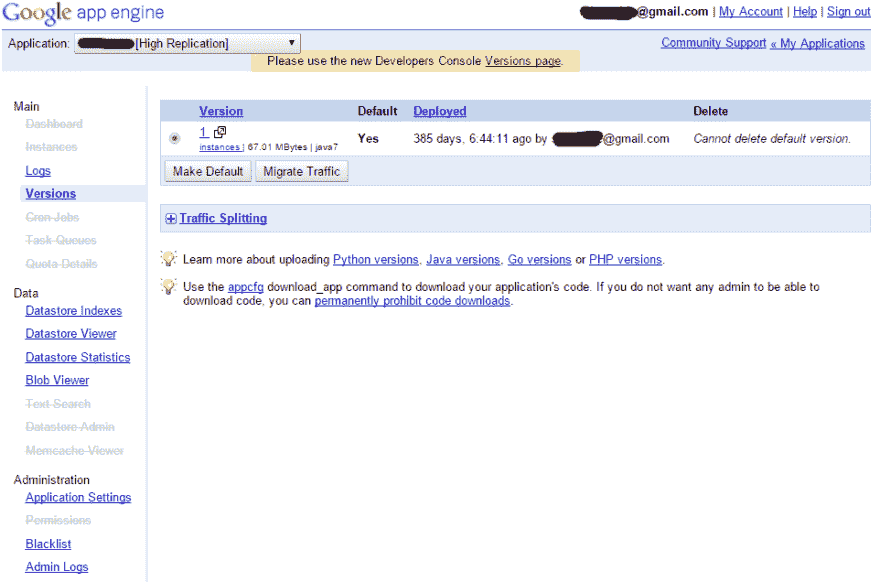

# 从 Google 应用引擎迁移

> 原文:[https://dev . to/stipegrbic/migrating-from-Google-app-engine-4nji](https://dev.to/stipegrbic/migrating-from-google-app-engine-4nji)

最初于 2016 年 2 月 26 日发布于 stipe.xyz

正如你可能已经在我的第一篇[博客文章](https://dev.to/stipegrbic/sending-push-notifications-with-google-app-engine-50io)中读到的，我在 Google App Engine 上构建了一个推送通知服务器。那是将近三年前的事了，当时我觉得用 Java 构建一个服务器，部署在谷歌的服务上，而且不用为此支付一分钱，这看起来很不错。最近出现了一些需求，虽然我不想做整个服务迁移的工作，但我最终还是做了。在这里，我将写下发生这种情况的原因，以及我是如何安全简单地做到这一点的。

### 开始

有一个服务器，服务器为用户提供推送通知，服务器经常会超过谷歌应用引擎的配额。看看这一页，有这么多的限制，真的很难想象你会碰到哪一个。例如，有时我会遇到数据存储操作限制。设置为每天 50000 次操作。现在，您可能认为一次数据存储操作就是一次数据库读/写操作，但您错了。在[这一页](https://cloud.google.com/appengine/pricing)上有一个表格详细描述了它，但是同样，这是一个很难计算你可以免费获得多少请求的时间。在修复问题并尝试最小化数据库操作数时，我注意到了一个注意事项:

> 数据存储管理员和数据存储查看器生成的数据存储操作计入您的应用程序配额。

这意味着只需浏览管理仪表板中的数据就可以让你的应用程序超出配额限制。不是很好，但你能做什么，我知道谷歌必须从数据库中为管理员和用户获取数据。与此同时，我设法将数据存储操作保持在配额之下，并学会了不要过多地手动浏览数据。

### 害怕配额

有一段时间一切都很好，直到应用程序获得更多用户并达到另一个极限，这次是每分钟 3000 个 HTTP 请求。虽然当应用程序达到极限时，让它休眠一分钟并不难，但现在我真的很害怕配额，看着我下一个要达到哪个配额。现在你可能会说，我甚至可以在实现服务之前更好地研究配额，但只要再看看配额和定价页面，对于一个正在开发的应用程序来说，知道所有这些数字来计算定价是不可能的。另一个评论可能是为什么不付钱——仅仅是因为我不想为我不需要的东西付钱。整个服务器是一个基本的东西，我相当适应它的行为，以保持它在自由层。我把这理解为我作为爱好项目所做的工作的报酬，我喜欢这种感觉胜过为没有做我喜欢做的事情——软件开发——而付钱。

### 技术

让我写一些关于应用引擎技术的事情。虽然本质上它是 Java，但 Google 在其中引入了不少自己的原则。例如，我不得不使用自己的 URL 获取服务进行简单的 HTTP 请求。这意味着同样的东西在您的本地环境中可以正常工作，但在生产中会失败。另一个大的新事物是[谷歌查询语言](https://cloud.google.com/datastore/docs/concepts/gql)(哦，名字)，它不是完整的 SQL，有严重的局限性。再说一次，由于我的服务不是那么特别和先进，我可以适应和使用强加的技术。

### 现在怎么办

快进到一个月前，我需要在服务器上实现一个新的 API。我知道谷歌应用引擎发生了一些事情，因为仪表板看起来不像以前一样，一些菜单项被交叉，并有切换到新仪表板的注释。我知道有相当多的变化，它被更名为谷歌云平台。好吧，我对所有的变化都不感兴趣，我只想实现新的功能。所以我试图部署新版本，但它根本不工作，几年前写的教程今天不工作，也没有迁移指南。这样做了，我决定远离整个事情，从头开始实现它，并把它部署在我能更好控制的地方。

[T4】](https://res.cloudinary.com/practicaldev/image/fetch/s--LB00_E0e--/c_limit%2Cf_auto%2Cfl_progressive%2Cq_auto%2Cw_880/http://stipe.ximg/GAE.png)

### 再 Node.js

当我最近玩 Node.js 时，决定很简单。对于一个服务于相当多的请求、没有内部处理需求并且我可以相当快地实现的服务，Node.js 看起来是自然的选择。事实上，我用几天的空闲时间开发了一个服务。我决定在 OpenShift 上部署它，因为它提供了简单易懂的定价和部署文档。我承认，由于不兼容的节点模块，在生产中出现了一些问题，但是我设法解决了这些问题，并且了解了版本控制的重要性。

### 迁移计划

关于如何将数据从一个平台迁移到另一个平台，我有几个选择，但由于我无法再部署到 App Engine，我必须首先考虑重新创建数据。所以这就是我所做的，所有的客户端必须把它的数据发送到新的服务器，并从旧的服务器上删除。幸运的是，我在旧服务器上实现了删除端点，这样用户就不会从两个服务器上都收到通知。在第一周，只有我使用新移植的客户端来查看是否有新的问题出现。之后，随着用户数量的上升，我一个接一个地向公众发布了客户端应用。现在已经是完全迁移后的一周了，我能说的就是一切正常，我很高兴服务器比在 App Engine 上得到更多的控制。