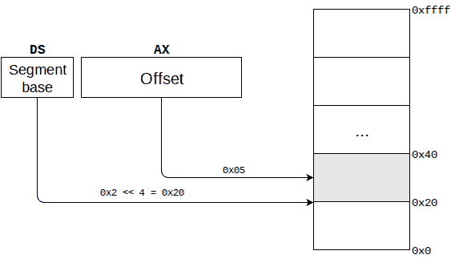
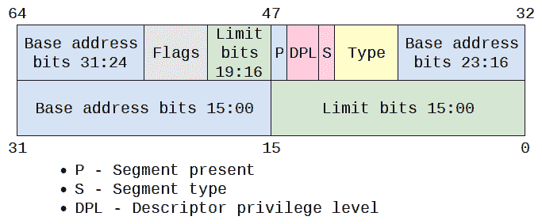
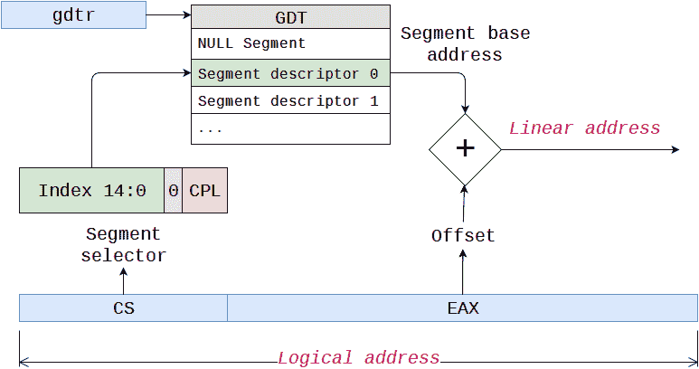

# 操作系统分段

> 原文:[https://dev.to/dzeban/os-segmentation-34l1](https://dev.to/dzeban/os-segmentation-34l1)

之前，我已经启动了[普通的多重启动内核](https://dev.to/blog/multiboot/)。尽管这真的很有趣，但我需要的不仅仅是在屏幕上显示一封信。我的目标是用 Unix 就绪的用户空间编写一个简单的内核。

过去几个月我一直在写我的内核(断断续续)，在 [OSDev wiki](http://wiki.osdev.org) 的帮助下，我得到了一个基于[肉骨架](http://wiki.osdev.org/Meaty_Skeleton)的相当不错的内核，现在我想更进一步。但是去哪里呢？我的里程碑是让键盘输入工作起来。这将需要工作中断，但这不是要做的第一件事。

根据多重引导规范，在引导装载程序将控制权传递给我们的内核之后，除了 3 件事之外，机器处于相当合理的状态(引用第 [3.2 章)。机器状态](https://www.gnu.org/software/grub/manual/multiboot/html_node/Machine-state.html#Machine-state)):

*   ESP' -操作系统映像必须在需要时立即创建自己的堆栈。
*   GDTR' -即使段寄存器如上所述设置，GDTR 可能是无效的，因此操作系统映像不得加载任何段寄存器(即使只是重新加载相同的值！)直到它建立了自己的‘GDT’。
*   IDTR 的操作系统映像必须禁用中断，直到它建立自己的 IDT。

建立一个堆栈很简单-你只需把 2 个标签除以你的堆栈大小。[在《九头蛇》中是 16 岁的 KiB](https://github.com/dzeban/hydra/blob/86b67dfe27001a9f21de64307eb6ec3395aecddd/arch/i386/boot.S#L15-L19) :

```
# Reserve a stack for the initial thread.
.section .bootstrap_stack, "aw", @nobits
stack_bottom:
.skip 16384 # 16 KiB
stack_top: 
```

<svg width="20px" height="20px" viewBox="0 0 24 24" class="highlight-action crayons-icon highlight-action--fullscreen-on"><title>Enter fullscreen mode</title></svg> <svg width="20px" height="20px" viewBox="0 0 24 24" class="highlight-action crayons-icon highlight-action--fullscreen-off"><title>Exit fullscreen mode</title></svg>

接下来，我们需要设置分段。我们必须在设置中断之前这样做，因为每个 IDT 描述符门必须包含一个目的代码段的段选择器——一个我们必须设置的内核代码段。

然而，它几乎肯定会工作，即使没有设置 GDT，因为多重引导引导程序设置它自己，我们离开了它的配置，通常会设置平面内存模型。例如，下面是 legacy grub 设置的 GDT:

| 索引 | 基础 | 大小 | DPL | 信息 |
| --- | --- | --- | --- | --- |
| 00(选择器 0x0000) | `0x0` | `0xfff0` | Zero | 不用的 |
| 01(选择器 0x0008) | `0x0` | `0xffffffff` | Zero | 32 位代码 |
| 02(选择器 0x0010) | `0x0` | `0xffffffff` | Zero | 32 位数据 |
| 03(选择器 0x0018) | `0x0` | `0xffff` | Zero | 16 位代码 |
| 04(选择器 0x0020) | `0x0` | `0xffff` | Zero | 16 位数据 |

这对于纯内核模式很好，因为它有 32 位的代码段和大小为 2 <sup>32</sup> 的数据段，但没有 DPL=3 的段，也没有我们不想要的 16 位代码段。

但是依赖未定义的值实在是太愚蠢了，所以我们自己设置分段。

## x86 上的分割

分段是 x86 CPUs 中使用的一种技术，用于扩展可用内存量。根据 CPU 模式，有两种不同的分段模型——真实地址模型和受保护模型。

### 在实模式下分割

实模式是一种 16 位 Intel 8086 CPU 模式，这是一种处理器在复位时开始工作的模式。对于 16 位处理器，你最多可以寻址 2 <sup>16</sup> = 64 KiB 的内存，即使在 1978 年，这也是太小了。于是 Intel 决定把地址空间扩展到 1 MiB，把地址总线做成 20 位宽(`2` <sup>`20`</sup> `= 1048576 bytes = 1 MiB`)。但是你不能用 16 位寄存器寻址 20 位宽的地址空间，你必须将你的寄存器扩展 4 位。这就是细分的用武之地。

分段的思想是将地址空间组织成称为段的块，其中来自 16 位寄存器的地址将是段中的偏移量。

对于分段，使用 2 个寄存器来寻址内存:分段寄存器和表示偏移量的通用寄存器。线性地址(将在 CPU 的地址总线上发出的地址)是这样计算的:

```
Linear address = Segment << 4 + Offset 
```

<svg width="20px" height="20px" viewBox="0 0 24 24" class="highlight-action crayons-icon highlight-action--fullscreen-on"><title>Enter fullscreen mode</title></svg> <svg width="20px" height="20px" viewBox="0 0 24 24" class="highlight-action crayons-icon highlight-action--fullscreen-off"><title>Exit fullscreen mode</title></svg>

[T2】](https://res.cloudinary.com/practicaldev/image/fetch/s--57qbiHKo--/c_limit%2Cf_auto%2Cfl_progressive%2Cq_auto%2Cw_880/https://alex.dzyoba.com/img/real-mode-segmentation.png)

注意，在这个公式中，由你来选择分段的大小。唯一的限制是段的大小至少为 16 字节，由 4 位移位表示，最大 64 KiB 由`Offset`大小表示。

在上面的例子中，我们使用了**逻辑地址** `0x0002:0x0005`，这给了我们**线性地址** `0x00025`。在我的例子中，我选择使用 32 字节的段，但这只是我的想法——我选择如何构造逻辑地址。用分段来表示同一个地址有很多种方式:

```
0x0000:0x0025 = 0x0 << 14 + 0x25 = 0x00 + 0x25 = 0x00025
0x0002:0x0025 = 0x2 << 14 + 0x25 = 0x20 + 0x25 = 0x00025
0xffff:0x0035 = 0xffff0 + 0x35 = 0x100025 = (Wrap around 20 bit) = 0x00025
0xfffe:0x0045 = 0xfffe0 + 0x45 = 0x100025 = (Wrap around 20 bit) = 0x00025
... 
```

<svg width="20px" height="20px" viewBox="0 0 24 24" class="highlight-action crayons-icon highlight-action--fullscreen-on"><title>Enter fullscreen mode</title></svg> <svg width="20px" height="20px" viewBox="0 0 24 24" class="highlight-action crayons-icon highlight-action--fullscreen-off"><title>Exit fullscreen mode</title></svg>

注意环绕部分。这就是事情开始变得复杂的地方，是时候讲一讲盖特·A20 的有趣故事了。

在 Intel 8086 上，段寄存器加载是一个很慢的操作，所以一些 DOS 程序员使用一个回绕技巧来避免它并加速程序。由于回绕，将代码放在内存的高位地址(接近 1mb)并访问低位地址(I/O 缓冲区)的数据是可能的，而无需重新加载段。

现在 Intel 推出 24 位地址总线的 80286 处理器。假设 20 位地址空间，CPU 以实模式启动，然后您可以切换到保护模式，并享受所有 16 MiB RAM 可用于您的 24 位地址。但是没人强迫你切换到保护模式。你仍然可以使用为真实模式编写的旧程序。不幸的是，80286 处理器有一个 bug——在实模式下它没有清零第 21 个地址线——A20 线(从 A0 开始)。所以这种环绕式的把戏不再奏效了。所有那些棘手的快速 DOS 程序都被破坏了！

销售 PC/AT 80286 计算机的 IBM 通过在 CPU 和系统总线之间的 A20 线上插入逻辑门来修复这个错误，可以通过软件控制。在复位时，BIOS 启用 20 行来计算系统内存，然后在将控制传递给操作 CPU 之前将其禁用，从而启用回绕技巧。耶！在这里阅读更多关于 A20 的恶作剧。

所以，从现在开始所有的 x86 和 x86 _ 64 PCs 都有这个门——A20。启用它是切换到保护模式的必要条件之一。

不用说，多重引导兼容的引导加载程序启用它，并在将控制权传递给内核之前切换到保护模式。

### 在保护模式下分段

正如您在上一节中可能看到的，对于内存组织和保护来说，分段是一种笨拙且容易出错的机制。英特尔很快就明白了这一点，并在 80386 年推出了**分页**——用于实际内存管理的灵活而强大的系统。分页仅在**保护模式**下可用，保护模式是 80286 中引入的实模式的继承者，提供分段的新功能，如段限制检查、只读和只执行段以及 4 个特权级别(CPU 环)。

尽管分页是在保护模式下运行时用于内存管理的*和*机制，但为了向后兼容，所有内存引用都要进行分段。它与实模式下的分段有很大的不同。

在保护模式下，段寄存器保存段选择器，而不是段基址，该值用于索引称为**全局描述符表(GDT)** 的段表。这个选择器在 GDT 选择一个名为**段描述符**的条目。段描述符是一个 8 字节的结构，它包含段的基地址和用于各种设计选择的各种字段，无论它们多么奇特。

[T2】](https://res.cloudinary.com/practicaldev/image/fetch/s---uccZBam--/c_limit%2Cf_auto%2Cfl_progressive%2Cq_auto%2Cw_880/https://alex.dzyoba.com/img/segment-descriptor.png)

GDT 位于内存中(8 字节边界上),由`gdtr`寄存器指向。

所有的内存操作都包含段寄存器。CPU 使用段寄存器从 GDT 中取出段选择器，找到该段的基址，并将来自内存操作数的偏移量添加到该段中。

[T2】](https://res.cloudinary.com/practicaldev/image/fetch/s--jpS9bY1g--/c_limit%2Cf_auto%2Cfl_progressive%2Cq_auto%2Cw_880/https://alex.dzyoba.com/img/protected-mode-segmentation.png)

您可以通过配置重叠段来模仿实模式分段模型。实际上，绝大多数操作系统都这样做。它们设置从 0 到 4 GiB 的所有段，从而完全重叠并执行内存管理到分页。

## 如何在保护模式下配置分段

首先，我们先说清楚——有很多东西。我在看英特尔系统编程手册的时候，头就开始疼了。实际上，您不需要所有这些东西，因为它是分段的，您想要设置它，以便它可以正常工作并为分页做好系统准备。

在大多数情况下，您至少需要 4 段:

1.  空段(英特尔要求)
2.  内核代码段
3.  内核数据段
4.  用户空间代码段
5.  用户空间数据段

这种结构不仅合理，而且是使用`SYSCALL` / `SYSRET` -快速系统调用机制而没有`int 0x80`的 CPU 异常开销所必需的。

这 4 个段是“非系统”段，由段描述符中的标志`S`定义。您可以将这样的段用于普通的代码和数据，包括内核和用户空间。还有对 CPU 有特殊意义的“系统”段。英特尔 CPU 支持 6 种系统描述符类型，其中系统中的每个 CPU(内核)至少应有一个任务状态段(TSS)。TSS 用于实现多任务，我将在后面的文章中介绍它。

我们设置的四个部分在标志上有所不同。代码段是执行/只读的，而数据段是读/写的。内核段与用户空间的区别在于 DPL 描述符的特权级别。特权等级形成 *CPU 保护环*。英特尔 CPU 有 4 个环，其中 0 是最高特权，3 是最低特权。

[](img/a776907d21e6304f1d8601c3ed22172e.png)T2】](https://res.cloudinary.com/practicaldev/image/fetch/s--qJ45XIK3--/c_limit%2Cf_auto%2Cfl_progressive%2Cq_auto%2Cw_880/http://static.duartes.org/img/blogPosts/x86rings.png)

CPU 环是一种保护特权代码(如操作系统内核)免受野用户空间直接访问的方法。通常，在环 0 中创建内核段，在环 3 中创建用户空间段。这并不是说不可能从用户空间访问内核代码，而是有一个定义良好的、由内核控制的机制，包括(除了别的以外)从 ring 3 切换到 ring 0。

除了存储在段描述符本身中的 DPL(描述符特权级别)，还有 CPL(当前特权级别)和 RPL(请求的特权级别)。CPL 存储在 CS 和 SS 段寄存器中。RPL 编码在段选择器中。在将段选择器加载到段寄存器之前，CPU 使用以下公式执行特权检查

```
MAX(CPL, RPL) <= DPL 
```

<svg width="20px" height="20px" viewBox="0 0 24 24" class="highlight-action crayons-icon highlight-action--fullscreen-on"><title>Enter fullscreen mode</title></svg> <svg width="20px" height="20px" viewBox="0 0 24 24" class="highlight-action crayons-icon highlight-action--fullscreen-off"><title>Exit fullscreen mode</title></svg>

因为 RPL 处于调用软件的控制之下，所以它可能被用来篡改特权软件。为了防止这种情况，在访问检查中使用 CPL。

让我们看看控制是如何在代码段之间转移的。我们将研究用 far jmp/call、特殊指令 SYSENTER/SYSEXIT、中断/异常和任务切换进行控制转移的最简单情况，这是另一个主题。

与近 jmp/call 相反，远 jmp/call 指令包含段选择器作为操作数的一部分。以下是例子

```
 jmp eax      ; Near jump
    jmp 0x10:eax ; Far jump 
```

<svg width="20px" height="20px" viewBox="0 0 24 24" class="highlight-action crayons-icon highlight-action--fullscreen-on"><title>Enter fullscreen mode</title></svg> <svg width="20px" height="20px" viewBox="0 0 24 24" class="highlight-action crayons-icon highlight-action--fullscreen-off"><title>Exit fullscreen mode</title></svg>

当您发出 far jmp/call 时，CPU 从 CS 获取 CPL，从段选择器获取编码到 far 指令操作数中的 RPL，从目标段描述符获取通过段选择器的偏移量找到的 DPL。然后它执行特权检查。如果成功，段选择器被加载到段寄存器中。从现在开始，你进入了一个新的领域，而 EIP 是这个领域的一个补充。被调用的过程在其自己的堆栈中执行。每个权限级别都有自己的堆栈。第四特权级堆栈由 SS 和 ESP 寄存器指向，而特权级 2、1 和 0 的堆栈存储在 TSS 中。

最后，让我们看看它是如何工作的。

正如您可能看到的，事情变得更加复杂，从逻辑地址到线性地址的转换(没有分页，它将是物理地址)现在是这样的:

1.  逻辑地址分为两部分:段选择器和偏移量
2.  如果不是控制转移指令(far jmp/call、SYSENTER/SYSCALL、call gate、TSS 或 task gate ),则转到步骤 8。
3.  如果是控制转移指令，则从 CS 加载 CPL，从段选择器加载 RPL，从段选择器指向的描述符加载 DPL。
4.  执行访问检查:`MAX(CPL,RPL) <= DPL`。
5.  如果不成功，则产生`#GF`异常(一般保护故障)
6.  否则，用段选择器加载段寄存器。
7.  提取基于地址、限制和访问信息，并缓存在段寄存器的隐藏部分
8.  最后，将取自段寄存器的当前段基址(实际上是来自段寄存器隐藏部分的缓存值)和取自逻辑地址(指令操作数)的偏移量相加，产生线性地址。

注意，如果没有段交换，地址转换相当简单:取基址并加上偏移量。段切换是一个真正的痛苦，所以大多数操作系统避免它，只设置 4 个段——最小数量，以取悦 CPU 并保护内核不受用户空间的影响。

## 分段布局示例

### Linux 内核

Linux 内核在[arch/x86/include/ASM/desc _ defs . h](http://lxr.free-electrons.com/source/arch/x86/include/asm/desc_defs.h?v=4.2#L14)
中将段描述符描述为 desc _ 结构

```
struct desc_struct {
        union {
                struct {
                        unsigned int a;
                        unsigned int b;
                };
                struct {
                        u16 limit0;
                        u16 base0;
                        unsigned base1: 8, type: 4, s: 1, dpl: 2, p: 1;
                        unsigned limit: 4, avl: 1, l: 1, d: 1, g: 1, base2: 8;
                };
        };
} __attribute__((packed));

#define GDT_ENTRY_INIT(flags, base, limit) { { { \
        .a = ((limit) & 0xffff) | (((base) & 0xffff) << 16), \
        .b = (((base) & 0xff0000) >> 16) | (((flags) & 0xf0ff) << 8) | \
            ((limit) & 0xf0000) | ((base) & 0xff000000), \
    } } } 
```

<svg width="20px" height="20px" viewBox="0 0 24 24" class="highlight-action crayons-icon highlight-action--fullscreen-on"><title>Enter fullscreen mode</title></svg> <svg width="20px" height="20px" viewBox="0 0 24 24" class="highlight-action crayons-icon highlight-action--fullscreen-off"><title>Exit fullscreen mode</title></svg>

GDT 本身定义在[arch/x86/kernel/CPU/common . c](http://lxr.free-electrons.com/source/arch/x86/kernel/cpu/common.c?v=4.2#L94):

```
.gdt = { 
    [GDT_ENTRY_KERNEL_CS]           = GDT_ENTRY_INIT(0xc09a, 0, 0xfffff),
    [GDT_ENTRY_KERNEL_DS]           = GDT_ENTRY_INIT(0xc092, 0, 0xfffff),
    [GDT_ENTRY_DEFAULT_USER_CS]     = GDT_ENTRY_INIT(0xc0fa, 0, 0xfffff),
    [GDT_ENTRY_DEFAULT_USER_DS]     = GDT_ENTRY_INIT(0xc0f2, 0, 0xfffff),
... 
```

<svg width="20px" height="20px" viewBox="0 0 24 24" class="highlight-action crayons-icon highlight-action--fullscreen-on"><title>Enter fullscreen mode</title></svg> <svg width="20px" height="20px" viewBox="0 0 24 24" class="highlight-action crayons-icon highlight-action--fullscreen-off"><title>Exit fullscreen mode</title></svg>

基本上，有一个平面内存模型，从`0`到`0xfffff *
granularity`有 4 个段，其中粒度标志设置为 1 指定 4096 个增量，因此给我们 4 GiB 的限制。用户空间和内核段仅在 DPL 不同。

### 第一个 Linux 版本 0.01

在 Linux 版本 0.01 中，没有用户空间段。在[开机/head . s](http://code.metager.de/source/xref/linux/historic/0.01/boot/head.s#171)T2】

```
_gdt:   .quad 0x0000000000000000    /* NULL descriptor */
    .quad 0x00c09a00000007ff    /* 8Mb */
    .quad 0x00c09200000007ff    /* 8Mb */
    .quad 0x0000000000000000    /* TEMPORARY - don't use */
    .fill 252,8,0           /* space for LDT's and TSS's etc */ 
```

<svg width="20px" height="20px" viewBox="0 0 24 24" class="highlight-action crayons-icon highlight-action--fullscreen-on"><title>Enter fullscreen mode</title></svg> <svg width="20px" height="20px" viewBox="0 0 24 24" class="highlight-action crayons-icon highlight-action--fullscreen-off"><title>Exit fullscreen mode</title></svg>

不幸的是，我无法追踪用户空间是如何建立的(仅限 TSS？).

### NetBSD

NetBSD 内核将 4 个段定义为 everybody。在[sys/arch/i386/include/segments . h](http://nxr.netbsd.org/xref/src/sys/arch/i386/include/segments.h#285)

```
#define GNULL_SEL   0 /* Null descriptor */ #define GCODE_SEL   1 /* Kernel code descriptor */ #define GDATA_SEL   2 /* Kernel data descriptor */ #define GUCODE_SEL  3 /* User code descriptor */ #define GUDATA_SEL  4 /* User data descriptor */  ... 
```

<svg width="20px" height="20px" viewBox="0 0 24 24" class="highlight-action crayons-icon highlight-action--fullscreen-on"><title>Enter fullscreen mode</title></svg> <svg width="20px" height="20px" viewBox="0 0 24 24" class="highlight-action crayons-icon highlight-action--fullscreen-off"><title>Exit fullscreen mode</title></svg>

段设置在[sys/arch/i386/i386/mach dep . c](http://nxr.netbsd.org/xref/src/sys/arch/i386/i386/machdep.c#953)，功能`initgdt` :

```
setsegment(&gdt[GCODE_SEL].sd, 0, 0xfffff, SDT_MEMERA, SEL_KPL, 1, 1);
setsegment(&gdt[GDATA_SEL].sd, 0, 0xfffff, SDT_MEMRWA, SEL_KPL, 1, 1);
setsegment(&gdt[GUCODE_SEL].sd, 0, x86_btop(I386_MAX_EXE_ADDR) - 1,
    SDT_MEMERA, SEL_UPL, 1, 1);
setsegment(&gdt[GUCODEBIG_SEL].sd, 0, 0xfffff,
    SDT_MEMERA, SEL_UPL, 1, 1);
setsegment(&gdt[GUDATA_SEL].sd, 0, 0xfffff,
    SDT_MEMRWA, SEL_UPL, 1, 1); 
```

<svg width="20px" height="20px" viewBox="0 0 24 24" class="highlight-action crayons-icon highlight-action--fullscreen-on"><title>Enter fullscreen mode</title></svg> <svg width="20px" height="20px" viewBox="0 0 24 24" class="highlight-action crayons-icon highlight-action--fullscreen-off"><title>Exit fullscreen mode</title></svg>

其中`setsegment`有[跟随签名](http://nxr.netbsd.org/xref/src/sys/arch/i386/i386/machdep.c#907) :

```
void
setsegment(struct segment_descriptor *sd, const void *base, size_t limit,
    int type, int dpl, int def32, int gran) 
```

<svg width="20px" height="20px" viewBox="0 0 24 24" class="highlight-action crayons-icon highlight-action--fullscreen-on"><title>Enter fullscreen mode</title></svg> <svg width="20px" height="20px" viewBox="0 0 24 24" class="highlight-action crayons-icon highlight-action--fullscreen-off"><title>Exit fullscreen mode</title></svg>

### OpenBSD

类似于 NetBSD，但是段顺序不同。在[sys/arch/i386/include/segments . h](http://bxr.su/OpenBSD/sys/arch/i386/include/segments.h#211):

```
/*
 * Entries in the Global Descriptor Table (GDT)
 */
#define GNULL_SEL   0 /* Null descriptor */ #define GCODE_SEL   1 /* Kernel code descriptor */ #define GDATA_SEL   2 /* Kernel data descriptor */ #define GLDT_SEL    3 /* Default LDT descriptor */ #define GCPU_SEL    4 /* per-CPU segment */ #define GUCODE_SEL  5 /* User code descriptor (a stack short) */ #define GUDATA_SEL  6 /* User data descriptor */  ... 
```

<svg width="20px" height="20px" viewBox="0 0 24 24" class="highlight-action crayons-icon highlight-action--fullscreen-on"><title>Enter fullscreen mode</title></svg> <svg width="20px" height="20px" viewBox="0 0 24 24" class="highlight-action crayons-icon highlight-action--fullscreen-off"><title>Exit fullscreen mode</title></svg>

如您所见，用户空间代码和数据段位于 GDT 的位置 5 和 6。我不知道`SYSENTER/SYSEXIT`在这里如何工作，因为你在`IA32_SYSENTER_CS` MSR 中设置了`SYSENTER`段的值。所有其他数据段被计算为相对于该 MSR 的偏移量，例如，`SYSEXIT`目标数据段是一个 16 字节的偏移量——GDT 条目，位于下一个`SYSENTER`数据段之后。在这种情况下，`SYSEXIT`将会击中 LDT。OpenBSD 内核人员的一些帮助在这里会很有帮助。

其他一切都一样。

### xv6

xv6 是 Dennis Ritchie 和 Ken Thompson 的 Unix 版本 6 (v6)的重新实现。这是一个在麻省理工学院教授的小操作系统。

看它的源代码真的很愉快。main.c 中有一个 [`main`](http://code.metager.de/source/xref/mit/xv6/main.c#14) 调用 vm.c 中的 [`seginit`](http://code.metager.de/source/xref/mit/xv6/vm.c#14)

该功能设置了 6 段:

```
#define SEG_KCODE 1  // kernel code
#define SEG_KDATA 2  // kernel data+stack
#define SEG_KCPU  3  // kernel per-cpu data
#define SEG_UCODE 4  // user code
#define SEG_UDATA 5  // user data+stack
#define SEG_TSS   6  // this process's task state 
```

<svg width="20px" height="20px" viewBox="0 0 24 24" class="highlight-action crayons-icon highlight-action--fullscreen-on"><title>Enter fullscreen mode</title></svg> <svg width="20px" height="20px" viewBox="0 0 24 24" class="highlight-action crayons-icon highlight-action--fullscreen-off"><title>Exit fullscreen mode</title></svg>

像这样

```
// Map "logical" addresses to virtual addresses using identity map.
// Cannot share a CODE descriptor for both kernel and user
// because it would have to have DPL_USR, but the CPU forbids
// an interrupt from CPL=0 to DPL=3.
c = &cpus[cpunum()];
c->gdt[SEG_KCODE] = SEG(STA_X|STA_R, 0, 0xffffffff, 0);
c->gdt[SEG_KDATA] = SEG(STA_W, 0, 0xffffffff, 0);
c->gdt[SEG_UCODE] = SEG(STA_X|STA_R, 0, 0xffffffff, DPL_USER);
c->gdt[SEG_UDATA] = SEG(STA_W, 0, 0xffffffff, DPL_USER);

// Map cpu, and curproc
c->gdt[SEG_KCPU] = SEG(STA_W, &c->cpu, 8, 0); 
```

<svg width="20px" height="20px" viewBox="0 0 24 24" class="highlight-action crayons-icon highlight-action--fullscreen-on"><title>Enter fullscreen mode</title></svg> <svg width="20px" height="20px" viewBox="0 0 24 24" class="highlight-action crayons-icon highlight-action--fullscreen-off"><title>Exit fullscreen mode</title></svg>

四段用于内核和用户空间代码和数据，一段用于 TSS，代码简洁明了，逻辑清晰，非常适合教育的操作系统。

## 阅读

*   英特尔 64 和 IA-32 架构软件开发人员手册第 3a 卷
*   古斯塔沃·杜阿尔特的文章一如既往的棒(为什么他不再写作了？):
    *   [记忆翻译和分段](http://duartes.org/gustavo/blog/post/memory-translation-and-segmentation/)
    *   [CPU 环、特权和保护](http://duartes.org/gustavo/blog/post/cpu-rings-privilege-and-protection/)
*   OsDev wiki 主题:
    *   [GDT 教程](http://wiki.osdev.org/GDT_Tutorial)
    *   [全局描述符表](http://wiki.osdev.org/GDT)