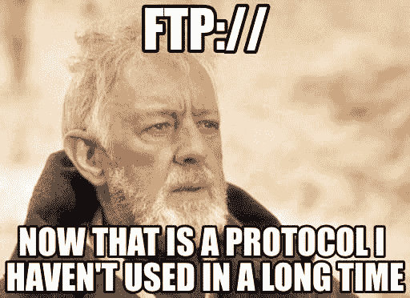

# 使用 Git 部署到 FTP 主机

> 原文:# t0]https://dev . to/adrantombu/deploy-with-git-sur-un-Heber-FTP-i4b

# 与 Git 一起部署到 FTP 主机

> 国家警察；dr 使用 git-ftp 极大地简化了文件在 ftp 中的联机

有时，根据项目的不同，无法检索 SSH 访问，以便通过 Git 轻松地进行在线访问，或使用**诸如 Heroku 或[doku](http://blog.otso.fr/2015-12-02-deployer-avec-git-sur-un-hebergement-ftp.html)等自动化部署工具。到目前为止，我一直在啃我的刹车，所以我在我的 FTP 软件中拖动-移动到旧的。**

[T2】](https://res.cloudinary.com/practicaldev/image/fetch/s--VMw4Gj4i--/c_limit%2Cf_auto%2Cfl_progressive%2Cq_auto%2Cw_880/https://blog.otso.img/2015-12-02-deployer-avec-git-sur-un-hebergement-ftp/old-star-wars-guy.jpg)

正是通过对**改进这种部署过程**进行一些研究，我才发现了**git-FTP[git-FTP](https://github.com/git-ftp/git-ftp)t5】仓库，这是一个将**git**的力量相结合的 shell 脚本**

该工具的全部有效性在于，它只需在终端中输入一个命令，即可将修改过的文件“T0”联机。我目前在一个重要项目中使用它在客户服务器上做‘T2’预生产’，这给我带来了真正的工作效率提升。

安装和配置相当简单，仓库的 install . MD 文件中对一切都做了明确的详细说明。作为 Mac OSX 用户，我只是使用 Homebrew。

```
brew install git brew install curl --with-ssl --with-libssh2 brew install git-ftp 
```

Enter fullscreen mode Exit fullscreen mode

然后，您只需转到 Git 项目并初始化 git-ftp。

```
git ftp init -u <user> -p <password> ftp://host.example.com/public_html 
```

Enter fullscreen mode Exit fullscreen mode

然后，使用较小的 ftp 推送 git 开始部署到 FTP。

```
git ftp push -u <user> -p <password> ftp://host.example.com/public_html 
```

Enter fullscreen mode Exit fullscreen mode

为了避免每次提示登录信息和主机，您可以将此信息保存在 git 仓库配置变量中。

```
git config git-ftp.user john git config git-ftp.url ftp.example.com
git config git-ftp.password secr3t git config git-ftp.syncroot path/dir 
```

Enter fullscreen mode Exit fullscreen mode

如果你想更进一步，你可以在用户手册中找到所有的文件和更多的例子[。](https://github.com/git-ftp/git-ftp/blob/develop/man/git-ftp.1.md)