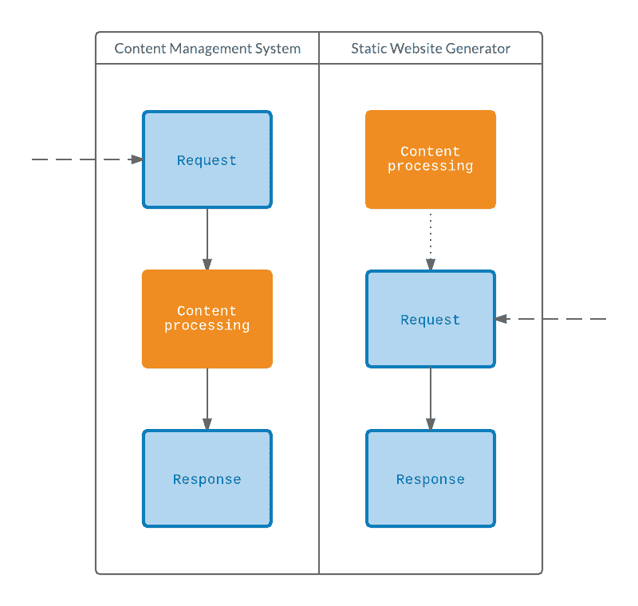

# 静态网站很棒

> 原文：<https://dev.to/mjswensen/static-sites-are-awesome-2dg2>

当创建登录页面、内容网站或博客时，内容管理系统不应该是 web 开发人员首先使用的工具。由于静态网站的简单性带来了许多好处，它们不仅是一个可行的替代方案，而且是一个更加实用的替代方案。随着静态站点生成器的迅速流行，创建和维护静态网站比以往任何时候都更容易。

## 为什么是静态网站？

对于某些类型的内容，静态网站在许多方面优于内容管理系统，包括性能、减少服务器维护、站点可维护性和版本控制内容的容量。

### 表现

在当今世界，网站性能是最重要的，转向静态网站的最有说服力的理由是性能优势。内容管理系统利用数据库，从数据库中读取内容以提供页面内容会导致性能损失。静态网站不使用数据库——所有的内容都嵌入到最终的 HTML 代码中。性能上的优势来自于这样一个事实，即现代 web 服务器(如 Apache 或 nginx)已经过大量优化，可以非常快速地为这类静态文件提供服务。

简而言之，在 CMS 中，当页面被请求时，构建网页的负担就放在了服务器上。对于静态站点，这种负担转移到了站点部署前的组装阶段。许多程序员都会同意，从用户体验的角度来看，在编译时比在运行时进行尽可能多的处理更好。这是静态站点生成器采用的方法。

[T2】](https://res.cloudinary.com/practicaldev/image/fetch/s--7zV1Czxk--/c_limit%2Cf_auto%2Cfl_progressive%2Cq_auto%2Cw_880/https://mjswensen.com/blimg/cms-vs-static-website-generator.png)

### 服务器维护

静态站点的另一大优势是减少了所需的服务器维护量。对于 Wordpress 或 Drupal 这样的典型 CMS，系统管理员需要安装和配置一个脚本语言运行时(如 PHP)、一个 web 服务器(如 Apache)和一个数据库服务器(如 MySQL)。安全补丁和定期软件更新也需要为每一个运行。对于静态站点，只需要一个 web 服务器来提供静态文件。(这种更简单的设置提高了服务器的安全性也是有争议的。)

### 可维护性

有些人对建立静态网站的想法嗤之以鼻，因为对于不熟悉的人来说，这听起来就像是手工单独编写静态网页，这当然是内容管理系统旨在克服的一项繁琐任务。然而，“静态”部分仅仅是编译目标。静态站点生成器允许 web 开发人员使用熟悉的编程结构来构建站点，如 DRY、逻辑和流控制、模板等。

### 版本控制

由于不依赖于数据库系统，根据开发人员选择的站点部署和发布方式，将站点内容置于修订控制之下也容易得多。这也意味着内容更容易与不同环境(即开发和生产)之间的代码同步。

## 关注静态网站

静态网站最明显的问题是它们不能提供动态内容。然而，有一些方法可以在不需要一个成熟的 CMS 的情况下给站点添加通用的动态元素。例如，流行的服务 [Disqus](https://disqus.com/) 为页面提供了一个全功能的评论系统，只需添加一小段 JavaScript 代码。还有像 Firebase 这样的服务，允许客户端应用程序直接与数据库通信。

当然，在很多情况下，静态站点是不合适的。用户登录以访问其内容的任何服务都是一个常见的例子。在这种情况下，人们可能会考虑使用博客或登录页面的静态网站，并将后端代码的范围最小化到应用程序本身的核心。

## 向静态站点部署和发布内容

静态站点可以通过多种方式部署。最简单的方法之一是将静态站点生成器的编译输出放到亚马逊 S3 桶中。由于 S3(以及类似的服务)被预先配置为提供静态文件，因此不需要设置服务器。再走一步，把那个桶放在像 Amazon CloudFront 这样的服务后面，网站的文件现在可以通过 CDN 提供，不费吹灰之力！

另一个值得注意的对开源网站非常有效的机制是 GitHub Pages(T2)，这是 GitHub 提供的一项免费服务。GitHub Pages 自动与最流行的静态站点生成器之一 Jekyll 集成，因此向站点部署和推送更新就像`git push`一样简单。 [GitHub 页面也通过 CDN 提供服务。](https://github.com/blog/1715-faster-more-awesome-github-pages)

也有很棒的工作流允许非技术人员发布到静态站点。例如， [Contentful](https://www.contentful.com/) 是一个内容管理服务，它有快速、只读的 API 来检索内容。非技术人员可以登录 Contentful 来创建内容，静态站点生成器可以配置为从 API 接收更新，编译站点，并自动部署更改。基于将 markdown 文件的 Dropbox 文件夹与静态站点生成器同步的类似工作流程也可以很好地工作。凭借静态站点的灵活性，团队可以找到一种适合他们的发布模式。

## 结论

静态网站是 web 开发人员工具箱中的一个实用工具。简单的静态网站可以取代复杂的内容管理系统。