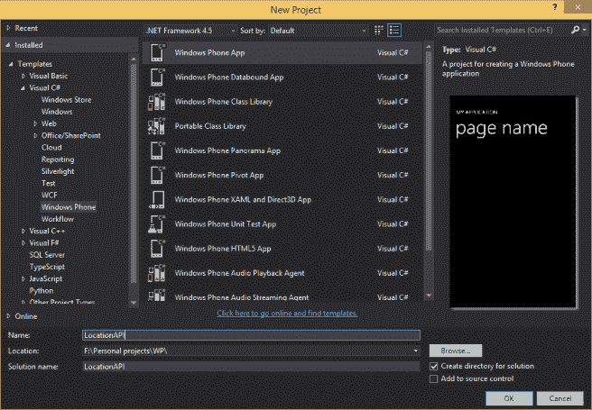
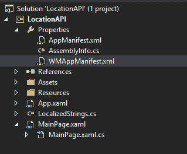
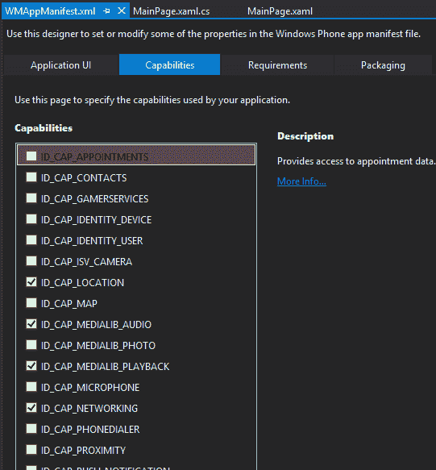
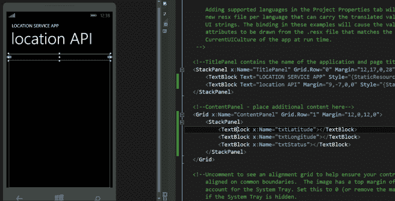
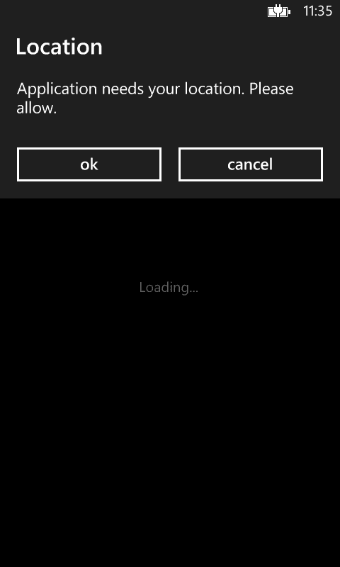
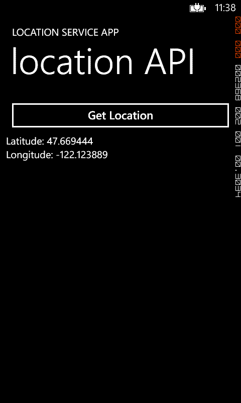

# 使用 windows phone 应用程序获取位置坐标

> 原文:[https://dev . to/mandarbadve/get-location-coordinates-with-windows-phone-application](https://dev.to/mandarbadve/get-location-coordinates-with-windows-phone-application)

*本帖最初发表于[blog.mandarbadve.com](http://blog.mandarbadve.com/2015/09/02/get-location-coordinates-with-windows-phone-application/)T3】*

### 位置 API

如果您的 windows phone 应用程序需要用户的位置，您可以使用 Windows Phone 的位置 API。在这篇文章中，我们将看到如何使用位置 API。

### 咱们码吧

开始创建新的 windows phone 应用程序。

[T2】](https://i0.wp.com/blog.mandarbadve.com/wp-content/uploads/2015/09/CreateProject.png)

双击“WMAppManifest.xml”文件。(更多详情可以在这里阅读[。)您将在项目属性中找到该文件。](https://msdn.microsoft.com/en-us/library/windows/apps/ff769509(v=vs.105).aspx)

[T2】](https://i1.wp.com/blog.mandarbadve.com/wp-content/uploads/2015/09/Capabilities.png)

转到“功能”选项卡，然后选择“ID_CAP_LOCATION”功能。这将告诉 Windows Phone 商店该应用程序需要访问用户的位置。安装应用程序时，用户会看到关于定位服务需求的提示信息。这是从用户处获得位置访问权限的第一步。

[T2】](https://i2.wp.com/blog.mandarbadve.com/wp-content/uploads/2015/09/LocationServiceCapabilities.png)

我们需要一些用户界面来显示位置状态。将下面的代码块复制到 visual studio 模板创建的默认网格中。

### XAML 代码

```
<StackPanel> 
    <Button x:Name="btnGetLocation" Click="btnGetLocation_Click">Get Location</Button> 
    <TextBlock x:Name="txtLatitude"></TextBlock> 
    <TextBlock x:Name="txtLongitude"></TextBlock> 
    <TextBlock x:Name="txtStatus"></TextBlock> 
</StackPanel> 
```

最后，您的 XAML 代码和设计器将看起来像这样。

[T2】](https://i1.wp.com/blog.mandarbadve.com/wp-content/uploads/2015/09/XAMLCode.png)

### 代码后面

转到 MainPage.xaml.cs 并添加以下方法

```
protected override void OnNavigatedTo(NavigationEventArgs e) 
 { 
 if (IsolatedStorageSettings.ApplicationSettings.Contains("LocationPermission")) 
 { 
 //// User already allowed app to access location 
 return; 
 }

 //// User not allowed app to access location 
 //// Ask user to allow

 MessageBoxResult result = 
 MessageBox.Show("Application needs your location. Please allow.", "Location", MessageBoxButton.OKCancel);

 if (result == MessageBoxResult.OK) 
 { 
   //// If user allows to access location 
   IsolatedStorageSettings.ApplicationSettings["LocationPermission"] = true; 
 } 
 else 
 { 
    //// If user not allows to access location 
    IsolatedStorageSettings.ApplicationSettings["LocationPermission"] = false; 
 } 
 IsolatedStorageSettings.ApplicationSettings.Save(); 
} 
```

当用户打开应用程序时，将导航到 MainPage.xaml 页面。这时 OnNaviatedTo 方法被调用。该方法首先检查用户是否已经设置了访问位置的权限。(此处不检查他是接受还是拒绝位置访问请求。我们稍后会检查)。

如果用户没有授予访问位置的权限，我们将显示确定取消消息框，询问访问位置的权限。如果他回答“Ok ”,我们将把“LocationPermission”键的值存储为 true，如果用户选择“Cancel”选项，则存储为 false。

[T2】](https://i1.wp.com/blog.mandarbadve.com/wp-content/uploads/2015/09/OnNevigaetedTo.png)

### 获取位置

下面是按钮单击事件处理程序。复制下面的代码并粘贴到上面的方法中。

```
private async void btnGetLocation_Click(object sender, RoutedEventArgs e) 
 { 
 if (!(bool)IsolatedStorageSettings.ApplicationSettings["LocationPermission"]) 
  { 
    return; 
  }
 Geolocator geolocator = new Geolocator(); 
 geolocator.DesiredAccuracyInMeters = 50;

 try 
  { 
   Geoposition geoposition = await geolocator.GetGeopositionAsync( 
   maximumAge: TimeSpan.FromMinutes(10), 
   timeout: TimeSpan.FromSeconds(10) 
   );

   txtLatitude.Text = "Latitude: " + geoposition.Coordinate.Latitude.ToString(); 

   txtLongitude.Text = "Longitude: " + geoposition.Coordinate.Longitude.ToString(); 

  } 
  catch (Exception) 
  { 
    txtStatus.Text = "Your phone may not have geolocation API support."; 
  } 
 } 
```

该方法首先通过从应用程序设置中访问键“LocationPermission”的值来检查用户是否被允许访问位置。如果用户不允许，那么我们将简单地返回。(您可以在此向用户显示消息。例如，您拒绝了访问位置的权限。)

如果用户允许，我们将创建地理定位器的对象。将属性“DesiredAccuracyInMeters”设置为 50 米。该选项定义了位置的精确度。您可以通过使用 Geolocator 对象的 GetGeopositionAsync 方法来获取 Geopostion 对象。Geoposition 对象包含具有纬度和经度值坐标属性。将此值设置为文本形式的标签。

这是最后一个屏幕，您将在屏幕上看到纬度和经度值。

[T2】](https://i1.wp.com/blog.mandarbadve.com/wp-content/uploads/2015/09/Result.png)

### 结论

在这篇文章中，我们看到了以下内容

*   如何在清单文件中添加位置 API 功能。
*   要求用户允许访问位置。
*   在应用程序设置中保存用户响应。

在下一篇文章中，我们将会看到如何使用这个坐标在地图上显示位置。