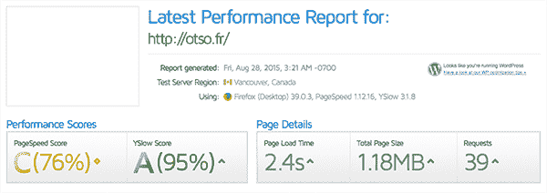
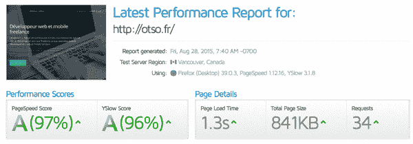

# 我如何将 Wordpress 网站导出到 Jekyll

> 原文:# t0]https://dev . to/adrantombu/comment-j-ai-export-mon-site WordPress-su-Jekyll-58p

# 我是如何将我的 Wordpress 网站输出到 Jekyll 的

> 国家警察；dr 关于我在 Wordpress 和 Jekyll 之间成功过渡的简短反馈

## 哲基尔的出身

一段时间以来，我一直在想，为了我的职业组合，我应该把‘t0’摆脱 Wordpress ，原因有几个，我不会在这里介绍(这不是文章的目的)。因此，我尝试使用几个插件来导出 Wordpress 网站，但没有一个插件令我满意。主要是因为他们主要是面向博客的**文章的出口，在个性化页面上陷入僵局。**

所以我就偷偷摸摸地去了那里(！)，并且我使用在 [Matt Radford](http://mattrad.uk/downloading-an-entire-website-on-a-mac-using-wget/) 网站上找到的以下命令，将网站的所有网页都用 html 抽取出来(谢谢 mate！):# T4]

```
wget --recursive --page-requisites --html-extension --convert-links --restrict-file-names=windows --random-wait otso.fr 
```

Enter fullscreen mode Exit fullscreen mode

接下来，我做了必要的事情让一切在当地运作有些文件尚未返回，有些链接仍在重定向到联机站点。

## 化身为人开始了

一旦我的所有 html 文件正常工作，没有 javascript 或 css 错误，我就在我的项目中安装了“[Jekyll](http://jekyllrb.com/)”以便于生成和更新我的站点“”。请注意，Jekyll 是我自该博客诞生以来一直使用的工具:**一篇文章= 1 个 markdown 文件**将在网上发布时生成 HTML。简单点，你死定了！

开始**文件清理工作**后(Wordpress，它变得非常空的 crade level code)，我将页眉和页脚提取到单独的文件中，创建了我的页面的基本模板。

## 哲基尔崛起

接下来，我转到我的产品组合中的项目管理。因此，我开始为每个项目创建一个页面，但很快就厌倦了(在两个项目之后)。真的，我很懒，会为我做任何事简化生活！

因此，我发现了一个非常实用的**Jekyll 插件**(T2】【Jekyll-data age _ gen】，它使我能够将我的所有项目组合成【yaml 文件，然后**自动生成**

此插件非常简单:

*   从 Git 仓库下载 _data_page_generator.rb_ 文件，并将其添加到 Jekyll 项目的“plugins”文件夹中

*   创建一个模板 *project.html* 以显示项目页面的内容

*   将以下信息添加到文件 *_config.yml* (根据需要进行编辑)

*   用所需信息填充 YAML 文件 *_data/projects.yml* (项目示例)
*   使用命令 *jekyll build* 启动静态站点生成

*   在上述范例中，透过自动产生的页面[*/portfolio/application-mobile-street-89 . html](https://otso.fr/portfolio/application-mobile-rue-89.html)*存取专案页面

我不得不对插件做一点修改，因为它—它会自动用 slug 替换页面标题，这并不真正令我感到满意。

```
self.data['title'] = data[name] 
```

Enter fullscreen mode Exit fullscreen mode

## 永远的哲基尔

我只剩下最后一件事要做，才能拥有一个功能齐全的网站:联系表。这是因为它是使用 WordPress API 构建的。离开，在 Jekyll 中，Wordpress 点，PHP 点，仅 HTML/css/js！因此，我修改了提交脚本，自动通过‘T2’mandrill JavaScript API，非常简单易用。

我还安装了一个**gulp**脚本，以便自动优化/挖掘/链接我的站点资产，从而进一步节省加载时间。

## 哲基尔得意洋洋

如有疑问，可访问位于我的 Github 上的站点代码，网址为:[https://github . com/adrianmbo/oto-Jekyll](https://github.com/adriantombu/otso-jekyll)

在离开之前，这是继我在 Jekyll 下汇出 Wordpress 之后的「T0」首页载入效能前后的一点点。我还有一些工作要做，要删除未使用的脚本和 css，但是现在的结果已经是**很有说服力**！

[T2】](https://res.cloudinary.com/practicaldev/image/fetch/s--7C5Bhb-1--/c_limit%2Cf_auto%2Cfl_progressive%2Cq_auto%2Cw_880/https://blog.otso.img/2015-08-28-comment-jai-exporte-mon-site-wordpress-sous-jekyll/performances-wordpress.png)

[T2】](https://res.cloudinary.com/practicaldev/image/fetch/s--BDseFBER--/c_limit%2Cf_auto%2Cfl_progressive%2Cq_auto%2Cw_880/https://blog.otso.img/2015-08-28-comment-jai-exporte-mon-site-wordpress-sous-jekyll/performances-jekyll.png)

[T2】](https://res.cloudinary.com/practicaldev/image/fetch/s--6ibI-qHU--/c_limit%2Cf_auto%2Cfl_progressive%2Cq_66%2Cw_880/https://blog.otso.img/2015-08-28-comment-jai-exporte-mon-site-wordpress-sous-jekyll/happy-guys-dancing.gif)