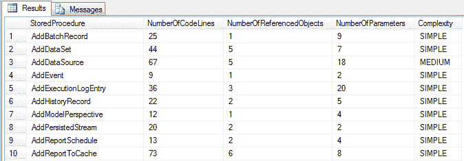

# 我的存储过程有多复杂？

> 原文:[https://dev . to/funky si1701/how-complex-are-my-stored-procedures-5b3g](https://dev.to/funkysi1701/how-complex-are-my-stored-procedures-5b3g)

最近，我和我的开发团队一直在研究性能以及如何提高性能。

我们已经确定的一个改进领域是我们的存储过程，我们计划重写它。但是我们如何识别哪些是最容易重写的，哪些是最难重写的呢？

我的第一个想法可能是计算每个关键词被使用的次数，并对它们进行排序。例如，每个 JOIN 得到 5，OUTER APPLY 得到 20，WHERE 中的每个术语得到 1，然后将其与查询的长度和多少个参数结合起来。

然而，我在谷歌上搜索了一下，发现了下面的[博客](https://aalamrangi.wordpress.com/2012/12/24/calculate-tsql-stored-procedure-complexity)和 [sql 脚本](https://gallery.technet.microsoft.com/Calculate-TSQL-Stored-831b683a)。这个脚本根据代码行数、参数数和依赖项数来分析存储过程。

复杂程度分为简单、中等和复杂。

```
WHEN NumberOfLines * NumberOfDependencies * NumberOfParameters < 5000 THEN ‘Simple’
WHEN NumberOfLines * NumberOfDependencies * NumberOfParameters < 10000 THEN ‘Medium’
ELSE ‘Complex’ 
```

<svg width="20px" height="20px" viewBox="0 0 24 24" class="highlight-action crayons-icon highlight-action--fullscreen-on"><title>Enter fullscreen mode</title></svg> <svg width="20px" height="20px" viewBox="0 0 24 24" class="highlight-action crayons-icon highlight-action--fullscreen-off"><title>Exit fullscreen mode</title></svg>

[T2】](https://res.cloudinary.com/practicaldev/image/fetch/s--MYFTOdxw--/c_limit%2Cf_auto%2Cfl_progressive%2Cq_auto%2Cw_880/https://storageaccountblog9f5d.blob.core.windows.net/blazor/wp-content/uploads/2015/08/reportscreenshot1.png%3Fw%3D674%26ssl%3D1)

这给出了一个相当好的估计，哪些存储过程是最复杂的，哪些可能需要最长的时间来重写。