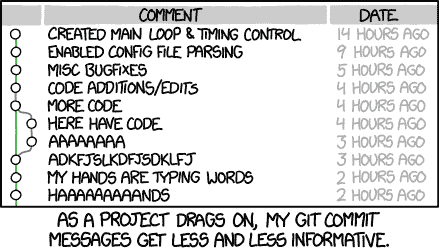

# 编写更好的 Git 提交消息

> 原文:[https://dev . to/funky si1701/writing-better-git-commit-messages-o5i](https://dev.to/funkysi1701/writing-better-git-commit-messages-o5i)

[T2】](https://res.cloudinary.com/practicaldev/image/fetch/s--SiUsoaOW--/c_limit%2Cf_auto%2Cfl_progressive%2Cq_auto%2Cw_880/https://storageaccountblog9f5d.blob.core.windows.net/blazor/wp-content/uploads/2015/07/git_commit.png%3Fw%3D439%26ssl%3D1)

我总是对我的代码变更使用源代码控制，但是我的一些提交消息还有一些需要改进的地方。

我总是试着写一个提交消息，但是我经常认为改变本身应该足以表明我做了什么。我也不需要包括谁做了更改，也不需要包括时间和日期，这些都会自动包括在内。

以下是我发现的一些提示，可能对我未来有所帮助。

1.  问问你自己为什么要做出这样的改变。“何人”、“何时”和“什么”已经被包括在内，因此提交消息中只需要包括“为什么”。

2.  如果您的提交破坏了某些东西或导致副作用或新的依赖，这应该包含在提交消息中。如果您的提交破坏了功能，考虑您是否真的需要提交它，也许只在修复后提交？

3.  如果您的提交包括一个很长的更改列表，请考虑是否需要将提交分成几个提交。很容易只提交一两个文件，编写一个特定的提交消息，然后分别提交其余的更改。

4.  考虑为更大的提交包含一个主题。以下内容来自 git 手册。

```
Though not required, it’s a good idea to begin the commit message with a single short 
(less than 50 character) line summarizing the change, followed by a blank line and then 
a more thorough description. The text up to the first blank line in a commit message 
is treated as the commit title, and that title is used throughout Git. 
```

<svg width="20px" height="20px" viewBox="0 0 24 24" class="highlight-action crayons-icon highlight-action--fullscreen-on"><title>Enter fullscreen mode</title></svg> <svg width="20px" height="20px" viewBox="0 0 24 24" class="highlight-action crayons-icon highlight-action--fullscreen-off"><title>Exit fullscreen mode</title></svg>

1.  如果使用主题，请遵循以下约定:

*   50 个字符的限制
*   以大写字母开始
*   不要以句号结尾
*   使用祈使语气，即像发布命令一样写作