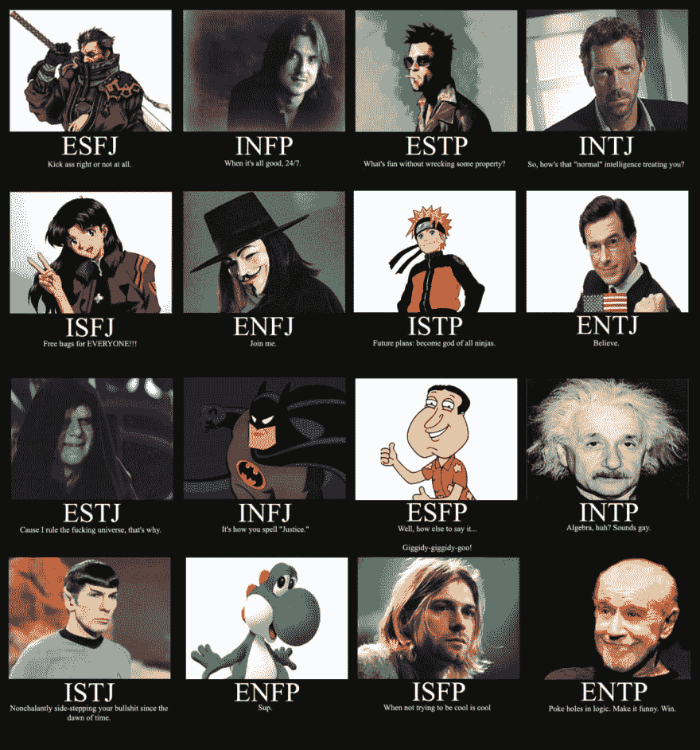

# 开发者个性测试

> 原文：<https://dev.to/funkysi1701/developer-personality-test-1eji>

早些时候，我收到了一个开发者个性测试的链接。该测试旨在让你了解你的开发人员性格，类似于著名的迈尔斯-布里格斯性格测试。这个测试的简短版本可以在[这里](https://www.surveygizmo.com/s3/1900187/Short-Developer-Personality-Test)找到。

Myers-Briggs 告诉你你是**内向者(I)** 还是**外向者(E)** 、**感觉(F)** 还是**思维(T)** 、**感知(P)** 还是**判断(J)** 、**感知(S)** 还是**直觉(N)** 。

然而这个测试告诉你你是否:

**独立 vs 协作**

**抽象 vs 低级**

**前沿 vs 保守**

**多面手 vs 专家**

**理想主义者 vs 实用主义者**

[T2】](https://res.cloudinary.com/practicaldev/image/fetch/s--3UPOQHMv--/c_limit%2Cf_auto%2Cfl_progressive%2Cq_auto%2Cw_880/https://storageaccountblog9f5d.blob.core.windows.net/blazor/wp-content/uploads/2015/07/19etmksoopu2ojpg.jpg)

独立:你喜欢大部分时间在孤立的环境中工作。你很少想要合作，因为你自己解决问题的机会更大。如果你不得不在一个项目的方向上合作，当你不得不捍卫自己的立场或者当其他人试图混淆你的项目计划时，你会不喜欢。最好是项目的首席程序员对项目有一个强烈的愿景。拥有一个大的团队或者允许其他人对项目有很大的控制权会带来沟通错误、混乱的代码库和效率低下的风险。如果一个开发人员牢牢掌握了整个代码库，他们会更好地快速修复和改进它。

**协作:**好的代码不会发生在真空中。你需要一个团队来保持你的活力和警觉，这样你就可以利用整个团队不同的经验和优势不断地改进项目代码。你喜欢经常与同事交谈，讨论想法，这样你可以向他人学习，激发想法。他们的经验水平如何并不重要，通过让每个人都参与进来，你总能学到一些东西。一个单独的程序员不可能以团队所能达到的速度和质量编写大型软件项目。

**摘要:**你更喜欢用尽可能简化开发的语言和框架来编写，使用尽可能少的字符和代码行。软件开发的轨迹总是朝着让生活变得更简单和没有错误的方向发展。编程总是要添加更多的抽象层来简化任务，那么为什么不信任您的层上的技术，而不用担心处理更低的层呢？

**低级:**我们构建的抽象工具和高级语言越多，我们对程序中更深层组件的理解和控制就越深入。这意味着更低的性能和无休止的 bug 搜索。今天的开发人员需要对编译器、内存管理、指针算法和其他底层主题有更深刻的理解。

前沿:你喜欢在前沿工作。使用太多旧的语言和技术会让你厌烦，而且会严重阻碍你的软件将过时的技术保留太久的潜力。开发人员需要密切关注他们已经使用的新技术和工具的新版本。即使项目的社区和成熟度没有达到大多数企业认为“安全”的水平，如果您相信社区和技术有发展势头，您也愿意成为早期采用者。开发技术每天都在快速变化，我们需要不断采用新的工具和方法来跟上发展。

保守:似乎每 10 年，我们就会忘记过去 10 年我们解决的所有问题，并开始构建解决相同问题的“新”工具，尽管已经存在多年的完美解决方案。当企业对其技术堆栈做出保守决策时，他们是正确的。为什么您会将您的业务寄托在一项仅在少数生产用例中成熟了几年的技术上呢？PHP、Java 和 SQL 等技术多年来一直是开发行业的中流砥柱，新技术进入成熟阶段需要花费大量时间。

多面手:你喜欢被称为“万事通”和团队中其他人的参考。你抓住每一个机会，在各种各样的技术主题中提高自己的技能，而不仅仅是那些适用于你日常工作的主题。你并不总是知道什么时候拥有这些额外的技能可能有用，但是当时机到来时，你已经准备好了。如果更多的开发人员花时间学习与他们的项目相关的技能之外的其他技能，他们会与他们组织的其他人更无缝地工作，因为他们会对他们的同事所面临的挑战有更多的同理心和理解。

如果你什么都懂，那你什么都不懂。精通一两个领域会让你变得有价值。对于其他你没有也无法掌控的工作，学习技能有什么意义？当你计划一个项目或做技术研究时，它总是集中在你正在做的事情上。你不会被岔开话题。如果你学习一项新技能，那是因为项目要求你去做。你的大部分或全部业余爱好项目也在培养你对工作中所用技能的掌握。

理想主义者:你相信定义明确的过程的力量。对于一个组织的成功来说，创建并遵循适当且有效的软件构建过程是至关重要的。试图随机应变或见机行事会带来工作流程错误的可能性，这会降低软件的质量，甚至导致重大的产品故障。规划对你来说也是极其重要的。你喜欢在开始一个项目之前研究所有你需要知道的事情。重要的是要事先找到软件的最佳架构，然后严格按照客观的最佳实践来实现该架构。您在开始时做的计划和搭建越多，完成软件所需做的总体工作就越少。

实用主义者:在竞争激烈的行业中，速度是你最好的武器，要快速开发新产品，你需要一个灵活、实用的流程。你没有几个月的时间来计划你的项目，你只需要开始编码，一条好的项目之路就会展现出来。伟大的产品是通过频繁的反馈和发布产生的，那么为什么你的计划不能同样具有适应性呢？您的计划应该适应软件的变化，您的专业知识应该适应项目。你不应该把宝贵的时间花在研究一个你在编写项目代码时不确定会遇到的问题上。试图为每一个可能的场景建立测试覆盖，并且在整个过程中进行长时间的会议是浪费时间，并且会分散你做更有成效的工作的注意力。

我不会承认作为一个开发新手，我的答案是非常主观的，我不相信我有足够的经验来真正说出我在这些问题上的谎言。

我只有独自工作和在非常小的团队中工作的经验，虽然我认为在更大的团队中工作会有好处，但我没有这方面的经验。