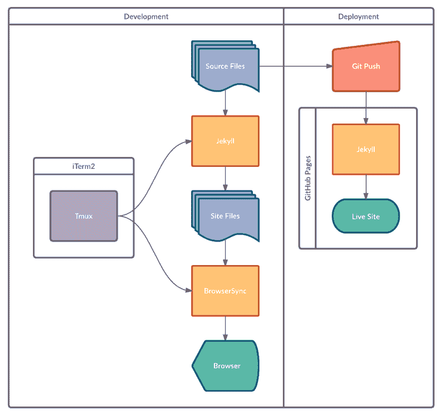
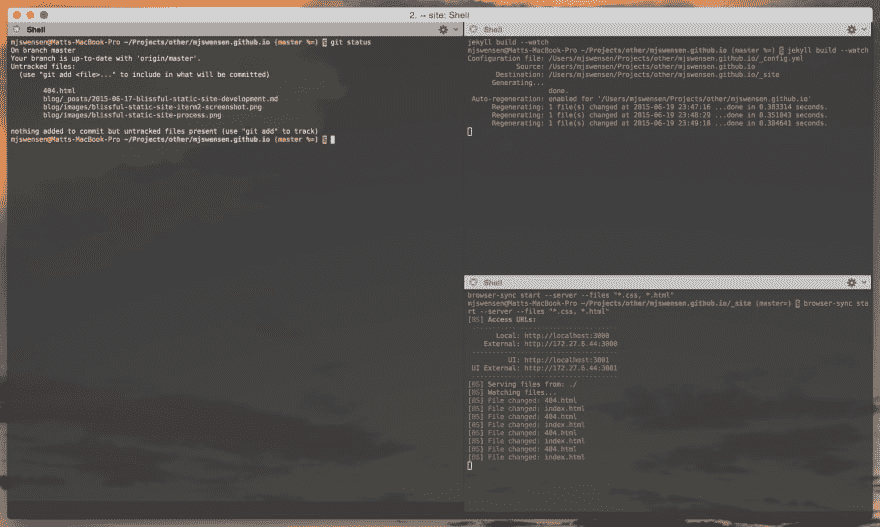

# 使用 Jekyll、BrowserSync 和 tmux 进行幸福的静态站点开发

> 原文:[https://dev . to/mjswensen/blindy-static-site-development-with-Jekyll-browser sync-and-tmux-4ei 3](https://dev.to/mjswensen/blissful-static-site-development-with-jekyll-browsersync-and-tmux-4ei3)

我最近在听[商店脱口秀播客](http://shoptalkshow.com/)，其中[克里斯·科伊尔](https://css-tricks.com/)分享了一位听众提交的材料，概述了她的个人网站的开发和部署设置。它包括使用 Dropbox 将博客文章同步到她服务器上的静态站点生成器，听起来相当巧妙。我想我应该分享一下我开发这个网站的过程。这些是协同使用的技术:

*   github pages-github 页面
*   吉基尔博士
*   浏览器同步
*   tmux
*   iTerm2

## 概述

这是用 [Lucidchart](https://www.lucidchart.com/) 创建的开发设置的可视化概述。

[T2】](https://res.cloudinary.com/practicaldev/image/fetch/s--WNPmHKG9--/c_limit%2Cf_auto%2Cfl_progressive%2Cq_auto%2Cw_880/https://mjswensen.com/blimg/blissful-static-site-process.png)

每个组件的进一步解释如下。

## GitHub 页

如今，GitHub Pages 几乎是部署一个基本网站最简单的方法。如果你有一个 GitHub 帐户(免费)，这个过程很简单:

1.  创建一个具有特殊名称的存储库:`<your username>.github.io`(例如，对于本网站，我的名称是 [`mjswensen.github.io`](https://github.com/mjswensen/mjswensen.github.io) )。
2.  添加您的网站文件(`index.html`等)。)到存储库。
3.  提交和推送。几分钟之内(通常只有几秒钟)，你的网站将在`http://<your username>.github.io/`上线。

如果你想要一个自定义域而不是默认域，也很容易[设置](https://help.github.com/articles/setting-up-a-custom-domain-with-github-pages/)。

最精彩的部分？已经*快*了。 [GitHub 通过 CDN](https://github.com/blog/1715-faster-more-awesome-github-pages) 分发 GitHub 页面上的内容，因此无论访问者身在何处，他们都可以快速下载您的内容。一天早上，我最近的一篇文章碰巧成为了[黑客新闻](https://news.ycombinator.com/item?id=9113474)的热门话题，几个小时之内，这个页面就有了大约 7500 次浏览；在那段时间里，尽管负载急剧增加，该站点仍然响应迅速。

而且是**免费**。你真的不能打败它。

## 哲基尔

Jekyll 是一个静态站点生成器，顾名思义，它使创建静态 HTML 站点变得轻而易举。Jekyll 是最流行的静态站点生成器之一。这部分是由于*与 GitHub 页面*的整合。如果你用 Jekyll 构建你的站点，GitHub 会检测到你的站点是 Jekyll 站点，并会在你推送的时候为你编译(如上所述)。因此，对于开发来说，可以安装 Jekyll 并在本地构建站点，推送并让 GitHub 构建实时站点，而不必担心将编译后的站点文件保存在源代码控制中或通过 FTP 上传。

在可能的情况下，从内容管理系统转向静态网站有很多好处。提高网站性能是首要的(内容管理系统通常涉及从数据库中读取数据，而静态网站只是可以从 web 服务器快速提供的文件，如 [nginx](http://nginx.org/) 已经针对该任务进行了大量优化)。将内容置于版本控制之下，而不是试图在不同的环境中同步数据库，这也很好。

(旁注:在 Jekyll 的众多特性中，最方便的一个是它对 [Sass](http://sass-lang.com/) 的原生支持。Sass 使编写 CSS 变得轻松有趣，Jekyll 将自动编译 Sass 源代码的事实是一大优势。)

## 浏览器同步

虽然 Jekyll 在默认情况下有一个内置的服务器，可以在开发时进行测试，但 [BrowserSync](http://www.browsersync.io/) 为现代 web 开发提供了一些令人难以置信的功能:

*   当信号源改变时实时重新加载
*   在多个设备或浏览器上同步查看和滚动页面
*   强大的调试功能
*   启动时自动转到新 Chrome 标签中的本地网站

因此，当 Jekyll 观察我的源文件的变化并自动生成站点时，BrowserSync 观察 Jekyll 的输出目录并将变化自动推送到浏览器。这是一个伟大的开发工作流程！

## tmux

虽然通过命令行启动 Jekyll 和 BrowserSync 非常简单，但每次我想写一篇新的博客文章或开发网站时，都需要两个相同的命令和两个终端窗口。这就是 tmux 的用武之地。tmux 是一个终端多路复用器，这意味着它允许基于文本的窗口和在单个终端窗口中分割窗格，以及许多其他奇妙的特性。

tmux 最大的优点是它很容易编写脚本。因此，为了开发这个站点，我编写了一个 Bash 脚本来设置我的 tmux 会话，按照我喜欢的方式配置窗口和窗格，并在单独的窗格中启动 Jekyll 和 BrowserSync。这个脚本非常简单:

```
#!/bin/bash

SESSION="mjswensen"
PROJECT_PATH="/Users/mjswensen/Projects/other/mjswensen.github.io"
OUTPUT_PATH="$PROJECT_PATH/_site"

tmux new-session -d -s $SESSION -n "site" -c $PROJECT_PATH

tmux split-window -h -t $SESSION:0 -c $PROJECT_PATH
tmux split-window -v -t $SESSION:0.1 -c $OUTPUT_PATH

tmux send-keys -t $SESSION:0.0 "git status" enter
tmux send-keys -t $SESSION:0.1 "jekyll build --watch" enter
tmux send-keys -t $SESSION:0.2 "browser-sync start --server --files \"*.css, *.html\"" enter

tmux select-pane -t $SESSION:0.0

tmux -CC attach-session -t $SESSION 
```

<svg viewBox="0 0 448 512" class="highlight-action highlight-action--fullscreen-on"><title>Enter fullscreen mode</title></svg> <svg viewBox="0 0 448 512" class="highlight-action highlight-action--fullscreen-off"><title>Exit fullscreen mode</title></svg>

## iTerm2

最后，我使用 [iTerm2](http://iterm2.com/) 来代替 Mac 的标准 Terminal.app。iTerm2 有一些令人惊叹的特性，是 Mac 用户终端仿真的热门选择。我如此喜欢 iTerm2 的原因是它的深度 tmux 集成。虽然 tmux 为终端带来了一些很棒的功能，但某些常见的任务——如在窗口之间切换、复制文本或滚动——涉及繁琐的键盘命令和变通方法。iTerm2，当使用特殊的`-CC`命令行标志连接到 tmux 会话时(如上面的脚本所示)，*将 tmux 窗口和窗格转换为本机 iTerm2 选项卡和窗格*。这听起来很简单，但它真的很重要。对于 tmux 爱好者来说，这确实是一个很好的解决方案。

最后，iTerm2 窗口看起来是这样的:

[T2】](https://res.cloudinary.com/practicaldev/image/fetch/s--HZcTbVlR--/c_limit%2Cf_auto%2Cfl_progressive%2Cq_auto%2Cw_880/https://mjswensen.com/blimg/blissful-static-site-iterm2-screenshot.png)

感谢阅读！