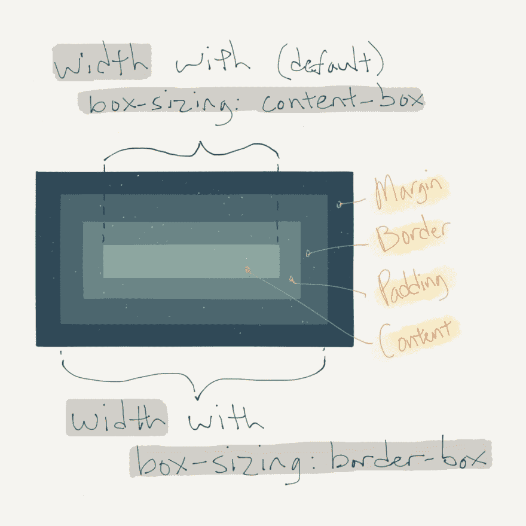
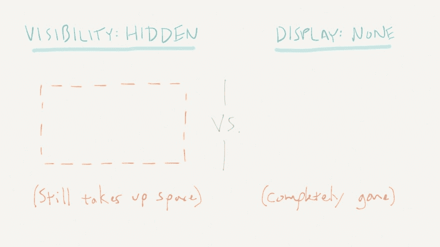

# 常见 CSS 问题的要点

> 原文：<https://dev.to/mjswensen/key-takeaways-to-common-css-questions-4206>

我参加 Q2 2015 的目标之一是回答十个关于堆栈溢出的 CSS 相关问题。下面是我这样做时遇到的一些关键概念的概要。

## 预处理器编译

[这个问题](http://stackoverflow.com/questions/29472923/sass-nesting-at-2-levels/29473205)关注的是两个可比较的 Sass 代码片段的相对“效率”。发帖者没有意识到的是，这种差异纯粹是偏好性的，这两个例子实际上编译成了完全相同的 CSS 代码。

**关键要点:**理解预处理程序的行为对于生成高质量的代码非常重要。了解预处理器编译输出的最好方法是回到 CSS 选择器的基础[，特别是简单选择器(和简单选择器序列)与](https://mjswensen.github.io/css-power-ups/introduction-and-selectors/#/3)[组合子](https://mjswensen.github.io/css-power-ups/introduction-and-selectors/#/7)的组合。理解组合子是有效使用流行的预处理器嵌套和`&`语法的关键。

## 父选择器

在[这个问题](http://stackoverflow.com/questions/29528157/nested-div-css-selector/29528204)中，发帖人陷入了一场大部分 CSS 开发人员都会发现自己陷入的徒劳无功的追逐中:试图根据父元素是否包含给定的后代来选择父元素。例如，包含具有`metadata`类的元素的所有`section`，但不包含具有`metadata`类的元素的所有`section`(建议语法:`section < .metadata`)。

**关键提示:**不幸的是，父选择器还不存在，但也许有一天在[未来的 CSS 规范](http://www.w3.org/TR/selectors4/)中。然而，可能有替代的解决方案来解决这个问题，比如[使用类似`:empty`](https://mjswensen.com/blog/2015/05/11/practical-use-cases-for-the-empty-pseudo-class/) 或`:not()`的伪类。

## 盒子模型

在[这个问题](http://stackoverflow.com/questions/29753912/figcaption-not-aligning-correctly-under-image/29753979)中，原始海报被一个元素的`padding`如何影响其位置和大小的问题绊倒了——这是一个非常常见的问题。

**关键要点:**对[CSS 盒子模型](https://mjswensen.github.io/css-power-ups/the-box-model-and-positioning/#/)缺乏了解是布局和对齐问题的常见错误来源。此外，`box-sizing`属性的使用可以极大地简化元素计算大小背后的推理。

[T2】](https://res.cloudinary.com/practicaldev/image/fetch/s--SmeSH-5O--/c_limit%2Cf_auto%2Cfl_progressive%2Cq_auto%2Cw_880/https://mjswensen.com/blimg/key-takeaways-box-model.jpg)

## `display`和`visibility`属性

在[这个问题](http://stackoverflow.com/questions/30766049/css3-animations-being-triggered-on-display-change/30766624)中，发帖人发现将一个元素的`display`属性从`none`更改为`block`会重新触发该元素的任何动画。解决方案是在`visibility`属性的`hidden`和`visible`值之间切换。

**关键要点:**动画通常与`display: none;`不协调。使用`visibility: hidden;`有时会有所帮助，但是必须特别小心，因为这两个属性-值对在行为和样式上有所不同。(例如，`visibility: hidden;`在网页流中保持一个元素的空间，而`display: none;`将它从流中移除。因此，在某些情况下，支持`visibility` 会带来[的性能提升。)](http://csstriggers.com/#display)

[T2】](https://res.cloudinary.com/practicaldev/image/fetch/s--PXWOMQpY--/c_limit%2Cf_auto%2Cfl_progressive%2Cq_auto%2Cw_880/https://mjswensen.com/blimg/key-takeaways-visibility-display.jpg)

## SVG

SVG 是一种极其强大和开放的图形格式。它与 HTML 密切相关，因为两者都是 XML (SVG 图像因此与网页非常兼容)和 CSS，因为 SVG 元素可以用 CSS 进行样式化，就像 HTML 元素一样。[这个问题](http://stackoverflow.com/questions/30784486/svg-mutiple-images-with-different-behaviors/30786215)的原发帖人就是不熟悉代码中使用的一些 SVG 特性。在这种情况下，向 SVG 元素添加一个类(因此能够使[的特异性](https://mjswensen.github.io/css-power-ups/the-cascade-and-specificity/#/2)为我们所用)就足以完成任务。

**要点提示:**虽然有很多图形工具和库可以用来处理 SVG 图像，但是熟悉 SVG 的源代码还是很有价值的。关于 SVG 的一些最佳参考资料可以在 [Mozilla 开发者网站](https://developer.mozilla.org/en-US/docs/Web/SVG)上找到。 [Sara Soueidan](http://sarasoueidan.com/) 也有很多关于 SVG 的精彩内容和研究。