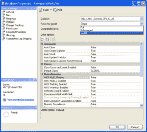

# SQL 日志增长失控

> 原文:[https://dev.to/funkysi1701/runaway-sql-log-growth-10ip](https://dev.to/funkysi1701/runaway-sql-log-growth-10ip)

今天是我的休息日，但我醒来后会快速浏览一下 nagios，看看是否有我需要担心的事情。是的，SQL Server 的数据磁盘空间不足。

我跑下楼，用 VPN 连接到服务器，看看发生了什么。我的一个监控数据库的日志增长失控，大小超过 80Gb。

> 使用 TRUNCATE_ONLY
> 
> DBCC 收缩文件('数据库名 _ 日志')备份日志[数据库名]

空闲磁盘空间恢复正常，所有用户都不会意识到这个问题，一切又恢复正常。我创建了一个运行上述代码的日常工作，这样它应该保持一个可管理的大小。

接下来我需要找出它发生的原因，并防止它在未来再次发生(下次我有一天休息，我想睡懒觉！)

我检查了 SQL 日志并注意到

> 不推荐使用带有 TRUNCATE_ONLY 或 NO_LOG 的 BACKUP LOG。应该使用简单恢复模式来自动截断事务日志。

然后我记得我做了什么导致这个问题。我有一个单独的磁盘用于存储备份文件，本周早些时候，我注意到这个磁盘已满，事务性备份文件占用了大量空间。我想我不需要备份这个非关键数据库的事务，我会在每天开始时做一个完整的备份。

但是我忘记了，事务性备份可以控制日志文件，一旦备份停止，日志文件就会不受控制地增长。答案是，将数据库从完整模式更改为简单模式。[T2】](https://i0.wp.com/www.funkysi1701.com/wp-content/uploads/2015/06/image002.png)

这是我对完整模式下备份工作方式的理解。在一天开始时进行完整备份，这会重置日志文件，然后数据库中的更改会存储在日志文件中，这将备份到事务备份中，日志文件也会重置。如果一整天都有常规的事务性备份，日志文件不会增长太多，但是如果没有事务性备份，日志文件会包含一整天的更改，因此对于监控数据库来说，这可能会非常大。

在简单模式下，您不能进行事务性备份，并且日志不会不受控制地增长。这不应该用于生产数据库，如果有一个问题，您可能会丢失数据。

帖子[失控的 SQL 日志增长](https://www.funkysi1701.com/2015/06/12/runaway-sql-log-growth/)最先出现在 [Funky Si 的技术演讲](https://www.funkysi1701.com)上。