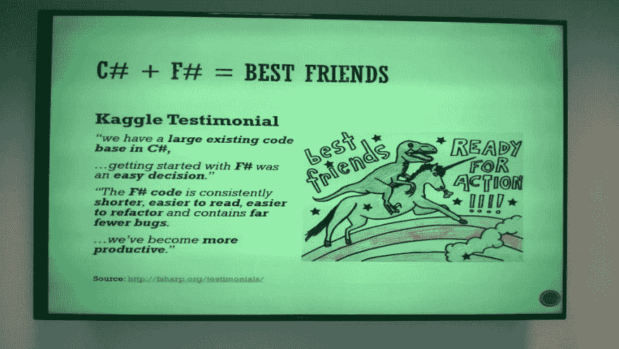

# 用户组和 F#

> 原文:[https://dev.to/funkysi1701/user-groups-and-f-37mi](https://dev.to/funkysi1701/user-groups-and-f-37mi)

有一段时间，我一直威胁要尝试一个用户组。这周我参加了我的第一次会议。

我去的用户组叫做 [Leeds Sharp](https://www.meetup.com/Leeds-Sharp/) 他们正在庆祝他们的三岁生日，生日快乐伙计们，谢谢你们的蛋糕。

演讲都是关于 F#的。除了在 visual studio 中，我对 F# 一无所知。演讲者是[菲尔·特雷福德](https://twitter.com/ptrelford)，F#专家，前游戏开发者，经常在会议上发言。Phil 是一名专业的程序员，他的一个故事是，当他手臂骨折时，他用 F#编写了一份 Excel。即使有两只手，我也不知道从哪里开始做这样的事情。

[T2】](https://res.cloudinary.com/practicaldev/image/fetch/s--noMlpg_X--/c_limit%2Cf_auto%2Cfl_progressive%2Cq_auto%2Cw_880/https://storageaccountblog9f5d.blob.core.windows.net/blazor/wp-content/uploads/2015/05/CGHJLlbWEAAbl14.jpg%3Fw%3D1024%26ssl%3D1)

与 C#相比，使用 F#有很多优势，其中之一就是代码行更少。在 Phil 的例子中，他有一些大约 30 行的 C#代码，但是 F#是 2，部分原因是 F#没有{}。

我发现自己在想，这肯定好得难以置信，使用 F#肯定有一些缺点？

我还不知道它们是什么，我猜你需要用这种语言玩一会儿才能真正理解它们。

一种说法是 F#的 bug 更少。我不确定这怎么可能是真的。代码是人类写的，人类会犯错误，无论他们选择哪种语言，都会有错误。

小组结束后，我带了一些东西去尝试。试试在 Visual Studio 中可以找到的 F#教程，试试 Koan，这是一段包含失败测试的代码，在修复测试的过程中你学习语言，下次再来 Leeds Sharp 学点别的。