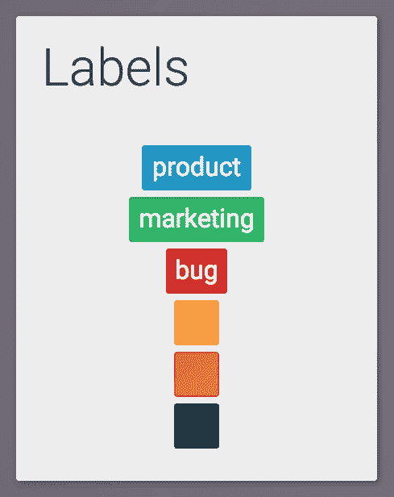
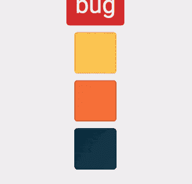
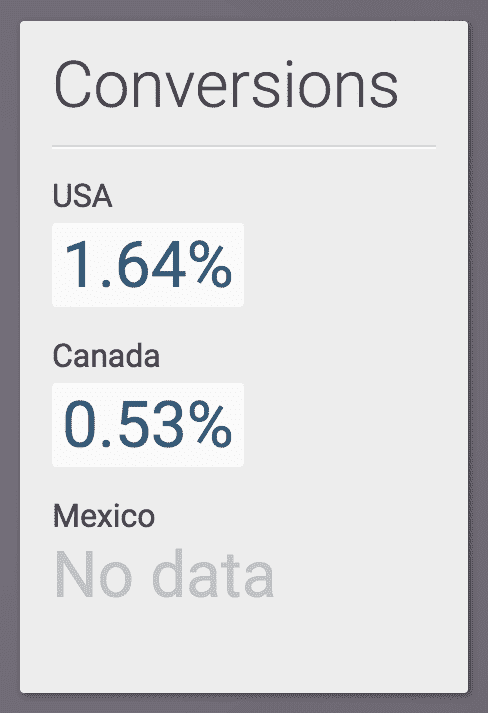

# 的实际用例:空伪类

> 原文:[https://dev . to/mjswensen/practical-use-cases-for-the-empty-pseudo-class-3g1f](https://dev.to/mjswensen/practical-use-cases-for-the-empty-pseudo-class-3g1f)

起初，`:empty`伪类似乎不是高级选择器中最有用的。然而，有些情况下`:empty`是这项工作的完美工具。这里有几个例子:

## 标签/标签管理器 UI

假设你正在开发一个允许用户管理标签的应用程序(想想 [Trello](https://trello.com/) )。允许用户在标签上添加标题当然很好，但是如果没有添加标题，标签也应该有足够的视觉效果，就像这样:

[T2】](https://res.cloudinary.com/practicaldev/image/fetch/s--XxEIFyIx--/c_limit%2Cf_auto%2Cfl_progressive%2Cq_auto%2Cw_880/https://mjswensen.com/blimg/css-empty-labels.png)

您会注意到，没有文本的标签比它们只是一个带有填充和背景色的空`<span>`要宽。实现这一点的代码要点是:

```
.label:empty {
  width: 1rem;
} 
```

<svg viewBox="0 0 448 512" class="highlight-action highlight-action--fullscreen-on"><title>Enter fullscreen mode</title></svg> <svg viewBox="0 0 448 512" class="highlight-action highlight-action--fullscreen-off"><title>Exit fullscreen mode</title></svg>

简单，但增加了设计的鲁棒性。我做了标签`contenteditable`和[放在 CodePen](http://codepen.io/mjswensen/pen/jPWrNe) 上，这样就可以玩了:

[T2】](http://codepen.io/mjswensen/pen/jPWrNe)

## 分析仪表板 UI

另一个示例用例是尚未接收任何数据的数据收集用户界面。假设一个应用程序正在按地理区域跟踪一个电子商务网站的转换率，如下所示:

[T2】](https://res.cloudinary.com/practicaldev/image/fetch/s--7JNSLF_p--/c_limit%2Cf_auto%2Cfl_progressive%2Cq_auto%2Cw_880/https://mjswensen.com/blimg/css-empty-conversions.png)

在前面的示例中，美国和加拿大指标的元素有文本(“1.64%”和“0.53%”)，而墨西哥的元素为空。这是相关代码:

```
.conversion-rate:empty::before {
  content: "No data";
  opacity: 0.25;
} 
```

<svg viewBox="0 0 448 512" class="highlight-action highlight-action--fullscreen-on"><title>Enter fullscreen mode</title></svg> <svg viewBox="0 0 448 512" class="highlight-action highlight-action--fullscreen-off"><title>Exit fullscreen mode</title></svg>

这里有一个实例的链接。这是一个很好的小技巧，比在没有数据的情况下简单地留空白提供了更好的体验。

## 结论

作为 web 专业人员，我们以确保我们的设计在任何情况下都看起来很棒而自豪——例如，想想*响应式设计*——`:empty`伪类是我们工具箱中实现这一点的另一个工具。

你还想出了其他哪些很棒的`:empty`用例？