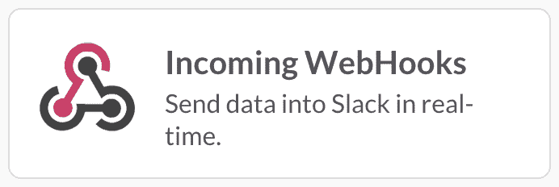
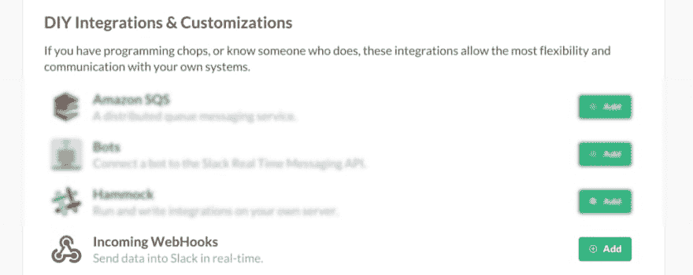

# Rails 中一个非常简单的松散集成

> 原文:[https://dev . to/Neil Bartley/a-really-simple-slack-integration-in-rails-jag](https://dev.to/neilbartley/a-really-simple-slack-integration-in-rails-jag)

我是 [Slack](https://slack.com) 的忠实粉丝。它的优势之一是它提供了“开箱即用”的大量[集成](https://slack.com/integrations)。我等会儿再盖另一个劲(等我把肥皂盒拿出来！).

显然，不太可能有一个“我的定制 rails webapp”的集成，但 Slack 已经通过提供一个框架来允许传入通知。

[T2】](https://res.cloudinary.com/practicaldev/image/fetch/s--NhW4BLfm--/c_limit%2Cf_auto%2Cfl_progressive%2Cq_auto%2Cw_880/https://cdn-images-1.medium.com/max/692/1%2A3wBSCaJlHSk1kuq3losm_A.png)

我将利用这一点将事件细节从‘我的定制 rails web app’发送到 Slack。

#### 真实生活用例

我开发的应用程序有一堆内部邮件挂在上面。当特定的动作发生时，它们向特定的人发送邮件。在这个例子中，我们将考虑**‘有人点击了鼠标按钮’**。

### 肥皂盒

<figure> 

<figcaption>[知识共享](https://creativecommons.org/licenses/by/2.0/)由[布兰登 C](https://www.flickr.com/photos/bmcirillo/) 创作。未进行任何更改。</figcaption>

</figure>

***邮件吸*** 。我收到的太多了(我可能也发送了太多)。通过允许这些邮件发送者的存在(以及添加新的邮件发送者)，我正在延续这种痛苦。

### 设置

[T2】](https://res.cloudinary.com/practicaldev/image/fetch/s--r3Aa0uBV--/c_limit%2Cf_auto%2Cfl_progressive%2Cq_auto%2Cw_880/https://cdn-images-1.medium.com/max/1024/1%2A4xhTahwmWxmg9ny4Dty86Q.png)

在 Slack 管理界面的“DIY 集成”部分，你会看到添加“输入网页挂钩”的选项。选择此项并选择您希望通知出现的默认通道(这可以根据具体情况进行更改)。

我们需要从这是一个独特的“网页挂钩网址”。一旦我们有了这个，我们就可以开始组装有效载荷了。

[T2】](https://res.cloudinary.com/practicaldev/image/fetch/s--QwqS9YyO--/c_limit%2Cf_auto%2Cfl_progressive%2Cq_auto%2Cw_880/https://cdn-images-1.medium.com/max/1024/1%2Aj68Z2uqT4mmHlYKWdL9ECg.png)

### 整合

#### 规格

我不打算复制粘贴 Slack 制作的精美文档。相反，这里有一些链接！

*   [https://api.slack.com/incoming-webhooks](https://api.slack.com/incoming-webhooks)
*   [https://api.slack.com/docs/attachments](https://api.slack.com/docs/attachments)

#### 终于，有些码了！

将您的 webhook URL 和测试通道添加到您的开发应用程序中。

在您的生产环境中，webhook URL 可能会保持不变，但您可能需要更新频道名称。

https://gist.github.com/neilbartley/f1ac92cf40f79a789e64% }

我为我们的 SlackBot 创建了一个服务，可以简单地从控制器中调用它。

https://gist.github.com/neilbartley/87bbcb97c67617d16344% }

为了演示，让我们从 rails 控制台调用:

https://gist.github.com/neilbartley/21d1d6e1d4ffb09700c9% }

第二行将在#events_test 通道中生成以下通知:

[T2】](https://res.cloudinary.com/practicaldev/image/fetch/s--EUOqZbYu--/c_limit%2Cf_auto%2Cfl_progressive%2Cq_auto%2Cw_880/https://cdn-images-1.medium.com/max/966/1%2AeUHKRxHgLaVjXiLMOZhC8A.png)

第四行和第六行说明了将默认通道覆盖到另一个通道或用户。

* * *