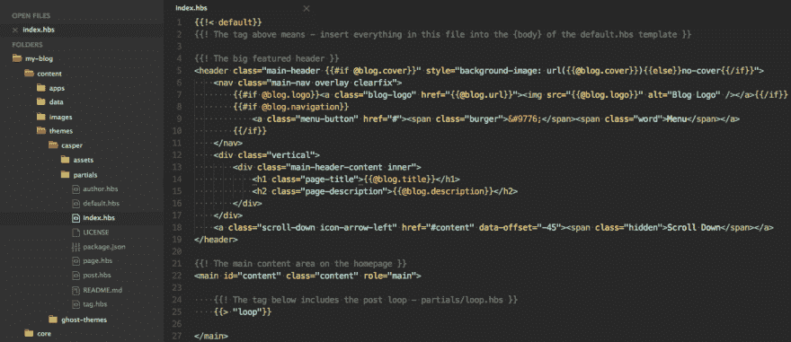

# 一个前端开发人员的崇高文本设置

> 原文:[https://dev . to/zackphilipps/a-front-end-developers-sublime-text-setup](https://dev.to/zackphilipps/a-front-end-developers-sublime-text-setup)

这篇文章——以及我的另一篇文章[一个前端开发人员的日常应用堆栈](http://zackphilipps.com/a-front-end-developers-daily-app-stack/)——100%受到设计师[的崇高文本设置](https://medium.com/design-notes/a-designers-sublime-text-setup-e3963f8d79da)的启发。

如果你正在跟进，作为先决条件，你一定要升级到 [Sublime Text 3](http://www.sublimetext.com/3) (如果你还没有升级的话)，同样[安装软件包控制](https://packagecontrol.io/installation)。

* * *

### 主题&配色方案

[T2】](https://res.cloudinary.com/practicaldev/image/fetch/s--TrhOtPBR--/c_limit%2Cf_auto%2Cfl_progressive%2Cq_auto%2Cw_880/http://zackphilipps.com/conteimg/2015/03/Screen-Shot-2015-03-27-at-12-28-43.png)

从[平地](https://github.com/thinkpixellab/flatland)开始，我现在用的是[黎明前](https://github.com/jamiewilson/predawn)。我太喜欢它了...它有一个内置的配色方案，甚至有自己的图标集和 dock 图标，以及建议的设置和软件包！我欠我的整个崇高设置杰米·威尔逊和[马蒂亚斯拜恩斯](https://github.com/mathiasbynens/dotfiles)。

* * *

### 按键绑定

像 [Matej Latin](https://medium.com/@matejlatin) 一样，在我切换到 Sublime 之前，我也使用了一段时间的括号。我也很难适应*复制行*和*删除行*的新按键。要在 Sublime 中模拟这一点，只需导航到首选项>按键绑定-用户，然后添加这个:

```
[
{ "keys": ["super+d"], "command": "duplicate_line" },
{ "keys": ["super+shift+d"], "command": "run_macro_file", "args": {"file": "Packages/Default/Delete Line.sublime-macro"} }
] 
```

<svg width="20px" height="20px" viewBox="0 0 24 24" class="highlight-action crayons-icon highlight-action--fullscreen-on"><title>Enter fullscreen mode</title></svg> <svg width="20px" height="20px" viewBox="0 0 24 24" class="highlight-action crayons-icon highlight-action--fullscreen-off"><title>Exit fullscreen mode</title></svg>

然而，实际上我在工作中与我的整个开发团队同步了我所有的崇高偏好(稍后将详细介绍——有它的优点和缺点),其中一个非常喜欢`command+D`的*快速添加下一个*默认行为，所以我习惯了这个:

```
{ "keys": ["super+alt+d"], "command": "duplicate_line" } 
```

<svg width="20px" height="20px" viewBox="0 0 24 24" class="highlight-action crayons-icon highlight-action--fullscreen-on"><title>Enter fullscreen mode</title></svg> <svg width="20px" height="20px" viewBox="0 0 24 24" class="highlight-action crayons-icon highlight-action--fullscreen-off"><title>Exit fullscreen mode</title></svg>

要做到这一点，我必须去*系统偏好>键盘>快捷键>发射台& Dock* 并取消勾选*开启/关闭 Dock 隐藏*的复选框。

我也是一个[片段](http://sublimetext.info/docs/en/extensibility/snippets.html)的超级粉丝，所以我想要一个方便的快捷方式来弹出一个片段列表。
这招奏效了

```
{ "keys": ["ctrl+s"], "command": "show_overlay", "args": {"overlay": "command_palette", "text": "Snippet: "}} 
```

<svg width="20px" height="20px" viewBox="0 0 24 24" class="highlight-action crayons-icon highlight-action--fullscreen-on"><title>Enter fullscreen mode</title></svg> <svg width="20px" height="20px" viewBox="0 0 24 24" class="highlight-action crayons-icon highlight-action--fullscreen-off"><title>Exit fullscreen mode</title></svg>

我还安装了包 [FixMyJS](http://addyosmani.com/blog/fixmyjs/) ，所以使用它的快捷方式是:

```
{ "keys": ["alt+super+j"], "command": "fix" } 
```

<svg width="20px" height="20px" viewBox="0 0 24 24" class="highlight-action crayons-icon highlight-action--fullscreen-on"><title>Enter fullscreen mode</title></svg> <svg width="20px" height="20px" viewBox="0 0 24 24" class="highlight-action crayons-icon highlight-action--fullscreen-off"><title>Exit fullscreen mode</title></svg>

概括一下，为了将来快速更新，我的整个键绑定文件看起来像这样:

```
[
{ "keys": ["super+shift+d"], "command": "run_macro_file", "args": {"file": "Packages/Default/Delete Line.sublime-macro"} },
{ "keys": ["ctrl+s"], "command": "show_overlay", "args": {"overlay": "command_palette", "text": "Snippet: "}},
{ "keys": ["alt+super+j"], "command": "fix" },
{ "keys": ["super+alt+d"], "command": "duplicate_line" },
] 
```

<svg width="20px" height="20px" viewBox="0 0 24 24" class="highlight-action crayons-icon highlight-action--fullscreen-on"><title>Enter fullscreen mode</title></svg> <svg width="20px" height="20px" viewBox="0 0 24 24" class="highlight-action crayons-icon highlight-action--fullscreen-off"><title>Exit fullscreen mode</title></svg>

* * *

### 首选项

我的偏好结合了马蒂亚斯和杰米的偏好，并做了一些小小的调整。我的调整大多是与排版相关的(我用 14 磅。底线填充为 4，因为我希望能够看到我的代码)，但是我也将`find_selected_text`设置为`true`(另一个括号内的行为)。我还实现了[本·弗雷恩的提示来阻止连字符分隔单词](http://benfrain.com/top-tips-selection-unrelated-front-end-developer-tips)。这是我的全部偏好文件:

```
{
"close_windows_when_empty": false,
"color_scheme": "Packages/Predawn/predawn.tmTheme",
"default_encoding": "UTF-8",
"default_line_ending": "unix",
"detect_indentation": false,
"draw_indent_guides": true,
"draw_minimap_border": true,
"draw_white_space": "all",
"enable_tab_scrolling": false,
"ensure_newline_at_eof_on_save": false,
"file_exclude_patterns":
[
    ".DS_Store",
    "Desktop.ini",
    "*.pyc",
    "._*",
    "Thumbs.db",
    ".Spotlight-V100",
    ".Trashes"
],
"find_selected_text": true,
"folder_exclude_patterns":
[
    ".git",
    "node_modules"
],
"font_size": 14,
"highlight_modified_tabs": true,
"hot_exit": false,
"ignored_packages":
[
    "Vintage"
],
"indent_guide_options":
[
    "draw_active"
],
"line_padding_bottom": 4,
"match_brackets": true,
"match_brackets_angle": true,
"open_files_in_new_window": false,
"overlay_scroll_bars": "enabled",
"remember_open_files": false,
"show_encoding": true,
"show_line_endings": true,
"sidebar_default": true,
"tab_size": 2,
"tabs_small": true,
"theme": "predawn.sublime-theme",
"translate_tabs_to_spaces": false,
"trim_trailing_white_space_on_save": true,
"word_separators": "./\\()\"':,.;<>~!@#$%^&*|+=[]{}`~?",
"word_wrap": true
} 
```

<svg width="20px" height="20px" viewBox="0 0 24 24" class="highlight-action crayons-icon highlight-action--fullscreen-on"><title>Enter fullscreen mode</title></svg> <svg width="20px" height="20px" viewBox="0 0 24 24" class="highlight-action crayons-icon highlight-action--fullscreen-off"><title>Exit fullscreen mode</title></svg>

* * *

### 套餐

[ACF 片段](https://github.com/smilledge/acf-sublime-snippets)–用于 WordPress 的[高级定制字段。我< 3 它。有了内置的 PHP 代码片段，我现在可以键入`php`、tab、`ifgf`、tab，然后键入字段名，而不是键入非常笨拙的`<?php if(get_field('field_name')): ?>`。](http://advancedcustomfields.com)

[彩色荧光笔](https://github.com/Monnoroch/ColorHighlighter)–以不同的样式在选定的十六进制代码下显示十六进制颜色值。

[Emmet](http://emmet.io/)——另一个节省时间的软件包，现在我可以输入`!`、`tab`而不是(和许多其他人一起):

```
<!DOCTYPE html>
<html lang="en">
<head>
    <meta charset="UTF-8">
    <title>Document</title>
</head>
<body>

</body>
</html> 
```

<svg width="20px" height="20px" viewBox="0 0 24 24" class="highlight-action crayons-icon highlight-action--fullscreen-on"><title>Enter fullscreen mode</title></svg> <svg width="20px" height="20px" viewBox="0 0 24 24" class="highlight-action crayons-icon highlight-action--fullscreen-off"><title>Exit fullscreen mode</title></svg>

[FixMyJS](http://addyosmani.com/blog/fixmyjs/)–点击链接，阅读 Addy 的帖子。

这是 T2·马蒂亚斯的网络文件 T3 的一部分，也是杰米建议的。太神奇了。

[车把](https://github.com/daaain/Handlebars)–车把语法支持。

每次点击*保存，JavaScript 美化——自动按照我喜欢的方式格式化我的 JS。*

[包同步](https://github.com/csch0/SublimeText-Package-Syncing)——由 Matej 和<建议，许多人支持。使用 Dropbox 在不同设备间同步您的卓越偏好。这是我们在工作中使用的，所以我们都有相同的 ST3 设置。帖子中提到的关于[我的日常应用栈](http://zackphilipps.com/a-front-end-developers-daily-app-stack/)。

[Sass](https://packagecontrol.io/packages/Sass)–Sass 语法支持。

每次点击*保存后，自动按照我喜欢的方式格式化我的 SCSS。*

[选择直到](https://github.com/xavi-/sublime-selectuntil)–让我按下`cmd+shift+L`在我选择的每一行找到一个光标。这样，我可以批量编辑多行，其中的字符都不同，但长度相同。对于编辑我从命令行复制的文件/目录结构很有用，因为 find & replace 并不能解决这个问题。

[sidebar enhancements](https://github.com/titoBouzout/SideBarEnhancements)——杰米推荐，许多人推荐<。当我在 ST3 的侧边栏中右击文件/文件夹时，我可以做很多事情，而不是几乎什么都不做。

如果你和很多 WP 网站合作，这是必不可少的。

* * *

#### 相关岗位

*   [一个前端开发者的日常应用栈](http://zackphilipps.com/a-front-end-developers-daily-app-stack/)
*   [2015 年面向小团队的 WordPress 开发工作流程](http://zackphilipps.com/a-wordpress-development-workflow-for-small-teams-in-2015/)
*   [我如何使用 Chrome 来经营网页设计业务](http://zackphilipps.com/how-i-use-chrome-to-run-a-web-design-business/)