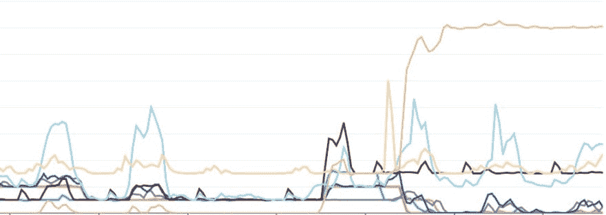

# 监控屏幕

> 原文:[https://dev.to/funkysi1701/monitoring-screens-1gdf](https://dev.to/funkysi1701/monitoring-screens-1gdf)

我们都知道监控您的服务器和服务非常重要，因此您可以在问题变成问题之前发现问题。我个人已经花了很多时间来配置 nagios 来给我发邮件，最近我在 Azure 中配置了各种不同的警报。

我以前的老板认为我应该有一个大屏幕来显示我的服务器和服务的所有重要统计数据，我个人不同意这个想法，并认为我的电话通知和电子邮件提醒就足够了。当他读到这篇文章时，他无疑会纠正我的想法，但我相信他的部分想法是让您的基础架构监控变得可见，并让任何路过的人都清楚，您在关注一切。

为了这篇博文的目的，让我们假设他已经说服了我，我也已经说服了我的实际老板花钱购买所需的技术来做到这一点(这并不容易)。我在这个屏幕上会显示什么？

我有谷歌 Chromecast，我用它来将各种东西传输到我的电视上，这是一种相对便宜的技术，可以让电视或显示器显示所需统计数据的网页。[T2】](https://res.cloudinary.com/practicaldev/image/fetch/s--R84Wlzvj--/c_limit%2Cf_auto%2Cfl_progressive%2Cq_auto%2Cw_880/https://storageaccountblog9f5d.blob.core.windows.net/blazor/wp-content/uploads/2015/03/perf.jpg%3Fw%3D980%26ssl%3D1)

我想展示的两个主要信息源是用于监控我的 azure 网站的 New Relic 和用于监控我的内部服务器的 Nagios。New Relic 允许您轻松地将实时性能数据导出为 iframes，因此我很快创建了一个包含这些图表的网页。然而，如果你在墙上有一个静态屏幕，你不希望必须滚动才能看到不同的信息，所以我需要想出另一种方法来显示这些信息。

我首先想到的是幻灯片。有很多 javascript 脚本像幻灯片一样循环播放一系列图像，这可以用来循环播放一系列 iframes 并显示我想要的一切。

我的脚本是这样的，需要 jquery 和 javascript。首先，脚本等待页面完全加载就绪函数，然后定义 URL，每次一个 URL 放入 iframe。然后它会计算你拥有的 URL 的数量。然后，它每隔几秒钟就改变 iframe 中 src 属性的内容，在我的例子中，它每隔 9 秒改变一次，但是一旦在生产中使用，您可能希望增加它。

```
<script type="text/javascript">
$(document).ready(function(){
  var locations = ["URL1", "URL2", "etc"];
  var len = locations.length;
  var iframe = $('#frame'); 
  var i = 0;
  setInterval(function () {
    iframe.attr('src', locations[++i % len]);
  }, 9000);
});
</script> 
```

<svg width="20px" height="20px" viewBox="0 0 24 24" class="highlight-action crayons-icon highlight-action--fullscreen-on"><title>Enter fullscreen mode</title></svg> <svg width="20px" height="20px" viewBox="0 0 24 24" class="highlight-action crayons-icon highlight-action--fullscreen-off"><title>Exit fullscreen mode</title></svg>

现在，像这样的脚本需要包含哪些信息呢？显示太多的性能数据几乎和根本不显示一样糟糕，因为问题会淹没在噪音中。对我来说，我有我的网站的性能，其次是 Nagios 问题，其次是 azure 状态页面，然后是我所有服务器的内存使用情况，最后显示我的数据库的连接数。另一个需要考虑的问题是，你希望用什么样的时间尺度来绘制图表，时间太长你看不到现在发生了什么，但时间太短你可能只会担心间歇性的问题。